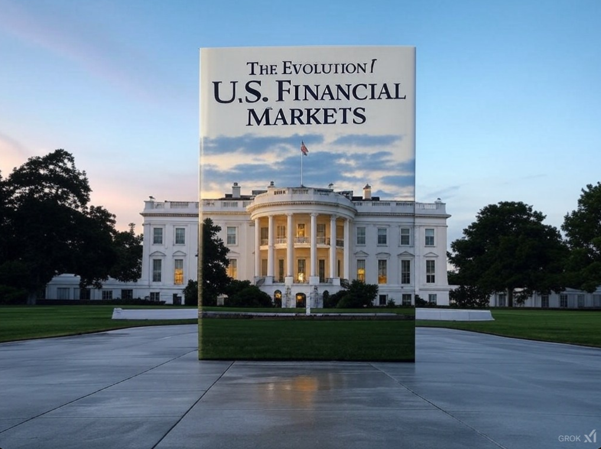

# The Evolution of U.S. Financial Markets

## Chapter 01: The Birth of American Financial Markets (18th Century)

- **1.1 The Early Colonial Economy**
   Explore the origins of financial systems in colonial America, including bartering, local currency systems, and the early attempts at organizing financial markets.
- **1.2 The Founding of the U.S. Treasury**
   Analysis of Alexander Hamilton's vision and the creation of a central bank, leading to the foundation of a formal financial system.
- **1.3 The Creation of Stock Markets**
   The role of the New York Stock Exchange and its early days in financing American industry.
- **1.4 Early Banking Systems**
   A look at the establishment of the first U.S. banks and their role in fostering economic growth.
- **1.5 The Impact of War on Financial Markets**
   How the Revolutionary War and the War of 1812 influenced early U.S. financial development.

## Chapter 02: The Rise of Financial Institutions (19th Century)

- **2.1 Expansion of Banks and Banking Practices**
   Growth of state-chartered and national banks, including the role of the National Bank Act of 1863.
- **2.2 The Role of Railroad Financing**
   How the rise of railroads reshaped the financial landscape and led to the creation of modern corporate finance.
- **2.3 The Panic of 1837 and its Aftermath**
   Understanding the causes and effects of early financial crises, and how they led to changes in policy and regulation.
- **2.4 The Birth of the Federal Reserve System**
   The long-term development of the Federal Reserve and the centralization of monetary policy.
- **2.5 The Growth of Wall Street**
   Wall Street’s emergence as the financial hub of America, including its transition from a trading post to a global powerhouse.

## Chapter 03: The Early 20th Century: Regulation and Institutionalization

- **3.1 The Federal Reserve Act and the Birth of Modern Monetary Policy**
   A deeper dive into the creation of the Federal Reserve System in 1913 and its foundational role in modern finance.
- **3.2 The Stock Market Boom and Bust (1920s-1930s)**
   Analyzing the financial excesses leading to the Great Depression and the reforms that followed.
- **3.3 The New Deal Financial Reforms**
   Key reforms like the Glass-Steagall Act, Securities Exchange Act, and the creation of the SEC to restore confidence in the financial markets.
- **3.4 The Evolution of Corporate Finance**
   How the role of corporations and their access to capital markets expanded, including the rise of large conglomerates.
- **3.5 The Role of Investment Banks**
   Understanding the increasing importance of investment banks in underwriting, mergers, and acquisitions during the early 20th century.

## Chapter 04: The Post-War Boom and the Expansion of Consumer Finance (1940s-1970s)

- **4.1 Post-War Economic Expansion**
   The impact of WWII on U.S. economic and financial growth, including increased government spending and the rise of consumer credit.
- **4.2 The Rise of Mutual Funds**
   How mutual funds democratized investment opportunities and reshaped U.S. household wealth.
- **4.3 The Growth of Housing and Mortgage Markets**
   The birth and rapid expansion of government-backed housing finance through GSEs like Fannie Mae.
- **4.4 The Bretton Woods System**
   The establishment of the dollar as the world’s reserve currency and its impact on global financial markets.
- **4.5 Inflation and Stagflation**
   The financial struggles of the 1970s, including the oil crisis and stagflation, and their implications for U.S. financial policy.

## Chapter 05: Financial Deregulation and Globalization (1980s-1990s)

- **5.1 The Reagan Era and Financial Deregulation**
   How deregulation under the Reagan administration reshaped U.S. financial markets, including the rise of the junk bond market.
- **5.2 The Growth of the Stock Market and the Dot-com Bubble**
   The booming stock market, fueled by technological innovation, and the eventual collapse of the dot-com bubble.
- **5.3 The Rise of Hedge Funds and Private Equity**
   Understanding the increasing role of hedge funds and private equity firms in reshaping corporate finance.
- **5.4 The 1987 Stock Market Crash**
   Analyzing the causes of Black Monday and the changes that followed in market regulation and policy.
- **5.5 Globalization of U.S. Financial Markets**
   The expansion of U.S. financial markets globally, including the rise of cross-border capital flows.

## Chapter 06: The Financial Crisis of 2008 and Its Aftermath

- **6.1 Causes of the 2008 Financial Crisis**
   A thorough examination of the factors that led to the subprime mortgage crisis and the collapse of major financial institutions.
- **6.2 Government Intervention and the Bailout**
   How the U.S. government intervened with TARP, the Federal Reserve’s response, and its consequences.
- **6.3 The Role of Financial Derivatives**
   Analyzing the role of complex financial products like mortgage-backed securities and credit default swaps.
- **6.4 Reform: Dodd-Frank and Beyond**
   Post-crisis regulatory reforms, including the Dodd-Frank Act and efforts to prevent another financial meltdown.
- **6.5 The Long Road to Recovery**
   The lasting impact of the financial crisis on U.S. financial markets and their slow recovery.

## Chapter 07: Technological Innovation and the Evolution of Financial Markets (2000s-Present)

- **7.1 The Digital Revolution in Finance**
   How technology has transformed financial markets, from algorithmic trading to blockchain and cryptocurrencies.
- **7.2 The Rise of FinTech**
   The rapid growth of fintech companies, including their impact on traditional financial services like banking and payments.
- **7.3 Cryptocurrencies and Blockchain**
   A deep dive into the emergence of digital currencies and the potential impact of blockchain technology on the financial sector.
- **7.4 The Role of Artificial Intelligence in Finance**
   How AI is reshaping financial services, from robo-advisors to algorithmic trading and fraud detection.
- **7.5 Regulatory Challenges and Opportunities in the Tech-Driven Market**
   The regulatory landscape in the context of new technology and how policymakers are adapting.

## Chapter 08: The Changing Role of Central Banks in the 21st Century

- **8.1 The Evolution of Monetary Policy**
   How central banks, particularly the Federal Reserve, are adapting to a rapidly changing global financial landscape.
- **8.2 Quantitative Easing and Unconventional Monetary Policy**
   Examining the unconventional monetary policies used by central banks during and after the financial crisis.
- **8.3 Central Bank Digital Currencies (CBDCs)**
   The exploration of digital currencies issued by central banks, and their potential to reshape financial systems.
- **8.4 Global Monetary Policy Coordination**
   The challenges and benefits of global coordination in monetary policy, especially in times of crisis.
- **8.5 The Future of Central Banking**
   Predictions and considerations for the evolving role of central banks in the next decade.

## Chapter 09: The Future of U.S. Financial Markets

- **9.1 Trends in Financial Regulation**
   Exploring future regulatory trends, including digital assets, environmental, social, and governance (ESG) criteria, and sustainability.
- **9.2 The Impact of Globalization and Emerging Markets**
   Understanding how financial markets are shifting due to the rise of emerging markets and the changing role of the U.S. in the global economy.
- **9.3 The Role of Artificial Intelligence in Future Markets**
   The future of AI in finance, including its role in portfolio management, predictive analysis, and financial decision-making.
- **9.4 The Rise of Sustainable Finance**
   Exploring the rise of sustainable investing and how climate change and social responsibility are reshaping financial markets.
- **9.5 Future Challenges and Opportunities**
   Key challenges and opportunities facing U.S. financial markets in the coming decades, including geopolitical tensions and technological disruption.

## Chapter 10: Conclusion: The Legacy and Future of U.S. Financial Markets

- **10.1 Reflection on Key Developments**
   A summary of the major milestones and turning points in U.S. financial market history.
- **10.2 Financial Innovation and the Path Ahead**
   How U.S. financial markets are poised to adapt and innovate in the future.
- **10.3 The Role of Financial Markets in Society**
   The critical role that financial markets play in economic development and societal well-being.
- **10.4 Preparing for Future Disruptions**
   How stakeholders can prepare for future disruptions in the financial system, including technological, regulatory, and geopolitical challenges.
- **10.5 Final Thoughts: The Enduring Power of U.S. Financial Markets**
   A concluding reflection on the enduring influence of U.S. financial markets on the global economy and their role in shaping the future.

This structure ensures the book not only covers key historical events but also dives deep into the evolution of the financial sector, providing a comprehensive overview for readers with an academic or professional interest in the field. Each chapter would provide a mixture of historical analysis, economic theory, and contemporary challenges to paint a full picture of U.S. financial markets over time.

## Book Cover

Book cover created by Grok 2

Option 2

## Afterword

