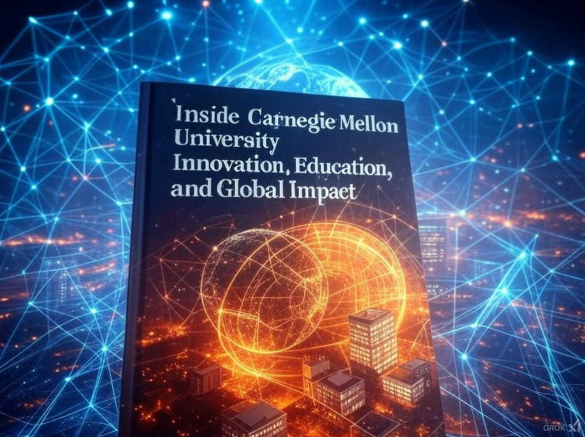
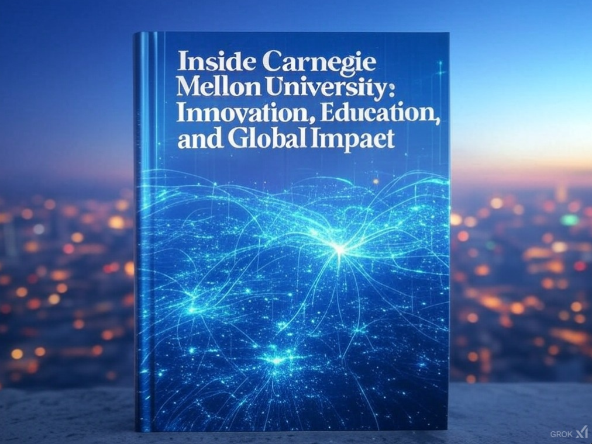
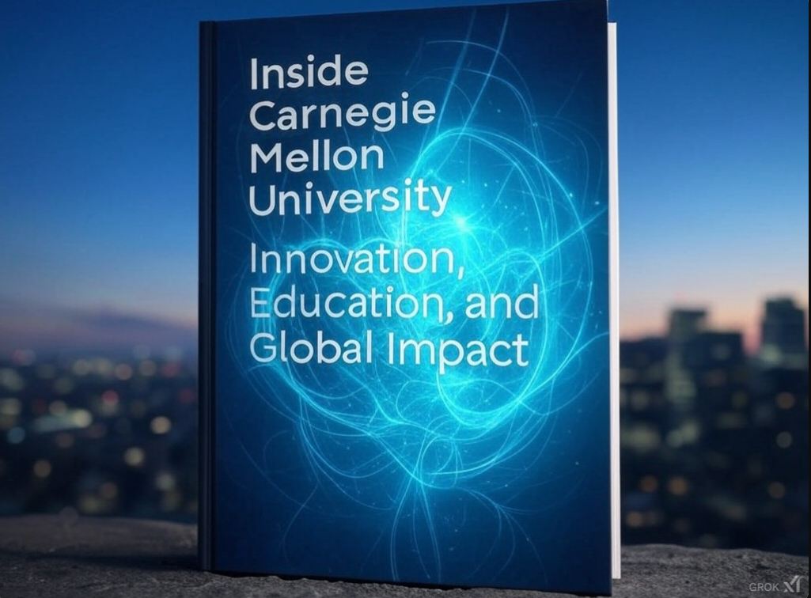

# Inside Carnegie Mellon University: Innovation, Education, and Global Impact

This is a book created by Shizheng Li with the help of OpenAI o1-mini and GPT 4o.

------

### Preface: Why This Book is Worth Reading

In the preface, the book will introduce CMU's unique position as one of the world’s top universities, particularly in computer science, artificial intelligence (AI), and entrepreneurship. This section will highlight the university’s global impact, its forward-thinking approach to interdisciplinary education, and its contribution to transforming industries through technology and innovation.

------

### Chapter 01: The History and Culture of Carnegie Mellon University

**Main Content:**

- The founding of CMU by Andrew Carnegie and the Mellon family, and its evolution into a world-class institution.
- CMU’s rise to prominence in global higher education, especially in technology and AI.
- The distinctive culture at CMU, including interdisciplinary collaboration, innovation, and a global perspective.

**Why It's Worth Reading:** This chapter provides a foundation for understanding the historical context of CMU's growth and success, setting the stage for appreciating its current achievements in technology and entrepreneurship.

------

### Chapter 02: CMU's Leadership in Computer Science and Artificial Intelligence

**Main Content:**

- The history and development of CMU’s School of Computer Science (SCS), its global rankings, and its significance in the tech world.
- CMU’s contributions to AI, from early machine learning advancements to the development of deep learning technologies.
- Notable professors and researchers (e.g., Raj Reddy, Tom Mitchell) and their pioneering work in AI.
- Key CMU labs and partnerships with tech companies, such as the self-driving car project and robotics.

**Why It's Worth Reading:** For readers interested in computer science and AI, this chapter details CMU’s leading role in shaping these fields, offering insights into its research breakthroughs and industry collaborations.

------

### Chapter 03: Cross-disciplinary Innovation and the Entrepreneurial Ecosystem

**Main Content:**

- How CMU fosters cross-disciplinary collaboration, combining computer science, arts, business, and social sciences to drive innovation.
- The university’s entrepreneurial ecosystem, including innovation hubs like the Don Jones Center for Entrepreneurship, and how it supports student and faculty ventures.
- Success stories of alumni who have founded successful companies, such as Duolingo and Twitch.

**Why It's Worth Reading:** This chapter showcases how CMU’s entrepreneurial environment nurtures startup founders and innovators, making it a valuable resource for aspiring entrepreneurs and those interested in turning ideas into businesses.

------

### Chapter 04: CMU and the Global Development of FinTech

**Main Content:**

- CMU’s role in advancing the field of Financial Technology (FinTech), combining finance, technology, and data science.
- The university’s contributions to financial engineering, blockchain, AI, and other emerging technologies in finance.
- Partnerships with financial institutions and global research centers, and their impact on the financial services industry.

**Why It's Worth Reading:** For readers with an interest in finance, this chapter offers insights into how CMU is shaping the future of financial services, blending technology and business to disrupt traditional financial systems.

------

### Chapter 05: Carnegie Mellon University’s Global Influence

**Main Content:**

- CMU’s academic influence on the global stage, especially in technology, business, and social sciences.
- The university’s international strategy and how it attracts top scholars and students from around the world.
- CMU’s contribution to developing leaders in technology, business, and social impact globally.

**Why It's Worth Reading:** This chapter emphasizes CMU’s global role as an educational leader, preparing students to make an impact on the world, not only in academia but also in business and technology industries worldwide.

------

### Chapter 06: The Future of Carnegie Mellon University: Innovating Education for a Global Impact

**Main Content:**

- CMU’s vision for the future of technology and education, particularly in fields like quantum computing, AI ethics, and global tech collaborations.
- How CMU is redefining the educational experience to prepare students for the challenges of the future.
- Partnerships with global industries and their role in shaping future educational trends.

**Why It's Worth Reading:** This chapter provides a forward-looking view of CMU’s strategic direction, highlighting how it continues to evolve to address global challenges and stay ahead in technological innovation.

------

### Conclusion: Why Choose Carnegie Mellon University?

The concluding chapter will synthesize the key themes of the book, drawing on your interests in computer science, finance, and entrepreneurship, to explain why CMU is an ideal choice for students and professionals aiming to excel in these fields. It will highlight how the university’s unique culture, interdisciplinary approach, and focus on innovation make it a leading institution for shaping the future of technology and business.

## Book Cover

Book cover created by Grok 2

The first one

The second one

The third one

## Afterword

January 20th, 2025

Shanghai, China

Shizheng Li

