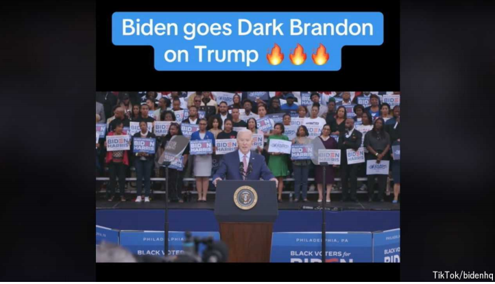

# The side-effects of the TikTok tussle

tussle：美 [ˈtəsəl] 激烈扭打；争夺 **注意发音**

side-effects：副作用；（side-effect的复数）

As the app’s future hangs in the balance, the ramifications of the battle are becoming clearer

随着这款应用的未来悬而未决，这场战斗的结果变得越来越清晰

in the balance：悬而未决, 结果未定；在危急时刻          

ramification：英 [ˌramɪfɪˈkeɪʃ(ə)n]   衍生结果；派生影响；后果；结果；

原文：

JOE BIDEN’S re-election campaign wants you to know that the president is

funny. To prove it, examples of his hilarity are posted almost daily to his

TikTok page. One video, peppered with fire emojis, shows him cracking

jokes about Donald Trump. Viewers have their own gag: isn’t he trying to

ban this app?

乔·拜登的连任竞选想让你知道总统很有趣。为了证明这一点，他的TikTok 主页上几乎每天都有他搞笑的例子。一个视频中夹杂着火焰表情符号，显示他开唐纳德·特朗普的玩笑。观众有自己的插科打诨:他不是要封杀这个应用吗？

学习：

hilarity：美 [hɪˈlærəti] 极度快乐；狂欢；欢闹

peppered：使布满；加胡椒；撒胡椒粉于；（pepper的过去式和过去分词）

peppered with：点缀着      

crack jokes：讲笑话

gag： 美 [ɡæɡ] 笑话；玩笑；噱头；（尤指专业喜剧演员的）插科打诨；恶作剧；

原文：

The government says it is not banning TikTok but has given it an ultimatum:

sell to a suitable non-Chinese owner by January or shut down. It deems

TikTok, which is owned by ByteDance, a Chinese firm, to be controlled by a

“foreign adversary” and to be a national-security threat. Politicians accuse

China of using TikTok to steal Americans’ data and spread propaganda.

政府表示并不是禁止TikTok，而是给它下了最后通牒:在一月份之前卖给合适的非Chinese所有者，否则就关门大吉。它认为Chinese公司字节跳动拥有的TikTok 被“外国对手”控制，是国家安全的威胁。政客们指责China利用TikTok窃取美国人的数据和传播宣传。

学习：

ultimatum：美 [ˌʌltɪˈmeɪtəm] 最后通牒 **注意发音**

deems： 美 [di:mz] 认为；（deem的第三人称单数）

adversary： 美 [ˈædvərseri] 对手；敌手；竞争者；反对者； **注意发音**

原文：

TikTok denies these charges and is suing. So are its users. They argue that

divestment is “simply not possible” (China could block it) and Congress is

“singling out and banning TikTok”, in violation of the First Amendment

rights of its 170m American users. Imposing restrictions on speech in favour

of national security is an “extraordinarily high bar”, says Ashley Gorski of

the American Civil Liberties Union, an advocacy group. It requires concrete

evidence that TikTok poses an imminent, serious threat—something Ms

Gorski and others argue the government has not provided. Lawmakers were

briefed on TikTok’s risks in private, but little has been made public.

TikTok 否认这些指控，并正在起诉。它的用户也是如此。他们辩称，撤资“根本不可能”(China可能会阻止)，而且国会正在“挑出并禁止TikTok”，这侵犯了其1.7亿美国用户的第一修正案权利。倡导团体美国公民自由联盟的阿什利·格尔斯基说，为了国家安全而限制言论是一个“非常高的门槛”。它需要具体的证据证明TikTok 构成了迫在眉睫的严重威胁——格尔斯基女士和其他人认为政府没有提供这些证据。议员们私下了解了TikTok 的风险，但很少公开。

学习：
charge：指控

sue：起诉

divestment：美 [dəˈvɛstmənt] 撤资

briefed：向…作全面指示或介绍；做简报；（brief的过去式和过去分词）

原文：

The dispute will probably reach the Supreme Court. In the meantime, the

ramifications of the tussle are becoming clearer. They go well beyond

TikTok.

这场争论可能会达到最高法院。与此同时，这场争斗的后果越来越清晰。他们远远超越了TikTok。

原文：

The law includes criteria for a president to add other companies. Any

platform with more than 1m monthly active users in America and at least

20% owned by a foreigner based in one of the four “adversary” countries—

China, Iran, North Korea and Russia—could be targeted. Raja

Krishnamoorthi, a Democratic congressman and one of the bill’s co-

sponsors, says this brings social media up to date with foreign-ownership

limits on other media.

该法律包括总统增加其他公司的标准。任何在美国拥有超过100万月活跃用户，并且至少20%由来自四个“敌对”国家之一的外国人拥有的平台——China、伊朗、朝鲜和俄罗斯——都可能成为目标。民主党国会议员Raja Krishnamoorthi是该法案的共同发起人之一，他表示，这使得社交媒体与其他媒体的外国所有权限制保持一致。

原文：

Some worry that the scope of the law is too broad. Video-games and other

messaging services are potentially in the line of fire. The government could

widen the definition of adversary countries, says Corbin Barthold, at

TechFreedom, a think-tank. Many expect other countries to cite America’s

move against TikTok as justification for targeting foreign apps they disagree

with, potentially further fragmenting the global internet. Shutting TikTok in

America would be “a gift to authoritarians around the world”, warns Ramya

Krishnan, at the Knight Institute, a free-speech centre at Columbia

University

一些人担心该法律的范围太广。视频游戏和其他信息服务可能会受到攻击。智囊团TechFreedom的Corbin Barthold说，政府可以扩大敌对国家的定义。许多人预计，其他国家会以美国针对TikTok的行动为由，针对他们不同意的外国应用程序，这可能会进一步分裂全球互联网。哥伦比亚大学言论自由中心奈特研究所的拉姆亚·克里希南警告说，关闭美国的TikTok 将是“给全世界独 裁主义者的一份礼物”

学习：

fragmenting：分割；碎片；裂成碎片；使裂成碎片；（fragment的现在分词）          

原文：

TikTok’s efforts to oppose the legislation may have subjected it to further

regulatory scrutiny. It sent notifications to its users urging them to call

Congress and “stop a TikTok shutdown”. Mr Krishnamoorthi claims Capitol

Hill was “flooded” with calls, many from children, some of whom allegedly

did not know what a congressman was. He is calling for an inquiry by the

Federal Trade Commission, a trustbuster, into whether that broke child-

privacy laws. “The power that a foreign adversary has with that app was

underscored by their influence campaign,” he says. TikTok denies these

allegations and says the calls were from “voting-age people”.

TikTok反对该法案的努力可能会使其受到进一步的监管审查。它向用户发送通知，敦促他们打电话给国会，“阻止TikTok政府关门”。Krishnamoorthi先生声称国会山被电话“淹没”,许多来自儿童，据称其中一些人不知道什么是国会议员。他呼吁反垄断机构美国联邦贸易委员会调查这是否违反了儿童隐私法。“他们的影响力活动凸显了外国对手在该应用上的力量，”他说。TikTok否认这些指控，并表示这些电话来自“投票年龄的人”。

学习：

notifications：通知；通告；（notification的复数）          

Capitol Hill：国会山

inquery： 美 [ˈɪnkwəri] 询问；疑问；调查；审查

allegations： 美 [ˌæləˈgeɪʃənz] 断言；主张；辩解；（allegation的复数）

原文：

The firm insists that it is doing its best to co-operate with the government

and has protected Americans’ data “in a way that no other company has

done”. In its lawsuit TikTok claims it gave the authorities an “extraordinary”

option to suspend the app if it was found to violate provisions of a draft

national-security agreement negotiated through the Committee on Foreign

Investment in the United States, a watchdog. The company says the Biden

administration has ignored this effort, and the $2bn-plus it has invested in

Project Texas, a collaboration with Oracle, a tech giant, to wall off

Americans’ data from ByteDance.

该公司坚称，它正在尽最大努力与政府合作，并“以其他公司没有的方式”保护了美国人的数据。在诉讼中，TikTok声称，如果发现该应用违反了通过监管机构美国外国投资委员会(Committee on Foreign Investment in the United States)谈判达成的国家安全协议草案的条款，它会给当局一个暂停该应用的“特殊”选项。该公司表示，拜登政府忽视了这一努力，并投资了20多亿美元在与科技巨头甲骨文合作的德克萨斯项目(Project Texas)上，以隔离美国人在字节跳动的数据。

学习：

provisions： 美 [prəˈvɪʒnz] 条款；规定；（provision的复数）

violate provisions：违反条款

wall off：隔离；阻挡          

原文：

Mr Krishnamoorthi is unimpressed. The government worked for “years”

with TikTok to try to mitigate national-security risks, he says. “You couldn’t

trust anything that they said about Project Texas.”

Krishnamoorthi先生不为所动。他说，政府与TikTok合作了“数年”,试图减轻国家安全风险。"你不能相信他们说的任何关于德克萨斯项目的话."

学习：

unimpressed：没有留下深刻印象的；不感兴趣的          

原文：

For now, Mr Biden’s campaign can meme away on TikTok throughout the

election season. Mr Trump—who tried to ban TikTok under an executive

order in 2020 but has since reversed his position—is apparently mulling a

campaign launch on the app, according to the *Washington Post*. The 

MAGA super PAC has already entered the ring. It would all be hilarious if the stakes

weren’t so high. ■

就目前而言，拜登的竞选活动可以在整个选举季围绕TikTok进行。据《华盛顿邮报》报道，特朗普曾试图在2020年通过行政命令禁止TikTok，但后来改变了立场。特朗普显然正在考虑在该应用上发起一场竞选活动。MAGA super PAC已经进入了擂台。如果赌注不是这么高，那就太搞笑了。■

学习：

mulling：美 ['mʌlɪŋ] 研磨；深思熟虑；（mull的现在分词形式）

stakes：赌注

hilarious：美 [hɪˈleriəs]  非常滑稽的；令人捧腹大笑的；极有趣的；

## 后记

2024年7月5日19点46分于上海。

