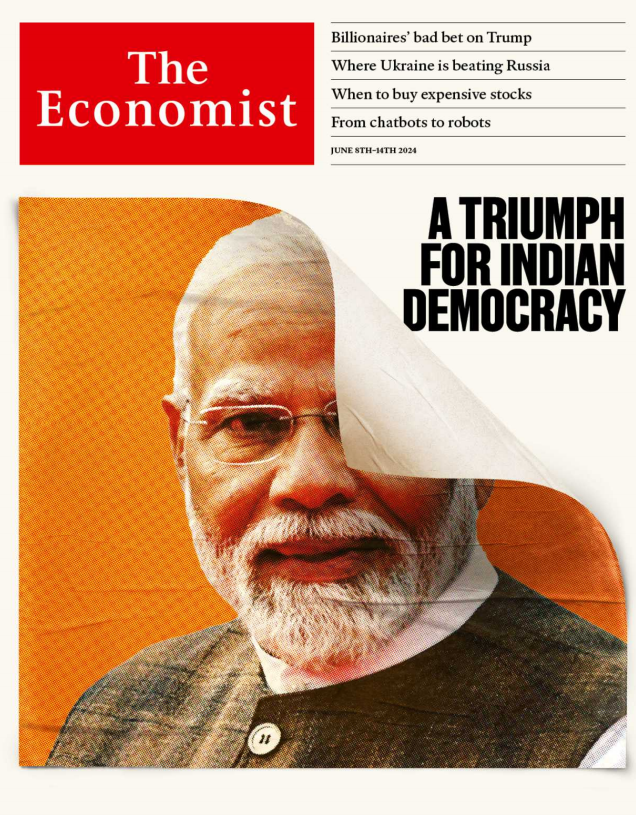

本文是对《经济学人》杂志2024.6.8这期的英文学习。

**Narendra Modi** looks likely to serve a third term as India’s prime minister,

after his Bharatiya Janata Party and its allies won a slim majority. The ruling

alliance won 293 seats, compared with the opposition’s 234. Mr Modi had

claimed that they would win upwards of 400 seats.

纳伦德拉·莫迪(Narendra Modi)看起来可能会第三次担任印度总理，此前他的印度人民党(Bharatiya Janata Party)及其盟友赢得了微弱多数。执政联盟赢得了293个席位，而反对派赢得了234个席位。莫迪先生声称他们将赢得超过400个席位。

serve  a third term: 第三次担任

allies：美 [eilaɪz] 同盟；同盟国；（ally的复数）

win a slim majority：微弱领先

Imran Khan, a former prime minister of **Pakistan**, was acquitted of leaking

state secrets in a ruling by the high court in Islamabad. The former cricketer

will remain in jail for a separate conviction. He is appealing the case.

巴基斯坦前总理伊姆兰·汗在伊斯兰堡高等法院的裁决中被判泄露国家机密罪不成立。这位前板球运动员将因另一项定罪而继续入狱。他正在对此案提出上诉。

acquitted：美 [ə'kwɪtid] 表现；宣判无罪（acquit的过去式和过去分词）

conviction:定罪

cricketer：美 [ˈkrɪkɪtər] 板球运动员

appeal the case：提出上诉

**South Korea** said it would resume military activities along its border with

the North. President Yoon Suk-yeol suspended the military agreement

between the two Koreas after Pyongyang sent balloons carrying rubbish over the border. It called them “gifts of sincerity”. Seoul vowed to “protect the

lives and safety of its people”.

韩国表示将恢复韩朝边境的军事活动。在平壤发送携带垃圾的气球越过边境后，韩国总统尹锡悦暂停了朝韩之间的军事协议。它称它们为“真诚的礼物”。首尔誓言“保护人民的生命安全”。

vowed：美 [vaʊd] 发誓；起誓；（vow的过去式）

**Donald Trump** was convicted on all 34 counts of falsifying business records

to hide hush-money payments to a former porn star before the election in 2016.

Mr Trump called the trial a “disgrace” and said that “the real verdict”

would come on November 5th, the day of the election. It is the first time that

a former American president has been found guilty of a crime. Mr Trump,

who will be sentenced on July 11th, vowed to appeal. His campaign said it

raised nearly $53m in the 24 hours after the verdict, and that more than a

third of the donors had given for the first time.

唐纳德·特朗普因在2016年大选前伪造商业记录以隐瞒对前色情明星的封口费而被判所有34项罪名成立。特朗普称这次审判是“耻辱”，并表示“真正的判决”将在11月5日，也就是大选当天揭晓。这是首次有前美国总统被判犯有罪行。特朗普将在7月11日被判刑，他誓言将上诉。他的竞选团队表示，判决后的24小时内筹集了近5300万美元，其中三分之一的捐款者是首次捐款。

falsifying：美 [ˈfɔlsəˌfaɪɪŋ] 篡改；（falsify的现在分词）

falsifying business records： 伪造商业记录

hush-money：封口费

verdict：判决

be sentenced：被判刑

**Hunter Biden’s** trial in Delaware began this week. Prosecutors allege that

the president’s son lied about using drugs while buying a revolver in 2018.

Another trial, over allegations that he failed to pay his taxes, is due in

September. It had seemed that Mr Biden might avoid the two ordeals

altogether, until his plea deal with prosecutors fell apart last year.

亨特·拜登在特拉华州的审判于本周开始。检察官指控总统的儿子在2018年购买左轮手枪时谎称吸毒。另一场针对他逃税指控的审判将于9月份进行。拜登似乎可以完全避免这两项考验，直到去年他与检方的认罪协议破裂。

prosecutors：美 [p'rɒsɪkjutəz] 公诉人；起诉人；检察官；（prosecutor的复数）

allege：美 [əˈledʒ] 声称

revolver：美 [rəˈvɑlvər] 左轮手枪

he failed to pay his taxes：逃税

ordeals：美 [ɔrˈdils] 折磨；严酷的考验；（ordeal的复数）

altogether：完全地；整个地；基本上；

plea：恳求；请求

A "plea deal" (or "plea bargain") is an agreement in a criminal case between the prosecutor and the defendant, where the defendant agrees to plead guilty to a particular charge in return for some concession from the prosecutor. This might involve the defendant pleading guilty to a lesser charge, receiving a lighter sentence, or having other charges dropped. Plea deals are often used to avoid the time and expense of a full trial, and they can result in a quicker resolution of the case. In the context of Hunter Biden's situation, his plea deal falling apart means that an agreement he had reached with prosecutors did not go through as planned, leading to the continuation of his legal ordeals.

“plea deal”（认罪协议）是指在刑事案件中，检察官与被告之间达成的一项协议。根据该协议，被告同意对某项指控认罪，以换取检察官做出某些让步。这些让步可能包括被告认罪较轻的罪名、获得较轻的刑罚或撤销其他指控。认罪协议通常用于避免全面审判的时间和费用，从而更快地解决案件。在亨特·拜登的情况下，他与检察官达成的认罪协议未能如计划中那样通过，这导致了他的法律问题继续进行。

fall apart：（协议）破裂

**Trial（审判）**

- **定义：** 司法程序中对案件进行审理和裁决的过程，通常由法庭进行。
- **例子：** 法庭上对被告是否有罪进行审判。

**Allegations（指控）**

- **定义：** 在法律或公众场合对某人提出未经证实的指责或宣称某人有不当行为的陈述。
- **例子：** 被告面对的多项指控包括欺诈和逃税。

**Due（预定的，预期的）**

- **定义：** 指某件事情计划或预计会在某个时间发生，通常带有时间上的要求或期限。
- **例子：** 这份报告的提交截止日期是下周一。

Definitions in English

1. **Trial**
   - **Definition:** The process in a court of law where a case is examined and a judgment is made.
   - **Example:** The court will hold a trial to determine the defendant's guilt or innocence.

2. **Allegations**
   - **Definition:** Claims or assertions that someone has done something illegal or wrong, typically made without proof.
   - **Example:** The defendant faces several allegations of fraud and tax evasion.

3. **Due**
   - **Definition:** Expected or scheduled to happen at a particular time.
   - **Example:** The report is due next Monday.

In the sentence "Another trial, over allegations that he failed to pay his taxes, is due in September," the word "over" functions as a preposition.

Explanation of Grammar and Structure:

1. **Main Clause:** 
   - "Another trial is due in September."
   - This is the core of the sentence, stating that a trial is scheduled for September.

2. **Prepositional Phrase:**
   - "over allegations that he failed to pay his taxes"
   - The prepositional phrase starts with the preposition "over" and provides additional information about the nature or reason for the trial.

 Role of "over":

- **Preposition "over":** 
  - In this context, "over" means "concerning" or "about." It introduces the reason or subject matter of the trial.
  - It connects the noun "trial" with the allegations that form the basis of the trial.

Breakdown of the Prepositional Phrase:

- **Allegations that he failed to pay his taxes:** 
  - This clause specifies what the allegations are.
  - "Allegations" is the object of the preposition "over."
  - "that he failed to pay his taxes" is a relative clause describing the allegations.

Rephrasing for Clarity:

- "Another trial, concerning allegations that he failed to pay his taxes, is due in September."
- "Another trial, regarding allegations that he failed to pay his taxes, is due in September."

In summary, the word "over" in this sentence serves to link the trial to its cause or subject, which is the allegations of tax evasion.

Delaware：美 [ˈdɛləwɛr] 特拉华州

特拉华州 (Delaware) 是美国东海岸的一州，拥有悠久的历史和丰富的文化遗产。以下是对特拉华州的一些基本介绍：

1. 地理位置

特拉华州位于美国东北部的中大西洋地区，北接宾夕法尼亚州，东邻新泽西州（隔特拉华河），南边和西边与马里兰州接壤。其东部沿大西洋和特拉华湾拥有漫长的海岸线。

2. 历史

特拉华州是美国最早的13个殖民地之一，也是第一个批准《美国宪法》的州，因此被称为“第一州”（The First State）。该州于1787年12月7日正式加入联邦。

3. 首府和主要城市

- **首府：** 多佛市 (Dover)
- **最大城市：** 威尔明顿 (Wilmington)

威尔明顿是特拉华州的经济中心，拥有多家跨国公司和金融机构。

4. 经济

特拉华州因其有利的税收政策和商业法规，成为许多公司的注册地。超过一半的美国上市公司和60%的财富500强公司在特拉华州注册。此外，该州还以化学工业、金融服务和农业（特别是家禽业）而闻名。

5. 教育

特拉华大学（University of Delaware）是该州最主要的高等教育机构，享有很高的学术声誉，特别是在工程、科学和商业领域。

6. 文化与旅游

特拉华州拥有丰富的历史遗迹和自然景观，如：
- **特拉华州立博物馆**：展示州的历史和文化。
- **布兰迪万河谷**：以其美丽的自然风光和历史遗迹闻名。
- **雷霍博斯海滩 (Rehoboth Beach)** 和其他海滩是受欢迎的度假胜地。
- **冬特尔博物馆与花园 (Winterthur Museum and Gardens)**：展示美国的历史和装饰艺术。

7. 政治

特拉华州在全国政治中具有重要影响力，尽管它是一个小州，但在参议院拥有平等的代表权。近年来，特拉华州在总统选举中倾向于支持民主党。

总之，特拉华州虽然面积小，但在历史、经济和文化等方面具有重要地位，成为美国重要的一部分。

Delaware is a state located on the East Coast of the United States, known for its rich history and cultural heritage. Here’s an overview of Delaware:

1. Geographic Location

Delaware is situated in the Mid-Atlantic region of the northeastern United States. It borders Pennsylvania to the north, New Jersey to the east (across the Delaware River), and Maryland to the south and west. It has a long coastline along the Atlantic Ocean and Delaware Bay on its eastern side.

2. History

Delaware is one of the original 13 colonies and was the first state to ratify the United States Constitution, earning it the nickname "The First State." It officially joined the Union on December 7, 1787.

3. Capital and Major Cities

- **Capital:** Dover
- **Largest City:** Wilmington

Wilmington is the economic hub of the state, hosting numerous multinational companies and financial institutions.

4. Economy

Delaware is known for its favorable tax policies and business regulations, making it a popular state for corporate registrations. More than half of publicly traded companies in the U.S. and 60% of the Fortune 500 companies are incorporated in Delaware. The state's economy also benefits from chemical manufacturing, financial services, and agriculture, particularly poultry farming.

5. Education

The University of Delaware is the state's most prominent higher education institution, renowned for its programs in engineering, science, and business.

6. Culture and Tourism

Delaware boasts a variety of historical sites and natural attractions, including:
- **Delaware State Museum:** Showcasing the state’s history and culture.
- **Brandywine Valley:** Known for its scenic beauty and historical landmarks.
- **Rehoboth Beach:** Along with other beaches, it is a popular vacation destination.
- **Winterthur Museum and Gardens:** Displaying American history and decorative arts.

7. Politics

Delaware holds significant political influence despite its small size, with equal representation in the Senate. In recent years, it has tended to support the Democratic Party in presidential elections.

Overall, Delaware may be small in size, but it plays a significant role in America's history, economy, and culture, making it an integral part of the nation.

President Joe Biden signed an executive order that would limit asylum

claims at America’s southern **border with Mexico**. The rule prevents people

who cross the border illegally from applying for asylum once encounters

with border-control officials exceed an average of 2,500 a day—a threshold

that will be easily crossed.

美国总统乔·拜登签署了一项行政命令，限制在美墨南部边境的庇护申请。该规则规定，当与边境管制官员的日均遭遇次数超过2,500次时，非法越境者将不能申请庇护——这一门槛很容易被超越。

executive order：行政命令

asylum：美 [əˈsaɪləm] 政治避难；避难所

asylum claims：庇护申请