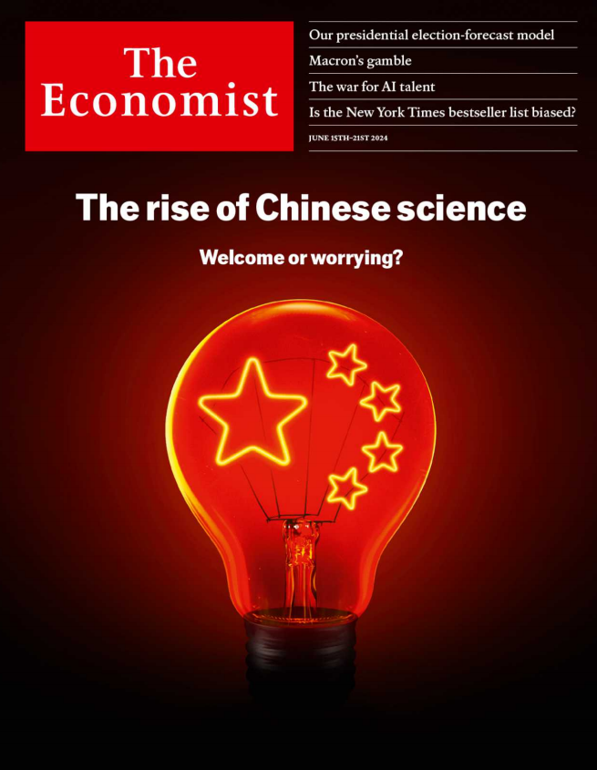

# **How worrying is the rapid rise of Chinese science?**

**If America wants to maintain its lead, it should focus less on keeping** **China down**

IF THERE IS one thing the Chinese Communist Party and America’s

security hawks agree on, it is that innovation is the secret to geopolitical,

economic and military superiority. President Xi Jinping hopes that science

and technology will help his country overtake America. Using a mix of

export controls and sanctions, politicians in Washington are trying to prevent

China from gaining a technological advantage.

学习：

Chinese Communist Party 

"Security hawks" 在这里指的是那些对国家安全问题特别强硬和警惕的美国政治人物或官员。他们通常主张采取严格的措施来保护国家安全，特别是在防止其他国家（如中国）获得技术优势方面。

In this context, "security hawks" refers to American politicians or officials who are particularly strong and vigilant on national security issues. They typically advocate for strict measures to protect national security, especially in preventing other countries (like China) from gaining a technological advantage.

superiority：美 [suːˌpɪriˈɔːrəti]  优势

military superiority：军事优势

using a mix of export controls and sanctions: 使用出口管控和制裁的混合手段

technological advantage：技术优势

America’s strategy is unlikely to work. As we report this week, Chinese

science and innovation are making rapid progress. It is also misguided. If

America wants to maintain its lead—and to get the most benefit from the

research of China’s talented scientists—it would do better to focus less on

keeping Chinese science down and more on pushing itself ahead.

美国的策略不太可能奏效。正如我们本周报道的那样，中国的科学和创新正在取得快速进步。这也是被误导的。如果美国想保持其领先地位，并从中国天才科学家的研究中获得最大利益，它最好少关注压制中国科学，多关注推动自己前进。

学习：

is unlikely to work: 不太可能奏效

make rapid progress：取得进步

maintain its lead：维持领先地位

get the most benefit: 获得最大利益

For centuries the West sniffed at Chinese technology. Self-regarding

Europeans struggled to accept that such a far-flung place could possibly

have invented the compass, the crossbow and the blast furnace. In recent

decades, as China joined the world economy, its rapid catch-up and abuse of

Western intellectual property meant that it was more often an imitator and a

thief than an innovator. Meanwhile, its science was disparaged, partly

because it encouraged researchers to churn out high volumes of poor-quality

scientific papers.

几个世纪以来，西方对中国技术嗤之以鼻。自负的欧洲人难以接受这样一个遥远的地方可能发明了指南针、十字弓和高炉。近几十年来，随着中国加入世界经济，它对西方知识产权的快速追赶和滥用意味着它更多时候是一个模仿者和小偷，而不是创新者。与此同时，它的科学受到了贬低，部分原因是它鼓励研究人员大量生产低质量的科学论文。

学习：

sniff at：对...嗤之以鼻（或不屑一顾）

self-regarding：自私自利的，自负的

struggle to xxx：难以xxx

far-flung：美 [ˈfɑr ˈfləŋ] 遥远的

crossbow：弩，十字弓

blast furnace：高炉；鼓风炉

join the world economy: 加入全球经济

rapid catch-up: 快速追赶

imitator：美 [ˈɪmɪteɪtər]  模仿者

it was more often an imitator and a thief than an innovator.它更多时候是一个模仿者和小偷，而不是创新者

disparaged：美 [dɪ'spærɪdʒd] 蔑视；毁谤；贬低；（disparage的过去式和过去分词）

churn out：美 [tʃərn aʊt] 大量炮制；粗制滥造

poor-quality：低质量的

churn out high volumes of poor-quality scientific papers. 大量生产低质量的科学论文。

It is time to lay these old ideas to rest. China is now a leading scientific

power. Its scientists produce some of the world’s best research, particularly

in chemistry, physics and materials science. They contribute to more papers

in prestigious journals than their colleagues from America and the European

Union and they produce more work that is highly cited. Tsinghua and

Zhejiang universities each carry out as much cutting-edge research as the

Massachusetts Institute of Technology

是抛弃这些旧观念的时候了。中国现在是领先的科学强国。它的科学家们做出了一些世界上最好的研究，尤其是在化学、物理和材料科学方面。与来自美国和欧盟的同事相比，他们在知名期刊上发表了更多的论文，他们的作品被高度引用。清华大学和浙江大学各自开展的前沿研究与麻省理工学院一样多

学习：

lay these old ideas to rest: 摒弃这些旧观念

prestigious：美 [preˈstɪdʒəs] 有威信的；有威望的；有声望的 **注意发音**

prestigious journals: 知名期刊

[prestigious university] 名牌大学；有名大学；著名学府

Chinese laboratories contain some of the most advanced kit, from

supercomputers and ultra-high-energy detectors to cryogenic electron

microscopes. These do not yet match the crown jewels of Europe and

America, but they are impressive. And China hosts a wealth of talent. Many

researchers who studied or worked in the West have returned home. China is

training scientists, too: more than twice as many of the world’s top 

AI researchers got their first degree in China as in America

中国实验室拥有一些最先进的设备，从超级计算机和超高能探测器到低温电子显微镜。这些还比不上欧美的皇冠上的明珠，但它们令人印象深刻。中国拥有大量人才。许多在西方学习或工作的研究人员已经回国。中国也在培养科学家:世界顶尖人工智能研究人员在中国获得第一个学位的人数是在美国的两倍多。

学习：

cryogenic：美 [ˌkraɪəˈdʒɛnɪk] 低温学的；低温的

microscopes：美 [ˈmaɪkrəˌskoʊps] 显微镜；（microscope的复数）

jewels：美 [ˈdʒuːəlz] 珠宝；宝石；（jewel的复数）**注意发音**

crown jewels：皇冠上的明珠

a wealth of: 大量的

China hosts a wealth of talent: 中国拥有大量人才。

In commercial innovation China is also overturning old assumptions. The

batteries and electric vehicles it exports are not just cheap, but state-of-the

art. Huawei, a Chinese telecoms firm brought low after most American firms

were barred from dealing with it by 2020, is resurgent today and has weaned

itself off many foreign suppliers. Although it earns a third of the revenue of

Apple or Microsoft, it spends nearly as much as they do on  R&D.

在商业创新方面，中国也在推翻旧的假设。它出口的电池和电动汽车不仅便宜，而且是最先进的。华为是一家中国电信公司，在2020年大多数美国公司被禁止与其打交道后陷入低迷。如今，华为正在复兴，并摆脱了对许多外国供应商的依赖。尽管它的收入是苹果或微软的三分之一，但它在研发上的支出几乎与它们一样多。

学习：

were barred：美 [bɑːrd]  禁止；闩上；阻拦；（bar的过去式和过去分词）

resurgent：美 [rəˈsərdʒənt] 复苏的；复兴的；复活的

weaned：美 [wi:nd] 使断奶；使断念；（wean的过去式）

China is not yet the world’s dominant technological power. Huawei still has

limited access to advanced chips; self-sufficiency is costly. The country’s

many state-owned firms are sclerotic. Much of the spending on research is

guided by the state’s heavy hand. And some mediocre universities still

produce mediocre research. China’s innovation, in other words, is inefficient. 

Yet it is an inefficiency that Mr Xi is willing to tolerate in order

to produce a sheaf of world-class results.

中国还不是世界上占主导地位的科技强国。华为获得先进芯片的渠道仍然有限；自给自足代价高昂。该国许多国有企业僵化。大部分研究支出都受到政府的强力指导。一些平庸的大学仍然产生平庸的研究。换句话说，中国的创新是低效的。然而，为了产生大量世界级的成果，Xi愿意容忍这种低效率。

学习：

self-sufficiency：自给自足；独立性；自足

state-owned firms：国有企业

sclerotic：美 [skləˈrɑdɪk] 僵化的；顽固的；失去适应能力的

heavy hand：严厉手段；粗暴方式

mediocre：美 [ˌmiːdiˈoʊkər]  平庸的；平凡的 **注意发音**

All this poses a dilemma for America. With more good science comes new

knowledge that benefits all humanity, by solving the world’s problems and

improving lives, as well as deepening understanding. Thanks to China’s

agronomists, farmers everywhere could reap more bountiful harvests. Its

perovskite-based solar panels will work just as well in Gabon as in the Gobi

desert. But a more innovative China may also thrive in fields with military

uses, such as quantum computing or hypersonic weapons. It will also aim to

convert its technological prowess into economic and diplomatic influence.

所有这些都给美国带来了两难的境地。更多好的科学带来新的知识，通过解决世界问题和改善生活以及加深理解来造福全人类。多亏了中国的农学家，世界各地的农民都能获得更大丰收。它的钙钛矿太阳能电池板在加蓬和戈壁沙漠一样好用。但一个更具创新性的中国也可能在具有军事用途的领域蓬勃发展，如量子计算或高超音速武器。它还将致力于将其技术实力转化为经济和外交影响力。

学习：

pose：美 [ˈpoʊz] 形成；构成；摆出姿态或姿势

agronomist：美 [əˈgrɑnəmɪst] 农学家 **注意发音**

reap：收割；收割…里的庄稼；获得；

bountiful：美 [ˈbaʊntɪfl] 大量的；丰富的；充足的；

harvest：美 [ˈhɑrvɪst] 收获；收成；

reap more bountiful harvests: 获得更大的丰收

perovskite：美 [pəˈrɑvzkaɪt] 钙钛矿

solar panel：太阳能电池板

hypersonic weapons：高超音速武器

prowess：美 [ˈpraʊəs] 杰出才能；高超本领；

technological prowess：技术实力

So far America has focused on the threats, by trying to stymie China using

sanctions and by limiting the flow of data, talent and ideas. After all, hawks

say, China is itself notoriously secretive. It failed to share its early work on

the virus that causes covid-19, a shocking breach of its responsibilities that

could have cost lives—possibly millions of them. If Chinese science is

thriving thanks to these tactics, then perhaps America should simply be even

harder line and more restrictive

迄今为止，美国一直关注这些威胁，试图通过制裁和限制数据、人才和思想的流动来阻碍中国。鹰派人士说，毕竟，中国本身就是出了名的神秘。它未能分享其对导致新冠肺炎病毒的早期工作，这是一个令人震惊的违反其责任的行为，可能会导致生命损失——可能有数百万人。如果中国的科学由于这些策略而繁荣，那么也许美国应该采取更强硬的路线和更多的限制

学习：

stymie：美 [ˈstaɪmi] 阻碍；妨碍；阻拦

notoriously：美 [noʊˈtɔːriəsli] 声名狼藉地；恶名昭彰地；众所周知地

secretive：美 [ˈsiːkrətɪv] 保密的；守口如瓶的；遮遮掩掩的

China is itself notoriously secretive.

breach：美 [briːtʃ]  违反；违背；破坏；

be hard line：严格的立场

在这个上下文中，"be harder line" 意思是采取更严格或更不妥协的立场或政策。这里的 "line" 不是形容词，而是 "harder line" 短语的一部分，其中 "hard" 作为形容词修饰 "line"。短语 "hard line" 意思是严格、不妥协的立场或方法，而 "harder line" 则表示使这种立场更加严格。

In this context, "be harder line" means to adopt a stricter or more uncompromising stance or policy. The word "line" is not an adjective here; rather, it is part of the phrase "harder line," where "hard" acts as an adjective modifying "line." The phrase "hard line" means a strict, uncompromising position or approach, and "harder line" suggests making that position even more strict.

That overestimates America’s ability to constrain the whole of Chinese

science. Even Huawei has prospered despite foreign sanctions. And it

underestimates the cost to America’s own science—including the technology

that underpins its security. Rather than copy China’s tactics, America should

sharpen its own innovative edge, by enhancing the traits that made it

successful

这高估了美国限制整个中国科学的能力。尽管受到外国制裁，甚至华为也取得了成功。而且它低估了美国自身科学的成本——包括支撑其安全的技术。美国不应该复制中国的策略，而应该通过增强使其成功的特质来增强自己的创新优势

学习：

underpin：美 [ˌʌndərˈpɪn] 加固…地下基础；支持；巩固； **注意发音**

sharpen innovative edge: 增强创新优势

One of its strengths is openness. America has long been a magnet for the

world’s brightest minds, and it should continue to attract them—even from

China. Some work needs to be secret, obviously, but a presumption against

hiring Chinese researchers would deprive America of precious talent.

America must also be open to ideas. Citations have increased, but too few

Western scientists take note of Chinese papers. A deal in the 1970s by Deng

Xiaoping and Jimmy Carter to enhance academic collaboration was

grudgingly extended in March for only six months, because of Republicans’

fears about national security. It should be renewed for longer. American and

Soviet scientists worked together even in the depths of the cold war.

它的优势之一是开放性。长期以来，美国一直吸引着世界上最聪明的人才，它应该继续吸引他们——甚至是来自中国的人才。显然，有些工作需要保密，但不雇佣中国研究人员的假设会剥夺美国宝贵的人才。美国也必须对思想持开放态度。被引用的论文越来越多，但很少有西方科学家注意到中国的论文。由于共和党人对国家安全的担忧，邓小平和吉米·卡特在20世纪70年代达成的一项加强学术合作的协议在3月份勉强延长了仅六个月。它应该更新更长的时间。美国和苏联的科学家甚至在冷战最激烈的时候也曾合作过。

学习：

brightest minds: 最聪明的大脑，最聪明的人才

has long been a magnet for the world’s brightest minds 剥夺美国宝贵的人才

deprive：美 [dɪˈpraɪv] 剥夺；夺取；使丧失；

deprive America of precious talent：剥夺美国宝贵的人才

take note of：留心，注意到

too few Western scientists take note of Chinese papers. 很少有西方科学家注意到中国的论文。

enhance academic collaboration: 加强学术合作。

grudgingly：美/ˈɡrʌdʒɪŋli/ 不情愿地；勉强地

Another strength is America’s dynamic economy, in which the best

universities, government agencies and companies innovate. But too much of

a scientist’s time is spent on bureaucracy. Finding faster ways to allocate

grants, say by lottery, could help. Last, America should not blunt its market

mechanism. In China most research money comes from the state; in America

the private sector is a bigger spender. It is not White House edicts that find

and develop the best ideas, but markets powered by competition.

另一个优势是美国充满活力的经济，最好的大学、政府机构和公司都在其中进行创新。但是，科学家太多的时间都花在了官僚主义上。通过抽签等更快的方式分配拨款，可能会有所帮助。最后，美国不应削弱其市场机制。在中国，大部分研究经费来自国家；在美国，私营部门的支出更大。寻找和发展最佳创意的不是白宫的法令，而是由竞争驱动的市场。

学习：

government agency：政府机构

bureaucracy：美/bjʊˈrɑːkrəsi/ 官僚主义

allocate grants：分配拨款

blunt：美/blʌnt/ 使减弱；使(尖端、刃)变钝；

The fact that an authoritarian regime is nearing the technological frontier is

alarming. Yet America should not strive to become more like China, but to

draw on its own distinctive strengths. The result will be more scientific

discovery and technical ingenuity—and ultimately more security. 

一个zhuanzhi政权正接近技术前沿，这一事实令人担忧。然而，美国不应该努力变得更像中国，而应该利用自己独特的优势。其结果将是更多的科学发现和技术独创性，并最终提高安全性。

学习：

authoritarian：美/əˌθɔːrəˈteriən/ 专制的；独裁的；威权主义的

regime：美/reɪˈʒiːm/ 政权；政体 **注意发音**

draw on：利用，动用，凭借

draw on its own distinctive strenghs: 利用自己独特的优势

