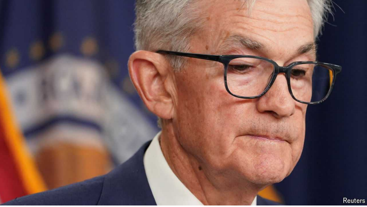

# America seems immune to the world economy’s problems

美国似乎对世界经济问题免疫

immune to：美 [ɪˈmjun tu] 对…有免疫力；不受…感染；不受…的影响；免疫耐受；

**Elsewhere, political dysfunction and fiscal frailties are taking a toll**

在其他地方，政治功能失调和财政脆弱正在造成损害

dysfunction：美 [ˌdɪsˈfəŋ(k)ʃ(ə)n] 功能障碍；机能不良；紊乱；失常

fiscal：美 [ˈfɪskl] 财政（尤指税收）的；金融的；财政年度的

frailty：美 [ˈfreɪlti] 脆弱；虚弱；弱点

toll：美 [toʊl] 代价；损失；破坏

这里的 "take a toll" 意思是“造成损失”或“产生负面影响”。整句话的意思是“在其他地方，政治功能失调和财政脆弱性正在造成损失。”

Add  MONETARY policy to the list of ways in which America’s economy stands out.

Central banks in Canada, Sweden and the euro zone all recently began

cutting interest rates. Yet the Federal Reserve on June 12th again postponed

its plans for monetary loosening. Even though rates in America have risen

higher than in other big rich countries and inflation is falling, the median

Fed rate-setter expects a cut of just one quarter of a percentage point this year.

将货币政策加入美国经济脱颖而出的方式中。加拿大、瑞典和欧元区的央行最近都开始降息。然而，美联储在6月12日再次推迟了放松货币政策的计划。尽管美国的利率已经比其他富裕国家上升的更高，通货膨胀也在下降，但是美联储的利率制定者预计今年的利率只会下降0 . 25个百分点。

学习：

monetary policy：货币政策

cut interest rate：降息

monetary loosening：货币宽松

one quarter of a percentage point：0.25个百分点

Some monetary divergence is the natural consequence of America’s stronger

growth. But what is striking about America is how immune its markets

appear to be to the threat of political dysfunction and fiscal frailty. By contrast, in the rest of the world those factors are weighing increasingly

heavily.

一些货币差异是美国强劲增长的自然结果。但是美国引人注目的是其市场似乎对政治功能失调和财政脆弱的威胁免疫。相比之下，在世界其他地区，这些因素的权重越来越大。

学习：

divergence：美 [daɪˈvɜːrdʒəns] 差异；不同；发散；分歧

natural consequence：自然结果

what is striking：引人注目的是xxx

factors are weighting increasingly heavily: 因素的权重越来越大

According to the European Central Bank’s latest projections, the euro zone’s

economy will grow by 0.9% in 2024. A real-time estimate by the Federal

Reserve Bank of Atlanta suggests that America’s is currently growing at

more than three times that pace. China is struggling with a property crisis

and the threat of deflation; Japan has been defending its weak currency and

Britain has become synonymous with dreadful productivity. As others catch

up to the world’s biggest economy, America’s share of global 

GDP at market exchange rates should be falling. A mix of strong growth and a strong dollar

means that it is growing instead.

根据欧洲央行的最新预测，2024年欧元区经济将增长0.9%。亚特兰大联邦储备银行的实时估计表明，美国目前的增长速度是这个速度的三倍多。中国正在艰难应对房地产危机和通缩威胁；日本一直在捍卫其疲软的货币，而英国已经成为可怕的生产率的代名词。当其他国家赶上世界上最大的经济体时，按市场汇率计算，美国占全球GDP的份额应该会下降。但是，强劲的增长和强势的美元意味着它正在增长。

学习：

latest projections: 最新预测

grow by xx：增长xxx

growing at more than three times that pace: 比这个速度快三倍多

property crisis：房地产危机

defending its weak currency：捍卫疲软的货币

synonymous with：与xxx是同义词

dreadful：美 [ˈdredfl] 令人痛苦的；极其糟糕的；

Elsewhere, investors are taking fright at election results, especially where

governments are fiscally frail. After President Emmanuel Macron

announced surprise parliamentary elections on June 9th, French bonds sold

off, widening the spread between their yields and those of safe German

bunds. The IMF reckons France needs fiscal tightening of about 3% of 

GDP to stabilise its debt by 2029. Yet the ascendant National Rally fought the last

parliamentary election on new tax and spending worth perhaps €100bn ($108bn, or 3.6% of GDP) a year.

在其他地方，投资者对选举结果感到恐惧，尤其是在政府财政脆弱的地方。在埃马纽埃尔·马克龙总统宣布6月9日出人意料的议会选举后，法国债券遭到抛售，扩大了其与安全的德国债券之间的利差。国际货币基金组织估计，法国需要财政紧缩约占GDP的3%,才能在2029年前稳定其债务。然而，方兴未艾的全国集会为上一次议会选举打了一场胜仗，新的税收和支出每年可能价值1000亿€(1080亿美元，或GDP的3.6%)。

学习：

"take fright" 是一个短语，意思是“受到惊吓”或“感到恐慌”。在这个上下文中，整句话的意思是“在其他地方，投资者对选举结果感到恐慌，尤其是那些财政状况脆弱的国家。”

frail：美 [freɪl] 脆弱的；体质弱的；弱的

fiscally frail：财政脆弱

parliamentary election：议会选举

法国的 **parliamentary elections**（议会选举）指的是法国选举国民议会（Assemblée Nationale）成员的过程。国民议会是法国的下议院，负责立法工作。议会选举通常每五年举行一次，通过选举产生的议员将代表各个选区的选民。议会选举的结果会对政府的组成和政策产生重要影响。如果现任总统所在的政党在议会中没有获得多数席位，就可能会导致政府的不稳定或政策执行上的困难。

widen the spread：扩大利差

"**Widening the spread**" 指的是扩大收益率差。这通常发生在金融市场中，特别是指不同债券之间的收益率差距增大。在你提到的上下文中，这句话的意思是：

“在6月9日总统埃马纽埃尔·马克龙宣布意外的议会选举后，法国债券被大量抛售，导致其收益率与安全的德国国债（bunds）的收益率差距扩大。”

简单来说，**"widening the spread"** 意味着法国债券和德国债券之间的收益率差距变大了，通常这是因为投资者对法国债券的信心下降，导致其价格下跌和收益率上升。

stabilise：美 ['steɪblˌaɪz]  （使）稳定；（使）稳固

ascendant：美 [əˈsɛndənt] 力量增长的；

rally：美 [ˈræli] 重新集合；集合

法国有多个主要政党，涵盖广泛的政治光谱。以下是一些主要的法国政党及其基本介绍：

1. **共和党（Les Républicains, LR）**：
   - 右翼政党，起源于戴高乐主义。
   - 主张保守主义、自由市场经济和强大的国家角色。
   - 近年来的著名领导人包括尼古拉·萨科齐（Nicolas Sarkozy）。

2. **社会党（Parti Socialiste, PS）**：
   - 中左翼政党，主张社会民主主义。
   - 支持社会福利、劳动权利和渐进式税收政策。
   - 弗朗索瓦·奥朗德（François Hollande）和弗朗索瓦·密特朗（François Mitterrand）是该党的著名总统。

3. **共和国前进（La République En Marche!, LREM）**：
   - 中间派政党，由现任总统埃马纽埃尔·马克龙（Emmanuel Macron）于2016年创立。
   - 主张进步主义、欧洲一体化和市场经济改革。
   - 在2017年总统选举中取得巨大胜利。

4. **国民联盟（Rassemblement National, RN）**：
   - 极右翼政党，前身为国民阵线（Front National, FN）。
   - 由马琳·勒庞（Marine Le Pen）领导，主张民族主义、反移民和欧盟怀疑论。
   - 近年来在选举中取得了显著进展。

5. **不屈法国（La France Insoumise, LFI）**：
   - 左翼政党，由让-吕克·梅朗雄（Jean-Luc Mélenchon）于2016年创立。
   - 主张社会主义、环境保护和反资本主义。
   - 在年轻选民和左翼选民中有一定影响力。

6. **民主运动（Mouvement Démocrate, MoDem）**：
   - 中间派政党，领导人是弗朗索瓦·贝鲁（François Bayrou）。
   - 支持欧洲一体化、社会自由和环境保护。
   - 通常与LREM合作。

7. **欧洲生态-绿党（Europe Écologie Les Verts, EELV）**：
   - 生态主义政党，主张环境保护和可持续发展。
   - 在环保政策和气候变化议题上具有强烈的立场。

这些政党在法国的政治舞台上扮演着重要角色，它们的政策和理念代表了不同的社会和经济观点。每次选举中，各政党之间的竞争和联盟变化都会影响法国的政治走向。

France has several major political parties spanning a wide political spectrum. Here are some of the main parties and a brief introduction to each:

1. **The Republicans (Les Républicains, LR)**:
   - A center-right party with roots in Gaullism.
   - Advocates for conservatism, free-market economy, and a strong state role.
   - Notable recent leaders include Nicolas Sarkozy.

2. **Socialist Party (Parti Socialiste, PS)**:
   - A center-left party that supports social democracy.
   - Emphasizes social welfare, labor rights, and progressive taxation policies.
   - François Hollande and François Mitterrand are notable presidents from this party.

3. **La République En Marche! (LREM)**:
   - A centrist party founded by current President Emmanuel Macron in 2016.
   - Promotes progressivism, European integration, and market economy reforms.
   - Achieved significant success in the 2017 presidential election.

4. **National Rally (Rassemblement National, RN)**:
   - A far-right party, formerly known as the National Front (Front National, FN).
   - Led by Marine Le Pen, it advocates for nationalism, anti-immigration policies, and Euroscepticism.
   - Has gained substantial ground in recent elections.

5. **La France Insoumise (LFI)**:
   - A left-wing party founded by Jean-Luc Mélenchon in 2016.
   - Supports socialism, environmental protection, and anti-capitalism.
   - Popular among young and left-leaning voters.

6. **Democratic Movement (Mouvement Démocrate, MoDem)**:
   - A centrist party led by François Bayrou.
   - Supports European integration, social liberalism, and environmental protection.
   - Often collaborates with LREM.

7. **Europe Ecology – The Greens (Europe Écologie Les Verts, EELV)**:
   - An environmentalist party focused on sustainability and ecological policies.
   - Takes strong positions on environmental protection and climate change issues.

These parties play significant roles in France's political landscape, representing diverse social and economic views. The competition and alliances among these parties in each election cycle significantly influence the country's political direction.

In Mexico the peso has fallen by about 10% against the dollar since the

crushing victory of Claudia Sheinbaum, the left-wing presidential candidate,

in its elections. India’s markets tumbled after it seemed that Narendra

Modi’s ability to enact reforms had weakened, though they have largely

recovered since. Britain’s election is not moving investors much, but only

because the result is all but known and its politicians have been cowed by

the bond-market crisis that struck in 2022.

自左翼总统候选人Claudia Sheinbaum在选举中大获全胜以来，墨西哥比索对美元下跌了约10%。印度市场在纳伦德拉·莫迪实施改革的能力似乎被削弱后大幅下挫，尽管此后基本上有所回升。英国大选并没有对投资者产生太大影响，但这只是因为结果几乎是众所周知的，而且其政客已经被2022年爆发的债券市场危机吓住了。

学习：

left-wing：左翼

crushing：美 [ˈkrʌʃɪŋ] 决定性的；压倒的

crushing victory：压倒性的胜利

tumbled：美 [ˈtʌmbld] 翻滚；暴跌；（tumble的过去分词）

all but：几乎，差不多

all but known：几乎是众所周知的

cowed：美 [kaʊd]恐吓；威胁；（cow的过去式和过去分词）

Only America looks able to shrug off political uncertainty and fiscal frailty.

Its underlying deficit of 7.4% of 

GDP means that the fiscal tightening needed to

stabilise its debts is bigger than France’s, even after accounting for faster

growth. The likely return of Donald Trump to the White House creates a risk

of wider deficits, institutional decay and perhaps even the politicisation of

monetary policy. Yet America’s government debt has no risk premium, as if

inflation were permanently defeated and Fed policy will turn out exactly as

forecast (despite the fact that in the recent past it has not). In most countries

big deficits are a threat. In America they are taken simply to support growth

and interest rates, leading the dollar to strengthen. The stockmarket is

booming again, fuelled by optimism about artificial intelligence.

只有美国看起来对政治不确定性和财政脆弱不以为意。其占GDP 7.4%的潜在赤字意味着稳定其债务所需的财政紧缩比法国更大，即使考虑到更快的增长。唐纳德·特朗普(Donald Trump)可能重返白宫，这带来了赤字扩大、制度衰退甚至货币政策政治化的风险。然而，美国政府债务没有风险溢价，就好像通货膨胀已经被永久击败，美联储的政策将完全按照预测的那样发展(尽管事实上在不久前还没有)。在大多数国家，巨额赤字是一种威胁。在美国，它们只是被用来支持增长和利率，导致美元走强。由于对人工智能的乐观情绪，股票市场再次繁荣起来。

学习：

shrug off：不予理会；对…置之不理；忽略；摆脱；

Betting against America can seem a sure-fire way to lose money. Yet Uncle

Sam’s unique status is double-edged. The more the world depends on

American dynamism and faith in the dollar, the greater the damage political

dysfunction and reckless fiscal policy in Washington could eventually

inflict. If America succumbed to populism, a budget crisis and inflation, the

world would find that no other economy was capable of providing safe

assets backed by a vast economy, deep capital markets, an open capital

account and the rule of law. America is the world economy’s only bulwark.

Strangely, that makes it a particular vulnerability

与美国唱反调看起来肯定会赔钱。然而，山姆大叔的独特地位是一把双刃剑。世界越是依赖美国的活力和对美元的信心，华盛顿的政治失灵和鲁莽的财政政策最终可能造成的损害就越大。如果美国屈服于民粹主义、预算危机和通胀，世界将会发现，没有哪个经济体能够提供由庞大经济体、深度资本市场、开放资本账户和法治支持的安全资产。美国是世界经济的唯一堡垒。奇怪的是，这使它成为一个特别的弱点

学习：

a sure-fire way: 肯定会…方法；绝对会…的方法；万无一失的办法          

lose money：赔钱

double-edged: 双刃剑

dynamism：美 [ˈdaɪnəmɪzəm] 生气勃勃；主动性

faith in dollar：对美元的信心

succumbed：美 [səˈkʌmd] 屈从；死；（succumb的过去式和过去分词）

populism：美 [ˈpɑpjəlɪzəm] 民粹主义

bulwark：美 [ˈbʊlˌwərk] 堡垒；壁垒

**民粹主义**是一种政治方法，旨在吸引那些认为他们的关切被既定精英群体忽视的普通民众。其主要特点包括：

1. **反建制**：民粹主义运动常常将自己置于政治、经济和文化精英的对立面，自我标榜为普通民众的真正代表。

2. **民族主义**：民粹主义有时包含强烈的民族主义，推行优先考虑本国公民利益而不是移民或国际利益的政策。

3. **直接诉求**：民粹主义领导人通常使用直接的沟通方式，例如社交媒体，以绕过传统媒体渠道，直接与支持者联系。

4. **简化的解决方案**：民粹主义倾向于为复杂问题提供简单的解决方案，吸引人们的正义感和公平感。

5. **魅力型领导**：民粹主义运动通常由具有魅力的领导人领导，这些领导人被视为政治现状的外来者或挑战者。

民粹主义可以出现在政治光谱的各个方面，从关注经济不平等和社会正义的左翼民粹主义，到强调移民控制和国家主权的右翼民粹主义。

**Populism** is a political approach that strives to appeal to ordinary people who feel that their concerns are disregarded by established elite groups. Here are some key characteristics:

1. **Anti-Establishment**: Populist movements often position themselves against the political, economic, and cultural elite, portraying themselves as the true representatives of the common people.
   
2. **Nationalism**: Populism can sometimes include a strong sense of nationalism, promoting policies that prioritize the interests of the native-born population over those of immigrants or international interests.

3. **Direct Appeal**: Populist leaders often use direct communication methods, such as social media, to bypass traditional media channels and connect directly with their supporters.

4. **Simplified Solutions**: Populism tends to offer simple solutions to complex problems, appealing to people's sense of justice and fairness.

5. **Charismatic Leadership**: Populist movements are often led by charismatic leaders who are seen as outsiders or challengers to the political status quo.

Populism can be found across the political spectrum, from left-wing populism, which may focus on economic inequality and social justice, to right-wing populism, which may emphasize immigration control and national sovereignty.

## 后记

2024年6月19日12点14分于上海。

