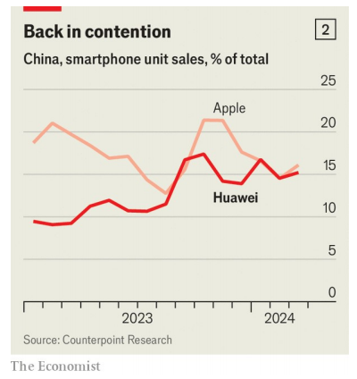

# America’s assassination attempt on Huawei is backfiring

美国对华为的暗杀企图适得其反

**The company is growing stronger—and less vulnerable**

assassination: 美 [əˌsæsɪˈneɪʃ(ə)n] 暗杀；行刺

backfire: 美 [ˌbækˈfaɪər] 适得其反；产生反作用；产生事与愿违的不良后果；

原文：

Ren Zhengfei, the founder of Huawei, often talks of his firm’s clashes with

America in military parlance. “It’s time to pick up the guns, mount the

horses and go into battle,” he said in an internal meeting in 2018. In a memo

the following year he encouraged staff to tie ropes to Huawei’s figurative

tanks and help drag them onto the battlefield.

华为的创始人任正非经常用军事术语谈论他的公司与美国的冲突。“是时候拿起枪，上马，投入战斗了，”他在2018年的一次内部会议上说。在第二年的一份备忘录中，他鼓励员工在华为的虚拟坦克上绑上绳子，并帮助将它们拖上战场。

学习：

clash：美 [klæʃ] 冲突；矛盾；冲突事件

parlance：美 [ˈpɑrləns] 说法；用语

in military parlance: 用军事术语

pick up the guns：拿起枪

mount the horses：上马

go into battle：加入战斗

internal meeting：内部会议

memo：美 [ˈmemoʊ] 便笺；备忘录；通知单；内部通告

staff：美 [stæf] 全体职员；全体雇员；

rope：绳子

drag：拉，拽，拖

battlefield：战场

原文：

The martial talk is understandable: Huawei has been under attack from

America for over a decade. In 2012 the American authorities began claiming

that China might use the firm for espionage. Another broadside was the

indictment of the firm’s CFO (and Mr Ren’s daughter) in 2018 for violating

sanctions on Iran. By 2020 America’s harrying had descended into all-out war, 

with most American firms barred from doing business with Huawei and

foreign firms barred from selling it chips or other gear that use American

technology. America also sought to dissuade other countries from using

Huawei’s equipment in their mobile-phone networks.

军事言论是可以理解的:华为十多年来一直受到美国的攻击。2012年，美国当局开始声称中国可能利用该公司从事间谍活动。另一项抨击是2018年该公司首席财务官(和任正非的女儿)因违反对伊朗的制裁而被起诉。到2020年，美国的痛苦已经演变成全面战争，大多数美国公司被禁止与华为做生意，外国公司被禁止向华为出售芯片或其他使用美国技术的设备。美国也试图劝阻其他国家在他们的移动电话网络中使用华为的设备。

学习：

martial：美 [ˈmɑːrʃl] 战争的；尚武的；好战的

American authorities：美国当局

espionage：美 [ˈespiənɑːʒ] 间谍活动

broadside：美 [ˈbrɔdˌsaɪd] 舷炮；措辞严厉的谴责；

indictment：美 [ɪnˈdaɪtmənt] 指控；控告；起诉 **注意发音**

harrying：美 ['hæriɪŋ] 掠夺；骚扰；使苦恼；（harry的现在分词）

all-out：全面的

all-out war：全面战争

do business：做生意

barred from doing business with Huawei：被禁止与华为做生意

gear：美 [ɡɪr] 齿轮；变速装置；设备；这里是设备的意思

use American technology：使用美国技术

sought：美 [sɔːt] 试图获得；（向人）请求；谋求；（seek的过去式和过去分词）

dissuade：美 [dɪˈsweɪd] 劝阻

Huawei's equipment: 华为的设备

原文：

This onslaught battered Huawei. It was forced to sell its main smartphone

brand for lack of chips. More than a dozen rich countries excluded it from 5G

contracts. Revenues tumbled 30% in 2021; net profits collapsed by 70% in 2022.

In a memo that year Mr Ren was clear that Huawei was fighting for its

life: “The first thing is to survive. We have a future if we survive.”

这场冲击重创了华为。由于缺乏芯片，它被迫出售其主要的智能手机品牌。十几个富裕国家将其排除在5G合同之外。2021年收入暴跌30%；2022年净利润暴跌70%。在那年的一份备忘录中，任正非明确表示华为正在为生存而战:“首先是生存。如果我们活下来，我们就有未来。”

学习：

onslaught：美 [ˈɑːnslɔːt] 攻击；猛攻；冲击；强烈抨击

batter：美 [ˈbætər] 连续猛击；向后倾斜；重创；

sell its main smartphone brand: 卖掉主要的手机品牌

for lack of：缺乏；由于缺乏；因缺少          

tumble：美 [ˈtʌmbl] （价格或数量）暴跌；翻滚

revenue tumbled：营收暴跌

collapse：暴跌

fight for its life：为了生存而战

原文：

America’s assault continues. In May, for instance, regulators revoked a

special permit allowing Intel and Qualcomm, two American tech groups, to

sell Huawei chips for laptops. Yet Huawei has not just survived; it is thriving

once again. In the first quarter of this year net profits surged by 564% year

on year to 19.7bn yuan ($2.7bn). It has re-entered the handset business. Its

telecoms-equipment sales are rising again. And it has achieved this in large

part by replacing foreign technology in its wares with home-grown parts and

programmes, making it much less vulnerable to American hostility in future.

Having failed to kill Huawei, Uncle Sam’s attacks have only made it

stronger.

美国的攻击仍在继续。例如，今年5月，监管机构撤销了允许英特尔和高通这两家美国科技集团销售华为笔记本电脑芯片的特别许可。然而，华为不仅幸存了下来；它再次繁荣起来。今年第一季度，净利润同比激增564%，达到197亿元人民币(27亿美元)。它已经重新进入手机业务。它的电信设备销售再次上升。它之所以能做到这一点，很大程度上是因为它用国产零件和程序替换了产品中的外国技术，这使得它在未来更不容易受到美国的敌意。未能击垮华为，山姆大叔的攻击只是让华为变得更强大了。

学习：

assault：美 [əˈsɔːlt] 武力攻击；袭击；困扰；使难受；攻击

special permit：特别许可

revoke：美 [rɪˈvoʊk] 撤销；取消；吊销；

surge：美 [sɜːrdʒ] 急剧上升；激增

year on year：同比

in large part：很大程度上；在很大程度上；

home-grown：自产的；本国产的；土生土长的；

hostility：美 [hɑːˈstɪləti] 敌对行为；不友善；反对；战争行动

原文：

Mr Ren, a former soldier, started Huawei in 1987 in his flat in Shenzhen,

importing foreign telecoms gear to sell to Chinese customers. An engineer

by training, he quickly started making his own equipment. As China’s

telecoms market grew, so did Huawei. By 2020 it had become not only the

world’s biggest smartphone maker, but also the leading provider of mobile-

network gear, with a market share of 30%.

曾当过兵的任正非1987年在深圳的公寓里创办了华为，进口外国电信设备，然后卖给中国客户。作为一名训练有素的工程师，他很快开始制造自己的设备。随着中国电信市场的增长，华为也在增长。到2020年，它不仅成为世界上最大的智能手机制造商，也是移动网络设备的领先供应商，拥有30%的市场份额。

学习：

flat：公寓

telecoms gear：电信设备

make equipment：制造设备

market share：市场份额

原文：

Mr Ren has never been short of ambition for Huawei. Its name is a

contraction of the phrase “China has promise”. Its headquarters in Shenzhen

are impossibly grand and imposing. A palatial meeting hall features

ornamentation worthy of Versailles: marble columns, inlaid floors and oil

paintings of bucolic scenes across the ceiling. In a nearby manufacturing city

the company has built a European-style town around a lake, complete with

life-size replicas of castles that serve as meeting rooms and libraries.

任正非从来不缺少华为的雄心。它的名字是短语“中国有希望”的缩写。它在深圳的总部宏伟壮观。富丽堂皇的会议厅配有凡尔赛宫的装饰:大理石柱、镶嵌地板和天花板上的田园风光油画。在附近的一个制造业城市，该公司在湖边建造了一个欧洲风格的城镇，里面有真人大小的城堡复制品，用作会议室和图书馆。

学习：

has never been short or ambition:从不缺雄心壮志

impossibly：美 [ɪmˈpɑsəbli] 不可思议地；令人难以置信地；

imposing：美 [ɪmˈpoʊzɪŋ] 雄伟的；壮丽的

impossibly grand and imposing：令人难以置信的宏伟壮观

palatial：美 [pəˈleɪʃəl] 宽敞的；富丽堂皇的

meeting hall：会议厅

ornamentation：美 [ˌɔrnəmɛnˈteɪʃ(ə)n]装饰；点缀；装饰品

Versailles：美 [vərˈsaɪ] 凡尔赛宫

marble：美 [ˈmɑːrbl]  大理石

marble columns：大理石石柱

inlaid：美 [ˌɪnˈleɪd] 镶嵌的；嵌饰的；镶嵌；把…嵌入；（inlay的过去式和过去分词）

inlaid floors：镶嵌的地板

oil paintings：油画

bucolic：美 [bjuˈkɑlɪk] 乡村的；田园生活的

bucolic scenes：田园风光

build a European-style town: 建造了一个欧洲风格的城镇

complete with：备有；具有；配备有；

life-size：真人大小的

replicas：美 [ˈrepləkəz] 复制品；复制艺术品；（replica的复数）

## **Mend of an empire**

mend：康复；痊愈；使（不快事态；尤指分歧）好转

原文：

In retrospect, America’s blitz only briefly shook this empire. Huawei’s sales

last year, of about $100bn, are twice those of Oracle, an American tech firm.

It is half the size of Samsung, a South Korean phonemaker, but outspends it

on research and development. In fact its R&D budget of $23bn in 2023 was

exceeded only by America’s biggest tech firms: Alphabet (the parent of

Google), Amazon, Apple and Microsoft (see chart 1). Last year’s profits, of

about $12.3bn, put it on a par with Cisco Systems, an American

communications group, and vastly exceed those of Ericsson and Nokia, its

main rivals in the mobile-networks business. And whereas Ericsson and

Nokia are laying off staff, Huawei’s headcount is growing. It now has

12,000 more workers than it did in 2021.

回想起来，美国的闪电战只是短暂动摇了这个帝国。华为去年的销售额约为1000亿美元，是美国科技公司甲骨文的两倍。它的规模是韩国手机制造商三星的一半，但在研发上的支出却超过了三星。事实上，其2023年230亿美元的R&D预算仅次于美国最大的科技公司:Alphabet(谷歌的母公司)、亚马逊、苹果和微软(见图表1)。去年的利润约为123亿美元，与美国通信集团思科系统公司不相上下，远远超过了移动网络业务的主要竞争对手爱立信和诺基亚。爱立信和诺基亚正在裁员，而华为的员工却在增加。它现在比2021年多了12，000名工人。

学习：

In retrosprect：回想起来，往回看

blitz：美 [blɪts] 闪电战；闪击式行动；突袭；

tech firm：科技公司

phonemaker:手机制造商

outspend：在支出上超过

research and development (R&D)：研发

exceed：超过

communications group：通信集团

vastly exceed：远远超过

Ericsson: 爱立信

main rivals：主要竞争对手

lay off staff：裁员

headcount：员工数

原文：

Huawei’s core business remains telecoms-network equipment, which

brought in about half of its revenues last year. In recent years this division

has also formed teams of engineers to take on consulting projects, helping to

re-wire and so streamline all sorts of businesses, from ports to coal mines.

These new initiatives have pitted it against Western rivals such as Cisco

Systems, Siemens and Honeywell.

华为的核心业务仍然是电信网络设备，这部分业务去年带来了大约一半的收入。近年来，这个部门还组建了工程师团队来承担咨询项目，帮助重组和简化各种业务，从港口到煤矿。这些新举措使其与思科系统、西门子和霍尼韦尔等西方竞争对手展开了竞争。

学习：

core business：核心业务

telecoms-network equipment：电信网络设备

division：部门

re-wire and streamline：重组和简化

pit：美 [pɪt] 使互斗；使相斗；使对抗；使竞争；

pit it against Western rivals: 和西方竞争对手竞争

## **Bric-a-brac from the dead**

bric-a-brac：小摆饰；小装饰；小古玩

原文：

A cloud-computing unit accounts for almost a tenth of revenues. Its sales

grew by 22% last year. As Microsoft shrinks its operations in China, owing

to American tech sanctions, Huawei is said to be scooping up its engineers.

Another fast-growing unit focuses on energy, including 

EV charging networks and photovoltaic inverters, which turn the direct current produced by solar

panels into the alternating sort that flows through the grid.

云计算部门几乎占了收入的十分之一。去年其销售额增长了22%。由于美国的技术制裁，微软缩减了在中国的业务，据说华为正在挖走它的工程师。另一个快速增长的部门专注于能源，包括电动汽车充电网络和光伏逆变器，它们将太阳能电池板产生的直流电转化为流经电网的交流电。

学习：

cloud-computing unit：云计算部门

tech sanctions：技术制裁

shrink operations：缩减业务

scoop：用勺舀；用铲子铲

scoop up：拿起；捡起；敏捷地抱起；抢先获得；大量获取

scoop up engineers: 挖走工程师

photovoltaic：美 [ˌfoʊdoʊˌvoʊlˈteɪɪk] 光伏的

direct current：直流电

alternating current：交流电

原文：

It is not that American sanctions have had no impact at all on Huawei—far

from it. Its business has become more concentrated in China, for one thing,

with foreign sales now only a third of the total, down from half in 2017. It

has also been forced to focus more on innovation, to find technological fixes

for its political problems. Some 114,000 employees, more than half the total,

work in R&D. Most striking of all, it has become more vertically integrated, as

it seeks to develop replacements in-house for components or software

snatched away by Uncle Sam.

这并不是说美国的制裁对华为没有任何影响——远非如此。首先，其业务在中国变得更加集中，国外销售额现在仅占总销售额的三分之一，低于2017年的一半。它还被迫更加关注创新，为其政治问题寻找技术解决方案。约11.4万名员工(超过总人数的一半)在研发部门工作。最引人注目的是，该公司变得更加垂直整合，因为它寻求在内部开发被山姆大叔夺走的组件或软件的替代品。

学习：

find technological fixes for its political problems: 找到技术解决方案

vertically integrated：垂直整合

develop replacements in-house：在内部开发替代品

snatch：美 [snætʃ] 夺去；抢走；绑架；

原文：

To survive existing and potential future American sanctions, Huawei has

been systematically seeking substitutes for American intellectual property

(IP) in its products and internal systems. Mr Ren claims the firm has replaced

13,000 foreign-made parts with Chinese ones. This has been extremely

costly. By forcing Huawei to focus on this task, American sanctions have

undoubtedly prevented it from investing in other areas. But the sanctions

have also spurred the rapid development of Huawei’s own IP and pushed it to

diversify into new lines of business. It has been able to revive sales of

smartphones, for instance, by collaborating with a Chinese supplier to

develop suitable chips, most of which it used to buy from foreign firms.

为了在现有和未来潜在的美国制裁中生存，华为一直在系统地寻找其产品和内部系统中美国知识产权(IP)的替代品。任先生声称，该公司已经用中国零件替换了13000个外国制造的零件。这是极其昂贵的。通过迫使华为专注于这项任务，美国的制裁无疑阻止了它在其他领域的投资。但制裁也刺激了华为自有知识产权的快速发展，并推动其向新的业务领域多元化发展。例如，通过与一家中国供应商合作开发合适的芯片，该公司已经能够重振智能手机的销售，过去该公司大部分芯片是从外国公司购买的。

学习：

substitutes：美 [ˈsʌbstitju:ts] 代替者；代用品；替补队员；（substitute的复数）**注意发音**

seek substitutes：寻找替代品

extremely costly：极其昂贵

spur the rapid development：刺激快速发展

revive：美 [rɪˈvaɪv] （使）复原；（使）复苏；重新唤起

原文：

China’s semiconductor industry still lacks many of the components and tools

needed for a complete break with the West. Some of the home-grown chips

that Huawei is using are thought to cost several times more than their

foreign equivalents and remain in short supply. But the fact that Huawei has

been able to get round the sanctions at all in such a short time is a surprise.

As a private firm whose goals dovetail neatly with those of the Chinese

government, it is becoming a model for how China thinks about innovation

中国的半导体行业仍然缺乏与西方彻底决裂所需的许多组件和工具。华为正在使用的一些国产芯片被认为比国外同类产品贵几倍，而且仍然供不应求。但华为能够在如此短的时间内规避制裁，这一事实令人惊讶。作为一家目标与中国政府目标完全吻合的私营企业，它正成为中国思考创新的典范

学习：

equivalents：美 [ɪkˈwɪvələnts] 等价物；（equivalent的复数）

remain in short supply：供不应求

get round：规避；避开（法律法章）；

get round the sanctions：规避制裁

dovetail：美 [ˈdəvˌteɪl]吻合

原文：

About 70% of the components (by value) of the Mate60 Pro+, a smartphone

Huawei released in September, are made in China, according to an estimate

from Jefferies, an investment bank. It helped give Huawei a 15.5% share of

smartphone sales in China in the first three months of 2024, up from about

9% during the same period in 2023 and on a par with Apple (see chart 2).

This success has been a big factor in Huawei’s recovery.

根据投资银行Jefferies的估计，华为9月份发布的智能手机Mate60 Pro+约70%的组件(按价值计算)是在中国制造的。2024年前三个月，华为在中国智能手机销量中的份额为15.5%，高于2023年同期的9%，与苹果持平(见图表2)。这一成功是华为复苏的一大因素。

学习：

a smartphone Huawei released：发布的手机

on a par with xxx：与xxx持平

原文：

The phone uses a chip made by 

SMIC, a state-owned foundry and one of a web

of firms in the semiconductor industry with which Huawei has been

collaborating. Around the same time as America issued its first export

restrictions, Huawei created an investment unit called Hubble. Since then it

has made at least 107 investments.

这款手机使用SMIC制造的芯片，该公司是一家国有代工企业，也是与华为合作的半导体行业公司之一。大约在美国发布第一批出口限制的同时，华为创建了一个名为哈勃的投资部门。自那以来，该公司至少进行了107笔投资。

学习：

foundry：美 [ˈfaʊndri] 代工厂

make investments：进行投资

原文：

Hubble’s strategy has been to take small equity stakes in dozens of suppliers

that are working on technologies that might help ease Huawei’s dependence

on foreign suppliers. Take lithography machines, which carve the tiniest of

circuits into wafers and pose by far China’s biggest challenge for self-

reliance in chipmaking. Hubble has made several investments in lithographic

lasers. Focuslight Technologies, for example, is a supplier of laser

components to ASML, the world leader in lithography, and TSMC, the world’s most

advanced chip foundry. Hubble invested in it in 2020. A system it created

for removing imperfections from the materials on which circuits are printed

has helped end a foreign monopoly on this specific function within the laser

supply chain. Another recipient of Hubble’s cash, Suzhou Everbright

Photonics, is building China’s largest production lines for gallium-nitride

chips, which are a novel type of high-performance semiconductors used in

everything from 5G gear to power grids. The market for photoresists, which

are used to form a pattern on the surface of chips in the lithography process,

is dominated by Japanese firms, but one of Hubble’s portfolio companies,

called Xuzhou B&C Chemical, is breaking into this niche.

哈勃的策略是持有数十家供应商的少量股份，这些供应商正在研究可能有助于减轻华为对外国供应商依赖的技术。以光刻机为例，这种机器将最小的电路刻成晶片，对中国在芯片制造方面的自力更生构成了迄今最大的挑战。哈伯已经在光刻雷射上做了几项投资。例如，Focuslight Technologies是世界光刻技术领先者阿斯麦和世界最先进的芯片代工厂台积电的激光元件供应商。哈勃在2020年投资了它。它创造了一个系统，用于消除印刷电路材料的缺陷，帮助结束了激光供应链中这一特定功能的外国垄断。哈勃资金的另一个接受者苏州光大光电正在建设中国最大的氮化镓芯片生产线，氮化镓芯片是一种新型的高性能半导体，用于从5G设备到电网的方方面面。光致抗蚀剂用于在光刻过程中在芯片表面形成图案，其市场被日本公司所主导，但是哈勃投资公司中的一家名为徐州B&C化学的公司正在打入这个细分市场。

学习：

take small equity stakes: 持有少量股份

ease Huawei's dependence on foreign suppliers：减轻对外国的依赖

lithography：美 [ləˈθɑɡrəfi] 光刻法

lithography machine：光刻机

carve：美 [kɑːrv] 雕刻；刻；切；

wafers：美 [ˈweɪfəz] 晶片；

self-reliance：自强，自力更生

most advanced chip foundry：最先进的芯片代工厂

imperfection：缺点，瑕疵

monopoly：美 [məˈnɑːpəli] 垄断；

end a foreign monopoly：结束外国垄断

gallium：美 [ˈɡæliəm]镓

nitride：美 [ˈnaɪtraɪd]  氮化物

gallium-nitride：氮化镓

building China’s largest production lines：建造中国最大的生产线

power grids：电网

niche：美 [niːʃ]缝隙市场；合适的职位；舒适的生活定位；

原文：

These investments are not creating the world’s most advanced lithography

equipment. Few expect Huawei to make strides in deep ultraviolet

lithography machines, the bleeding edge of the industry produced only by

ASML. But Hubble’s activities are eating away at pockets of reliance on foreign

tech. Part of that reliance is simply servicing foreign-made machines. Since

the start of the year American commerce officials have been telling allies to

stop providing help to keep advanced lithography machines running. Some

of Hubble’s investments, analysts believe, are meant to build up Huawei’s

ability to service and adjust components so that they work with locally made

systems.

这些投资并没有创造出世界上最先进的光刻设备。很少有人预计华为会在深紫外光刻机方面取得进展，这是该行业的前沿，只有阿斯麦生产。但是哈勃的活动正在蚕食对外国技术的依赖。这种依赖的一部分只是为外国制造的机器提供服务。自今年年初以来，美国商务官员一直告诉盟友停止提供帮助，不让先进的光刻机运行。分析师认为，哈勃的一些投资旨在增强华为维修和调整组件的能力，以便它们能与本地制造的系统一起工作。

学习：

make strides：取得进展

ultraviolet: 紫外线的

bleding edge：最前沿，最先进

eat away at: 逐渐削弱，消耗

eating away at pockets of reliance on foreign tech： 蚕食对外国技术的依赖

>“Eating away at pockets of reliance on foreign tech” 中的“eating away at” 是一个俚语，意思是逐渐削弱或消耗。它通常用于描述某种现象或因素逐渐减少、侵蚀或破坏某个事物的过程。
>
>### 语法结构：
>
>- **Eating away at** 是一个动词短语（phrasal verb），表示逐步侵蚀、削弱或消耗某个目标。
>- **Pockets of reliance** 指的是局部或特定领域对某物的依赖。
>- **On foreign tech** 表示这些依赖是针对外国技术的。
>
>### 例句：
>1. **The continuous economic sanctions are eating away at the country’s financial reserves.**
>   - 持续的经济制裁正在逐渐消耗该国的财政储备。
>
>2. **Pollution is eating away at the ancient monuments, causing irreversible damage.**
>   - 污染正在逐步侵蚀古代遗迹，造成不可逆转的损害。
>
>3. **The high cost of living is eating away at the savings of the middle class.**
>   - 高昂的生活成本正在逐渐消耗中产阶级的储蓄。
>
>4. **Corruption scandals are eating away at the public's trust in the government.**
>   - 腐败丑闻正在逐渐侵蚀公众对政府的信任。
>
>5. **Termites are eating away at the foundation of the house, making it unsafe.**
>   - 白蚁正在逐渐侵蚀房子的地基，使其变得不安全。

commerce ：美 [ˈkɑːmɜːrs] 商业；商务；（尤指国际间的）贸易 **注意发音**

原文：

Hubble’s investment strategy is already having an impact on global markets.

Take silicon carbide (SiC) chips. These semiconductors are used mainly in

EVs and green-energy systems owing to their ability to operate at high

temperatures. The market for them has long been dominated by Infineon, a

German company. As Huawei has moved rapidly into providing technology

for EVs and energy management, Hubble has invested in at least four Chinese

companies that produce the materials for SiC chips, which constitutes the

biggest cost in producing them. They have quickly grabbed a 32% share of

the market for SiC wafers, up from almost nothing a few years ago.

Huawei’s involvement in the market has been one factor contributing to the

fall in global prices of this type of hardware, says Poshun Chiu of Yole

Group, a chip-intelligence firm

哈勃的投资策略已经对全球市场产生了影响。以碳化硅芯片为例。这些半导体主要用于电动汽车和绿色能源系统，因为它们能够在高温下工作。它们的市场长期被一家德国公司英飞凌所垄断。随着华为迅速进入为电动汽车和能源管理提供技术的领域，哈勃已经投资了至少四家生产碳化硅芯片材料的中国公司，这是生产碳化硅芯片的最大成本。他们迅速抢占了32%的碳化硅晶片市场份额，而几年前这一份额几乎为零。芯片智能公司Yole Group的Poshun Chiu说，华为对市场的介入是导致这类硬件全球价格下跌的一个因素

学习：

hava an impact on：产生影响

silicon carbide：美 [ˈsɪlɪkən ˈkɑrbaɪd] 碳化硅（SiC）

constitutes：美 [ˈkɑːnstɪtuːts] 构成；组成；

grabbed a 32$ share of the market:抢占市场份额

involvement：介入，加入

原文：

There are no American sanctions on SiC chips; Huawei is simply being

proactive, given the risk that sanctions may be applied in future. This

approach prevails throughout the company. Executives must contemplate

restrictions on most components. The rescinding in May of Intel’s and

Qualcomm’s licences to sell it basic computer chips has validated this

thinking

美国对SiC芯片没有制裁；考虑到未来可能受到制裁的风险，华为只是主动出击。这种方法在整个公司盛行。高管必须考虑对大多数组件的限制。今年5月，英特尔和高通出售基本计算机芯片的许可证被吊销，这证实了这种想法

学习：

Executives：高管

contemplate：考虑；思考；沉思；打算；

rescinding：美 [rɪˈsɪndɪŋ] 废除；（rescind的现在分词）

## **A virtual Lazarus**

原文：

Hardware is only half the battle for Huawei: since 2019 American firms

have also been prohibited from selling it software, forcing the company to

develop substitutes for those purchases as well. Oracle, for example, had

provided Huawei with a programme to manage its internal systems

(enterprise resource planning or ERP, in the jargon). The restrictions forced

Huawei to build an entirely new system of its own, called Meta

ERP. At its launch last year an executive exulted, “We have broken through the

blockade. We have survived.” Some speculate that Huawei may eventually

attempt to sell the system in competition with the likes of Oracle and 

SAP, a German company.

硬件只是华为战斗的一半:自2019年以来，美国公司也被禁止销售it软件，迫使该公司也开发这些采购的替代品。例如，甲骨文为华为提供了一个管理内部系统的程序(行话叫企业资源规划或ERP)。这些限制迫使华为建立了自己的全新系统，名为Meta ERP。在去年的发布会上，一位高管欢欣鼓舞地说:“我们已经突破了封锁。我们活下来了。”一些人推测，华为最终可能会尝试销售该系统，与甲骨文和德国公司SAP竞争。

学习：

jargon：行话

exult：美 [ɪɡˈzəlt]狂喜；欢欣鼓舞

blockade：英 [blɒˈkeɪd] 封锁；起阻碍作用的人；障碍；阻滞；阻塞

原文：

An even bigger hurdle has been the operating system (OS) for its consumer

electronics. Huawei built its smartphone business on Google’s Android.

Losing access to Android, and the vast ecosystem of applications that run on

it, was one of the reasons it had to jettison most of its smartphone business.

 一个更大的障碍是其消费电子产品的操作系统。华为在谷歌的安卓系统上建立了智能手机业务。无法使用Android，以及在其上运行的应用程序的庞大生态系统，是它不得不放弃大部分智能手机业务的原因之一。

学习：

hurdle：障碍

consumer electronics：消费电子产品

jettison：美 [ˈdʒɛdəsən] 抛扔；扔弃；抛弃；废弃

原文：

Since 2012 Huawei had been developing an OS, called Harmony, for its

watches and other gadgets. America’s sanctions on software forced it to

incorporate Harmony into its phones as well. The popularity of its new

models, in turn, has induced developers to make more apps that run on

Harmony. The current version of the OS has been built with open-source

Android code to make Android apps compatible for the time being. It is

designed to be used in all Huawei’s consumer products, including watches,

televisions and vehicle systems, which makes it possible to integrate

functions across devices. It is said to have 700m users and 2.2m developers.

自2012年以来，华为一直在为其手表和其他设备开发名为Harmony的操作系统。美国对软件的制裁迫使它也将Harmony融入到手机中。反过来，其新模型的流行也促使开发者开发更多基于Harmony的应用。目前版本的操作系统是用开源的Android代码构建的，以使Android应用程序暂时兼容。它旨在用于华为的所有消费产品，包括手表、电视和车载系统，这使得跨设备集成功能成为可能。据说它拥有7亿用户和220万开发者。

学习：

gadgets：美 [ˈgædʒɪts] 小玩意儿；小配件；（gadget的复数）

for the time being：暂时；目前；眼下          

vehicle systems：车载系统

原文：

The next version of Harmony is expected to drop all Android-linked code.

When this happens, Android apps will no longer work on Huawei phones.

That could be harmful to business, given that there are still very few

“native” apps for the OS. But the shift would also signal the OS’s total 

independence from the West. Harmony would, in effect, become a

competitor to Android and Apple’s iOS—a far more ambitious outcome than

Huawei originally planned for the software

下一个版本的Harmony预计会删除所有与Android相关的代码。当这种情况发生时，Android应用程序将不再适用于华为手机。这可能对商业有害，因为目前还很少有针对该操作系统的“原生”应用。但这种转变也标志着操作系统完全独立于西方。事实上，Harmony将成为Android和苹果iOS的竞争对手——这比华为最初为该软件计划的结果要远大得多

学习：

drop all Android-linked code：删除所有和安卓相关的代码

in effect：事实上

原文：

American sanctions have also prompted Huawei to diversify, to compensate

for lost revenue. Whereas its international focus used to be network

equipment, it is now expanding sales of software to firms in Africa, Asia and

Latin America running databases in the cloud. An executive from Clarin, an

Argentine media group, told a Huawei event in May that his firm was

replacing expensive Oracle database software with Gauss, Huawei’s

offering. Even two years ago, such switches often created compatibility

problems with other Western software, but a recent overhaul appears to have

ironed out most such glitches.

美国的制裁也促使华为多元化，以弥补收入损失。虽然它的国际重点曾经是网络设备，但现在它正在向非洲、亚洲和拉丁美洲运行云端数据库的公司销售软件。阿根廷媒体集团Clarin的一名高管在华为5月的一次活动中表示，他的公司正在用华为的Gauss软件替换昂贵的Oracle数据库软件。甚至在两年前，这种转变还经常造成与其他西方软件的兼容性问题，但最近的一次大修似乎已经解决了大多数此类故障。

学习：

prompt：促进

compensate：弥补

compatibility：美 [kəmˌpætəˈbɪləti]  兼容性

overhaul：解体检修；大修；全面修改

glitches：美 [glɪtʃiz] 小过失；小故障；（glitch的复数）

ironed out most such glitches. 解决了大多数这样的小故障。

iron out: 解决问题，消除障碍

>是的，“iron out” 是一个俚语，意思是解决问题、消除障碍或克服困难。它源自于熨衣服的动作，表示通过努力使事情变得顺利、平滑。
>
>### 例句：
>1. **We need to iron out the details of the contract before we can sign it.**
>   - 我们需要解决合同的细节问题，然后才能签署。
>
>2. **The team had a meeting to iron out the issues with the project.**
>   - 团队开会解决项目中的问题。
>
>3. **After several discussions, they were able to iron out their differences.**
>   - 经过几次讨论后，他们解决了分歧。
>
>4. **They worked hard to iron out the bugs in the software before the release.**
>   - 他们努力解决软件发布前的漏洞。
>
>5. **It took some time, but we finally ironed out the scheduling conflicts.**
>   - 花了一些时间，但我们最终解决了排程冲突问题。

原文：

American policymakers had believed that Huawei would struggle to produce

enough AI chips to sustain its own operations. In fact, it appears to have chips

to spare. A Chinese voice-recognition company called iFlyTech recently

revealed that its models and technology run entirely on Huawei’s AI chips.

This represents the first indigenous AI system in China that has “supply-chain

independence” from the West. It is also the first AI ecosystem fully built by

Huawei for another company.

美国政策制定者曾认为，华为将难以生产足够的人工智能芯片来维持自身的运营。事实上，它似乎有多余的芯片。一家名为iFlyTech的中国语音识别公司最近透露，其模型和技术完全运行在华为的人工智能芯片上。这代表了中国第一个拥有独立于西方的“供应链”的本土人工智能系统。这也是华为为另一家公司完全构建的第一个人工智能生态系统。

学习：

sustain：支持；支撑；忍受；经受（不愉快的事情；尤指伤痛）；

to spare：多余, 富余       

indigenous：美 [ɪnˈdɪdʒənəs]当地的；本土的；土生土长的

原文：

All this suits the Chinese Communist Party well. Xi Jinping, China’s leader,

has expressed the same ambition as the company, to overcome American

sanctions with locally developed technology. The state, already Huawei’s

biggest customer, also supports it in other ways. To spur the development of

the semiconductor industry, it provides subsidies and invests alongside

Huawei. The company and the government both own stakes in Focuslight,

Everbright Photonics and Xuzhou B&C Chemical, for instance.   

原文：

But Huawei’s relationship with the state is often misunderstood. The firm is

not trying to indigenise its supply chain to comply with government

directives. Rather, for Huawei and many other Chinese companies, self-

sufficiency has become a commercial imperative because it is their only

means of survival. Its investment decisions are market driven. This separates

it from sluggish state-owned enterprises, which formulate their business

plans based solely on state policy.

但华为与国家的关系经常被误解。该公司并未试图使其供应链本土化以符合政府指令。相反，对于华为和其他许多中国公司来说，自给自足已经成为商业上的当务之急，因为这是它们唯一的生存手段。它的投资决策是由市场驱动的。这使得它不同于停滞不前的国有企业，后者完全根据国家政策制定商业计划。

学习：

is misunderstood：被误解

indigenise：本土化

comply with: 符合

directives：指示；指令；命令；（directive的复数）          

commercial imperative：商业上的当务之急

state-owned enterprises：国有企业

sluggish：美 [ˈslʌɡɪʃ] 行动迟缓的；不活跃的；迟钝的；缺乏活力的

state policy：国家政策

formulate business plans：制订商业计划

原文：

No state firm has come close to the level of success experienced by Huawei

over the past decade. SMEE, the state-owned lithography group, is years behind

schedule in releasing advanced products. Even as state subsidies for

semiconductors have increased (last month the state launched a $47.5bn

fund for the industry), notes Lin Qingyuan of Bernstein, a broker,

government interference is declining. The authorities, Ms Lin says, want

market forces to shape investments. Huawei thus represents the Chinese

government’s latest thinking on industrial policy

原文：

America’s policymakers are also learning from their mistakes. The gradual

ratcheting-up of sanctions on Huawei, and especially the 28-month gap

between the announcement of the most severe measures in 2018 and their

implementation in 2020, gave the firm lots of time to prepare, China hawks

lament. But the bigger lesson from Huawei’s torment has not yet sunk in:

that cutting the firm off from Western technology did not stifle it, but instead

increased its incentives to innovate.

美国的决策者也在从他们的错误中吸取教训。中国鹰派哀叹道，对华为制裁的逐步升级，特别是2018年宣布最严厉措施与2020年实施这些措施之间的28个月差距，给了该公司大量时间来准备。但是华为痛苦的更大教训还没有被人们理解:切断公司与西方技术的联系并没有扼杀它，反而增加了它创新的动力。

学习：

ratcheting：美 ['rætʃɪtɪŋ] 安装棘轮于；松脱；（ratchet的现在分词形式）

ratcheting-up：逐渐增加

lament：美 [ləˈment]哀悼；痛惜；惋惜；悼念；表示失望

torment：美 [ˈtɔːrment] 折磨；困扰；苦恼；煎熬；

stifle: 美 [ˈstaɪfl] 抑制；扼杀；阻止；

increase its incentives to innovate: 增加创新动力

原文：

China is still years behind the West in chipmaking. Sanctions on high-

powered semiconductors have raised costs and slowed the uptake of 

AI for thousands of firms, as intended. Hubble’s investments are still far from

replacing Western lithography machines and other components. But if

Huawei was a worry when America first declared war, it is a bigger one now. 

中国在芯片制造方面仍落后西方数年。对高性能半导体的制裁增加了成本，减缓了数千家公司对人工智能的使用，这是他们的初衷。哈勃的投资还远远不能取代西方的光刻机和其他部件。但是如果说华为是美国第一次宣战时的一个担忧，那么它现在是一个更大的担忧。

学习：

uptake：利用；采用；

raise costs：提高成本

## 后记

2024年6月20日15点34分于上海。
