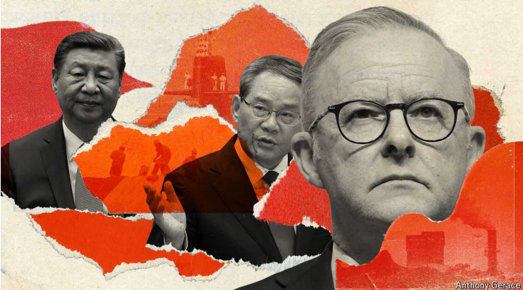
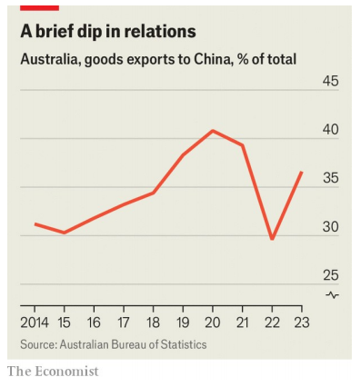
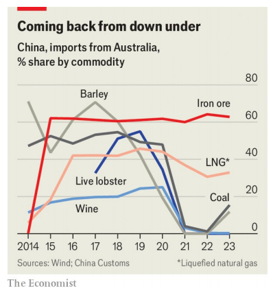

# **Li Qiang and China look to make up with Australia**

**The superpower is seeking to ease tensions with at least some of America’s allies**

make up with：和解

ease tensions：缓解紧张关系

ally：美 [ˈælaɪ] 盟友；（尤指从政者的）支持者；同盟者；结盟者；**注意发音**

原文：

“My government is pro-panda,” said Australia’s prime minister, Anthony

Albanese, as he prepared to host the highest-ranking Chinese visitor to his

country in seven years. Mr Albanese was simply referring to the bears that

China has lent to Australia’s Adelaide Zoo. Still, such sound-bites had long

been rare before he was elected in 2022. Relations between China and

Australia had suffered years of acrimony. The mood is now much changed.

During his four-day trip to Australia, beginning on June 15th, China’s prime

minister, Li Qiang, will be keen to show that even with one of America’s

closest allies, cordial ties are possible.

“我的政府是支持熊猫的，”澳大利亚总理安东尼·艾博年(Anthony Albanese)说，他正准备接待七年来到访澳大利亚的最高级别的中国游客。艾博年先生只是指中国借给澳大利亚阿德莱德动物园的熊。尽管如此，在他2022年当选之前，这样的原话一直很少见。中国和澳大利亚之间的关系经历了多年的不和。现在，人们的情绪发生了很大变化。在6月15日开始的为期四天的澳大利亚之行中，中国总理李强将热衷于展示即使与美国最亲密的盟友之一也有可能建立友好关系。

学习：

highest-ranking：级别最高；排名最高；最高级别          

sound-bites：原话

acrimony：美 [ˈækrəˌmoʊni] 尖刻；恶毒

suffered years of acrimony: 经历了多年的不和

cordial：美 [ˈkɔːrdʒəl] 热情友好的；

原文：

In China’s political hierarchy, Mr Li is a distant number two to the president,

Xi Jinping, who last visited Australia a decade ago. But his trip has much

symbolic importance. Under Australia’s previous governments, China hawks

held sway. Relations turned particularly sour in 2017 when the prime

minister at the time, Malcolm Turnbull, tried to clamp down on Chinese

attempts to exert covert influence in Australia. He introduced laws aimed at

curbing this. In 2018 he also took the lead among Western powers by

banning Chinese involvement in the building of advanced 5G 

communications networks. His successor, Scott Morrison, infuriated China

by calling for an international investigation into the origins of covid-19.

China responded with sweeping restrictions on Australian exports to China.

Mr Li’s visit is a clear sign that both countries want to move on.

 但他的旅行具有象征意义。在澳大利亚前几届政府的领导下，中国鹰派占据了主导地位。2017年，时任总理马尔科姆·特恩布尔（Malcolm Turnbull）试图打击中国在澳大利亚施加秘密影响的企图，两国关系变得特别糟糕。他出台了旨在遏制这种情况的法律。2018年，他还率先禁止中国参与先进5G通信网络的建设，成为西方大国中的佼佼者。他的继任者斯科特·莫里森呼吁对新冠肺炎的起源进行国际调查，激怒了中国。作为回应，中国全面限制了澳大利亚对中国的出口。李的访问清楚地表明，两国都希望继续前进。

学习：

relations turned sour：关系变坏

clamp down on：压制；取缔

exert：施加

covert：英 [ˈkʌvət]秘密的，暗中的

curb：遏制

introduce laws：出台法律

infuriate：美/ɪnˈfjʊrieɪt/ 激怒；使大怒；使极为生气

sweeping：全面的

sweeping restrictions：全面的限制

China hawks

在这段话中，"China hawks" 指的是对中国采取强硬立场或强硬政策的人士。具体来说，这些人主张在外交和经济事务上对中国采取更加严格和警惕的态度。他们可能认为中国是一个潜在的威胁，因此支持采取措施来限制或遏制中国的影响力。在澳大利亚的背景下，这些人曾在前几届政府中占据主导地位，导致与中国的关系变得紧张。

has much symbolic importance: 象征意义

hold away：占据主导地位

"Hold sway" 这个短语意思是“占据主导地位”或“有影响力”。它表示某个人或某个群体在某个领域或某种情境中拥有显著的权力或影响力。

例子：

1. **In politics:** "For many years, the conservative party held sway in the country's politics, shaping policies and decisions."
   - 许多年里，保守党在国家政治中占据主导地位，影响政策和决策。

2. **In culture:** "Traditional customs still hold sway in rural areas, despite modernization."
   - 尽管现代化进程不断推进，传统习俗在农村地区仍然占据主导地位。

3. **In a meeting:** "During the meeting, the CEO held sway, guiding the discussion and making the final decisions."
   - 在会议期间，首席执行官占据主导地位，引导讨论并做出最终决定。

在你提供的段落中，"China hawks held sway" 意思是那些对中国采取强硬立场的人士在澳大利亚的前几届政府中占据了主导地位。

原文：

The mood-change was already clear when Australia’s leader met Mr Xi in

Beijing in November. “The China-Australia relationship has embarked on

the right path,” Mr Xi told Mr Albanese. In the preceding months China had

eased its sanctions on Australian barley, coal, cotton, copper and timber. Mr

Albanese’s milder tone may have helped. But Australian officials believe

China may have sensed that its sanctions were failing. Australia had suffered

little pain and had drawn even closer to America. Mr Albanese’s election

gave Mr Xi an excuse to change course.

当澳大利亚领导人11月在北京会见Xi先生时，这种情绪变化就已经很明显了。“中澳关系已经走上了正确的道路，”Xi告诉艾博年。此前几个月，中国已经放松了对澳大利亚大麦、煤炭、棉花、铜和木材的制裁。艾博年先生温和的语气可能有所帮助。但澳大利亚官员认为，中国可能已经意识到其制裁正在失败。澳大利亚几乎没有遭受痛苦，甚至与美国走得更近了。艾博年的当选给了Xi一个改变路线的借口。

学习：

mood-change：情绪变化

embark on：着手，进入

in the preceding months：先前的几个月

ease sanctions: 放松制裁

barley: 美 [ˈbɑːrli] 大麦；大麦作物；

had suffered little pain:没有遭受痛苦

原文：

In China’s view, pandas are a perfect way to say you want to be pals. Mr Li

will begin his trip with a visit to the Adelaide Zoo. Its two pandas have spent

15 years in Australia and are due to be sent back to China at the end of the

year. Mr Li is likely to announce that they will either stay or be replaced.

That would please Mr Albanese.

在中国看来，熊猫是表达你想成为朋友的完美方式。李先生将从参观阿德莱德动物园开始他的旅行。它的两只熊猫在澳大利亚生活了15年，将于今年年底被送回中国。李先生可能会宣布他们要么留下，要么被替换。艾博年先生会很高兴的。

原文：

But Australia’s leader is no panda-hugger in the sense of wanting warm and

fuzzy ties with China regardless of how it behaves. He has shown no sign of

retreat from Australia’s commitment to AUKUS, a defence pact reached between

Australia, America and Britain in 2021, when Mr Morrison was prime

minister. Nor has he wavered in support for the Quad, an informal security

related group made up of Australia, America, India and Japan that drew

closer in the years leading up to Mr Albanese becoming prime minister.

(China—with good reason—sees both of these networks as efforts to

toughen resistance to its power.) Shortly before visiting Beijing, Mr

Albanese went to America, where he called Australia’s relationship with that

country “second to none” and “a relationship of trust”. He was evasive when

asked in Beijing whether he trusted Mr Xi.

但是不管中国如何表现，澳大利亚的领导人都不想与中国保持温暖而模糊的关系。对于澳大利亚对奥库斯的承诺，他没有任何退缩的迹象。奥库斯是澳大利亚、美国和英国在2021年达成的防御协议，当时莫里森是总理。他也没有动摇对四方的支持，四方是一个非正式的安全相关组织，由澳大利亚、美国、印度和日本组成，在艾博年成为总理之前的几年里，四国关系越来越密切。(中国——有充分的理由——将这两个网络视为加强对其权力的抵抗的努力。在访问北京前不久，艾博年去了美国，在那里他称澳大利亚与美国的关系是“不亚于任何人的”和“信任的关系”。当被问及是否信任Xi时，他闪烁其词。

学习：

pack：美 [pækt] 契约；盟约

retreat：退出

waver：美 [ˈweɪvər] 摇摆；闪烁；动摇；

evasive：美 [ɪˈveɪsɪv] 含糊的；推托的；逃避的；

原文：

Australian officials see China’s change of heart as part of a broader shift.

This has involved the tempering of its aggressive “wolf-warrior” diplomacy

and re-engagement with America and its allies. After meeting Mr Albanese,

Mr Xi went to San Francisco, where he met President Joe Biden for the first

time in a year. In May Mr Li held trilateral talks with the leaders of Japan

and South Korea for the first time since 2019. “It was pointless to keep

flogging Australia,” says Richard McGregor of the Lowy Institute, a think

tank in Sydney. “All they got out of it was 

AUKUS and a strengthened Quad.

And that is not the winning hand that China had hoped for.”

澳大利亚官员将中国的回心转意视为更广泛转变的一部分。这包括缓和其咄咄逼人的“狼勇士”外交，并重新与美国及其盟友接触。会见艾博年先生后，Xi先生去了旧金山，在那里他一年内第一次会见了乔·拜登总统。今年5月，李克强与日本和韩国领导人举行了三方会谈，这是自2019年以来的首次。“继续鞭笞澳大利亚毫无意义，”悉尼智库洛伊研究所的理查德·麦格雷戈说。“他们得到的只有奥库斯和一个增强的Quad。这并不是中国所希望的致胜牌。”

学习：
tempering：缓和

engagement：订婚；婚约；婚约期；（与…的）密切关系；（尤指正式的或与工作有关的）约会；

flog：鞭打

原文：

Shortly before his visit to China last year, Mr Albanese said he would not

end a controversial 99-year lease of the strategic port of Darwin by a private

Chinese company, Landbridge. But Mr Albanese is trying to reduce China

related risks to Australia’s economy. China is the country’s biggest trading

partner (and the biggest buyer of its iron ore—which, being badly needed in

China, remained sanction-free). His government plans to spend billions of

dollars on subsidies for Australian firms to help them challenge China’s

dominance of minerals and technologies needed by Australia’s green

industries. It is boosting scrutiny of foreign investments, too. On June 2nd

Australia ordered Chinese-linked funds to divest their holdings in Northern

Minerals, a rare-earths miner.

在去年访问中国前不久，艾博年表示，他不会终止一家中国私营公司——陆桥公司对战略港口达尔文为期99年的租约。但艾博年正试图降低澳大利亚经济面临的与中国相关的风险。中国是该国最大的贸易伙伴(也是其铁矿石的最大买家——中国急需铁矿石，但仍不受制裁)。他的政府计划花费数十亿美元补贴澳大利亚公司，帮助他们挑战中国对澳大利亚绿色产业所需的矿产和技术的主导地位。它也加强了对外国投资的审查。6月2日，澳大利亚命令中国相关基金减持稀土矿商Northern Minerals的股份。

学习：

ore：美 [ɔːr] 矿；矿石；矿砂；矿物；

iron ore：铁矿石

minerals：美 [ˈmɪnərəlz] 矿物质；矿物；矿石

divest：美 [dəˈvɛst] 剥夺…权利；使…失去；为…脱去；

divest their holdings：减持股份

rare-earths：稀土元素

## **Hey there, partner?**

原文：

Mr Li may try to nudge Mr Albanese to back China’s bid to join the

Comprehensive and Progressive Trans-Pacific Partnership, a trade pact. An

inducement, he may be hoping, will be China’s lifting of its last remaining

restrictions on Australian imports: wine started flowing freely in March,

beef curbs were further eased in May and lobsters may soon crawl behind.

But Mr Li is unlikely to make much headway. Australia strongly opposes

China’s accession.

Mr Li可能会试图推动艾博年支持中国加入《全面进步跨太平洋伙伴关系协定》(TPP)的努力。他可能希望，一个诱因将是中国取消对澳大利亚进口的最后剩余限制:葡萄酒在3月份开始自由流动，牛肉限制在5月份进一步放松，龙虾可能很快就会跟上。但是李先生不太可能取得多大进展。澳大利亚强烈反对中国加入。

学习：

nudge：美 [nʌdʒ] 轻推；（用肘）轻触；（朝某方向）渐渐推动；

inducement：美 [ɪnˈduːsmənt] 引诱物；诱因；动机；

lobsters：美 [ˈlɑbstərz] 龙虾；（lobster的复数）

headway：前进，进展

make headway：取得进展

accession：加入（组织或协议）；正式接纳；（国家统治者的）就职；就任；

原文：

Like his predecessors, Mr Albanese worries about China’s aggressive

behaviour in the region. Last month Australia accused a Chinese air-force jet

of dropping flares near an Australian military helicopter in the Yellow Sea.

Mr Albanese called this “unacceptable” and said he would raise the matter

with Mr Li.

像他的前任一样，艾博年担心中国在该地区的咄咄逼人的行为。上个月，澳大利亚指责一架中国空军飞机在黄海向一架澳大利亚军用直升机附近投掷照明弹。艾博年称这是“不可接受的”,并表示他将向李克强提出此事。

学习：

air-force jet：空军飞机

原文：

China’s prime minister may hope that even if he cannot prise Australia away

from America, he can at least try to win over some Australians whose views

matter. He is expected to meet members of the country’s 1.4m-strong ethnic-

Chinese community, which makes up about 5.5% of the population.

Opposition within this group to Mr Morrison’s strident views on China

contributed to his defeat by Mr Albanese.

中国总理可能希望，即使他不能把澳大利亚从美国手中抢走，他至少可以争取一些观点重要的澳大利亚人。预计他将会见该国140多万华裔社区的成员，约占总人口的5.5%。这群人反对莫里森对中国的尖锐观点，这是他被艾博年击败的原因之一。

学习：

prise：美 [praɪz] 撬开；撬起；用杠杆撬动

opposition：反对

strident：美 [ˈstraɪdnt]   大声的；刺耳的；过激的；过分强烈的

原文：

But even with the help of pandas, Mr Li will have a hard job finding

admirers. Recent polling by the Lowy Institute suggests the public is

nervous of China. In 2020 55% of Australians saw China primarily as an

economic partner rather than as a security threat. The worriers have since

become a majority: 53% now view China mainly as a threat (though that is

down from 63% in 2021 and 2022). In the 2010s between 39% and 48% of

respondents to the institute’s annual polls said they thought China would

threaten Australia militarily in the coming 20 years. Now more than 70% do.

但是即使有熊猫的帮助，李先生也很难找到崇拜者。洛伊研究所最近的民意调查显示，公众对中国感到紧张。2020年，55%的澳大利亚人主要将中国视为经济伙伴，而非安全威胁。担忧者已经成为大多数:53%的人现在主要视中国为威胁(尽管比2021年和2022年的63%有所下降)。2010年，该研究所年度民意调查的39%至48%的受访者表示，他们认为中国将在未来20年内对澳大利亚构成军事威胁。现在超过了70%。

原文：

Mr Li will find a similar hardening of views in New Zealand, where he was

starting his trip as *The Economist* went to press (after Australia he will visit

Malaysia). Though a friend of America, New Zealand has long pursued

close ties with China, its largest overseas buyer of the dairy and other farm

products that are the staple of its exports. New Zealand is now eyeing the

possibility of joining  AUKUS collaboration on technologies such as artificial

intelligence, quantum computing and hypersonic missiles. Last month its

foreign minister, Winston Peters, said the country was “seriously concerned”

about China’s security-related activity in the Pacific.

在《经济学人》即将出版之际，Mr Li将在他此行的第一站新西兰发现类似的强硬观点(在澳大利亚之后，他将访问马来西亚)。尽管新西兰是美国的朋友，但它长期以来一直寻求与中国建立密切关系，中国是新西兰乳制品和其他农产品的最大海外买家，而乳制品和其他农产品是新西兰的主要出口产品。新西兰现在正在考虑加入AUKUS在人工智能、量子计算和高超音速导弹等技术上的合作。上月，新西兰外交部长温斯顿·彼特斯表示，新西兰“严重关切”中国在太平洋地区的安全相关活动。

学习：

farm products：农场品

staple：美 [ˈsteɪpl] （某国的）主要产品；支柱产品；adj.主要的；基本的；标准的；重要的；

foreign minister：外交部长

原文：

At best, perhaps, Mr Li can expect that America’s friends will keep their

criticism of China’s human-rights record muted. Mr Albanese’s mantra is

“co-operate where we can, disagree where we must”, which means rarely

criticising China publicly, and raising concerns behind closed doors. He has

not joined America and the European Union in imposing sanctions on

Chinese officials for human-rights abuses. But Mr Albanese has said he will

raise the case of Yang Hengjun, a China-born Australian who was given a

suspended death sentence in February by a Chinese court for espionage. No

matter what tone of voice Mr Albanese uses, China is unlikely to pay

attention. Its efforts to charm are increasingly impeded by its fixation on

perceived threats at home. ■

也许，李先生最多期望美国的朋友们对中国人权记录的批评保持沉默。艾博年的口头禅是“在我们能合作的地方合作，在我们必须合作的地方分歧”，这意味着很少公开批评中国，并且关起门来提出担忧。他没有加入美国和欧盟对中国官员侵犯人权的制裁。但艾博年表示，他将提起在中国出生的澳大利亚人杨恒军的案子。杨恒军今年2月被中国一家法院以间谍罪判处死刑，缓期执行。无论艾博年用什么样的语气说话，中国都不太可能注意。中国试图通过外交手段改善与其他国家的关系，但由于中国对国内各种被认为的威胁过度关注，这些努力变得越来越困难。■

学习：

mantra：原则

"Mantra" 在这个上下文中的意思是一个人或一个群体反复强调的信念或原则，通常是一种指导行动的简短句子或口号。在这段话中，澳大利亚总理阿尔巴尼斯的“mantra”是“co-operate where we can, disagree where we must”，意思是“我们能合作的地方就合作，我们必须反对的地方就反对”。

espionage：美 [ˈespiənɑːʒ] 间谍

fixation：美 [fɪkˈseɪʃn] 痴迷；依恋；过分关注；

Its efforts to charm are increasingly impeded by its fixation on perceived threats at home.

这句话的意思是：中国试图通过外交手段改善与其他国家的关系，但这些努力越来越受到其国内对潜在威胁的过度关注的阻碍。

具体来说，这句话表达了以下几个意思：
- **Its efforts to charm**：指中国试图通过外交和其他手段来改善国际关系，赢得其他国家的好感和支持。
- **Are increasingly impeded**：这些努力变得越来越困难，受到阻碍。
- **By its fixation on perceived threats at home**：因为中国对国内被认为的威胁过度关注，这些威胁可能是政治、社会或经济方面的。

所以整句话的意思是：中国试图通过外交手段改善与其他国家的关系，但由于中国对国内各种被认为的威胁过度关注，这些努力变得越来越困难。

## 后记

2024年6月21日20点17分于上海。

