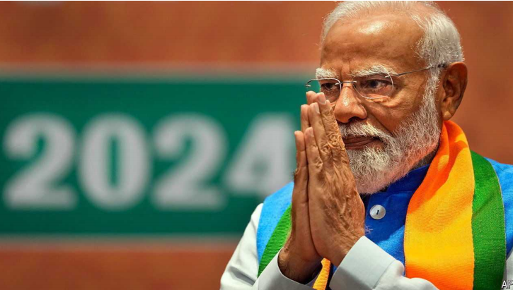

# **What Indian business expects from Modi 3.0**

**After a brief panic, investors and bosses welcome the new government**

原文：

HOW MUCH is one-party rule worth to India Inc? Judging by the market

reaction to the results of the general election, the figure is around $400bn.

That is the total market value lost by Mumbai-listed stocks on June 4th,

when it turned out that rather than securing a big majority, as exit polls had

predicted, the ruling Bharatiya Janata Party (BJP) of Narendra Modi would

need coalition partners to govern.

一党统治对印度公司来说值多少钱？从市场对大选结果的反应来看，这个数字在4000亿美元左右。这是孟买上市股票在6月4日损失的总市值，当时事实证明，纳伦德拉·莫迪领导的执政的印度人民党(BJP)需要联盟伙伴来执政，而不是像出口民调预测的那样获得绝大多数席位。

学习：

general election：大选

coalition：美 [ˌkoʊəˈlɪʃn] 联盟；联合；结盟；

原文：

Investors’ panic proved short-lived. By June 10th the Mumbai bourse had

clawed back all its losses, after Mr Modi quickly assembled a coalition

perceived to be sympathetic to his pro-business economic agenda. The

previous day a “Who’s Who” of corporate India applauded in the

presidential palace as Mr Modi was sworn in as prime minister for a third

time. Modi 3.0, as Indians refer to the new government, is looking much like

the earlier versions.

事实证明，投资者的恐慌是短暂的。到6月10日，在莫迪迅速组建了一个被认为支持其亲商经济议程的联盟后，孟买证券交易所收复了所有失地。前一天，当莫迪第三次宣誓就任总理时，印度企业界的“名人”在总统府鼓掌。莫迪3.0，印度人对新政府的称呼，看起来很像早期的版本。

学习：

bourse：美 [bʊrs] 证券交易所；

claw back：夺回来

assemble a coalition：组建联盟

sumpathetic：美 [ˌsɪmpəˈθetɪk] 同情的；体恤的；支持的；赞同的；赞成的；

pro-business：利商；亲企业；亲商务的          

presidential palace：总统府

sworn：swear发誓；保证；的过去分词

swear in：宣誓就职

原文：

The BJP’s two main coalition partners are seen as amenable to Mr Modi’s

vision for the economy. The Telugu Desam Party is led by the chief minister

of Andhra Pradesh, N. Chandrababu Naidu, who played a key role in the

development of Hyderabad, the former state capital, and is considered a

strong supporter of foreign investment. The Janata Dal (United) party, from

the state of Bihar, is also unlikely to make trouble. The cabinet emphasises

continuity. The ministers of finance, commerce and foreign affairs remain in

their roles. So do some colleagues with smaller portfolios that are

nonetheless critical to business, notably Ashwini Vaishnaw, who oversees

the much-ballyhooed subsidies for electronics manufacturing.

BJP的两个主要联盟伙伴被视为顺从莫迪的经济愿景。泰卢固德萨姆党由安得拉邦首席部长n·钱德拉巴布·奈杜(N. Chandrababu Naidu)领导，他在前邦首府海德拉巴的发展中发挥了关键作用，被认为是外国投资的坚定支持者。来自比哈尔邦的联合党也不太可能制造麻烦。内阁强调连续性。财政部长、商务部长和外交部长继续留任。一些投资组合较小但对业务至关重要的同事也是如此，特别是Ashwini Vaishnaw，他负责监管被大肆宣传的电子制造业补贴。

学习：

amenable to：顺从

make trouble：制造麻烦

cabinet：内阁

emphasise = emphasize：强调

continuity：美 [ˌkɑːntɪˈnuːəti] 连续性；连贯性；

oversee：监管

notably：特别是

ballyhoo：美 [ˈbæliˌhu] 夸大宣传；大吹大擂

much-ballyhooed：大肆宣传

原文：

The dexterity with which Mr Modi handled his apparent electoral setback

may have bolstered his reputation for getting things done. Many executives

take it as a sign that he can still push through reforms. Better yet, the

coalition may keep him from overreaching, for example by making life

difficult for companies that do not embrace the BJP wholeheartedly enough—a

fear that many denizens of corporate India share but, given Mr Modi’s

intolerance of open criticism, dare not utter in public.

莫迪先生处理他明显的选举挫折的灵巧性可能提升了他做事情的声誉。许多高管将此视为他仍能推进改革的标志。更好的是，联合政府可能会阻止他做得过火，例如让那些不够全心全意拥护BJP的公司日子不好过——这是许多印度企业界人士共有的担忧，但鉴于莫迪对公开批评的不容忍，他们不敢在公开场合说出这种担忧。

学习：

dexterity：美 [dekˈsterəti] 灵巧；熟练

electoral：美 [ɪˈlektərəl]   选举的；与选举相关的；

setback：挫折

bolster：美 [ˈboʊlstər]  支持；加强；支撑

bolster his reputation：提升了声誉

push through reforms：推动改革

wholeheartedly：全心全意地；全神贯注地；尽力地

denizen：美 [ˈdɛnəzən] 居民；居住者；外国人；外籍人士

utter：说话

原文：

The risk is that the constraints of coalition will do more than just curb 

BJP excesses. A series of 100-day plans promised during the campaign have yet

to be released. Other half-finished projects, such as new rules for foreign

investment that were meant to be finalised at the start of the new term, are in

limbo. Much-needed agricultural, land and labour reforms, which Mr Modi

has struggled to push through even with a BJP majority, will be no easier to enact.

风险在于，联合政府的约束不仅仅是抑制BJP的过度行为。竞选期间承诺的一系列百日计划尚未公布。其他一些半成品项目，比如本应在新任期开始时敲定的外国投资新规，也被搁置了。迫切需要的农业、土地和劳动力改革将不会更容易实施，即使在BJP人占多数的情况下，莫迪也难以推动这些改革。

学习：

curb BJP excesses：抑制BJP的过度行为

have yet to be released：还没有公布

finalise：使…结束；把最后定下来

limbo：美 [ˈlɪmboʊ]  进退两难的中间阶段；

原文：

Indian bosses confess that their main pre-election mistake was exaggerated

expectations. Third terms rarely come with big majorities anywhere in the

world, says an investor. Change in India takes time, he observes, and

direction matters more than distance travelled. In the eyes of Indian

business, the direction remains correct. ■

印度老板们承认，他们选举前的主要错误是夸大了期望。一位投资者表示，在世界任何地方，第三任期很少伴随着绝大多数。他观察到，印度的变化需要时间，方向比路程更重要。在印度商界看来，方向仍然是正确的。■

学习：

confess：承认

direction matters more than distance travelled: 方向比路程更重要

