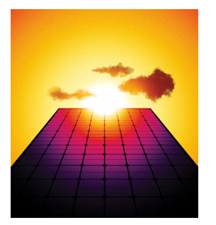

# The exponential growth of solar power will change the world

**An energy-rich future is within reach**

原文：

It is 70 years since AT&T’s Bell Labs unveiled a new technology for turning

sunlight into power. The phone company hoped it could replace the batteries

that run equipment in out-of-the-way places. It also realised that powering

devices with light alone showed how science could make the future seem

wonderful; hence a press event at which sunshine kept a toy Ferris wheel

spinning round and round.

70年前，美国电话电报公司贝尔实验室公布了一项将阳光转化为电能的新技术。电话公司希望它能取代在偏远地区运行设备的电池。它还意识到，仅用光为设备提供动力显示了科学如何让未来看起来美好；因此，在一次新闻发布会上，阳光让一个玩具摩天轮不停地旋转。

学习：

unveiled：公之于众的；使公之于众；揭开；（unveil的过去式）；显露          

unveil a new technology: 发布了一项新技术

in out-of-the-way places：在偏僻的地区；在偏远的地方

press event：新闻发布会

Ferris wheel：摩天轮；大观览车

round and round：一圈圈地；团团转；

原文：

Today solar power is long past the toy phase. Panels now occupy an area

around half that of Wales, and this year they will provide the world with

about 6% of its electricity—which is almost three times as much electrical

energy as America consumed back in 1954. Yet this historic growth is only

the second-most-remarkable thing about the rise of solar power. The most

remarkable is that it is nowhere near over.

今天，太阳能早已过了玩具阶段。太阳能电池板现在占据了威尔士一半的面积，今年它们将为世界提供6%的电力——这几乎是美国1954年消耗的电能的三倍。然而，这一历史性的增长只是太阳能崛起的第二大亮点。最值得注意的是，它还远未结束。

学习：

long past the xxx phase：早过了xxx阶段

nowhere near：远远不

原文：

To call solar power’s rise exponential is not hyperbole, but a statement of

fact. Installed solar capacity doubles roughly every three years, and so grows

ten-fold each decade. Such sustained growth is seldom seen in anything that

matters. That makes it hard for people to get their heads round what is going

on. When it was a tenth of its current size ten years ago, solar power was

still seen as marginal even by experts who knew how fast it had grown. The

next ten-fold increase will be equivalent to multiplying the world’s entire

fleet of nuclear reactors by eight in less than the time it typically takes to

build just a single one of them.

将太阳能的增长称为指数增长并不夸张，而是事实的陈述。太阳能装机容量大约每三年翻一番，因此每十年增长十倍。如此持续的增长在任何重要的领域都很少见。这使得人们很难理解正在发生的事情。十年前，当太阳能的规模只有现在的十分之一时，即使是知道其发展速度的专家也仍然认为它是微不足道的。下一个10倍的增长将相当于在不到通常建造一个核反应堆所需时间的情况下，将世界上整个核反应堆的数量增加8倍。

学习：

hyperbole：美 [haɪˈpɜːrbəli] 夸张法 **注意发音**

原文：

Solar cells will in all likelihood be the single biggest source of electrical

power on the planet by the mid 2030s. By the 2040s they may be the largest

source not just of electricity but of all energy. On current trends, the all-in

cost of the electricity they produce promises to be less than half as expensive

as the cheapest available today. This will not stop climate change, but could

slow it a lot faster. Much of the world—including Africa, where 600m

people still cannot light their homes—will begin to feel energy-rich. That

feeling will be a new and transformational one for humankind.

到21世纪30年代中期，太阳能电池极有可能成为地球上最大的单一电力来源。到2040年，它们可能不仅是电力的最大来源，也是所有能源的最大来源。按照目前的趋势，它们生产的电力的总成本有望比目前最便宜的价格低一半以上。这不会阻止气候变化，但可能会大大加快速度来减缓它。世界大部分地区——包括非洲，那里仍有6亿人无法照明——将开始感到能源丰富。这种感觉对人类来说将是一种全新的、变革性的感觉。

学习：

solar cells：太阳能电池

in all likelihood: 极有可能；几乎肯定的；很可能；

electrical power：电力

all-in:  包括一切费用的          

原文：

To grasp that this is not some environmentalist fever dream, consider solar

economics. As the cumulative production of a manufactured good increases,

costs go down. As costs go down, demand goes up. As demand goes up,

production increases—and costs go down further. This cannot go on for

ever; production, demand or both always become constrained. In earlier

energy transitions—from wood to coal, coal to oil or oil to gas—the

efficiency of extraction grew, but it was eventually offset by the cost of

finding ever more fuel.

为了理解这不是环保主义者的狂热梦想，考虑一下太阳能经济学。随着制成品累计产量的增加，成本下降。随着成本下降，需求上升。随着需求上升，产量增加，成本进一步下降。这不能永远持续下去；生产、需求或两者总是受到限制。在早期的能源转换中——从木材到煤炭，从煤炭到石油或从石油到天然气——提取效率提高了，但最终被寻找更多燃料的成本抵消了。

学习：

environmentalist：环保主义者

fever dream：狂热梦想

原文：

As our essay this week explains, solar power faces no such constraint. The

resources needed to produce solar cells and plant them on solar farms are

silicon-rich sand, sunny places and human ingenuity, all three of which are

abundant. Making cells also takes energy, but solar power is fast making that

abundant, too. As for demand, it is both huge and elastic—if you make

electricity cheaper, people will find uses for it. The result is that, in contrast

to earlier energy sources, solar power has routinely become cheaper and will

continue to do so.

正如我们本周的文章所解释的，太阳能没有这样的限制。生产太阳能电池并将其种植在太阳能农场所需的资源是富含硅的沙子、阳光充足的地方和人类的聪明才智，这三者都很丰富。制造电池也需要能源，但太阳能也在迅速丰富能源。至于需求，它既巨大又有弹性——如果你让电力更便宜，人们会发现它的用途。结果是，与早期的能源相比，太阳能通常会变得更便宜，并将继续如此。

学习：

ingenuity：美 [ˌɪndʒəˈnuːəti]   独创力；独创性；创造力；心灵手巧；聪明才智

原文：

Other constraints do exist. Given people’s proclivity for living outside

daylight hours, solar power needs to be complemented with storage and

supplemented by other technologies. Heavy industry and aviation and freight

have been hard to electrify. Fortunately, these problems may be solved as

batteries and fuels created by electrolysis gradually become cheaper.

其他限制因素确实存在。鉴于人们倾向于在白天以外的时间生活，太阳能需要补充储存和其他技术。重工业、航空和货运已经很难电气化了。幸运的是，随着电解产生的电池和燃料逐渐变得便宜，这些问题可能会得到解决。

学习：

proclivity：英 [prəˈklɪvɪti]倾向；癖性

heavy industry：重工业

freight：美 [freɪt] 货物；散装货；运费

原文：

Another worry is that the vast majority of the world’s solar panels, and

almost all the purified silicon from which they are made, come from China.

Its solar industry is highly competitive, heavily subsidised and is

outstripping current demand—quite an achievement given all the solar

capacity China is installing within its own borders. This means that Chinese

capacity is big enough to keep the expansion going for years to come, even

if some of the companies involved go to the wall and some investment dries

up.

另一个担忧是，世界上绝大多数的太阳能电池板，以及几乎所有制造太阳能电池板的纯硅都来自中国。它的太阳能产业极具竞争力，得到大量补贴，超过了目前的需求——考虑到中国在其境内安装的所有太阳能发电能力，这是一个相当大的成就。这意味着，中国的产能足够大，可以在未来几年保持扩张。

学习：

vast majority：绝大多数

highly competitive：极具竞争力

heavily subsidised：得到大量补贴的

outstripping：美 [aʊtˈstrɪpɪŋ] 超过；跑过；比…跑得快；（outstrip的现在分词）

go to the wall：(因缺少资金)走投无路, 失败, 破产, 陷于绝境          

原文：

In the long run, a world in which more energy is generated without the oil

and gas that come from unstable or unfriendly parts of the world will be

more dependable. Still, although the Chinese Communist Party cannot rig

the price of sunlight as OPEC tries to rig that of oil, the fact that a vital industry

resides in a single hostile country is worrying.

学习：

rig：操纵；垄断；

原文：

It is a concern that America feels keenly, which is why it has put tariffs on

Chinese solar equipment. However, because almost all the demand for solar

panels still lies in the future, the rest of the world will have plenty of scope

to get into the market. America’s adoption of solar energy could be

frustrated by a pro-fossil-fuel Trump presidency, but only temporarily and

painfully. It could equally be enhanced if America released pent up demand,

by making it easier to install panels on homes and to join the grid—the

country has a terawatt of new solar capacity waiting to be connected. Carbon

prices would help, just as they did in the switch from coal to gas in the

European Union

这是美国深切感受到的担忧，这也是它对Chinese太阳能设备征收关税的原因。然而，由于几乎所有对太阳能电池板的需求仍然存在于未来，世界其他地区将有足够的空间进入这个市场。美国对太阳能的采用可能会因支持化石燃料的特朗普当选总统而受挫，但这只是暂时的、痛苦的。如果美国释放被压抑的需求，通过使家庭安装电池板和加入电网变得更容易，这同样可以得到加强——这个国家有一万亿瓦的新太阳能容量等待连接。碳价格会有所帮助，就像他们在欧盟从煤到气的转变中所做的那样

学习：

pent up：被压抑的；抑制；

原文：

The aim should be for the virtuous circle of solar-power production to turn

as fast as possible. That is because it offers the prize of cheaper energy. The

benefits start with a boost to productivity. Anything that people use energy

for today will cost less—and that includes pretty much everything. Then

come the things cheap energy will make possible. People who could never

afford to will start lighting their houses or driving a car. Cheap energy can

purify water, and even desalinate it. It can drive the hungry machinery of

artificial intelligence. It can make billions of homes and offices more

bearable in summers that will, for decades to come, be getting hotter.

目标应该是让太阳能发电的良性循环尽快转向。这是因为它提供了更廉价的能源。好处始于生产率的提高。今天人们使用能源的任何东西都将花费更少——这包括几乎所有的东西。接下来，廉价能源将使一些事情成为可能。那些永远负担不起的人将开始点亮他们的房子或者开车。廉价能源可以净化水，甚至淡化水。它可以驱动人工智能的饥饿机器。它可以让数十亿家庭和办公室在未来几十年越来越热的夏天变得更容易忍受。

学习：

virtuous circle：良性循环

desalinate：美 [diˈsæləˌneɪt]   淡化；使（海水）脱盐

原文：

But it is the things that nobody has yet thought of that will be most

consequential. In its radical abundance, cheaper energy will free the

imagination, setting tiny Ferris wheels of the mind spinning with excitement

and new possibilities.

但是没有人想到的事情才是最重要的。极其丰富的廉价能源将解放想象力，让思维的小摩天轮充满兴奋和新的可能性。

原文：

This week marks the summer solstice in the northern hemisphere. The Sun

rising to its highest point in the sky will in decades to come shine down on a

world where nobody need go without the blessings of electricity and where

the access to energy invigorates all those it touches. ■

本周标志着北半球的夏季至日。太阳升到天空的最高点，将在几十年后照耀一个世界，在这个世界上，没有人不需要电力，能源的获取使所有接触到的人都充满活力。■

学习：

solstice：美 [ˈsɑːlstɪs] 至点；至日；夏至；冬至

summer solstice：夏至；夏至点；夏至日；夏至时（一年中白昼最长的一天，北半球的6月21日左右）

invigorate：美 [ɪnˈvɪɡəˌreɪt]  使精力充沛；使精神焕发；使生气勃勃；振作；

## 后记

2024年6月30日14点33分于上海。

