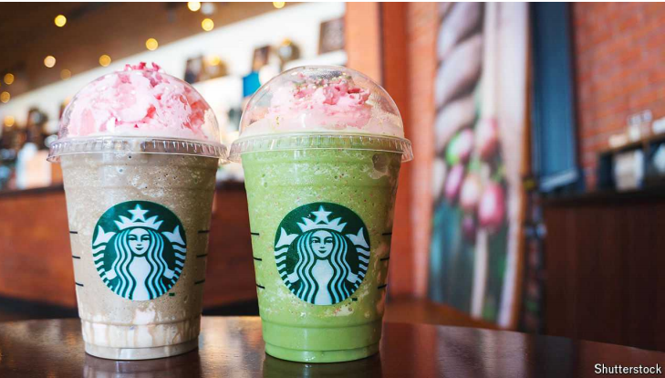

# How Starbucks caffeinates local economies

Call it the frappuccino effect

frappuccino：星冰乐

星巴克如何刺激当地经济：称之为星冰乐效应

原文：

Starbucks offers endless opportunities for innovation. Parts of social media

delight in hacking the chain’s menu to create highly instagrammable drinks.

Fancy a “cake batter Frappuccino”? Simply order a “vanilla bean crème

Frappuccino”, add a pump of hazelnut syrup and ask the barista to put a cake

pop in the blender. How about some “liquid cocaine”? That involves four

shots of espresso with four pumps of white-chocolate syrup, served over ice.

星巴克为创新提供了无尽的机会。部分社交媒体热衷于黑掉连锁店的菜单，创造高度不可模仿的饮料。想来杯“蛋糕面糊星冰乐”吗？只需点一份“香草豆鲜奶油星冰乐”，加入一泵榛子糖浆，让咖啡师在搅拌机里放一块蛋糕。来点“液体可卡因”怎么样？那包括四份浓缩咖啡和四份白巧克力糖浆，放在冰块上。

学习：

vanilla：美 [vəˈnɪlə] 无特色的；普通的；香草冰淇淋；

vanilla bean：香草豆；香荚兰豆；

hazelnut：美 [ˈheɪzəlˌnət] 榛实；榛子仁

syrup：美 [ˈsɪrəp] 糖浆；假发；含药糖浆；饮品糖浆

barista：美 [bəˈristə] 咖啡师；咖啡吧员；

blender：搅拌器；混合器；

原文：

A new working paper suggests the purveyor of coffee-based milkshakes

offers other innovation, too. Choi Jinkyong, Jorge Guzman and Mario Small,

all of Columbia University, find that a new Starbucks in an American

neighbourhood without a coffee shop leads to the creation of between 1.1

and 3.5 new companies a year over the next seven years. That, the authors

argue, owes to the café’s role as a “third place”—somewhere people can

gather without a purpose. Branches “help entrepreneurs form and mobilise

networks”, they write.

一份新的工作报告显示，这家咖啡奶昔供应商还提供了其他创新。哥伦比亚大学的Choi Jinkyong、Jorge Guzman和Mario Small发现，在没有咖啡店的美国社区中，一家新的星巴克在未来7年内每年会产生1.1到3.5家新公司。作者认为，这是因为咖啡馆扮演了“第三个地方”的角色——一个人们可以无目的聚集的地方。他们写道，分支机构“帮助企业家形成和动员网络”。

学习：

milkshake： 奶昔；冰淇淋牛奶饮料

原文：

Perhaps Starbucks spots neighbourhoods where the flat-white-sipping

entrepreneurs of tomorrow will settle and boost business-creation numbers.

To control for this, the authors lean on two sources of randomness:

nimbyism and Earvin “Magic” Johnson, a basketball player. They compare

places that gained a Starbucks with those where the chain had hoped to

expand only to be foiled by planning objections, ensuring it was not the

chain’s foresight which explained the later business growth. They also look

at places that gained a branch following a partnership with Mr Johnson

which aimed to push the chain into poor neighbourhoods, and were thus not

its usual sort of site.

也许星巴克发现了未来喝着纯白咖啡的企业家会定居并增加创业数量的街区。为了控制这一点，作者依靠两个随机来源:邻避主义和篮球运动员埃尔文“魔术师”约翰逊。他们将有星巴克的地方与那些连锁店希望扩张却因规划反对而受挫的地方进行比较，确保不是连锁店的远见解释了后来的业务增长。他们还调查了与约翰逊先生合作后开设分店的地方，这些分店旨在将连锁店推向贫困社区，因此不是其通常的站点。

学习：

nimby：邻避；邻避主义；邻避效应；本地反对者（指反对在本地建设扰民的或不安全的设施但不反对在其他地区进行类似建设的人）。

原文：

The authors provide further evidence that the benefits are thanks to a new

third space. They find no similar effects for Dunkin’ Donuts, which does not

typically provide much seating. By contrast, Caribou Coffee, a chain in the

Midwest, has a similar model to Starbucks and provides similar benefits.

作者提供了进一步的证据，证明这些好处是由于一个新的第三空间。他们发现邓肯甜甜圈没有类似的效果，它通常不会提供太多的座位。相比之下，中西部的连锁店Caribou Coffee与星巴克有着相似的模式，并提供相似的好处。

学习：

donuts：美 [ˈdoʊˌnʌts] 甜甜圈；油炸圈饼；（donut的复数）

原文：

Although the paper is not yet peer-reviewed, it has historical plausibility.

London’s coffee houses were the site of 18th-century innovation. They were

known as “penny universities”: for the price of a cup one could gain access

to the era’s finest minds. Lloyd’s of London, an insurance market, is the

descendant of Lloyd’s coffee house; London’s stock exchange has a similar

pedigree.

尽管这篇论文还没有经过同行评议，但它具有历史合理性。伦敦的咖啡馆是18世纪创新的场所。它们被称为“便士大学”:花一个杯子的钱，你就可以接触到那个时代最优秀的人才。伦敦的劳合社，一个保险市场，是劳合社咖啡屋的后代；伦敦证券交易所也有类似的血统。

学习：
pedigree：美 [ˈpɛdəˌɡri] 血统；家谱；世系；

原文：

The results also provide a puzzle. Starbucks drew from Europe’s cafés. Yet

the presence of third spaces across the continent has not been enough to

overcome its innovation struggles. Maybe there is something about the chain

itself. Italians should trade their espresso for a “cotton candy Frappuccino”

just in case. ■

这些结果也提供了一个谜题。星巴克借鉴了欧洲的咖啡馆。然而，第三空间在欧洲大陆的存在并不足以克服其创新困境。也许是链条本身有问题。意大利人应该用他们的浓缩咖啡换一杯“棉花糖星冰乐”，以防万一。■

学习：

just in case：以防万一

espresso：浓咖啡          

## 后记

2024年7月8日14点46分于上海。

