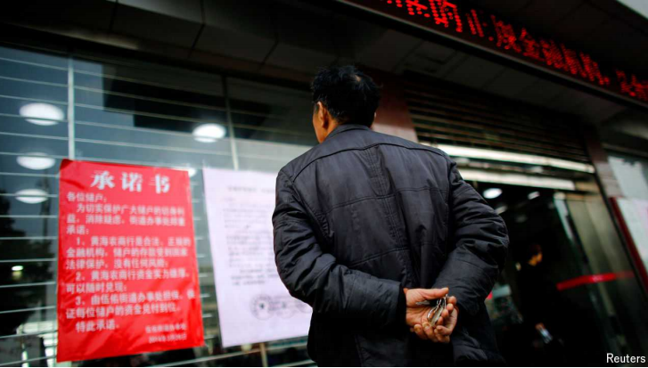

# Why Chinese banks are now vanishing

The state is struggling to deal with troubled institutions

troubled: 被扰乱的；混乱的；苦恼的；

原文：

The savings and LOAN (S&L) CRISIS terrorised America’s banks for years. Starting

in the mid-1980s, a mix of aggressive lending growth, poor risk controls and

a property downturn contributed to the collapse or consolidation of over

1,000 small lending institutions. China’s smallest banks are now suffering

from many of the same ailments. But until recently few have collapsed or

merged with others.

储蓄贷款危机多年来一直困扰着美国的银行。从20世纪80年代中期开始，贷款大幅增长、风险控制不力和房地产低迷的综合因素导致了1000多家小型贷款机构的倒闭或整合。中国最小的银行现在正遭受着许多同样的疾病。但直到最近，很少有公司倒闭或与其他公司合并。

学习：

terrorize：美 [ˈtɛrəˌraɪz]  恐吓；威胁；使惊恐不安；使充满恐怖

downturn：衰落；下降趋势

property downturn：房地产低迷

consolidation：美 [kənˌsɑːlɪˈdeɪʃn] 合并；联合；

collapse：美 [kəˈlæps] 塌陷；垮掉；垮台；（如机构、生意或行动的）突然失败；全面崩溃

lending institution：贷款机构

ailments：美 [ˈeilmənts]	小病；小病（ailment复数形式）；

原文：

That is starting to change. In the week ending June 24th, 40 Chinese banks

vanished as they were absorbed into bigger ones. Not even at the height of

the S&L crisis did lenders disappear at such a clip.

这种情况正在开始改变。截至6月24日的一周，40家中国银行消失了，因为它们被更大的银行所吸收。即使是在储贷危机最严重的时候，贷款人也不会这么快消失。

学习：

clip：快速移动；削减（费用、时间）；缩短（词语）；

lenders：            贷方；（lender的复数）          

原文：

China’s regulators have been trudging through various reforms and

consolidations for years. Since 2019 several mid-tier banks have collapsed.

Powerful investment managers and state financiers have melted down. But it

is small, rural banks that provide the most complex problem.

多年来，中国监管机构一直在艰难地进行各种改革和整合。自2019年以来，几家中型银行已经倒闭。强大的投资管理者和国有金融企业已经垮台。但正是小型农村银行带来了最复杂的问题。

学习：

trudging：美 [trʌdʒɪŋ] 跋涉；步履艰难地走；（trudge的现在分词）

原文：

Some 3,800 such institutions dot the Chinese countryside. They have 55trn

yuan ($7.5trn) in assets—13% of the total banking system—and have long

been mismanaged, accruing vast amounts of bad loans. Many have lent to

real-estate developers and local governments, gaining exposure to China’s

property crisis. In recent years some have revealed that 40% of their books

are made up of non-performing loans.

大约3800个这样的机构遍布中国农村。他们拥有55万亿元人民币(7.5万亿美元)的资产，占整个银行系统的13%，长期以来管理不善，积累了大量的不良贷款。许多银行向房地产开发商和地方政府放贷，从而在中国的房地产危机中也受到波及。最近几年，一些银行披露其40%的账目是由不良贷款构成的。

学习：

mismanaged：管理不善

accrue：美 [əˈkruː]  （钱款、债务）累积；积累；

bad loans：不良贷款

real-estate developers：房地产开发商

non-performing：不良资产

原文：

Cleaning up this mess is an extremely delicate task. Many banks were

established in order to serve small businesses, especially in China’s poorest

areas. Those stuck with toxic debts struggle to supply firms with new loans,

which can hurt vulnerable companies and local economic growth. The

worst-performing small banks have already threatened social stability, the

main concern of Xi Jinping, China’s leader. Fraud on a large scale caused

several to freeze withdrawals in 2022, drawing depositors onto the streets of

a provincial capital. But state intervention is risky, too. Rumours of distress,

restructuring or consolidation can lead to bank runs.

收拾这个烂摊子是一项极其棘手的任务。许多银行的建立是为了服务小企业，尤其是在中国最贫困的地区。那些背负有毒债务的企业难以向企业提供新的贷款，这可能会损害脆弱的企业和当地的经济增长。大规模的欺诈导致数家银行在2022年冻结取款，将储户吸引到省会城市的街道上。但是国家干预也有风险。困境、重组或整合的谣言会导致银行挤兑。

学习：

delicate：美 [ˈdelɪkət] 棘手的；

serve small businesses：服务小企业

withdrawals：提款；

bank runs：银行挤兑

原文：

One solution has been steady but meagre recapitalisation. Local

governments are issuing special-purpose bonds, which they use for a number

of things including bailing out banks. Although last year just 218bn yuan of

proceeds went to regional banks, an amount equal to 1% of their risk

weighted assets, some troubled provinces have dished out more. Between

December 2020 and May this year, Liaoning in China’s north-east injected

17% of special-purpose-bond proceeds into its banks.

一个解决方案是稳定但微薄的资本重组。地方政府正在发行特殊用途债券，用于包括救助银行在内的多种用途。尽管去年只有2180亿元的款项流入了地方银行，相当于其风险加权资产的1%，但一些陷入困境的省份却拿出了更多。2020年12月至今年5月，中国东北的辽宁省向其银行注入了17%的特殊目的债券收益。

学习：
meagre：英 [ˈmiːɡə] 贫乏的；稀少的；数量很少的；

proceeds：营收；净收入；所得；进款；款项；

原文：

Liaoning is also at the centre of what has now become China’s main way of

dealing with small, feeble banks: making them disappear. Of the 40

institutions that vanished recently, 36 were in the province and absorbed into

a new lender, called Liaoning Rural Commercial Bank, which was created as

a receptacle for bad banks. Since it was set up in September, five other

institutions have been established to do similar work. More are expected.

辽宁也是如今中国处理弱小银行的主要方式的中心:让它们消失。在最近消失的40家机构中，有36家位于辽宁省，并被一家名为辽宁农村商业银行的新贷款机构吸收，该银行是为坏账银行设立的。自9月份成立以来，已经成立了另外五个机构来做类似的工作。预计还会有更多。

学习：
feeble：美 [ˈfiːbl] 虚弱的；衰弱的；乏力的；无力的

receptacle：美 [rəˈsɛptək(ə)l] 容器；贮藏器；贮藏所；

原文：

This regulatory vanishing act will probably pick up pace. S&P Global, a

rating agency, reckons it will take a decade to complete the project.

Supporters say that fewer bigger banks will be easier for regulators to keep

watch over. Critics argue that it is little more than sleight of hand.

Combining dozens of bad banks, they say, only creates bigger, badder banks.

这项监管消失法案可能会加快步伐。评级机构标普全球认为完成这项工程需要十年时间。支持者称，监管者更容易监管更少的大银行。批评者认为这只不过是耍花招。他们说，合并几十家坏银行只会产生更大、更坏的银行。

学习：

sleight： 美 [slaɪt] 巧妙；灵巧；诡诈 **注意发音**

sleight of hand：敏捷手法；花招；戏法；把戏

原文：

Regulators are doubling down on consolidation because they lack

mechanisms to allow banks to fail and leave the market. During the 

S&L crisis American lawmakers passed the Financial Institutions Reform,

Recovery and Enforcement Act. This created a way for small lenders’ assets

to be sold off and helped resolve the crisis in an orderly manner. China has

fumbled such a law for years. Draft legislation, called the Financial Stability

Law, was proposed at a lawmaking session in Beijing in June but was once

again delayed. Such ineptitude is now common in Chinese policymaking. As

economic growth slows further, technocrats will need to do more than wave

a wand at the problems of the lowest rung of the banking system. ■

监管者加倍重视整合，因为他们缺乏允许银行倒闭并退出市场的机制。在储贷危机期间，美国立法者通过了金融机构改革、恢复和执行法案。这为小银行的资产出售创造了一种方式，并有助于以有序的方式解决危机。多年来，中国一直在摸索这样一部法律。名为《金融稳定法》的立法草案在6月份北京的一次立法会议上提出，但再次被推迟。随着经济增长进一步放缓，技术官僚需要做的不仅仅是挥舞魔杖，解决银行体系最底层的问题。■

学习：

resolve the crisis：解决危机

fumbled：美 [ˈfʌmbəld] 摸索；笨手笨脚地做；（fumble的过去式）

ineptitude：美 [ɪˈneptɪttud] 愚笨；缺乏技巧；无能；

wand：美 [wɑːnd] 魔杖；指挥棒；棍；棒

tachnocrat：美 [ˈtɛknəˌkræt]  技术专家政治论者；技术专家治国论者；技术专家

banking system：银行系统

rung：梯级；梯子横档；横档；梯阶；阶梯的一级

## 后记

2024年7月8日17点00分于上海。

