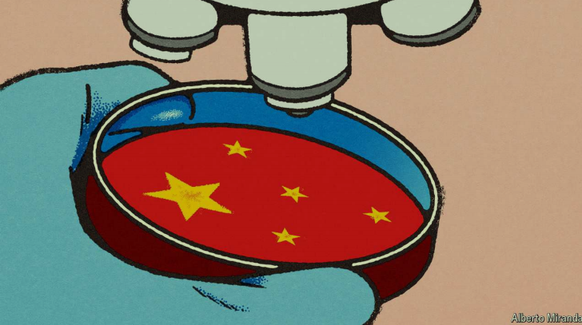

# China is the West’s corporate R&D lab. Can it remain so?

Foreign firms want Chinese boffins. America and China may have other plans

boffins：美 ['bɒfɪnz] 科学工作者；研究员；（boffin的复数）

原文：

CHINA IS, FAMOUSLY, the world’s factory and a giant market for the

world’s companies. More unremarked is its growing role as the world’s

research-and-development laboratory. Between 2012 and 2021 foreign firms

increased their collective Chinese research personnel by a fifth, to 716,000.

Their annual R&D spending in the country almost doubled, to 338bn yuan

($52bn). Add investments by local firms and China now matches Europe’s

R&D tally (see chart). Only America splurges more.

众所周知，中国是世界工厂，也是世界公司的巨大市场。更不为人注意的是，它作为世界研发实验室的角色越来越重要。2012年至2021年间，外国公司在中国的研究人员总数增加了五分之一，达到71.6万人。他们每年在中国的R&D支出几乎翻了一番，达到3380亿元人民币(520亿美元)。加上当地公司的投资，中国现在已经和欧洲的R&D相当了(见图表)。只有美国支出得更多。

学习：

world's factory：世界工厂

unremarked：未被提及的；无评注的；未受注意的

personnel：美 [ˌpɜːrsəˈnel] （公司、组织或军队中的）全体人员；员工；

tally：账单；积分表

splurge：乱花（钱）；大量花费；

原文：

In 2022, despite harsh covid-19 lockdowns, 25 new foreign R&D centres

opened in Shanghai. Last year, when overall foreign direct investments in

China shrivelled by 80%, those in R&D rose by 4%. In the process, Western 

R&D centres in China have been re-engineered, from places to learn about the

domestic market into hotbeds of innovation whose fruits can be found in

products sold everywhere.

2022年，尽管新冠肺炎实施了严厉的封锁，仍有25家新的外国R&D中心在上海开业。去年，当在中国的外国直接投资总额缩水80%时，在R&D的外国直接投资却增长了4%。在这个过程中，位于中国的西方国家R&D中心被重新设计，从了解国内市场的地方变成了创新的温床，创新的成果可以在各地销售的产品中找到。

学习：

shrivelled：皱缩；（使）枯萎；（shrivel的过去式）

hotbed：温床

原文：

Foreign chief executives now believe that China’s brainpower and its

innovation-curious regulatory regime are crucial ingredients of their

companies’ global success. Nowhere else in the world can newfangled

technologies, from novel drugs to flying taxis, be tested as quickly as in

China, marvels a foreign diplomat. So even as the Chinese economy slows

—it grew by a surprisingly tepid 4.7% in the second quarter, year on year—

and multinational businesses try to reduce their reliance on Chinese supply

chains amid mounting geopolitical tension, global CEOs are desperate to

protect this critical third function of their Chinese operations.

外国首席执行官们现在认为，中国的智力及其对创新充满好奇的监管制度是他们公司在全球取得成功的关键因素。一位外国外交官惊叹道，从新药到飞行出租车，世界上没有其他地方能像中国这样快速地测试新奇的技术。因此，尽管中国经济放缓——第二季度同比增长4.7%，出人意料地不温不火——跨国企业试图在地缘政治紧张局势加剧的情况下减少对中国供应链的依赖，但全球首席执行官们仍急于保护他们在中国业务的第三个关键功能。

学习：

regime：美 [reɪˈʒiːm] 政权；政体；体制；体系；政治制度； **注意发音**

newfangle：美 ['njuːfæŋgl]  使流行

tepid：美 [ˈtɛpəd] 温热的；微温的；不太热的；不冷不热的；

原文：

Last year Volkswagen invested more than $1bn in an innovation centre in

the inland city of Hefei. Bosch, a fellow German firm that supplies parts to

Volkswagen and other car giants, is building its own $1bn R&D outpost in

nearby Suzhou. HSBC, a British bank, employs thousands of people at an 

R&D centre in southern China, where they are working on uses of AI, as well as

other advanced technology such as blockchains and biometrics.

去年，大众在内陆城市合肥的一个创新中心投资逾10亿美元。博世，一家为大众和其他汽车巨头提供零部件的德国公司，正在苏州附近建造自己的10亿美元的R&D前哨站。英国银行汇丰(HSBC)在中国南方的一个R&D中心雇用了数千人，他们在那里研究人工智能的应用，以及区块链和生物识别等其他先进技术。

学习：

Volkswagen：大众

outpost：前哨基地；边防站；边界哨点；

biometrics：生物测定学

原文：

In February AstraZeneca, a British pharmaceutical company, said it would

turn its Shanghai operation into a global R&D hub. In March Apple, maker of

the iPhone, unveiled new R&D initiatives around Shenzhen. The next month

Bayer, a German drugs-and-chemicals firm, said it was increasing its

presence in Shanghai to bring “more technology from China to the world”.

In June Tesla, an American electric-vehicle (EV) pioneer, was granted

permission by Shanghai’s authorities to conduct tests of its most advanced

autonomous-driving systems on the city’s streets.

二月份，英国制药公司阿斯利康表示，将把其上海业务转变为全球R&D中心。今年3月，iPhone制造商苹果公司在深圳周边推出了新的R&D计划。接下来的一个月，德国药品和化学品公司拜耳表示，将增加在上海的业务，以“将更多的技术从中国带到世界”。6月，美国电动汽车(EV)的先驱特斯拉获得上海当局的许可，在该市的街道上对其最先进的自动驾驶系统进行测试。

原文：

A big reason for doing lots of R&D in China is the country’s surplus of young

engineers and scientists. Southern China is full of small companies

developing all manner of clever technologies, from new chemicals to

artificial intelligence (AI). This is a giant talent pool in which foreign

multinationals can fish.

在中国做大量R&D的一个重要原因是该国年轻工程师和科学家过剩。中国南方到处都是开发各种智能技术的小公司，从新化学药品到人工智能(AI)。这是一个巨大的人才库，外国跨国公司可以从中渔利。

学习：

talent pool：人才库

multinationals：跨国公司

原文：

The Chinese boffins are certainly quite a catch. They are no less talented

than their counterparts in the West, where many of them studied and worked,

but still command considerably lower pay. The average monthly salary for a

newly minted PhD at a foreign company in China is around 13,000 yuan, a

third of what they would make in America. One multinational’s China boss

reckons he gets 30% more working hours out of his research staff in China

than his company manages to coax from similar workers in Europe.

中国科学家当然是相当抢手的。他们的才华不亚于西方的同行，他们中的许多人在那里学习和工作，但工资仍然低得多。在中国的外企，新博士的平均月薪约为13000元，是他们在美国收入的三分之一。一家跨国公司的中国老板估计，他从中国的研究人员那里得到的工作时间比他的公司从欧洲的类似员工那里得到的多30%。

学习：

boffins：科学工作者；研究员；（boffin的复数）          

minted：铸造；制造；创造；（mint的过去式和过去分词）

newly minted PhD：刚毕业的博士

coax：劝诱；哄骗；诱导；诱惑；巧妙处理；

>这里的“coax”意思是“劝诱”或“哄劝”。在这段话中，它指的是公司通过某种方式使员工更努力工作。
>
>举个例子：
>- 一位父亲可能会用各种甜言蜜语和奖励来“coax”他的孩子做家庭作业。
>
>在这段话里，公司试图通过某种方式（可能是管理策略、工作环境等）来使他们在中国的研究人员比在欧洲的研究人员工作更多的时间。

原文：

A lot of this work is focused on D rather than R. In many areas China still

produces less basic research than America but, by many accounts, more

applications. Its app economy is the world’s most sophisticated and, as one 

AI researcher at a foreign firm in Shanghai explains, leading the world in

bringing machine learning to the masses. Cosmetics companies tend to

launch more products in China than in other places—and also discontinue

more. This lets them test consumers’ reactions more rapidly than in other

places, says a marketing specialist. Products which pass the Chinese test can

then be offered abroad.

在许多领域，中国的基础研究仍然比美国少，但是从很多方面来说，中国的应用更多。它的应用经济是世界上最复杂的，正如上海一家外国公司的人工智能研究员解释的那样，它在将机器学习带给大众方面领先世界。化妆品公司倾向于在中国推出比其他地方更多的产品，同时也停止生产更多的产品。一位营销专家说，这让他们比在其他地方更快地测试消费者的反应。通过中国测试的产品可以销往国外。

学习：

basic research：基础研究

app economy：应用经济

原文：

Pharmaceutical companies, among the world’s biggest spenders on R&D, can

tap a burgeoning network of world-class contract-research outfits that carry

out trials more cheaply than in the West. They have also found that the

Chinese are keener to participate in clinical trials than people in other places.

China’s population of 1.4bn means that it is also easier to recruit sufficient

numbers of patients even for trials of drugs targeting rare diseases, adds Eric

Bouteiller of China Europe International Business School.

制药公司是世界上在R&D花钱最多的公司之一，它们可以利用迅速发展的世界级合同研究机构网络，这些机构进行试验的成本比西方更低。他们还发现，中国人比其他地方的人更热衷于参与临床试验。中欧国际工商学院(China Europe International Business School)的埃里克布泰勒(Eric Bouteiller)补充称，中国14亿人口意味着，即便是针对罕见疾病的药物试验，也更容易招募到足够多的患者。

学习：

clinical trials：临床试验

原文：

Trials, whether of cosmetics, apps, medicines or autonomous vehicles, are

made simpler by China’s regulatory forbearance. Local governments vie

with each other, and with other countries, to be leaders in emerging

industries that will undergird what Xi, China’s president, calls “high

quality growth”.

无论是化妆品、应用程序、药物还是自动驾驶汽车的试验，都因为中国的监管宽容而变得更加简单。地方政府相互竞争，也与其他国家竞争，成为新兴产业的领导者，这些新兴产业将支撑“高质量增长”。

学习：

forbearance：忍耐；耐心；宽容；

vie： 美 [vaɪ] 争夺；激烈竞争； **注意发音**

undergird：在底部加固；由底部支撑；支持

原文：

Pharma executives praise Chinese rules for clinical studies that are

independently designed and conducted by researchers rather than

drugmakers. In some fields, such as cell therapies for cancer, these

investigator-initiated trials in China are identifying successful treatments

faster than in other places, says Susan Galbraith of AstraZeneca. Developers

of passenger drones are similarly complimentary about rules that allow them

to fly their contraptions in designated zones springing up in Chinese cities.

Volkswagen began testing a prototype drone in the province of Inner

Mongolia in 2022, a world first for a legacy carmaker. Forget San Francisco,

says a foreign executive participating in such tests. If you want to set up a

testing programme quickly, you had better come to China.

制药公司高管称赞中国的临床研究规则，这些规则是由研究人员而非制药商独立设计和实施的。阿斯利康大学的Susan Galbraith说，在某些领域，如癌症的细胞疗法，中国的这些研究者发起的试验比其他地方更快地发现了成功的治疗方法。无人驾驶客机的开发者同样对允许他们在中国城市涌现的指定区域飞行的规定表示赞赏。大众汽车于2022年开始在内蒙古测试原型无人机，这是传统汽车制造商的世界首例。一位参与此类测试的外国高管表示:忘了旧金山吧。如果你想尽快建立一个测试项目，你最好来中国。

学习：
investigator-initiated：研究者发起的      

contraption：美 [kənˈtræpʃ(ə)n]  复杂的机械；新奇的设备；怪异的机械；

legacy carmaker：传统的汽车制造商

原文：

Western companies would understandably hate to be shut out of this R&D

paradise. Some are nonetheless bracing for such an eventuality. In June

America’s Treasury department issued draft rules that would ban American

firms from investing in AI, semiconductors, microelectronics and quantum

computing in China. These could come into force later this year.

可以理解的是，西方公司不愿被挡在这个R&D天堂之外。尽管如此，一些人还是为这种可能性做好了准备。6月，美国财政部发布了一份草案，禁止美国公司在中国投资人工智能、半导体、微电子和量子计算。这些可能在今年晚些时候生效。

学习：

eventuality：可能发生的事情；可能出现的结果

## **Lab leaks**

原文：

At the same time, Mr Xi’s paranoid security apparatus is making it harder to

move some intellectual property (IP) generated in China outside its borders,

ignoring economically minded officials’ concomitant efforts to attract

foreign investment. Exports of some AIs, such as speech- and text-recognition

software or even TikTok’s recommendation algorithm, now need permission

from the commerce ministry. So far this has not stopped most IP from leaving

the country. But this may change at any moment, says Alex Roberts of

Linklaters, a law firm. “We are at a tipping point.”

与此同时，中国产生的一些知识产权转移到境外变得更加困难，忽视了具有经济头脑的官员为吸引外国投资所做的努力。一些人工智能的出口，如语音和文本识别软件，甚至抖音的推荐算法，现在需要商务部的许可。到目前为止，这并没有阻止大多数知识产权离开这个国家。但是律师事务所Linklaters的Alex Roberts说，这种情况随时都可能改变。“我们正处于一个转折点。”

学习：

paranoid：偏执的；多疑的；妄想的；

apparatus：美 [ˌæpəˈrætəs] （尤指政党或政府的）机构；机关；组织；系统 **注意发音**

concomitant：美 [kənˈkɑmədənt] 伴随物；伴随现象；同时发生的事情

commerce ministry：商务部

原文：

In anticipation of tougher American and Chinese IP regimes, some foreign

companies have started to move research staff out of China. Even as Apple

doubles down on its Chinese R&D, Microsoft, its big-tech rival, is said to be

offering AI researchers in Beijing relocation packages as it winds down more

sensitive R&D in China. Although AstraZeneca and Bayer remain ostensibly

bullish on Chinese research, some pharmaceutical companies are seeking

more clarity about the rules for cross-border transfer of data and IP, says an

industry insider, and are rethinking new investments. The flying-taxi firms

are staying put for now. One day they, too, may have no choice but to take

flight. ■

由于预期美国和中国的知识产权制度会更加严格，一些外国公司已经开始将研究人员迁出中国。尽管苹果在中国R&D加倍努力，但其大型科技竞争对手微软(Microsoft)据说正在向北京的人工智能研究人员提供安置方案，以结束一些在中国的R&D。一位业内人士表示，尽管阿斯利康和拜耳表面上仍然看好中国的研究，但一些制药公司正在寻求更清晰的数据和知识产权跨境转移规则，并正在重新考虑新的投资。飞行出租车公司目前还在原地踏步。有一天，他们也可能别无选择，只能选择逃跑。■

学习：

ostensibly：表面上；表面看来；

stay put

>“Stay put” 意思是“留在原地”或“不移动”。在这段话里，指的是飞行出租车公司暂时还留在中国，没有搬离的计划。
>
>例如：
>- 尽管有许多不确定性，许多公司还是选择“stay put”，继续在当前的位置运营。
>
>在这段话中，飞行出租车公司目前还留在中国，但未来可能也不得不搬走。

## 后记

2024年7月22日10点11分于上海。