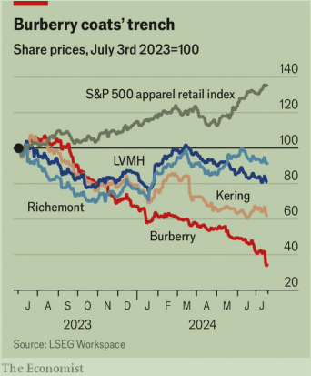

# Can Burberry put its chequered past behind it?

Burberry能忘掉它曲折的过去吗？

chequered：英 [ˈtʃɛkəd]  盛衰无常的；多波折的

The British label’s new boss has his work cut out

这家英国品牌公司的新老板面临艰巨的任务

>在这句话中：
>
>1. **Chequered**：此处的 “chequered” 有双关的意思。首先，它指的是 Burberry 标志性的格子图案（chequered pattern），这是一种象征和品牌识别。但在这个语境中， “chequered” 还暗指品牌的 “多变的” 或 “有好有坏的” 历史或过去，这个词在英文中常用来描述经历过起伏、波折的历史或过往。
>
>2. **Cut out**：此短语 “have his work cut out” 意思是某人有很多艰难的工作要做或面临许多挑战。这是一种比喻说法，表示新任老板将面临重大任务和挑战，需要努力去克服这些困难。
>
>所以，这句话的大意是：Burberry 这家英国品牌的新任老板将面临重重挑战，看看他能否带领品牌走出多变且有波折的过去。

原文：

PITY EUROPE’S luxury giants. On July 15th Swatch Group, a Swiss

watchmaker, said its revenues and operating profit ticked down in the six

months to June, by 14% and 70% year on year, respectively. The next day

Hugo Boss, a German fashion house, cut its earnings forecast for 2024 and

Richemont, another Swiss group, reported that its quarterly sales in China,

which accounts for a quarter of the $1.6trn annual global luxury market,

plunged by 27% compared with last year. All eyes are now on the world’s

luxury colossus, LVMH, which will report results on July 23rd.

可怜欧洲的奢侈品巨头。7月15日，瑞士钟表制造商斯沃琪集团表示，截至6月的6个月中，其收入和营业利润同比分别下降了14%和70%。第二天，德国时装公司Hugo Boss下调了2024年的盈利预测，另一家瑞士集团Richemont报告称，其在中国的季度销售额与去年相比下降了27%，中国占全球每年1.6万亿美元奢侈品市场的四分之一。所有的目光都集中在世界奢侈品巨头LVMH身上，该公司将于7月23日公布业绩。

学习：

colossus：美 [kəˈlɑsəs] 巨人；巨像；极具影响力的人；

luxury colossus：奢侈品巨头

luxury giants：奢侈品巨头

原文：

All luxury stocks are suffering (see chart). But so-called aspirational brands

have been hit the hardest. Burberry is a textbook example. On July 15th the

168-year-old British maker of chequered trench coats reported that sales

slumped by 21% in the second quarter, year on year, cut its dividend and

sacked its chief executive

所有奢侈品股票都在遭受损失(见图表)。但所谓的高端品牌受到的冲击最大。博柏利是一个教科书式的例子。7月15日，这家有着168年历史的英国方格风衣制造商报告称，第二季度销售额同比下降21%，削减了股息并解雇了首席执行官

学习：

aspirational：（生活形态等）梦寐以求的；有雄心壮志的；成功指南；

>“Aspirational brands” 是指那些消费者希望拥有，但由于价格高昂或其他原因，不一定能够轻易买得起的品牌。这些品牌通常具有较高的社会地位和声望，消费者购买这些品牌的产品不仅是为了实际用途，更是为了满足自己的身份认同和社会地位的象征需求。
>
>在这段话中，Burberry 被视为一个经典的 aspirational brand，代表了许多人追求的时尚和高端生活方式。

textbook example：教科书式的例子

trench coat：风衣

sack：解雇

原文：

Burberry’s woes were years in the making. Faced with a choice of becoming

Britain’s answer to Coach, a lower-luxury fashion firm from America, or

moving upmarket, it chose the latter. It invested in flagship stores at swish

addresses in London (New Bond Street) and Manhattan (Fifth Avenue). In

2022 it hired Daniel Lee, a British designer, to play up the brand’s 

Britishness. Mr Lee produced sophisticated collections but little buzz.

Burberry also raised prices in its high-street shops while simultaneously

selling about $1.3bn-worth of products at a discount in outlets, which

tarnished the brand’s image.

博柏利的灾难酝酿了多年。面对成为英国版的蔻驰(一家来自美国的低端时尚公司)或者走向高端市场的选择，它选择了后者。它投资了位于伦敦(新邦德街)和曼哈顿(第五大道)的旗舰店。2022年，该公司聘请了英国设计师李仁港，强调该品牌的英国特色。李先生推出了精致的系列，但没有什么亮点。博柏利还提高了其高街商店的价格，同时在商店打折销售价值约13亿美元的产品，这损害了该品牌的形象。

学习：

woe：困境

fashion firm：时尚公司

upmarket：美 [ˌʌpˈmɑːrkɪt] 高档的；高级的；（服务或商品）适合高消费阶层的；

play up：渲染；夸大；强调；

little buzz：没什么亮点

high-street：（城镇的）主要街道          

tarnished：美 [ˈtɑ:nɪʃt] 沾污；（tarnish的过去式和过去分词）

原文：

That has made it particularly vulnerable in China, which remains the

company’s biggest market and where it is now slashing prices. In the latest

quarter Burberry’s sales in mainland China also fell by 21%, year on year.

Amid the Communist Party’s crackdown on opulence, Chinese consumers

are becoming more cautious about displaying bling in public. Federica

Levato of Bain, a consultancy, remarks that China is in the grip of “luxury

shame”.

这使得它在中国尤其脆弱，中国仍然是该公司最大的市场，它现在正在大幅降价。最近一个季度，博柏利在中国大陆的销售额同比下降了21%。在共产党打击奢侈消费之际，中国消费者对在公共场合展示奢侈品变得更加谨慎。咨询公司Bain的Federica Levato评论说，中国正处于“奢侈的耻辱”之中。

学习：

slash prices：大幅降价

crackdown：镇压；打击；严厉制裁

opulence： 美 [ˈɑpjələns] 富裕；富饶；丰富

bling：亮闪闪；奢华高档的首饰或服装

in the grip of：受制于；受…的控制；处于…的影响之下

原文：

Perhaps as a result, Chinese luxury buyers are becoming more discerning,

preferring fewer, more chic items. Hermès, an uber-elegant maker of scarves

and handbags that never sells at discounted prices, reported that its sales in

China jumped by 17% in the first quarter, year on year, to €3.8bn ($4.2bn).

Brunello Cucinelli, a similarly exclusive Italian brand, reported a 14%

increase in Asian sales in the first half of 2024. Loro Piana and Zegna, two

other posh Italian labels, are also doing fine.

或许正因如此，中国奢侈品买家变得越来越挑剔，更喜欢数量更少、更别致的商品。超级优雅的围巾和手袋制造商爱马仕(Hermès)报告称，其第一季度在中国的销售额同比增长17%，达到38亿€元(42亿美元)。同样独家的意大利品牌Brunello Cucinelli报告称，2024年上半年亚洲销量增长14%。另外两家时髦的意大利品牌Loro Piana和Zegna也做得不错。

学习：

discerning：美 [dɪˈsɜːrnɪŋ] 有鉴赏力的；挑剔的

uber-elegant：超级优雅的

posh：美 [pɑːʃ] 优雅豪华的；高档的；时髦的；

原文：

Bain predicts that by 2030 the Chinese will again be the world’s keenest

buyers of luxury, accounting for 40% of sales. But if their tastes continue to

evolve towards the poshest of the posh, Burberry may not be a beneficiary of

that reversal. Its incoming boss, Joshua Schulman, is expected to give up on

his predecessor’s high-end ambitions and settle for the second tier, alongside

his former employers, Coach and Michael Kors, and labels like Hugo Boss.

Rational, perhaps. But not aspirational. ■

贝恩预计，到2030年，中国人将再次成为世界上最热衷的奢侈品买家，占销售额的40%。但是如果他们的品味继续向上流社会发展，博柏利可能不会成为这种逆转的受益者。其新任老板约书亚·舒尔曼(Joshua Schulman)预计将放弃其前任的高端雄心，与他的前雇主蔻驰和迈克高仕以及雨果博斯(Hugo Boss)等品牌一道，满足于第二梯队。或许是理性的。但没有抱负。■

## 后记

2024年7月22日13点19分于上海。

