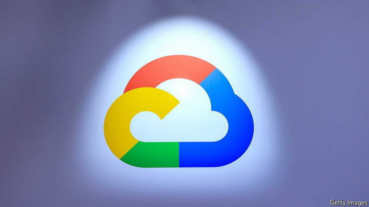
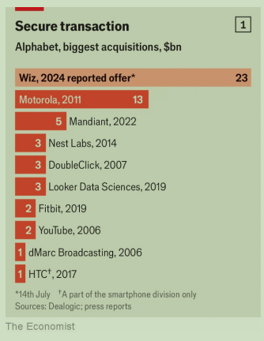
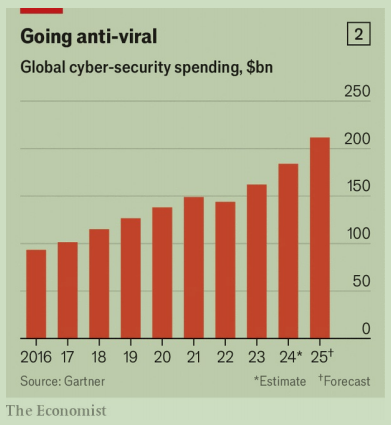

# Google wants a piece of Microsoft’s cyber-security business

A $23bn acquisition of Wiz, an Israeli startup, is the search giant’s biggest ever

acquisition：美 [ˌækwɪˈzɪʃn] 收购；购置的产业

Israeli：美 [ɪzˈreɪli]   以色列的；以色列人的；

原文：

IN LATE 2022 Wiz, a cyber-security startup, boasted that it was “the fastest

growing software company ever”. A stretch, maybe, but not a big one. At

that point, 18 months after it was founded, annualised sales hit \$100m. By

2023 they were \$350m. In May Wiz raised \$1bn at a $12bn valuation. On

July 14th it emerged that Alphabet, Google’s parent company, was in talks to

acquire Wiz for \$23bn. It would be the biggest purchase of a cyber-security

firm in history and Alphabet’s biggest takeover ever (see chart 1).

2022年末，网络安全初创公司Wiz自诩为“有史以来发展最快的软件公司”。一段时间，也许，但不是很长。当时，在公司成立18个月后，年销售额达到了1亿美元。到2023年，它们达到3.5亿美元。今年5月，Wiz以120亿美元的估值融资10亿美元。7月14日，有消息称谷歌的母公司Alphabet正在谈判以230亿美元收购Wiz。这将是历史上最大的网络安全公司收购案，也是Alphabet有史以来最大的收购案(见图表1)。

学习：

boasted：以有…而自豪；夸口说；（boast的过去式和过去分词）

stretch：一片；一段时间；

at that point：在那时；就在那时；在那一刻；

annualised：年度的

hit $100m：达到1亿美元

emerged：浮现；摆脱；暴露；（emerge的过去式和过去分词）

it emerged that：有消息称; 被批露出来

>这里的 "emerged" 意思是“出现，显现，或被披露出来”。
>
>例子：After a long investigation, it emerged that the company had been hiding its financial losses for years.
>（经过长时间的调查，结果发现该公司多年来一直在隐藏财务损失。）
>
>在上述句子中，“it emerged that Alphabet, Google’s parent company, was in talks to acquire Wiz for \$23bn” 表示“披露出 Alphabet（谷歌的母公司）正在洽谈以230亿美元收购 Wiz”。

原文：

Wiz is the brainchild of four former Israeli soldiers. In 2015 they sold their

three-year-old first startup, Addollum, to Microsoft. The quartet then worked

for Microsoft Azure, the software giant’s cloud service, before launching

Wiz in 2020. Its technology helps clients identify security risks in the cloud,

such as which employees are using which apps or who has a weak password.

By stitching together lots of data Wiz allows customers to spot

vulnerabilities that hackers could exploit.

Wiz是四名前以色列士兵的创意。2015年，他们将成立三年的第一家初创公司Addollum出售给了微软。在2020年推出Wiz之前，这四人曾在软件巨头的云服务微软Azure工作。它的技术可以帮助客户识别云中的安全风险，例如哪些员工正在使用哪些应用程序，或者谁的密码较弱。通过将大量数据拼接在一起，Wiz允许客户发现黑客可能利用的漏洞。

学习：

brainchild：创意；构思；发明；

quartet：美 [kwɔrˈtɛt] 四重奏；四重唱；四人组；

stitching：缝纫；缝合（伤口）；缝补；绣制；（stitch的现在分词）

原文：

The firm sits at the intersection of two trends reshaping the cyber-security

business. The first is computing’s inexorable move to the cloud. This year

businesses will spend around $300bn worldwide on cloud services. This

creates new vulnerabilities—and new opportunities for startups like Wiz. In

2023 global sales of cloud-security products grew by 32%, compared with

13% for computer-security overall, according to Gartner, a research firm.

And whereas many cyber-security incumbents, such as Palo Alto Networks

and Fortinet, mostly sell firewalls and other safeguards for older IT systems,

Wiz has from the start specialised in protecting the cloud.

该公司位于重塑网络安全业务的两大趋势的交汇点。首先是计算不可阻挡地向云转移。今年，全球企业将在云服务上花费约3000亿美元。这就产生了新的脆弱性，也为Wiz这样的初创公司带来了新的机遇。根据研究公司Gartner的数据，2023年云安全产品的全球销售额增长了32%,相比之下，计算机安全的整体销售额增长了13%。尽管许多网络安全公司，如Palo Alto Networks和Fortinet，主要销售旧IT系统的防火墙和其他安全措施，但Wiz从一开始就专注于保护云。

学习：

inexorable：美 [ɪnˈeksərəbl] 不可阻挡的；无法改变的；

incumbent：现任者

原文：

The second change is in how companies buy security software. They used to

purchase lots of individual tools, layered one on top of another. As a result,

big businesses often have between 50 and 70 separate security applications,

notes Charlie Winckless of Gartner. Duplication is rife, costs high and IT 

managers unable to tell which tools work and which do not. In February

Nikesh Arora, boss of Palo Alto Networks, admitted that “customers are

facing spending fatigue.”

第二个变化是公司购买安全软件的方式。他们过去常常购买许多单独的工具，一层一层地放在另一层之上。Gartner的Charlie Winckless指出，结果是大企业通常有50到70个独立的安全应用程序。重复现象很普遍，成本很高，IT经理无法分辨哪些工具有效，哪些工具无效。二月份，帕洛阿尔托网络公司的老板尼科什·阿罗拉承认“顾客正面临消费疲劳”

学习：

duplication：复制；重复；复制品

rife：普遍的；常见的；

fatigue：美 [fəˈtiːɡ] 劳累；极度疲劳；疲乏；疲惫； **注意发音**

原文：

Nowadays IT departments favour one-stop shops. These are easier to manage

and the tools talk to each other. Cyber-security providers are thus busily

adding services, often via acquisitions. JPMorgan Chase, a bank, notes that

over 50 security firms have been acquired this year, more than in all of 2022

or 2023. Wiz itself has bought two in the past year, and raised capital in May

partly to buy more. Being swallowed by Alphabet gives Wiz a giant

platform atop the world’s third-biggest cloud.

如今，IT部门青睐一站式商店。这些工具更易于管理，并且可以互相交流。因此，网络安全提供商正忙于增加服务，通常是通过收购。摩根大通银行指出，今年有超过50家安全公司被收购，比2022年或2023年的总和还要多。Wiz自己在过去的一年里已经收购了两个，并在5月份筹集资金，部分是为了购买更多。被Alphabet吞并给了Wiz一个位于世界第三大云之上的巨大平台。

学习：

one-stop：一站式的；提供全面服务的

busily：美 [ˈbɪzlɪ] 忙碌地；起劲地

原文：

For Alphabet, swallowing Wiz bolsters its own cyber-security business. This

is thought to be modest, especially compared with that of Microsoft, which

last year said its cyber-offering surpassed $20bn in annual revenue, a tenth

of its total sales. To catch up, in 2022 Alphabet bought Siemplify, another

Israeli startup, for \$500m and Mandiant, an American one, for \$5bn. Wiz

would enable Google’s clients to assess threats in other clouds they use, a

capability that Microsoft has offered since 2022. It is an important one,

given that four-fifths of cloud users have data spread across several clouds.

对于Alphabet来说，吞并Wiz有助于其自身的网络安全业务。这被认为是适度的，特别是与微软相比，微软去年表示其网络销售年收入超过200亿美元，占其总销售额的十分之一。为了迎头赶上，2022年Alphabet以5亿美元收购了另一家以色列初创公司Siemplify，并以50亿美元收购了美国公司Mandiant。Wiz将使谷歌的客户能够评估他们使用的其他云中的威胁，这是微软自2022年以来一直提供的功能。这是一个重要的问题，因为五分之四的云用户将数据分散在几个云中。

学习：

bolsters：美 [ˈbəʊlstəz] 支持；支撑；（bolster的第三人称单数）

原文：

In recent years trustbusters have looked askance at big tech’s attempts to buy

companies even outside their core business. Alphabet will be hoping that

they will conclude that by taking the fight to Microsoft, the Wiz deal will

make the cyber-security business more competitive, not less. ■

近年来，反垄断者对大型科技公司试图收购甚至是核心业务之外的公司持怀疑态度。Alphabet将希望他们会得出结论，通过与微软的斗争，Wiz交易将使网络安全业务更具竞争力，而不是更低。■

学习：

trustbusters：反垄断者

askance：美 [əˈskæns] 态度怀疑（或不赞成）地；表情怀疑（或不赞成）地

## 后记

2024年7月24日13点37分于上海。

