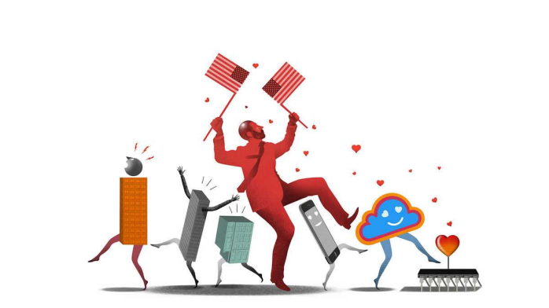

# Tech bros love J.D. Vance. Many CEOs are scared stiff

Donald Trump’s running-mate has a deep-rooted resentment of big business

resentment：美 [rɪˈzentmənt] 怨恨；愤恨；不满；

deep-rooted：根深蒂固的；深切的          

stiff: 非常；极度地；极其 （加强语气）

scared stiff：非常害怕

>In the phrase "Many CEOs are scared stiff," the word "stiff" is used as an intensifier to describe the extent of the fear. It means that the CEOs are extremely or very frightened. Here, "stiff" emphasizes the severity of their fear.
>
>### Examples:
>
>1. **Literal Use:** "He was scared stiff by the horror movie and couldn't move for a few minutes after it ended."
>   - In this case, "stiff" suggests that the person was so frightened they were unable to move.
>
>2. **Figurative Use:** "The new regulations have the industry scared stiff, fearing it will hurt their profits."
>   - Here, "scared stiff" means the industry is extremely worried about the potential negative impact of the new regulations.
>
>So, in the context of the original sentence, "Many CEOs are scared stiff" means that many CEOs are very afraid of J.D. Vance's deep-rooted resentment of big business.

原文：

J.D. Vance’s life is full of twists and turns. His memoir from 2016, “Hillbilly

Elegy”, chronicles how a boy from a drug-afflicted home in the Ohio

rustbelt, who almost flunked high school, made it to Yale Law School. As a

bestselling author, celebrated by liberals for his unflinching portrayal of left

behind people and places, he turned staunchly anti-establishment, attacking

what he saw as business elites benefiting from moving factories abroad and

paying low wages at home. As a venture capitalist, he was mentored in

Silicon Valley by Peter Thiel, a conservative contrarian who then backed

him for the Senate. Now he crusades against the very tech giants that, like

Meta, owner of Facebook, made Mr Thiel billions as an early investor. He

was once a “never-Trumper”. Now he is Donald Trump’s vice-presidential

running-mate.

J.D .万斯的一生充满了曲折。他2016年的回忆录《乡下人的悲歌》记录了一个来自俄亥俄州铁锈地带饱受毒品折磨的家庭的男孩如何在高中差点不及格，最终进入耶鲁大学法学院。作为一名畅销书作家，他因对落后的人和地方的坚定描绘而受到自由主义者的称赞，他坚定地反建制，攻击他所认为的受益于将工厂转移到国外和在国内支付低工资的商业精英。作为一名风险投资家，他在硅谷得到了保守的逆向投资者彼得·泰尔的指导，并支持他竞选参议员。现在，他开始讨伐那些科技巨头，比如脸书的所有者Meta，这些巨头为作为早期投资者的泰尔赚了数十亿美元。他曾经是一个“永远不会支持Trump的人”。现在他是唐纳德·特朗普的副总统竞选伙伴。

学习：

twists and turns：迂回曲折；变化多端；波折；

memoir：美 [ˈmemwɑːr]回忆录；自传；传记； **注意发音**

hillbilly：美 [ˈhɪlˌbɪli] 乡下人；山区居民；

elegy：悲歌；哀歌；挽诗；

chronicles：美 [ˈkrɑːnɪklz] 翔实记载；记述事件；（chronicle的第三人称单数）

rustbelt：铁锈地带

flunked：使…不及格；（使）失败；（flunk的过去式）

who almost flunked high school：在高中差点不及格

unflinching: 美 [ˌənˈflɪn(t)ʃɪŋ] 不畏缩的；不退缩的；坚定的

staunchly:  美 [stɔntʃli] 坚定地; 忠实地

anti-establishment: 反现存社会体制的；反现有权力结构的

mentored: 指导；（mentor的过去式和过去分词）

contrarian: 美 [kənˈtrɛ(ə)riən] 逆向投资者；逆向思维者

crusades: 美 [kru'seɪds] 改革运动；十字军东征；（crusade的复数）

crusade against: 讨伐

原文：

Among entrepreneurs in Silicon Valley and elsewhere, Mr Vance’s

nomination has led tech bros who once kept their arch-conservative clothes

in the closet to come out in full MAGA regalia. Elon Musk, who according to the

*Wall Street Journal* is planning to throw $45m a month behind Mr Trump’s

presidential run, said the Trump-Vance ticket “resounds with victory”.

Delian Asparouhov of the Founders Fund, a venture-capital (VC) firm co

founded by Mr Thiel, jumped the gun with boyish insouciance, tweeting:

“We have a former tech VC in the White House. Greatest country on earth

baby.” Marc Andreessen and Ben Horowitz, the eponymous co-founders of a

VC Goliath, released a video the day after Mr Vance’s nomination backing Mr

Trump (albeit with pretend sheepishness: “Sorry Mom,” Mr Horowitz

bleated).

在硅谷和其他地方的企业家中，万斯的提名让那些曾经把自己最保守的衣服藏在衣柜里的科技公司老板们开始穿上全套MAGA regalia。据《华尔街日报》报道，埃隆·马斯克(Elon Musk)计划每月投入4500万美元支持特朗普的总统竞选，他说特朗普-万斯的竞选“充满了胜利”。Thiel先生共同创立的风险投资公司Founders Fund的Delian Asparouhov带着孩子气的漫不经心过早地发推特说:“我们在白宫有一个前技术风险投资人。世界上最伟大的国家，宝贝。”马克·安德森和本·霍洛维茨(Ben Horowitz)是一家风投巨头的联合创始人，他们在万斯获得提名的第二天发布了一段视频，支持特朗普(尽管假装害羞地说:“对不起，妈妈，”霍洛维茨低声说道)。

学习：

arch-conservative：极端保守派      

regalia：美 [rəˈɡeɪljə] 礼服；徽章；（官方或王位）标志

resound：回响，回荡

venture-capital (VC)： 风险投资，风投

boyish：孩子气的；顽皮可爱的

insouciance：美 [ɪnˈsusiəns] 漫不经心；漠不关心

eponymous： 美 [əˈpɑnəməs] 以…的名字命名的

pretend：假装的；仿制的；

sheepishness ：害羞；羞怯

bleat：抱怨；

**Arch-conservative:** 极端保守派，指在政治观点上非常保守的人。“Arch”用于强调保守程度，表示该人持有非常强烈、传统的保守信仰。

> "Arch-conservative" refers to someone who is extremely conservative in their political views. The term "arch" is used to emphasize the degree of conservatism, indicating that the person holds very strong, traditional conservative beliefs.

jump the gun: 过早或在适当时间之前开始某事

Jumped the Gun with Boyish Insouciance

**Jumped the gun with boyish insouciance:** 以男孩般的漫不经心态度抢先一步，意思是Delian Asparouhov过早或仓促地行动，表现出一种无忧无虑、年轻的漠不关心态度。“Jumped the gun”是一个成语，意思是过早或在适当时间之前开始某事。“Boyish insouciance”指一种典型于年轻男孩的随意、不在乎的态度。

> "Jumped the gun with boyish insouciance" means that Delian Asparouhov acted prematurely or hastily, showing a carefree and youthful disregard for the consequences. "Jumped the gun" is an idiom that means to start something too soon or before the proper time. "Boyish insouciance" refers to a casual, nonchalant, and carefree attitude typical of a young boy.

原文：

There is naked self-interest in these declarations. Their justification, they

say, is that the startup industry is being burned by the anti-tech zeal of

President Joe Biden. In Mr Vance, they no doubt see a kindred spirit whom

they can influence. Yet in corporate America at large, the recognition that

Mr Trump looks increasingly likely to win the election also comes with deep

misgivings about Mr Vance as his consigliere. Both men are driven by

grievances. Both are highly unpredictable. Yet for all the Ohioan’s twists and

turns, his antipathy towards big business and his desire to break up big tech

appear to run deep. That may make him harder to deal with than the

transactional Mr Trump.

这些声明中有赤裸裸的利己主义。他们说，他们的理由是，创业行业正在被乔·拜登总统的反科技热情所吞噬。毫无疑问，他们在万斯先生身上看到了他们可以影响的志趣相投的人。然而，在整个美国企业界，人们在认识到特朗普似乎越来越有可能赢得大选的同时，也对万斯担任他的顾问深感疑虑。两人都是被不满所驱使。两者都高度不可预测。然而，尽管俄亥俄州人经历了种种曲折，但他对大企业的反感以及拆分大型科技公司的愿望似乎根深蒂固。这可能会让他比事务型的特朗普更难打交道。

学习：

self-interesting：自身利益；自私自利 ；利己主义

justification：正当的理由；

zeal：美 [ziːl] 热情；激情；积极性；狂热

kindred：美 [ˈkɪndrəd] 同血系；亲族团体；血缘关系；有血缘关系的；有亲属关系的

corporate America ：美国企业界

misgivings：担忧；疑虑；不安；（misgiving的复数）

consigliere：美 [ˌkɔnsiˈljɛreɪ] 黑手党顾问

grievances：美 [ˈgrivənsəz] 不满；抱怨；（grievance的复数）

antipathy：美 [ænˈtɪpəθi] 根深蒂固的反感；厌恶 **注意发音**

**Kindred spirit:** 志同道合的人，指在兴趣、信仰或态度上有相似之处的人。在这个语境中，指科技企业家认为Mr. Vance与他们有相似的观点和价值观，尤其是在反对拜登总统的反科技立场上。

> A "kindred spirit" refers to someone who shares similar interests, beliefs, or attitudes. In this context, it means that the tech entrepreneurs see Mr. Vance as someone who shares their views and values, particularly in opposition to President Biden's perceived anti-tech stance.

**Corporate America:** 美国企业界，指美国的大型商业和工业企业，涵盖主要公司、高管和整个美国的企业部门。

> "Corporate America" refers to the large-scale business and industrial enterprises in the United States. It encompasses major corporations, their executives, and the overall corporate sector of the U.S. economy.

**Transactional:** 交易型的，指一种以交换或交易为中心的行为或方法，通常以实际利益和特定的收益为特征。在这个语境中，意味着Mr. Trump被视为一个根据即时交易和交换做出决定的人，而不是根据意识形态一致性或长期原则。

> "Transactional" refers to a type of behavior or approach that is focused on exchanges or deals, often characterized by practicality and the pursuit of specific benefits or gains. In this context, it means that Mr. Trump is seen as someone who makes decisions based on immediate exchanges and deals, rather than ideological consistency or long-term principles.

原文：

It is strange to see parts of Silicon Valley shifting to the MAGA camp. In 2016

Mr Thiel was almost unique among the tech elite in throwing his weight

behind Mr Trump, and was pilloried as a result (this time he says he may

vote for Mr Trump but will not give money to his campaign). Yet the

Andreessen-Horowitz duo, who used to vote Democrat, offer a full-throated

argument for being pushed into the arms of Mr Biden’s opponents. They

frame it as an existential battle of “little tech” against big tech

看到硅谷的部分地区转向MAGA阵营是很奇怪的。2016年，泰尔在支持特朗普方面几乎是科技精英中独一无二的，因此遭到了嘲笑(这一次他表示，他可能会投票给特朗普，但不会给他的竞选活动捐款)。然而，曾经投票给民主党的安德森-霍洛维茨二人组为被推到拜登对手的怀抱提供了一个充分的理由。他们把它框定为“小技术”对大技术的生存之战

学习：

elite：美 [eɪˈliːt] 精英；精锐；出类拔萃的人（或物） **注意发音**，经常读错

Throwing his weight behind: 全力支持

pillory:将（人）夹于颈手枷中；攻击；嘲笑

a full-throated: 高声喊出；全力支持；大嗓门          

existential battle: 生存之战

原文：

Their first gripe is over cryptocurrencies and the blockchain. These, they

say, are vital for encouraging innovation beyond the confines of big tech. Yet

crypto startups are hobbled by what the venture capitalists argue is excessive

regulation, particularly from the Securities and Exchange Commission. This

is a view shared by Mr Vance. In what sounds like an echo of the “little

tech” manifesto, the Republican platform promises to end Democrats’

“unlawful and unAmerican Crypto crackdown”.

他们首先抱怨的是加密货币和区块链。他们说，这些对于鼓励创新超越大科技的界限至关重要。然而，风险资本家认为过度的监管，特别是来自证券交易委员会的监管，阻碍了加密初创公司的发展。万斯先生也同意这一观点。在听起来像是“小科技”宣言的回声中，共和党平台承诺结束民主党人的“非法和非美国的关于加密领域的镇压”。

学习：

gripe：美 [ɡraɪp] 抱怨；发牢骚

confines：范围；疆界；界线；界限；（confine的复数）

beyond the confines：超越界限

hobbled：蹒跚；跛行；（hobble的过去式和过去分词）这里是被阻碍的意思

manifesto： 美 [ˌmænɪˈfestoʊ] 宣言；纲领；

原文：

Next come concerns about Mr Biden’s efforts to regulate artificial

intelligence (AI). Some in Silicon Valley take particular issue with his

executive order last year requiring builders of powerful AI models to report to

the government for safety reasons. They say the order provides an unfair

advantage to tech giants, which have vastly more resources to deal with red

tape. Mr Vance agrees. He recently told a congressional hearing that though

he was worried about the threat of AI to child safety, he wanted to prevent

“pre-emptive overregulation” from entrenching big tech.

接下来是对拜登政府监管人工智能（AI）努力的担忧。硅谷的一些人尤其反对他去年发布的行政命令，该命令要求强大AI模型的开发者出于安全原因向政府报告。他们认为这项命令给了科技巨头不公平的优势，因为这些巨头拥有更多的资源来应对繁琐的手续。万斯也同意这一点。他最近在国会听证会上表示，尽管他担心AI对儿童安全的威胁，但他希望防止“预防性过度监管”来巩固大科技公司的地位。

学习：

red tape: 繁文缛节

congressional hearing ：国会听证会

pre-emptive：先发制人的；预防性的；

entrenching：确立；以壕沟防护；用壕沟围住；（entrench的现在分词形式）巩固地位

**Take particular issue with:** 表示特别反对或对某事有异议。例如，某人对新的公司政策表示特别反对，可以说他对这项政策特别有异议（takes particular issue with the policy）。

entrenching big tech：

>**Entrenching big tech** 意思是使大型科技公司巩固其地位，使其在市场中更加难以被挑战或取代。这个词通常用来形容某些政策或措施进一步加强了大公司的优势，使其更难以被中小型企业竞争。
>
>**举个例子：**
>
>如果政府颁布了一项新法规，要求所有的AI公司都必须经过严格的安全检查，而只有像谷歌和亚马逊这样的大公司才有资源和能力来符合这些要求，那么这项法规就有可能进一步巩固这些大公司的市场地位，使中小型企业更难以竞争。这种情况下，可以说这项法规**entrenches big tech**。
>
>**例句：**
>
>"The new data protection laws may end up entrenching big tech companies, as smaller firms struggle to comply with the costly regulations."
>
>（新的数据保护法可能最终会巩固大型科技公司的地位，因为较小的公司难以遵守这些昂贵的规定。）

原文：

The third, and most immediate, concern is Mr Biden’s latest budget

proposal, which includes a 25% tax on unrealised capital gains for those

with over $100m of wealth, and which Messrs Andreessen and Horowitz say

threatens to kill the VC industry. On top of hurting innovation, it makes the

distinction between the two candidates’ approach to business taxes all the

starker. Mr Trump wants to cut these, not raise them.

第三，也是最直接的担忧是拜登先生的最新预算提案，其中包括对拥有超过1亿美元财富的人征收25%的未实现资本利得税，安德森先生和霍洛维茨先生认为这可能会扼杀风险投资行业。除了损害创新之外，这也使得两位候选人在商业税上的做法更加明显。特朗普希望削减这些支出，而不是提高它们。

学习：

hurt innovation：损害创新

stark：明显的

原文：

Beyond Silicon Valley, concerns about Mr Biden run deep, too. Many 

CEOs would love him to step aside in favour of a younger candidate. Yet a Trump

Vance ticket is more of a worry. Although bosses may like the sound of tax

cuts and deregulation, they fear further descent into protectionism and

political chaos.

除了硅谷，对拜登的担忧也很深。许多首席执行官希望他让位给更年轻的候选人。然而，特朗普-万斯的竞选更令人担忧。尽管老板们可能喜欢减税和放松管制的声音，但他们担心进一步陷入保护主义和政治混乱。

学习：

step aside：下台；让位；靠边

原文：

There are Mr Trump’s tariff threats, echoed by Mr Vance, that risk inflaming

trade wars, and the spectre of mass deportation of immigrants, which may

exacerbate labour shortages. There is economic populism: “We’re done…

catering to Wall Street,” Mr Vance thundered in a deeply isolationist speech

on July 17th at the Republican National Convention. There is geopolitical

uncertainty, as illustrated in a recent interview in which Mr Trump, in a

reminder of how loose-lipped he can be, reaffirmed his misgivings about

arming Taiwan against China. As for the Biden administration’s obsession

with antitrust, Mr Vance promises more of the same. He is a fan of Lina

Khan, who heads the Federal Trade Commission. Like her, he wants to stick

it to giants like Google.

万斯呼应了特朗普的关税威胁，这有可能引发贸易战，还有大规模驱逐移民的威胁，这可能加剧劳动力短缺。7月17日，在共和党全国代表大会上，万斯先生在一次极具民粹主义色彩的演讲中咆哮道:“我们受够了……迎合华尔街。”。地缘政治存在不确定性，最近的一次采访就说明了这一点。特朗普在采访中重申了他对arming Taiwan against China的担忧，这提醒了人们他可以有多么信口开河。至于拜登政府对反垄断的痴迷，万斯先生承诺更多同样的事情。他是美国联邦贸易委员会领导人莉娜·汗的粉丝。和她一样，他想用到谷歌这样的巨头身上。

学习：

inflame：激怒

inflame trade wars：引发贸易战

spectre：英 [ˈspɛktə] 幽灵；鬼魂；幻影；幻觉；威胁；**注意发音**

the spectre of mass deportation of immigrants：驱逐移民的威胁

cater to：迎合

loose-lipped：信口开河的      

## **Oh for boredom in the boardroom**

boredom：美 [ˈbɔːrdəm] 无聊；厌倦；乏味；

boardroom：董事会会议室；管理层会议室；（公司的）高层办公室

原文：

Picture this: Mr Trump and Mr Vance in the White House, and Mr Musk, Mr

Thiel and other tech billionaires influencing policy from behind the throne.

No wonder Silicon Valley’s libertarians are salivating. Put yourself in a

boardroom, though, where instead of discussing business, CEOs will be bogged

down by trade wars, geopolitical rifts or social divisions, and you are likely

to have your heart in your mouth. Things are fractious enough under Mr

Biden. They could be worse under Messrs Trump and Vance. ■

想象一下:特朗普和万斯在白宫，马斯克、泰尔和其他科技亿万富翁在幕后影响政策。难怪硅谷的自由主义者垂涎三尺。然而，如果你置身于一个会议室，首席执行官们不会讨论业务，而是被贸易战、地缘政治分歧或社会分裂所困扰，你很可能会提心吊胆。在拜登先生的领导下，事情已经够棘手的了。在特朗普和万斯的领导下，情况可能会更糟。■

学习：

salivate：（尤指看到或嗅到食物时）垂涎；流口水；渴望

bogged：使陷入泥沼；（bog的过去式）

bogged down：陷入泥沼；陷入困境；

rifts：美 [rɪfts] 裂隙；裂缝；（rift的复数）

have your heart in your mouth：心提到嗓子眼了，提心吊胆

fractious： 美 [ˈfrækʃəs] 难控制的；难对付的

Messrs：美 [ˈmesərz] 各位先生（同Messieurs）

## 后记

2024年7月25日18点50分于上海。

