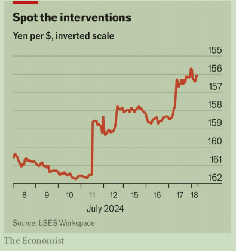

# Japan’s strength produces a weak yen

Currency meddling will prove futile

货币干预将被证明是徒劳的

meddling：干涉；摸弄；（meddle的现在分词形式）

futile： 美 [ˈfjuːtl] 无效的；徒劳的；无用的；

原文：

It does not require a financial detective to work out what is going on. Three

sudden surges in the value of the yen, on July 11th, 12th and 17th, have

raised suspicions that the Bank of Japan (BoJ) is again intervening in currency

markets (see chart). The bursts have left the currency, at ¥156 to the dollar,

up by 4% against the greenback and marginally above the 37-year lows it

reached earlier this month.

不需要金融侦探就能搞清楚发生了什么。日元价值在7月11日、12日和17日的三次突然飙升，引起了人们对日本银行再次干预货币市场的怀疑(见图表)。这些爆发使得日元兑美元汇率上升了4%，略高于本月早些时候达到的37年低点，目前为1美元兑156元日元。

学习：

intervening：美 [ˌɪntərˈvinɪŋ] 阻碍；出面；插嘴；干涉；（intervene的现在分词）

greenback：美钞（尤指19世纪的美国纸币）

原文：

Preliminary data suggest that the central bank sold over $35bn of foreign

exchange reserves on July 11th and 12th (the scale of the most recent

apparent intervention remains unclear). These sales would add to over

$120bn of intervention in the past two years, more than half of which

occurred between late April and late May. Such moves burn the fingers of

currency traders. They are unlikely to have a long-term impact on the

exchange rate, however, which will disappoint officials and delight the

tourists now flooding Japan.

初步数据显示，日本央行在7月11日和12日出售了超过350亿美元的外汇储备(最近一次明显干预的规模尚不清楚)。这些出售将增加过去两年逾1200亿美元的干预，其中逾一半发生在4月底至5月底。这种举动会让外汇交易员遭受损失。然而，它们不太可能对汇率产生长期影响，这会让官员们失望，让现在涌入日本的游客高兴。

学习：

burn the fingers of: 让人遭到损失

>"Burn the fingers of" 是一个比喻，意思是让某人遭受损失或失败，通常是因为他们采取了冒险或不明智的行动。
>
>例句：
>
>1. **Example in trading**: Many currency traders who bet against the central bank's intervention ended up burning their fingers as the exchange rate unexpectedly stabilized.
>   - 许多押注央行干预失败的货币交易员最终遭受了损失，因为汇率出乎意料地稳定了下来。
>
>2. **Example in business**: The new startup burned its fingers by investing heavily in a technology that was quickly made obsolete by a competitor's innovation.
>   - 这家新创公司在一项很快被竞争对手的创新淘汰的技术上进行了大量投资，结果遭受了损失。

原文：

The yen’s astonishing weakness is most commonly explained by the

divergence between American and Japanese monetary policy. Although the

BoJ has lifted interest rates a fraction, the rise has hardly matched the Federal

Reserve’s, meaning that investors have preferred dollars over the past few

years. Yet things have recently moved in a different direction: the gap

between America’s and Japan’s five-year government bond yields has

narrowed by more than a percentage point since October. Oddly, over the

same period, the yen has fallen by another 4% against the dollar.

日元惊人的疲软最常见的解释是美国和日本货币政策的差异。尽管日本央行将利率提高了一点点，但这一增幅几乎赶不上美联储，这意味着投资者在过去几年中更青睐美元。然而，事情最近朝着不同的方向发展:自10月以来，美国和日本五年期政府债券收益率之间的差距已经缩小了一个多百分点。奇怪的是，在同一时期，日元对美元又下跌了4%。

学习：

divergence：差异；分歧；不同；

fraction：小部分；微量；

原文：

Why is the yen continuing to weaken? Successful corporate-governance

reforms may be in part to blame. As a consequence of changes that began

under Abe Shinzo, whose second spell as prime minister ran from 2012 to

2020, Japanese companies have become increasingly focused on returns on

investments and have shed needless shareholdings in other firms. Indeed, the

country’s stocks have outperformed those in most of the non-American rich

world over the past decade.

为什么日元持续走软？成功的公司治理改革可能是部分原因。Abe Shinzo从2012年到2020年第二次担任首相，他领导下的变革导致日本公司越来越注重投资回报，并减持了其他公司不必要的股份。事实上，在过去的十年里，日本的股票表现超过了大多数非美国的富裕国家。

学习：

spell：（干某事或在某处工作的）一段时间；短暂时期；轮班；

second spell as prime minister：第二次担任首相      

needless：不必要的；可以避免的；无需的

shed：放弃；去除；摆脱；

shed needless shareholdings：减持不必要的股份

原文：

But the focus on returns is also pushing money overseas. In the year to the

end of May, Japanese firms invested $178bn more abroad than foreign firms

invested in the country, up from $72bn in 2010. Although flows of portfolio

investment in and out of Japan—money entering and leaving stocks, bonds

and other securities—are volatile, direct investment is clearly going in one

direction: out of the country

但对回报的关注也在推动资金流向海外。在截至5月底的一年里，日本企业的海外投资比外国企业在日本的投资多1780亿美元，高于2010年的720亿美元。尽管进出日本的证券投资——资金进出股票、债券和其他证券——是不稳定的，但直接投资显然是朝着一个方向:走出日本

学习：

portfolio： 美 [pɔːrtˈfoʊlioʊ] 投资组合；产品组合；

原文：

A recent decision by TSMC to build factories in Kumamoto province, in the

south of Japan, caught international attention, but the Taiwanese

semiconductor giant remains an outlier. Japan’s cultural oddities and

language barriers ultimately deter many overseas companies considering a

move. The total stock of foreign direct investment in the country is worth

just 5% of GDP—a figure that puts it near the very bottom of global rankings,

between Kiribati and Burundi, and far below the global average of 44%. As

such, there is simply not much demand for the yen.

台积电最近决定在日本南部的熊本省建厂，引起了国际社会的关注，但这家半导体巨头仍是一个局外人。日本的文化差异和语言障碍最终阻止了许多海外公司考虑搬迁。该国的外国直接投资总量仅相当于GDP的5%——这一数字使其在全球排名中接近垫底，介于基里巴斯和布隆迪之间，远低于44%的全球平均水平。因此，对日元的需求并不多。

学习：

oddities：美 ['ɑdətis] 古怪；怪人；怪事；奇异；（oddity的复数）

原文：

The greater focus on returns has changed what Japanese companies do with

overseas profits, too. Rather than bringing home cash made abroad, they

now increasingly keep it in higher-yielding foreign bonds and investments.

Japan ran a trade deficit of ¥4trn in the year to May. According to Japan’s

official statistics, this is more than offset by the earnings of the country’s

companies overseas, known as the “primary-income balance”, which

registers a healthy surplus of ¥37trn. But if these earnings are not actually

returning to Japan, and being converted to yen, then they will not support the

exchange rate. That makes Japan’s consistent current-account surplus, which

should in theory prop up the currency, something of a mirage. Indeed, an

estimate by Karakama Daisuke of Mizuho Bank suggests that only a tenth of

the primary surplus is reflected in actual flows of cash returning to the

country.

对回报的更大关注也改变了日本公司对海外利润的处理方式。他们现在越来越多地将海外赚来的钱投资于高收益的外国债券和投资，而不是拿回家。截至今年5月，日本的贸易逆差为4万亿日元。根据日本官方统计，这被该国海外公司的收益所抵消，被称为“初级收入平衡”，记录了37万亿日元的健康盈余。但如果这些收入实际上没有返回日本，并被兑换成日元，那么它们就不会支撑汇率。这使得日本持续的经常账户盈余，理论上应该支撑货币，有点像海市蜃楼。事实上，瑞穗银行的卡拉卡马·景岛乐估计，只有十分之一的初级盈余反映在实际的现金回流中。

学习：

prop up：支撑, 撑起, 扶持

mirage：美 [məˈrɑːʒ] 海市蜃楼；幻景；**注意发音**

原文：

Over the very long run, Japan’s attractiveness as a location for supply-chain

diversification may help to strengthen the yen. More immediately, if the

Federal Reserve begins to cut interest rates faster than markets now expect,

the narrowing of the gap between American and Japanese bond yields will

support the currency.

从长期来看，日本作为供应链多元化地点的吸引力可能有助于日元升值。更直接的是，如果美联储开始比市场现在预期的更快地降息，美国和日本债券收益率之间差距的缩小将支撑日元。

学习：

immediately：立刻；直接地；

more immediately：更直接地

原文：

However, there are also forces pulling in the opposite direction. Given

Japan’s shrinking labour force, it is difficult to imagine that a rush of

companies will follow TSMC’s example. Moreover, as long as Japanese firms

continue to become more disciplined, lean and effective, they will continue

to put pressure on the currency. That is, at least, good news for Americans

keen to sample some *omakase*. ■

然而，也有相反方向的拉力。鉴于日本劳动力的萎缩，很难想象会有一大批公司效仿台积电。此外，只要日本企业继续变得更加自律、精简和高效，它们就会继续对日元施压。至少，对于热衷于品尝厨师发办的美国人来说，这是个好消息。■

学习：

lean：精简的

>这里的 "lean" 描述的是公司精简和高效的运营模式，通常涉及减少浪费、优化流程和资源利用，以提升效率和竞争力。
>
>例句：
>
>1. **Example in business**: The company adopted a lean management approach, reducing unnecessary overhead and streamlining production processes to increase profitability.
>   - 公司采用了精益管理方法，减少了不必要的开销并简化了生产流程，以提高盈利能力。
>
>2. **Example in manufacturing**: Lean manufacturing principles helped the factory reduce waste and improve product quality by focusing on continuous improvement and eliminating non-value-added activities.
>   - 精益制造原则帮助工厂通过专注于持续改进和消除无价值活动来减少浪费并提高产品质量。
>

sample：浅尝；尝试；试穿（衣物）；试验（产品或服务）

Omakase：厨师发办

>厨师发办，又称无菜单料理，是餐厅点餐的一种方式，由主厨决定用餐的菜单，在日本和香港均十分流行。一般而言，在厨师发办的菜式，均以较为珍贵的食材为主，加上由厨师挑选及料理食材和菜色，因此部分厨师发办用餐的平均价格虚高，性价比较低。除了刺身，厨师发办亦会包含寿司、熟食等各种日式料理。
>
>指的是「厨师发办」，也就是当你没有特定想吃什麼，但是想好好品尝美味的日式料理时，让厨师为你决定菜单。

## 后记

2024年7月26日17点54分于上海。

