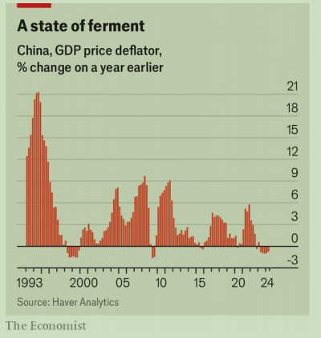

# China’s leaders face miserable economic-growth figures

Reality intruded at the “third plenum”, intended to discuss long-term reforms

plenum：美 [ˈplɛnəm] 全体会议

third plenum：三中全会

原文：

The Jingxi Hotel in Beijing is known for its home-made yogurt—and for

hosting some of the most important meetings in the history of the Chinese

Communist Party. These gatherings include the “third plenum” of 1978,

which confirmed Deng Xiaoping’s rise to power and the opening of China’s

economy. From July 15th-18th, the country’s leaders met for another “third

plenum” in this closely guarded venue. With luck, they savoured their

yogurt. Because outside the hotel walls, the economy was again turning sour.

学习：
savour：美 [ˈseɪvər] 品尝；享用；细品；充分享受

venue： 美 [ˈvenjuː] 会场；地点；

closely guarded venue：戒备森严的地方

原文：

Figures released on the opening day of the meeting showed that the

economy grew by 4.7% in the second quarter, compared with a year earlier.

The number was both weaker than expected and slower than the previous

quarter’s figure, when growth seemed to be stabilising. It puts the

government’s official growth target for this year—around 5%—in doubt.

会议开幕当天发布的数据显示，与去年同期相比，第二季度经济增长了4.7%。这一数字既低于预期，也低于上一季度的数据，当时增长似乎正在企稳。这使得政府今年的官方增长目标——5%左右——受到质疑。

学习：

ferment：美 [fərˈment , ˈfɜːrment] 发酵作用；（政治或社会上的）动乱；骚动；纷扰；

原文：

Beneath the headline figure, things were even worse. Nominal GDP,

unadjusted for inflation, grew more slowly than the adjusted figure. The gap

implies that prices across the economy continue to fall. In fact, by this

measure, China has suffered its fifth quarter of deflation in a row.

在标题数字之下，情况甚至更糟。未经通胀调整的名义GDP增速低于调整后的数据。这一差距意味着整个经济中的价格继续下跌。事实上，按照这一标准，已经连续第五个季度出现通缩。

学习：

in a row：连续地；接连不断地；不间断地

原文：

Since China’s housing slump began in mid-2021, economists have feared

that the world’s second-biggest economy might follow in the footsteps of

Japan, which suffered two lost decades of deflation after asset bubbles burst.

By some measures, China is a fast follower. Japan did not enter the fifth

quarter of its deflationary spell until the end of 1995, over four years after its

property market peaked. In Japan the pattern of falling prices persisted, with

few interruptions, for another 18 years

自2021年年中，房地产市场开始低迷以来，经济学家一直担心这个世界第二大经济体可能会步日本的后尘，日本在资产泡沫破裂后经历了长达二十年的通缩。从某些方面来看，中国是一个快速的跟随者。日本直到1995年底才进入通缩的第五个季度，距离其房地产市场见顶已过去了4年多。在日本，价格下跌的模式持续了18年，几乎没有中断

学习：

slump：经济衰退；衰退；市场萎靡；价格暴跌

housing slump：房地产市场低迷

asset bubbles burst：资产泡沫破裂

spell：时期，一段时间

原文：

In both Japan then and China today, deflation is a symptom of lacklustre

demand. China’s retail sales, for example, grew by only 2% in nominal

terms in June, compared with a year earlier. Vehicle sales shrank by more

than 6%. The slump in property rumbles on. Even the push to finish half-

built homes, one of the government’s priorities, seems to have lost

momentum. The amount of floor space completed by developers in June was

almost a third less than a year earlier.

无论是在当时的日本还是今天的中国，通货紧缩都是需求不振的一个症状。例如，与去年同期相比，中国6月份的名义零售额仅增长了2%。汽车销量缩水超过6%。房地产市场持续低迷。就连政府优先考虑的完成半建房屋的努力似乎也失去了动力。开发商6月份完成的建筑面积比去年同期减少了近三分之一。

学习：

lacklustre：英 [ˈlaklʌstə] 缺乏活力的；缺少信念的；

rumble：发隆隆声；连续发出低沉的声音；

rumble on：持续存在

>"Rumble on" 是一个短语，意思是某事持续存在，通常指一些负面或令人不快的事情不断发生或继续存在。
>
>例句：
>
>1. **Economic Issues**: Despite several interventions by the government, the economic crisis rumbled on, affecting millions of people.
>   - 尽管政府采取了多种干预措施，经济危机仍然持续，影响了数百万人。
>
>2. **Political Scandals**: The political scandal rumbled on for months, with new revelations coming to light almost every week.
>   - 这场政治丑闻持续了好几个月，几乎每周都有新的爆料浮出水面。
>
>在你提到的上下文中，“The slump in property rumbles on” 意味着房地产市场的低迷状态依旧持续，没有明显的改善。

原文：

Just as deflation reflects weak spending, it can also cause it. Firms will

hesitate to borrow and invest if falling prices mean that the money they must

repay is worth more, in real terms, than the money they borrowed. In

response to slowing credit growth, China’s central bank could cut interest

rates. But it worries that lower rates would weaken China’s currency and

erode the profitability of its banks. The central bank’s recent announcements

have instead focused on refinements to its policymaking apparatus, helping

it prop up bond yields and keep interest rates in a narrower range. It has been

more active in sharpening its tools than using them.

正如通缩反映支出疲软一样，它也可能导致支出疲软。如果下跌的价格意味着他们必须偿还的钱实际上比他们借的钱更值钱，公司将会犹豫借贷和投资。为了应对信贷增长放缓，中国央行可能会降息。但它担心较低的利率会削弱人民币，侵蚀银行的盈利能力。相反，央行最近的声明专注于完善其政策制定机制，帮助其支撑债券收益率，并将利率保持在较窄的范围内。它更积极地磨利工具，而不是使用它们。

学习：

in real terms：实际；实际上          

apparatus：美 [ˌæpəˈrætəs] （尤指政党或政府的）机构；机关；组织；系统

prop up：支撑, 撑起, 扶持

原文：

Could policy signals from the third plenum come to the rescue? In recent

days official media have presented Xi Jinping, China’s ruler, as an

“outstanding reformer”, much like Deng. A communiqué on July 18th

vowed to “place reform in a more prominent position”, “actively expand

domestic demand” and “give better play to the role of the market

mechanism”. But these pronouncements may not be convincing enough to

lift the mood. The party routinely promises to boost consumption and

honour private enterprise. The problem is that it also periodically cracks

down on successful firms and forswears consumer-friendly handouts in

times of distress. Ultimately, confidence is low not because policy signals

have been absent, but because they have been mixed.

学习：

forswear：美 [fɔrˈswɛr] 坚决抛弃；拒绝；否认

distress：困苦；困境；穷困

in times of disress：在困难时期

原文：

Some reforms could even make the country’s cyclical problems worse.

Local governments, for example, need new sources of revenue to replace

dwindling proceeds from selling land. One answer could be an annual tax on

the value of property. However, introducing such a tax would be perverse in

the midst of a property slump. Another possibility is expanding China’s

consumption tax, which falls mainly on luxuries, like jewellery, and sinful

goods, like booze. Yet such a tax would only further depress weak retail

sales.

一些改革甚至可能使该国的周期性问题恶化。例如，地方政府需要新的收入来源来替代日益减少的卖地收入。一个答案可能是每年对房产价值征税。然而，在房地产市场低迷之际，引入这一税种是有悖常理的。另一种可能性是扩大中国的消费税，主要针对珠宝等奢侈品和酒类等商品。然而，这种税收只会进一步抑制疲软的零售销售。

学习：

cyclical：美 [ˈsaɪklɪkəl] 周期的；循环的

dwindling：美 [ˈdwindlɪŋ] 缩减的；逐渐减少的；减少；变小；（dwindle的现在分词形式）

proceeds：收入；收益；营收；

jewellery：美 [ˈdʒuːəlri] 首饰；珠宝饰品； **注意发音**

sinful：罪恶的；不道德的；

booze：美 [buz] 酒精饮料；烈酒；<俚>喝酒

原文：

Over the next few days and months, China’s leaders need to keep this

balance in mind. Long-term reforms following the plenum must be

sweetened with further stimulus spending in the short term. The Jingxi

hotel’s yogurt reportedly tastes even better with a sprinkling of sugar. ■

学习：

sprinkling：美 [ˈsprɪŋk(ə)lɪŋ] 少量；洒在…上；下稀疏小雨；洒；（sprinkle的现在分词）

a sprinkling of：少量xxx

## 后记

2024年7月26日19点53分于上海。