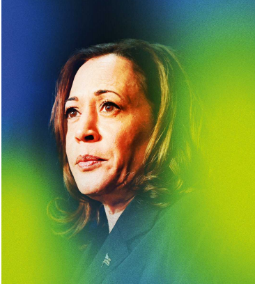

# Can Kamala Harris win?

Joe Biden’s vice-president has an extraordinary opportunity. But she also has a mountain to climb

原文：

THE PHONEY campaign has ended. The real battle for the White House

will be between Donald Trump and Kamala Harris, and it has only just

begun. When Joe Biden withdrew his candidacy on July 21st, Mr Trump

was in a commanding position. With a bit over 100 days to turn around his

lead, Ms Harris still has enough time to win the presidency. The question is

whether she has the ability.

虚假的竞选已经结束。真正的白宫之战将在唐纳德·特朗普和卡玛拉·哈里斯之间展开，而这才刚刚开始。当乔·拜登在7月21日退出竞选时，特朗普先生处于一种居高临下的地位。还有100多天的时间来扭转他的领先优势，哈里斯女士仍然有足够的时间赢得总统大选。问题是她是否有能力。

学习：

phoney：美 [ˈfoʊni] 虚假的；伪造的；欺诈性的；诈骗的；骗子；假冒者；假货

candidacy：美 [ˈkændɪdəsi] 候选人的资格（或身份）；候选资格；候选人的地位

withdrew his candidacy：退出竞选

commanding：居高临下的；占优势的；支配的；

**Bit**：稍微，略微

**Turn around**：扭转局面，翻盘

>**句子的意思**：
>
>- **Bit**：在这里表示“稍微”或“略微”的意思，用来描述接下来100天的时间并不是很多。
>- **Turn around**：表示“扭转局面”或“翻盘”，指的是在现有的形势下进行逆转。
>
>详细解析：
>
>- **Bit**：
>  - **句子**：With a bit over 100 days to turn around his lead, Ms Harris still has enough time to win the presidency.
>  - **解释**：在稍微超过100天的时间里扭转局面，哈里斯女士仍然有足够的时间赢得总统职位。
>  - 具体例子
>    - I'll be there in a bit. (我马上就到。)
>    - It will take a bit of time. (这会花一点时间。)
>- **Turn around**：
>  - **句子**：With a bit over 100 days to turn around his lead, Ms Harris still has enough time to win the presidency.
>  - **解释**：在稍微超过100天的时间里扭转局面，哈里斯女士仍然有足够的时间赢得总统职位。
>  - 具体例子
>    - The company was in financial trouble, but the new CEO managed to turn it around. (公司曾陷入财务困境，但新任CEO成功扭转了局面。)
>    - The team was losing, but they turned the game around in the last quarter. (球队一直落后，但他们在最后一节翻盘了。)

原文：

Her task is to make the election a referendum on Mr Trump, who is

unpopular outside his devoted MAGA base. If, instead, the election is about the

record of the Biden administration and her part in it, she is likely to lose. But

for Ms Harris to turn the spotlight onto Mr Trump, she must also satisfy

voters that she is equal to the job of president. Mr Biden’s campaign was

doomed because his infirmity kept the focus on him. Despite numerous

appearances, he could not dispel the image of a stumbling, befuddled old

man unfit to serve a second full term.

她的任务是让这次选举成为对特朗普的公投，特朗普在他所热爱的MAGA阵营之外不受欢迎。相反，如果选举是关于拜登政府的记录和她在其中的作用，她很可能会输。但要让哈里斯将焦点转向特朗普，她还必须让选民相信，她能胜任总统的工作。拜登先生的竞选注定要失败，因为他的虚弱让人们一直关注他。尽管出现了无数次，他无法消除一个磕磕绊绊、昏昏沉沉、不适合连任的老人的形象。

学习：

referendum：美 [ˌrefəˈrendəm] 全民投票；公民投票；全民公决；公投

>这里的"referendum on Mr Trump"表示将选举变成对特朗普的公投。也就是说，哈里斯女士的任务是将选举的焦点放在特朗普身上，而不是在拜登政府的记录和她在其中的角色上。这样可以利用特朗普在狂热的MAGA支持者之外的普遍不受欢迎来增加自己的胜算。

doomed：注定；判定；（doom的过去式和过去分词）

infirmity：美 [ɪnˈfərmədi] 体弱；智弱

dispel：消除（尤指感觉或信仰）；驱散；驱逐（邪恶、危险等）

stumbling：跌跌撞撞地走；（stumble的现在分词）

befuddled：美 [bɪ'fʌd(ə)ld] 迷糊的；糊涂的；昏沉的

is equal to：胜任某项工作

>**Is Equal To**：
>
>- **句子**：But for Ms Harris to turn the spotlight onto Mr Trump, she must also satisfy voters that she is equal to the job of president.
>- **解释**：这里的"is equal to"表示“胜任，能够胜任某项工作或任务”。即哈里斯女士不仅要把焦点转向特朗普，还要让选民相信她有能力胜任总统的工作。
>- 具体例子
>  - She has proved that she is equal to the challenge. (她已经证明她能够胜任这个挑战。)
>  - He felt confident that he was equal to the task. (他感到有信心能够胜任这项任务。)

原文：

The upshot is a race to define Ms Harris. Unfortunately for the Democrats,

Mr Trump has plenty of damning material to work with. As a former

attorney-general of California, she is linked to the homelessness, drugs and

crime of cities such as San Francisco. A west coast centrist is not a centrist

in the battleground states she must win. She had a disastrous run in the

presidential primaries last time round, dropping out early, having taken

leftish positions on subsidising rent and banning fracking. As Mr Biden’s

vice-president, she is lumbered with his record on inflation, immigration and

(in Republican eyes) crime.

结果是一场定义哈里斯女士的竞赛。对民主党人来说，不幸的是，特朗普有大量确凿的材料可以利用。作为加州前司法部长，她与旧金山等城市的无家可归、毒品和犯罪有着千丝万缕的联系。西海岸的中间派不是她必须赢得的战场州的中间派。她在上次总统初选中遭遇了灾难性的失败，早早退出，在补贴租金和禁止水力压裂法上采取了左派立场。作为拜登先生的副总统，她被他在通货膨胀、移民和(在共和党人看来)犯罪方面的记录所拖累。

学习：

upshot：美 [ˈəpˌʃɑt] 结果；结局；最终效果

damning：美 [ˈdæmɪŋ]（证据）确凿的；

attorney general：首席检察官；司法部长

lumbered：美 ['lʌmbɚd] 笨重地行进；缓慢地移动；拖累；（lumber的过去式和过去分词）

fracking：水力压裂（hydraulic fracturing）技术

>
>
>**Fracking** 是指水力压裂（hydraulic fracturing）技术，这是一种用于从地下深处的页岩层中开采石油和天然气的方法。该技术通过在高压下注入含有水、沙子和化学物质的液体来破碎岩石，从而释放出石油和天然气。这一过程能够显著增加石油和天然气的产量。
>
>例子：
>
>- **句子**：The debate over fracking has been heated, with some arguing it boosts energy independence and others concerned about environmental impacts.
>- **中文翻译**：关于水力压裂的争论一直很激烈，有人认为它增加了能源独立性，而其他人则担心环境影响。
>
> 相关背景：
>
>- 在美国，fracking 技术的使用已导致国内石油和天然气产量的大幅增加，从而降低了能源价格并减少了对外国能源的依赖。然而，该技术也引发了对地下水污染、地震活动增加以及其他环境和健康问题的担忧。

原文：

All along, she has struggled in speeches and interviews. Reportedly, some

Biden allies sought to stop Democrats deserting the president by privately

warning that she could take his place—as if that were a threat. What, then,

can Ms Harris do? Her chances of success rest on one enormous piece of

luck and three tests of her political instincts.

一直以来，她都在演讲和采访中挣扎。据报道，拜登的一些盟友试图阻止民主党人抛弃总统，他们私下警告说，她可能会取代他的位置——好像这是一种威胁。那么，哈里斯女士能做什么呢？她成功的机会取决于一次巨大的运气和对她政治直觉的三次考验。

学习：

sought to：寻求；设法；谋求；（seek to的过去式和过去分词）

political instincts：政治直觉

原文：

The luck was Mr Biden’s obstinacy. Had he given way sooner, the party

could have held an open primary and Ms Harris might have lost. As it was,

she saw off her potential rivals within 36 hours. After Mr Biden’s epic stall,

that reflected the party’s wish to move on. She inherited a ready-made

campaign and its cash. A day of record fundraising revealed Democrats’

relief at their new, younger candidate. Simply by being 59, she has turned

the issue of age, which devastated Mr Biden, back onto Mr Trump, who is

now the oldest nominee in history

幸运在于拜登先生的固执。如果他早点让步，该党可能会举行公开的初选，哈里斯女士可能会落选。事实上，她在36小时内击败了她的潜在对手。在拜登先生史诗般的拖延之后，这反映了该党继续前进的愿望。她继承了现成的竞选活动及其资金。一天创纪录的筹款揭示了民主党人对他们新的、更年轻的候选人的宽慰。仅仅因为59岁，她就把摧毁拜登的年龄问题转回到特朗普身上，特朗普现在是历史上年龄最大的被提名人

学习：

obstinacy：美 [ˈɑbstənəsi] 顽固；固执；

saw off：通过互让解决；相互妥协；送别；送行；把...赶走；（see off的过去式）   

potential rivals：潜在竞争对手

stall：使停止；使熄火；（使）停止发展；（使）动弹不得; 拖延，停滞

>这里的 "stall" 是指 "拖延" 或 "停滞"。在这段话中，"Mr Biden’s epic stall" 意思是拜登史诗般的拖延，指他迟迟不退出竞选。
>
>例子：
>
>- **句子**：The project faced an epic stall due to continuous disagreements among the team members.
>- **中文翻译**：由于团队成员之间的持续分歧，项目面临史诗般的拖延。
>
>拜登的拖延使得党内没有时间举行公开初选，这样哈里斯才能快速看到潜在对手并接手竞选活动及资金。

ready-made: 现成的；已做好的；预先制成的；

devastated：美 [ˈdevəsteɪtɪd] 毁坏；毁灭；蹂躏；（devastate的过去式） **注意发音**       

原文：

But luck will not be enough. To win, Ms Harris must also pass those

political tests. The first is to articulate the convictions that will be the

foundation for her presidency, without lapsing into promises to hand out

welfare cheques. Her identity as the first black and South Asian woman to

run for president could, if handled right, make her a compelling symbol of

the American dream. Rather than letting progressives pull her to the left, she

should back pragmatic policies that serve ordinary Americans. Mr Trump,

she can say, is out to serve himself.

但是光有运气是不够的。为了获胜，哈里斯女士还必须通过那些政治考验。首先是阐明将成为她总统任期基础的信念，而不是承诺发放福利支票。如果处理得当，她作为第一位竞选总统的黑人和南亚女性的身份可能会使她成为美国梦的一个引人注目的象征。她应该支持为普通美国人服务的务实政策，而不是让进步人士将她拉向左翼。她可以说，特朗普是在为他自己服务。

学习：

articulate：[ɑːrˈtɪkjuleɪt ] 表达；明确表述；清楚地讲话

conviction: 确信；坚定的信念；深信的观点

lapsing：流逝；失效；（lapse的现在分词）

lapsing into：陷入      

cheques：美 [t'ʃeks] 支票；（cheque的复数）

compelling：有说服力的；扣人心弦的；难以抗拒的；引人注目的；

a compelling symbol of the American dream: 美国梦的一个引人注目的象征

pragmatic：美 [præɡˈmætɪk] 实用的；讲求实效的；务实的；

原文：

This will mean touting the accomplishments of Mr Biden’s presidency more

effectively than he could—in particular, America’s most significant climate

legislation ever. But it also means facing up to the Biden administration’s

poor record on immigration with the help of a tough plan for the southern

border. In contrast to Mr Biden, she must acknowledge voters’ struggle with

inflation. She should continue to speak out strongly for women’s

reproductive rights, a winning issue—and that involves being aware of

Republican traps claiming that this means the unrestricted abortions late in

pregnancy which most Americans reject. When pressed, as she will be, she

should make clear that she thinks trans women have an unfair advantage in

competitive women’s sports.

这将意味着比他能做的更有效地吹捧拜登先生任期内的成就——特别是美国有史以来最重要的气候立法。但这也意味着面对拜登政府在移民问题上的不良记录，并在南部边境的强硬计划的帮助下。与拜登相反，她必须承认选民在与通胀作斗争。她应该继续为女性的生殖权利大声疾呼，这是一个胜利的议题——这包括意识到共和党的陷阱，声称这意味着大多数美国人拒绝的怀孕后期无限制堕胎。当受到压力时，她应该明确表示，她认为跨性别女性在女性竞技运动中拥有不公平的优势。

学习：

touting：美 [taʊtɪŋ] 兜售；吹捧；招徕；（tout的现在分词形式）

reproductive：美 [ˌriːprəˈdʌktɪv] 生殖的；复制的；再生的

原文：

Ms Harris’s second test is what she makes of having been a prosecutor and a

state attorney-general. She may be tempted simply to bash away at Mr

Trump as a convicted felon. Instead she should also use her experience as

the foundation for a broad argument that she can be trusted to defend

American values at home and abroad.

哈里斯女士的第二个考验是她如何看待曾担任的检察官和州检察长。她可能会忍不住抨击特朗普是一名被定罪的重罪犯。相反，她还应该用自己的经历作为广泛论证的基础，证明她可以在国内外捍卫美国价值观。

学习：

prosecutor：美 [ˈprɑːsɪkjuːtər] 检察官

tempt：劝诱；鼓动；使感兴趣

be tempted to：想要做

bash away at：猛烈抨击

felon：罪犯；

原文：

This starts with the rule of law, including in tackling violence and street

crime, so as to counter the accusation that Democrats are soft on both. She

could contrast her support of an independent legal system with Mr Trump’s

plan to deploy the Department of Justice against his foes. And she should

endorse America’s global role as the guardian of norms and rules. Mr Trump

has a real-estate tycoon’s view of strength as simply muscle; in fact, strength

is enhanced by being rooted in principle.

这从法治开始，包括解决暴力和街头犯罪，以反驳民主党在这两方面都很软弱的指责。她可以将自己对独立法律体系的支持与特朗普部署司法部打击对手的计划进行对比。她应该支持美国作为规范和规则守护者的全球角色。特朗普有一种房地产大亨的观点，认为实力仅仅是肌肉；事实上，力量是因为根植于原则而增强的。

学习：

counter：反驳；驳斥；

accusation：美 [ˌækjuˈzeɪʃn] 指控；控告

foes：敌人；（foe的复数）

tycoon：美 [taɪˈkuːn] 大亨；巨头；权贵；

原文：

Ms Harris’s third test is to offer America hope. In a vicious election powered

by fear and loathing, she may be tempted to peddle apocalyptic visions of a

second Trump term. Better to use humour and optimism. Like any bully, her

opponent is vulnerable to mockery. An upbeat Ms Harris looking to the

future will do well against a sullen, vengeful Mr Trump enraged about the

past.

哈里斯女士的第三个考验是给美国带来希望。在一场由恐惧和厌恶推动的恶性选举中，她可能会忍不住兜售特朗普第二个任期的灾难性的愿景。最好使用幽默和乐观。像任何欺负者一样，她的对手很容易受到嘲弄。乐观的哈里斯展望未来，将会在面对阴沉、报复心强、对过去感到愤怒的特朗普时表现出色。

学习：

vicious：美 [ˈvɪʃəs] 恶意的；恶劣的；

loathing：厌恶；憎恨；嫌恶

be tempted to：想要

peddle：叫卖；兜售；贩卖（小商品）；推销；散播（思想或消息）

apocalyptic：美 [əˌpɑkəˈlɪptɪk] 像世界末日的；描述（历史）大动乱的；预示灾难的；灾难性的；

mockery：美 [ˈmɑːkəri] 嘲笑；讥讽；嘲弄；

upbeat：美 [ˈʌpbiːt] 乐观的；积极向上的；

sullen：美 [ˈsʌlən] 闷闷不乐的；郁郁寡欢的；面有愠色的；愠怒的；赌气的；不高兴的；（天色或天气）阴沉的；阴郁的；

vengeful：美 [ˈvɛndʒfəl] 复仇的；心存报复的；怀恨在心的；报复性的

enraged：暴怒的

原文：

Encouragingly, her first official rally, in Milwaukee on July 23rd, was

fizzing with enthusiasm. This was not the awkward, unconvincing candidate

of four years ago. After Mr Biden’s halting delivery, her words were full of

vitality.

令人鼓舞的是，她7月23日在密尔沃基的第一次官方集会热情高涨。这不是四年前那个尴尬的、没有说服力的候选人。在拜登先生结结巴巴地发表讲话后，她的话充满了活力。

学习：

halting：犹豫的；结结巴巴的

fizzing with：充满

>
>
>这里的 "fizzing with" 意思是“充满”。在这段话中，"fizzing with enthusiasm" 表示“充满热情”。
>
> 例子：
>
>- **句子**：The room was fizzing with excitement as the concert was about to begin.
>- **中文翻译**：随着音乐会即将开始，房间里充满了兴奋的气氛。
>
>在这段话中，哈里斯在密尔沃基的首次正式集会充满了热情，与四年前那位尴尬、不够令人信服的候选人形成了鲜明对比。

原文：

But Ms Harris is the underdog. Her first big decision—her vice-president—

is a chance to catch up and plant her campaign in the centre ground. Josh

Shapiro, the eloquent governor of Pennsylvania, could help in a must-win

state. Mark Kelly, a senator from Arizona, another battleground state, would

also add to the ticket—and it would rile Mr Trump to face an ex-astronaut.

Be warned, however: Ms Harris is running a rushed operation. If her

campaign starts to go awry, recriminations about her uncontested nomination

will soon follow

但是哈里斯女士处于不利地位。她的第一个重大决定——她的副总统——是一个迎头赶上并在中间地带开展竞选活动的机会。雄辩的宾夕法尼亚州州长乔希·夏皮罗可以在一个非赢不可的州提供帮助。来自另一个战场州亚利桑那州的参议员马克·凯利也将加入竞选——如果特朗普面对一名前宇航员，他会很恼火。但是，请注意:哈里斯女士正在进行一项紧急行动。如果她的竞选开始出问题，对她毫无争议的提名的指责很快就会接踵而至

学习：

underdog：弱者；劣势群体；处于不利地位者

eloquent：口才流利的；雄辩的；有口才的；

rile：使恼怒；惹…生气；搅浑

awry：美 [əˈraɪ] 偏离预期的；不顺利地；脱轨的；（事物）走样的；出错的；出岔子的

recrimination：美 [rəˌkrɪməˈneɪʃ(ə)n]  反责；反诉；指责

原文：

By contrast, Mr Trump, having survived an assassination attempt, enjoys an

unshakable hold on his party. And yet his campaign’s attempt to redefine

him as a unity candidate at the Republican convention crumbled with his

rambling and mean-spirited acceptance speech. That makes him beatable.

相比之下，特朗普在一次暗杀企图中幸存下来，享有对其政党不可动摇的控制。然而，他的竞选团队试图在共和党大会上将他重新定义为团结候选人，但他散漫而卑鄙的接受提名演讲粉碎了这一企图。这让他变得可以被战胜。

学习：

crumbled：衰落；弄碎；崩溃；（crumble的过去式和过去分词）

rambling：散漫的；不连贯的；杂乱无章的；

mean-spirited：气量小的；心胸狭窄的；卑鄙的          

acceptance speech：获奖感言；接受提名演讲          

beatable：美 [bitəbl] 可打的; 可击的;

原文：

After months of desultory campaigning, Americans have a race on their

hands, and a good thing too. At a perilous time for their country and the

world, they deserve a real contest. ■

经过几个月断断续续的竞选活动，美国人面临着一场竞赛，而且是一件好事。在他们的国家和世界面临危险的时候，他们应该有一场真正的竞争。■

学习：

desultory：美 [ˈdɛsəlˌtɔri] 不连贯的；不系统的；断断续续的

perilous：美 [ˈperələs] 危险的；险恶的；不稳定的；

## 后记

2024年7月27日19点55分于上海。

