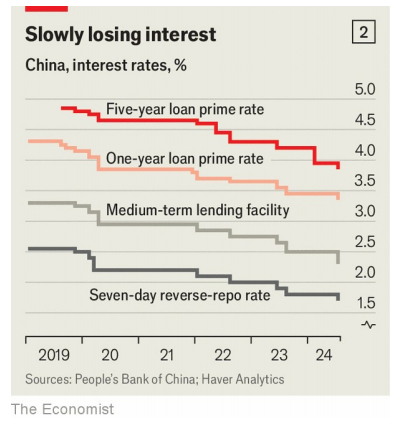

# China unveils its new economic vision

It promises many reforms, but remains ambivalent about the role of the market

ambivalent：美 [æmˈbɪvələnt] （态度、情绪）矛盾的；心情复杂的

原文：

ONLY 205 of the Chinese Communist Party’s 99m members serve as full

members of its Central Committee. Reaching such giddy heights (the top

0.0002%) is not always a privilege. Of late for example, it has meant

spending four days in July closeted in a Beijing hotel poring over an epic

resolution on “Further Deepening Reform Comprehensively to Advance

Chinese Modernisation”.

中国共产党9900万党员中，只有205人是中央委员会的正式成员。达到如此令人眩晕的高度(最高的0.0002%)并不总是一种特权。例如，最近，这意味着7月份花4天时间在北京一家酒店闭门研究一项关于“进一步全面深化改革，推进中国现代化”的宏大决议。

学习：

giddy：美 [ˈɡɪdi] 头晕的；眩晕的；轻浮的；轻佻的；轻率的；令人兴奋的；

>“Giddy” 在这里指的是一种兴奋、狂喜或令人目眩的高度。这句话描述了达到中国共产党中央委员会的顶峰成员之一是一种非常高的成就和荣誉。
>
>例子
>
>1. **英文**: She felt giddy with excitement when she received the news of her promotion.
>   - **中文**: 当她收到升职的消息时，她感到兴奋不已。
>
>2. **英文**: The views from the top of the skyscraper were giddy, making him feel lightheaded.
>   - **中文**: 从摩天大楼顶端看到的景色令人目眩，使他感到头晕目眩。

closeted：英 [ˈklɒzɪtɪd] 保密的；把…关起来；（closet的过去式和过去分词）

原文：

Known as the “third plenum”, this was one of seven plenary meetings that

punctuate a Central Committee’s five-year term. By tradition, the third has

been used to approve big economic-policy shifts. Many analysts argue

another rethink is long overdue. Xi Jinping, China’s ruler since 2012, once

promised to give markets a “decisive” role in the allocation of resources. But

he has since lost the confidence of private enterprise. And the economy is

struggling to wean itself off decades of investment in property and

infrastructure.

被称为“三中全会”的这次会议是贯穿中央委员会五年任期的七次全体会议之一。传统上，三中全会被用来批准重大的经济政策转变。许多分析师认为，早就应该进行另一次反思了。中国经济正在努力摆脱几十年来对房地产和基础设施的投资。

学习：
plenum：美 [ˈplɛnəm] 全体会议

plenary：美 [ˈpliːnəri] 全体会议；全会

private enterprise：私营企业

wean：英 [wiːn] 使断奶；使戒掉（习惯等）；使放弃（依赖、瘾头等）

原文：

Data released on July 15th showed flagging growth, slowing retail sales,

persistent deflation and no recovery in homebuilding. Many economists

believe China’s leadership is preoccupied with the “supply side” of the

economy—cultivating the technologies, kit and skills that enable China to

produce things—but has not done enough to revive the “demand side”. It has

failed to restore the confidence of entrepreneurs, or to give households the

means and motivation to buy things.

7月15日公布的数据显示增长乏力，零售销售放缓，通货紧缩持续，房屋建筑没有复苏。许多经济学家认为，中国领导层专注于经济的“供给侧”——培养使中国能够生产东西的技术、设备和技能——但在重振“需求侧”方面做得不够。它未能恢复企业家的信心，也未能给家庭提供购物的手段和动力。

学习：

flagging：疲乏；衰退；（flag的现在分词） 衰弱的；下垂的；

kit：成套工具；成套设备；

原文：

Did this third plenum respond to these concerns? The answer is a heavily

qualified yes. It was closed to outsiders, but on July 21st published a

resolution, open to all with the fortitude to wade through over 22,000

characters of partyspeak (more than 17,000 words in English). This suggests

that China’s leaders remain obsessed with technology. But they may also be

a little more attentive to household demand

这次三中全会是否回应了这些担忧？答案是绝对肯定的。它不对外人开放，但在7月21日发布了一项决议，向所有有毅力的人开放，阅读超过22，000个字符的partyspeak(超过17，000个英语单词)。这表明中国领导人仍然痴迷于技术。但是他们也可能更加关注家庭需求

学习：

outsiders：局外人；（outsider的复数）          

fortitude：美 [ˈfɔːrtɪtuːd] 刚毅；勇气；毅力；

wade：跋涉；涉；蹚水艰难行走；积极参与

partyspeak：讲话

attentive：注意的；留心的；

原文：

Of its 60 sections, three are devoted to innovation, including one on “talent”.

A fourth discusses “new productive forces”, the economic buzzword of the

past ten months, which refers to technology-driven leaps in productivity

在60个版块中，有三个版块专门讨论创新，包括一个“人才”版块。第四篇讨论“新生产力”，这是过去十个月的经济术语，指的是技术驱动的生产力飞跃

学习：

devoted to：致力于；专门

new productive forces：新质生产力

buzzword：美 [ˈbʌzwɜːrd] 新兴词汇；时尚用语

原文：

This emphasis reflects Mr Xi’s belief that the world is in the midst of a

scientific revolution that China should lead. But it also betrays Mr Xi’s siege

mentality. He is determined to break America’s stranglehold on key

technological inputs, such as high-end semiconductors. In 2013 the plenum

resolution allocated three sections to national security and military reform.

This one devotes seven, including a commitment to counter foreign

sanctions.

这种强调反映了领导者的信念，即世界正处于一场科学革命之中，中国应该领导这场革命。但这也暴露了领导者的围困心态。他决心打破美国在关键技术投入上的束缚，比如高端半导体。2013年，全会决议用了三个章节讨论国家安全和军事改革。这份协议有七条，包括一项反击外国制裁的承诺。

学习：

in the midst of：在…当中；正当…时候

siege：美 [siːdʒ] 围攻；围困；包围；

>“Siege” 在这里指的是一种围攻或被包围的状态。在这种情况下，指的是“围困心态”，意味着他认为中国正面临外部压力和威胁，特别是来自美国的科技和经济压力。
>
> 例子
>
>1. **英文**: The castle was under siege for weeks, with no supplies getting in or out.
>   - **中文**: 城堡被围困了数周，没有任何补给进出。
>
>2. **英文**: The company felt under siege from its competitors, who were constantly trying to poach its clients.
>   - **中文**: 该公司感觉受到竞争对手的围攻，他们不断试图挖走其客户。

stranglehold：美 [ˈstræŋɡəlˌhoʊld] 束缚；压制；控制手段；绝对控制；垄断；

high-end：高端的

原文:

The biggest internal threat to China’s economy is its property slump. The

resolution said little about housing directly. But it did tackle one of the side-

effects of the slump: how hard it is for local governments to raise revenue by

selling land. In response, the central government will take on a greater share

of public spending and refrain from imposing new obligations on local

governments without matching resources. It will give them a portion of the

money raised by China’s consumption tax on luxuries and indulgences. It

will also explore combining three local levies into a single tax and giving

local governments some leeway to set the rate.

中国经济面临的最大内部威胁是房地产暴跌。该决议很少直接提及住房问题。但它确实解决了衰退的一个副作用:地方政府通过卖地增加收入有多难。作为回应，中央政府将承担更大份额的公共支出，并避免在没有匹配资源的情况下给地方政府强加新的义务。这将使他们从中国对奢侈品和奢侈品征收的消费税中获得一部分收入。它还将探索将三种地方税合并为一种税，并给地方政府一些设定税率的余地。

学习：

property slump：房地产暴跌

side-effect：副作用；

selling land：卖地

revenue：收入；收益；税收

raise revenue：增加收入

refrain： 美 [rɪˈfreɪn] 避免；克制；抑制； 

refrain from：避免…；克制…；控制自己不做（某事）；

indulgences：美 [ɪnˈdʌldʒənsiz] 纵容；放纵；（indulgence的复数）奢侈品

>“Indulgence” 在这里指的是奢侈品或享受品，表示中国对奢侈品和享乐品征收的消费税。
>
>**例子**
>
>1. 英文: His frequent trips to luxury resorts were a form of indulgence.
>   - **中文**: 他经常去豪华度假村是种享受。
>2. 英文: She allowed herself a small indulgence by buying an expensive chocolate bar.
>   - **中文**: 她通过买一块昂贵的巧克力来犒劳自己。

levies：美 [ˈli:viz] 征税；征兵；（levy的复数）

leeway： 美 [ˈliˌweɪ] 余地；余裕；回旋余地；操作空间

obligation：责任或义务

>“Obligation” 在这里指的是一种责任或义务。它表示地方政府被要求履行的职责或任务。
>
>**例子**
>
>1. 英文：The company has an obligation to pay its employees on time.
>   - **中文**: 公司有按时支付员工工资的责任。
>2. 英文：Parents have an obligation to provide for their children.
>   - **中文**: 父母有责任抚养他们的孩子。

原文：

What about the neglected demand side of China’s economy? Many policies

and aspirations mentioned in the resolution could in principle boost

consumption. It repeated a long-standing pledge to raise household income

as a share of GDP, and promised subsidies for childbearing. It will consider

allowing debtors to declare personal bankruptcy. It will increase pensions

“gradually” and welfare spending “within our means”. Migrants from the

countryside will have easier access to pensions, housing and education in the

cities where they work. The resolution also recognised that many migrant

workers will not settle in cities if that means forfeiting their claims on

collectively owned land in their home villages. So ways in which people

could sell or lease out these claims will be explored.

中国经济中被忽视的需求端呢？决议中提到的许多政策和愿望原则上可以刺激消费。它重申了提高家庭收入占GDP比重的长期承诺，并承诺为生育提供补贴。它将考虑允许债务人宣布个人破产。它将“逐步”增加养老金，并“在力所能及的范围内”增加福利支出。来自农村的移民将更容易在他们工作的城市获得养老金、住房和教育。该决议还承认，如果这意味着失去对家乡集体所有土地的所有权，许多农民工将不会在城市定居。因此，人们可以出售或出租这些权利的方式将被探索。

学习：

raise household income：提高家庭收入

childbearing：美 [ˈtʃaɪl(d)ˌbɛrɪŋ] 生育；妊娠；分娩；生孩子

subsidies：英 [ˈsʌbsɪdiz] 津贴；补贴；补助金；（subsidy的复数） **注意发音**

welfare spending：福利支出

migrant workers：农民工

forfeiting： 美 ['fɔrfɪt] 失去；丧失；（forfeit的现在分词形式）

lease out：出租；租赁；租出          

claims：权利（土地的所有权）
>这里的 "claims" 指的是对其家乡集体所有土地的权利或要求。许多中国农村的移民工人在城市工作，但他们不愿意放弃家乡的土地权利。这些权利可以包括对土地的所有权、使用权或收益权。
>
>**例子**
>1. **英文**: Farmers have claims on the collectively owned land in their villages.
>   - **中文**: 农民对他们村庄的集体所有土地拥有权利。
>   
>2. **英文**: Migrant workers are reluctant to settle in cities if it means losing their claims on their home village's land.
>   - **中文**: 如果移民工人定居城市意味着失去他们对家乡土地的权利，他们通常不愿意定居城市。

原文：

Will all this translate into effective reform? The party’s record is one of slow

progress. Government spending on social security, health and employment

has increased gradually from 3% of GDP in 2008 to almost 5% in 2023. And

household income has risen from 59% of GDP in 2008 to 66% in 2021 by one

measure. China’s leaders may be starting to accept the urgency of lifting

demand. At the close of the plenum, the party said it remains committed to

its growth target for this year (see chart 1). And in the days after the plenum,

the central bank unexpectedly cut interest rates (see chart 2).

所有这些会转化为有效的改革吗？该party的记录是进展缓慢。政府在社会保障、卫生和就业方面的支出从2008年占GDP的3%逐步增加到2023年的近5%。根据一项指标，家庭收入已经从2008年占GDP的59%上升到2021年的66%。中国领导人可能开始接受提振需求的紧迫性。全会结束时，中共表示将继续致力于今年的增长目标(见图表1)。全会后的几天，中央银行出人意料地降低了利率(见图表2)。

学习：

social security：社会保障

household income：家庭收入

原文：

The resolution also offered reassurance for private entrepreneurs shaken by

recent regulatory crackdowns. E-commerce and other internet firms, which

suffered a blizzard of fines, bans and restrictions in 2021, can now look

forward to more “routine” regulation, it said. It mentioned a private-sector

promotion law and even promised to redress “wrongly adjudicated cases”.

But businesses have learnt not to take promises at face value. The party’s

attitude toward free markets remains conflicted. This ambivalence was

captured well by new language in the resolution about “letting go” to

invigorate market forces, while “managing well” to keep market order.

该决议还为受到近期监管打击的民营企业家提供了保证。它说，电子商务和其他互联网公司在2021年遭受了大量罚款、禁令和限制，现在可以期待更多的“例行”监管。它提到了私营部门促进法，甚至承诺纠正“错判案件”。但企业已经学会不要轻信承诺的表面价值。该党对自由市场的态度仍然矛盾。决议中关于“放开”以激活市场力量，同时“管好”以维持市场秩序的新措辞，很好地抓住了这种矛盾心理。

学习：

reassurance：美 [ˌriːəˈʃʊrəns] 安慰；（能消除疑虑等的）肯定

blizzard： 美 [ˈblɪzərd] 暴风雪；雪暴；大批侵扰性的事物；大量的负担

>**Blizzard**: 这里指的是大量的、密集的（罚款、禁令和限制）。比喻那些互联网公司在 2021 年遭受了一连串的严厉监管措施。
>
>- 例子:"The new policy led to a blizzard of complaints from affected businesses."
>  - **中文**: 新政策导致受影响的企业大量投诉。

redress：美 [rɪˈdres] 补救；纠正；矫正；改正；

adjudicated： 美 [əˈdʒu:dɪˌkeɪtid] 判决；（adjudicate的过去式和过去分词）

invigorate：使精神焕发；使生气勃勃；振作；鼓舞；激励；使蒸蒸日上

at face value: 字面意思

>**At face value**: 这里指的是字面意思。表达不要轻易相信表面上的承诺，而是要谨慎对待。
>
>- 例子："You can't take his words at face value; he's known for making empty promises."
>  - **中文**: 你不能轻信他的话；他以空口许诺而闻名。

原文：

The plenum made clear that China’s “modernisation” will be of a style of its

own. China is so vast and varied that no other country offers a convincing

model, *Qiushi*, a party journal, argued this month. As a reminder of China’s

idiosyncrasies, it invoked an old saying: south of the Huai river, oranges are

sweet; north of the river, they are bitter.

全会明确表示，中国的“现代化”将有自己的风格。党刊《求是》本月指出，中国幅员辽阔，多样化，没有一个国家能提供令人信服的模式。为了提醒人们中国的特质，它引用了一句老话:橘生淮南则为橘 生于淮北则为枳。

学习：

idiosyncrasies：美 [ˌɪdi:əʊˈsɪŋkrəsi:z] 癖好；习性；（idiosyncrasy的复数）

invoke：援引；引用；

old saying： 古语；古话；老话

invoke an old saying：引用一句老话

原文：

Official lore is that China’s economic exceptionalism is rooted chiefly in the

size of its population and the dominance of the party. Outsiders point to

other distinctive features such as inhibited consumption and insecure private

enterprise. The reforms outlined at the plenum could eventually encourage

freer household spending. But the party’s ambivalence towards the market

persists. For China’s communist leaders, the fruits of private enterprise will

always be bittersweet. ■

官方说法是，中国的经济例外论主要植根于其人口规模和党的统治地位。局外人指出了其它明显的特征，如抑制消费和不安全的私营企业。全会上概述的改革最终可能会鼓励更自由的家庭支出。但是党对市场的矛盾心理依然存在。对于中国的共产党领导人来说，私营企业的果实总是苦乐参半。■

学习：

lore：（某一群体的）传统；（尤指口头流传的某一方面的）学问

official lore：官方说法

>**Lore**: 这里指的是官方的说法或传统观念。通常用来描述一种被广泛接受的但未必完全真实的信仰或知识。
>
>- 例子： "According to local lore, the village was founded by a legendary hero."
>  - **中文**: 根据当地的传说，这个村庄是由一位传奇英雄建立的。

exceptionalism：美 [ɪk'sepʃənəˌlɪzəm] 例外论；例外主义; 特殊性

>**Exceptionalism**: 这里指的是中国经济的特殊性或独特性。表示中国经济与其他国家的不同之处和优势。
>
>- 例子: "American exceptionalism is often cited to explain the country’s unique role in world politics."
>  - **中文**: 美国的特殊性常被用来解释该国在世界政治中的独特角色。

inhibited；美 [ɪnˈhɪbɪtɪd] 抑制的；不自然的；受限制的；

bittersweet：又苦又甜的；苦乐参半的

## 后记

2024年7月31日14点50分于上海。

