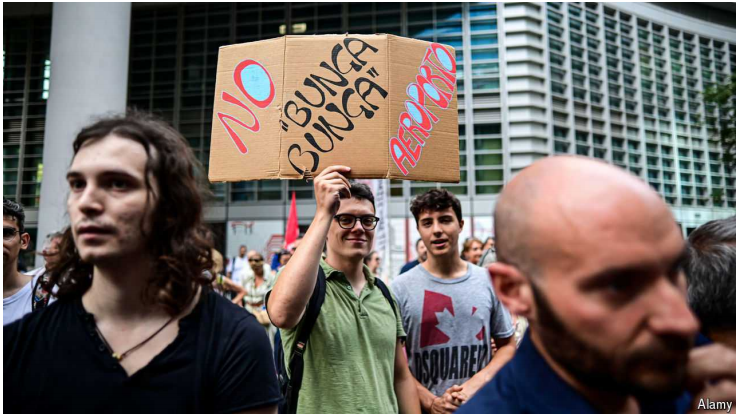

# Italian right-wingers have renamed Milan’s airport after Silvio Berlusconi

A finger in the eye of those who detested the late populist leader

detested：厌恶；（detest的过去式和过去分词）

finger in the eye: 故意激怒别人，故意让人不高兴

>**Silvio Berlusconi** 是意大利的已故政治人物和商业大亨。他是意大利的前总理，并且以其富有争议的领导风格和政治观点而闻名。他同时也是一位成功的媒体大亨，拥有多家意大利的媒体公司。
>
>在这段话中：
>- **Finger in the eye** 是一个英语习语，意思是故意让人不高兴或激怒他人。在这里，它表示意大利右翼人士将米兰的机场重新命名为贝卢斯科尼机场是为了激怒那些讨厌已故民粹领导人的人。
>
>**中文翻译**：
>- 意大利右翼人士将米兰的机场重新命名为西尔维奥·贝卢斯科尼机场，这对那些厌恶这位已故民粹领导人的人来说是一种挑衅。

原文：

“I AM APPALLED,” declared an executive of one of Italy’s premier fashion houses,

contemplating the prospect of clients and suppliers arriving in Milan at

Silvio Berlusconi airport. She is not alone. Although many Italians see the

renaming of Malpensa airport on July 11th as a fitting tribute to the

republic’s longest-serving prime minister, others are acutely embarrassed.

“我感到震惊，”意大利一家顶级时装公司的一名高管在西尔维奥贝卢斯科尼(Silvio Berlusconi)机场面对抵达米兰的客户和供应商时表示。她并不孤单。尽管许多意大利人认为7月11日马尔彭萨机场的重新命名是对这位共和国任职时间最长的总理的恰当致敬，但其他人却感到非常尴尬。

学习：
appalled：美 [əˈpɔːld] 震惊的

premier：美 [prɪˈmɪr] 一流的；最著名的；最成功的

fashion house：时尚公司

tribute：美 [ˈtrɪbjuːt] （表示敬意的）礼物；颂辞；

acutely embarrassed：非常尴尬

>**Contemplating** 意思是考虑、思考或深思。这里是指那位意大利顶级时装公司的高管在思考客户和供应商到达米兰的机场时的情景。
>
>**Prospect** 意思是前景或可能性。在这里，它指的是客户和供应商到达米兰的机场的可能性。

原文：

Some are already calling Italy’s second-biggest air-passenger terminal

“Bunga Bunga airport”—a dig at the late prime minister’s hosting of sex

parties that led to his being tried (and acquitted) of paying an under-age

prostitute. The renaming accords Berlusconi, a convicted tax fraudster who

died in 2023, an honour otherwise reserved for the likes of Leonardo da

Vinci (after whom Rome’s main airport is named), Galileo Galilei (Pisa) and

Marco Polo (Venice).

一些人已经将意大利第二大航空客运站称为“Bunga Bunga机场”，这是对这位已故总理举办性派对的挖苦，导致他因向未成年妓女卖淫而受审(并被判无罪)。贝鲁斯科尼于2023年去世，是一名被判犯有税务欺诈罪的人，更名后的贝鲁斯科尼获得了一项原本属于列奥纳多·达·芬奇(罗马主要机场就是以他的名字命名)、伽利略·伽利雷(比萨)和马可·波罗(威尼斯)等人的荣誉。

学习：

dig：讽刺；挖苦；批评；

prostitute：美 [ˈprɑːstɪtuːt] 妓女；娼妓；卖淫者

tried：审判；审理；审讯；评判；（try的过去式和过去分词）

under-age：未达到法定年龄的；未成年的          

fraudster：美 [ˈfrɔdstər] 诈骗犯；欺诈者；骗子

原文：

By July 24th a petition to scrap the move had attracted more than 170,000

signatures. The initiative has also been condemned by Milan’s mayor. Nine

local authorities adjoining the airport have protested that they were not

consulted.

到7月24日，一份要求废除这一举措的请愿书已经吸引了超过17万人签名。这一举措也遭到了米兰市长的谴责。毗邻机场的九个地方当局抗议说，他们没有被咨询。

学习：

petition：美 [pəˈtɪʃn] 请愿书；申请书

scrap：丢弃；除掉；废除

原文：

By far the most surprising objector, however, is Berlusconi’s son, Pier

Silvio. While stressing that the Berlusconi family was flattered by the

decision, he publicly condemned its “timing and the way it was done”. That

was a none-too-veiled dig at the man who approved the move, Matteo

Salvini, the infrastructure minister and leader of the far-right League. And it

reflected growing tensions within Italy’s governing coalition.

然而，到目前为止，最令人惊讶的反对者是贝卢斯科尼的儿子皮尔·西尔维奥。在强调贝卢斯科尼家族对这一决定感到受宠若惊的同时，他公开谴责了这一决定的“时机和方式”。这是对批准这一举措的人——基础设施部长兼极右翼联盟领导人马泰奥·萨尔维尼(Matteo Salvini)的毫不掩饰的挖苦。这也反映了意大利执政联盟内部日益紧张的局势。

学习：

objector：反对者；提出异议的人

flattered：高兴的；感到荣幸的

none-too-veiled：毫不掩饰      

原文：

The League had already lost most of its support to the nativist Brothers of

Italy party, led by the prime minister, Giorgia Meloni. Recently it has been

overtaken in the polls by its other coalition ally, Forza Italia, the movement

Silvio Berlusconi founded and which his heirs finance. By endorsing the

renaming of Malpensa, Mr Salvini was cheekily laying claim to the legacy

of the late prime minister, a pioneer of contemporary right-wing populism.

Under Berlusconi’s successor, Antonio Tajani, Forza Italia has adopted a

more conventional liberal conservatism. Berlusconi’s children seem to want

to go further: Pier Silvio’s sister, Marina, has said that on many social issues

she backs the left.

该联盟已经失去了总理乔治·梅洛尼领导的意大利本土主义兄弟党的大部分支持。最近，它在民意调查中被它的另一个联盟盟友“意大利力量”(Forza Italia)超越，该运动由西尔维奥贝卢斯科尼(Silvio Berlusconi)创立，并由其继承人资助。萨尔维尼支持马尔彭萨更名，是厚颜无耻地要求继承已故总理的遗产，他是当代右翼民粹主义的先驱。在贝卢斯科尼的继任者安东尼奥·塔亚尼的领导下，意大利力量党采取了更为传统的自由保守主义。贝卢斯科尼的孩子们似乎想走得更远:皮尔·西尔维奥的姐姐玛丽娜说，在许多社会问题上，她支持左派。

学习：

nativist：美 ['neɪtɪvɪst] 本土主义者；本土文化保护者

heirs：美 ['erz] 继承人；后嗣；承袭者；（heir的复数）

cheekily：厚脸皮地

原文：

On July 18th Forza Italia’s European Parliament members voted to re-elect

Ursula von der Leyen as European Commission president. The League gave

her the thumbs-down. Surprisingly, so did the Brothers’ MEPs. Ms Meloni may

be edging right in anticipation of Donald Trump regaining America’s

presidency. Berlusconi’s political legacy looks increasingly mainstream. But

not, many Italians feel, airport-worthy just yet. ■

7月18日，意大利力量党的欧洲议会成员投票选举乌尔苏拉·冯·德·莱恩连任欧盟委员会主席。联盟否决了她。令人惊讶的是，这对兄弟的欧洲议会议员也是如此。在唐纳德·特朗普(Donald Trump)重登美国总统宝座的预期下，梅洛尼可能会逐渐走上正轨。贝卢斯科尼的政治遗产看起来越来越主流。但是，许多意大利人认为，现在还不值得以他的名字命名机场。■

学习：

thumbs-down：不支持

## 后记

2024年8月1日19点00分于上海。

