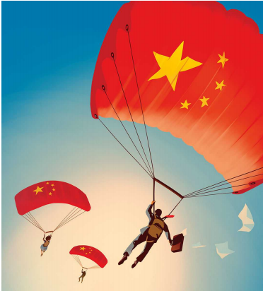

# Chinese companies are winning the global south

Their expansion abroad holds important lessons for Western incumbents

原文：

Since the end of the cold war the rich world’s corporate giants have been the

dominant force in global commerce. Today consumers and workers in

almost every country are touched in some way by the world-spanning

operations of multinational firms from America, Europe and, to a lesser

extent, Japan. These leviathans are now under threat, as Chinese firms in

industries from cars to clothing expand abroad with startling speed. A new

commercial contest has begun. Its battleground is neither China nor the rich

world, but the fast-growing economies of the global south.

自冷战结束以来，富裕国家的企业巨头一直是全球商业的主导力量。今天，几乎每个国家的消费者和工人都在某种程度上受到来自美国、欧洲以及在较小程度上来自日本的跨国公司的跨国经营的影响。随着从汽车到服装等行业的中国企业以惊人的速度向海外扩张，这些庞然大物正面临威胁。一场新的商业竞赛开始了。它的战场既不是中国，也不是富裕国家，而是全球南部快速增长的经济体。

学习：

commerce：美 [ˈkɑːmɜːrs] 商业；商务；（尤指国际间的）贸易

global commerce：全球商业

world-spanning：世界范围的

multinational firms：跨国公司

leviathan：美 [ləˈvaɪəθən]  海中怪兽；水中巨兽；

under threat：面临威胁

startling：美 [ˈstɑːrtlɪŋ] 惊人的；令人震惊的

battleground：战场

fast-growing：快速增长的；增长迅速的          

原文：

The expansion of Chinese business is taking two forms. One is through

globalised supply chains. Greenfield foreign direct investment by Chinese

firms tripled last year, to $160bn. Much of that was spent building factories

in countries from Malaysia to Morocco. Less noticed is the fact that Chinese

firms are also pursuing the 5bn consumers who live in the rest of the

developing world. Since 2016, listed Chinese firms have quadrupled their

sales in the global south, to $800bn, and now sell more there than in rich

countries. For the West, attempting to deal with China’s rise, that holds

uncomfortable lessons.

中国企业的扩张有两种形式。一种是通过全球化的供应链。去年，中国企业的绿地外国直接投资增长了两倍，达到1600亿美元。其中很大一部分被用于在从马来西亚到摩洛哥的国家建厂。人们较少注意到的事实是，中国企业也在追逐生活在其他发展中国家的50亿消费者。自2016年以来，中国上市公司在全球南方的销售额翻了两番，达到8000亿美元，现在在那里的销售额超过了在富裕国家的销售额。对于试图应对中国崛起的西方来说，这是令人不快的教训。

学习：

take two forms：采用两种形式

greenfield：未开发地区的；地产发展规划区的；绿色开发区的、

>
>
>**Greenfield Foreign Direct Investment**: 绿地外商直接投资是指母公司在外国从头开始建立运营的一种投资类型。这包括新设施的建设，如工厂或办公室，以及新运营的建立。
>
>**Greenfield** foreign direct investment refers to a type of investment where a parent company builds its operations in a foreign country from the ground up. This includes the construction of new facilities, such as factories or offices, and the establishment of new operations.
>
>一家来自美国的大型电子制造商决定通过投资5亿美元在越南建造一座新工厂来扩展其生产能力。这座新工厂是从头开始建造的，雇佣当地劳动力并使用当地资源。这是绿地外商直接投资的一个例子。
>
>A major electronics manufacturer from the United States decides to expand its production capacity by investing $500 million in building a new factory in Vietnam. This new facility is constructed from scratch, employing local labor and using local resources. This is an example of greenfield foreign direct investment.

listed firms：上市公司

quadrupled：美 [kwɔˈdru:pəld] 变成四倍

hold lessons: 包含重要的警示

>The phrase **"hold lessons"** means to contain or provide important information, insights, or warnings that can be learned from or considered in the future.
>
>“hold lessons”这一短语意味着包含或提供重要的信息、见解或警示，可以从中学习或在未来考虑。
>
>The financial crisis of 2008 holds important lessons for today's policymakers, highlighting the need for stronger regulations and oversight to prevent similar economic downturns.
>
>2008年的金融危机对当今的政策制定者有重要的借鉴意义，强调了需要加强监管和监督以防止类似的经济衰退。

原文：

Chinese businesses are looking abroad partly because of slowing economic

growth and ferocious competition at home. They are chipping away at the

dominance of incumbent multinationals everywhere from Indonesia to

Nigeria. Transsion, an electronics firm, produces half of the smartphones

purchased by Africans. Mindray is the leading supplier of patient-monitoring

systems in Latin America. Chinese makers of electric vehicles (EVs) and wind

turbines are expanding in the developing world, which also happens to be

home to nine of TikTok’s ten biggest markets.

中国企业将目光投向海外，部分原因是国内经济增长放缓和竞争激烈。从印度尼西亚到尼日利亚，它们正在削弱现有跨国公司的主导地位。电子公司Transsion生产了非洲人购买的一半智能手机。迈瑞是拉丁美洲病人监护系统的领先供应商。中国电动汽车和风力涡轮机制造商正在发展中国家扩张，而发展中国家恰好是TikTok十大市场中的九个。

学习：

ferocious：美 [fəˈroʊʃəs] 凶猛的；猛烈的；残暴的

ferocious competition：激烈的竞争

chip away at：逐渐蚕食，逐渐削弱

>这里的“chip away”意思是逐渐削弱、蚕食或侵蚀。
>
>例子
>
>**中文**：
>小米公司通过不断推出高性价比的手机产品，逐渐蚕食了传统国际手机品牌在印度市场的份额。
>
>**英文**：
>Xiaomi gradually chipped away at the market share of traditional international smartphone brands in India by continuously launching high-value, cost-effective products.

原文：

The precise shape of Chinese expansion is, however, a consequence of

policies of governments in the West and China. As rich countries erect trade

barriers to keep out Chinese goods, including solar panels and EVs, some

Chinese firms are attempting to skirt restrictions by shifting production to

the global south. At the same time, selling to emerging markets in their own

right has become more attractive, too. The companies’ path has been

smoothed by the efforts of China’s government to build diplomatic ties with

the global south, notably by facilitating $1trn of infrastructure investment

through the Belt and Road Initiative (BRI). As the West has turned inward,

China and the rest of the emerging world have drawn closer.

然而，中国扩张的确切形式是西方和中国政府政策的结果。随着富裕国家竖起贸易壁垒，将包括太阳能电池板和电动汽车在内的中国商品拒之门外，一些中国公司正试图通过将生产转移到全球南方来规避限制。与此同时，向新兴市场销售自己的产品也变得越来越有吸引力。中国政府努力与全球南方建立外交关系，尤其是通过“一带一路”(BRI)促进了1万亿美元的基础设施投资，为这些公司铺平了道路。随着西方转向内向，中国和其他新兴世界越走越近。

学习：

erect：建造；建立；搭建

erect trade barriers：设置贸易障碍

keep out：不让…进来；阻止；

skirt：绕过；绕开；绕行；

skirt restrictions：绕过限制

emerging market: 新兴市场

原文：

At a time when globalisation is under attack, this holds an important lesson

for policymakers: that trade can bring extraordinary benefits. Billions of

lives will be enhanced by a wider choice of cheap, innovative and green

goods. Transsion’s $100 smartphones mean that some of the world’s poorest

people now have at their fingertips all the knowledge and services the

internet has to offer. Affordable medical devices will save countless lives.

Low-cost climate-friendly technologies make it more likely that developing

countries will be able to keep their greenhouse-gas emissions in check even

as they get richer and their populations grow.

在全球化受到攻击之际，这对政策制定者来说是一个重要的教训:贸易可以带来非凡的好处。数十亿人的生活将因更多廉价、创新和绿色商品的选择而得到改善。100美元的智能手机转运意味着世界上一些最贫穷的人现在可以随时获得互联网提供的所有知识和服务。负担得起的医疗设备将拯救无数的生命。低成本的气候友好型技术使得发展中国家更有可能控制其温室气体排放，即使它们变得更加富裕，人口也在增长。

学习：

fingertip：指尖

at one's fingertips: 易于获得，触手可及

>"At their fingertips" 表示某物易于获得或随时可用。以下是几个例子：
>
> 例子
>
>**英文**：
>1. With the internet at their fingertips, students can access a vast amount of information for their research projects.
>2. Thanks to smartphones, people now have navigation tools at their fingertips, making it easy to find directions anywhere.
>3. Online banking apps put financial management at your fingertips, allowing you to transfer money and pay bills effortlessly.
>
>**中文**：
>1. 有了互联网，学生可以轻松获取大量的研究资料。
>2. 多亏了智能手机，人们现在随时随地都能使用导航工具，轻松找到方向。
>3. 在线银行应用程序让你随时随地管理财务，轻松转账和支付账单。

in check：被控制住；在抑制之下

>"**In check**" 的意思是保持在控制范围内或受控制。以下是几个例子：
>
>例子
>
>**英文**：
>1. The government implemented new policies to keep inflation in check.
>2. Regular maintenance helps to keep the car's performance in check and prevent major breakdowns.
>3. Strict regulations are necessary to keep pollution levels in check and protect the environment.
>
>**中文**：
>1. 政府实施了新政策以控制通货膨胀。
>2. 定期维护有助于保持汽车性能在控制范围内，防止重大故障。
>3. 严格的法规对于控制污染水平和保护环境是必要的。

原文：

Another lesson is how costly it is to shelter incumbent Western

multinationals from competition. Domestic rivalries mean that Chinese

firms, once derided for turning out shoddy copycat products, have mastered

the knack of producing goods for low-income consumers in a way that

Western companies never did. Chinese firms are now at the cutting-edge of

EVs and batteries, precisely the sorts of industries rich-world governments

coddle at home. The idea that Chinese brands lack global appeal has been

shattered by companies such as Shein, a fast-fashion firm. Sales by Chinese

companies in the global south have already overtaken those of Japanese

multinationals. On current trends, they will pull ahead of European firms

and be on par with American ones by 2030.

另一个教训是，保护现有西方跨国公司免受竞争的代价有多高。国内竞争意味着，曾经因生产假冒伪劣产品而被嘲笑的中国公司，已经掌握了为低收入消费者生产商品的诀窍，而这是西方公司从未掌握的。中国公司现在处于电动汽车和电池的最前沿，这正是发达国家政府在国内过度保护的行业。中国品牌缺乏全球吸引力的观点已经被像Shein这样的公司打破，Shein是一家快速时尚公司。中国公司在全球南部的销售额已经超过了日本跨国公司。按照目前的趋势，到2030年，他们将超过欧洲公司，与美国公司并驾齐驱。

学习：

shelter：保护；使免受（伤害、危险）；使免遭（不利影响）

rivalries：美 [ˈraivəlriz] 竞争；敌对；（rivalry的复数）

derided：嘲笑；嘲弄；愚弄；（deride的过去式）

shoddy：美 [ˈʃɑːdi] 劣质的；低劣的；粗制滥造的

turn out: 生产，制造

>"Turn out" 的意思是生产或制造。以下是例子：
>
>**英文**：
>
>1. The factory can turn out 1,000 units of smartphones per day.
>2. 这家工厂每天可以生产1000部智能手机。

copycat：（尤为儿童用语）抄袭者；仿效者；跟风者；

knack：诀窍；技巧

coddle：溺爱；娇养；娇纵; 过度保护

>"Coddle" 的意思是娇惯或过度保护。以下是例子：
>
>**英文**：
>
>1. The government coddles its domestic car manufacturers with subsidies and tax breaks.
>2. 政府通过补贴和税收优惠来娇惯其国内的汽车制造商。

lack global appeal：缺乏全球性的吸引

shatter：打碎

>"Idea shattered" 的意思是某个想法被彻底击碎或颠覆。以下是例子：
>
>**英文**：
>
>1. The idea that working from home reduces productivity has been shattered by recent studies showing increased efficiency.
>2. 认为在家工作会降低生产力的想法已被最近显示效率提高的研究彻底颠覆。

on current trends：按照目前的趋势

pull ahead：领先；抢到前头；

原文：

For governments in the global south, the lesson is more subtle. Policymakers

in host countries have an opportunity to enrich their own consumers, create

jobs, and foster innovation and competition. But to do so they will need to

steer between protectionism on one hand, and passivity on the other.

对于南半球的政府来说，这个教训更加微妙。东道国的决策者有机会丰富自己的消费者，创造就业机会，促进创新和竞争。但要做到这一点，他们需要在保护主义和消极被动之间进行权衡。

学习：

passivity：美 [pæˈsɪvɪti] 被动；被动性

steer：操纵（车辆、船只等）；导向；驾驶（船、汽车等）；掌舵；引领；

原文：

As in the West, local industries competing with Chinese companies will cite

China’s fondness for subsidies and seek special protection. Already, Brazil

has introduced tariffs on EVs, and some Chinese exports are facing levies in

Indonesia. Yet to shut out Chinese products would deprive consumers of the

benefits of choice and innovation, and shield unproductive and stagnant

local industries from competition. But policymakers should also beware of

being too lax. Some have already been burnt as BRI debts went sour. Much of

the business being done by Chinese firms in the global south today involves

only final assembly. Many firms are reported to bring in Chinese workers,

rather than hire locally. For developing economies to truly benefit, they

should press Chinese firms to employ more local workers, share technology

and heed local environmental and labour standards.

与西方一样，与中国企业竞争的本土企业会以中国对补贴的偏爱为由，寻求特殊保护。巴西已经对电动汽车征收关税，一些中国出口产品在印尼面临征税。然而，将中国产品拒之门外将剥夺消费者选择和创新的好处，并保护低效和停滞的本土产业免受竞争。但是政策制定者也应该小心不要太松懈。随着BRI债务的恶化，一些已经被烧毁。如今，中国企业在全球南方开展的大部分业务只涉及最终组装。据报道，许多公司引进中国工人，而不是在当地雇佣。要让发展中经济体真正受益，它们应该敦促中国企业雇佣更多的本地工人，分享技术，遵守当地的环境和劳工标准。

学习：

lax：松懈的；不严格的；马虎的

heed：注意；留心；密切关注

heed standards：留意标准，遵守标准

原文：

China may well go along with this. Over the years American and Japanese

multinationals saw the benefits of training up local staff and imparting

know-how, as they sought to be nearer their end markets, reduce costs and

avoid a backlash from angry locals. Chinese firms may similarly come to see

the benefits of establishing deeper roots in the emerging world. And just as

closer commercial ties enhanced the soft power of America and Japan in the

late 20th century, so too may China wield greater influence in the global

south.

中国很可能会同意这一点。多年来，美国和日本的跨国公司看到了培训当地员工和传授技术的好处，因为它们寻求更接近自己的终端市场，降低成本，并避免愤怒的当地人的反弹。中国公司可能同样会看到在新兴世界建立更深根基的好处。正如更紧密的商业联系在20世纪末增强了美国和日本的软实力，中国也可能在全球南部发挥更大的影响力。

学习：

impart：传授；告知；

impart know-how：传授经验

backlash：强烈抵制；集体反对

wield：挥舞；挥；操；掌握；运用；行使（权力或影响力）；施加（影响）

wield influence：发挥影响力

## **Cede capital**

cede：让出（位置、权力）；移交（控制权）

原文：

For decades the West was the world’s fiercest advocate for globalisation.

The consequences of its decision to turn inward to shield itself from Chinese

competition will take years to become completely clear. But the world is not

standing still. Western multinationals have long been the main agents of

cross-border trade and investment, and some of the biggest beneficiaries of

openness. Today they are surrendering ground in the world’s fastest-growing

and most populous markets. China is already reaping the rewards. ■

几十年来，西方一直是世界上最积极的全球化倡导者。它决定转向国内以保护自己免受中国竞争的影响，其后果需要数年时间才能完全明朗。但是世界并不是静止不动的。西方跨国公司长期以来一直是跨境贸易和投资的主要代理人，也是开放的一些最大受益者。今天，他们正在放弃世界上增长最快、人口最多的市场。中国已经收获了回报。■

学习：
surrender ground：放弃阵地

## 后记

2024年8月3日20点02分于上海。

