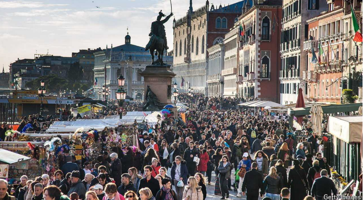
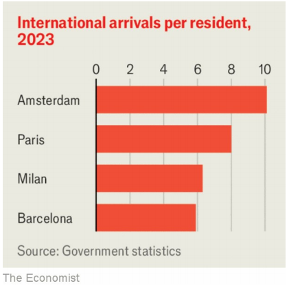

# How to make tourism work for locals and visitors alike

Holidays don’t have to be hell

原文：

The dollar is hovering near a two-decade high. That has unleashed a

multitude of American tourists keen to exercise their newfound spending

power, much to the dismay of snobbish Europeans and anyone who has a

fondness for empty, unspoilt beaches. And it has done so at a time when

tourism is back in fashion. Trips were up by 19% in the first quarter of this

year, compared with a year ago. They are forecast to exceed pre-covid levels

across the whole of the year.

美元徘徊在20年来的最高点附近。这释放了大量渴望行使其新发现的消费能力的美国游客，这让势利的欧洲人和任何喜欢空旷、未受破坏的海滩的人感到沮丧。而且是在旅游业重新流行的时候。与一年前相比，今年第一季度的旅游增长了19%。预计全年的旅游业将超过冠状病毒肺炎前的水平。

学习：

hovering：盘旋；徘徊；（hover的现在分词形式）

multitude：大量；众多；海量；无数；

a multitude of：众多；许许多多；大量          

spending power：消费能力；购买力          

newfound：新发现的；新得到的

dismay：美 [dɪsˈmeɪ] 沮丧；灰心；丧气；气馁

snobbish：美 [ˈsnɑːbɪʃ] 势利的；自大的；狂妄的；傲慢的；

have a fondness for：喜欢

unspoilt：美 [ˌʌnˈspɔɪlt] 未受破坏的；保持原貌的；未被污染的

in back in fashion：重新流行起来

exceed xxx levels：超过xxx的水平

原文：

But tourism’s revival is being met by a backlash. Popular destinations

including Barcelona, Dubrovnik, Majorca and Santorini have either

introduced or are considering limits on cruise ships. Japan is erecting

barriers to prevent tourists gathering to gawp at Mount Fuji. Tens of

thousands of protesters in Barcelona and the Balearic Islands have even

called for an end to “mass tourism”.

但是旅游业的复兴正遭到强烈反对。巴塞罗那、杜布罗夫尼克、马略卡岛和圣托里尼岛等热门目的地已经或正在考虑对游轮设限。日本正在竖起屏障，防止游客聚集在一起傻看富士山。巴塞罗那和巴利阿里群岛成千上万的抗议者甚至呼吁结束“大众旅游”。

学习：

revival： 美 [rɪˈvaɪvl] 复兴；复活；再生；振兴；

backlash：（对社会变动等的）强烈抵制；集体反对

popular destinations：热门旅游目的地

cruise ships：邮轮

erect barriers：设置障碍

gawp：美 [ɡɔp] 盯视

Mount Fuji：富士山

mass tourism：大众旅游

原文：

The arguments underpinning the protests are misguided—as are many of the

policies they inspire. Tourism is a useful source of revenue. Policymakers

can find ways to make it more bearable and more lucrative at the same time.

These do not involve bans on tourists or making destinations less attractive.

Instead, countries should pursue a more capitalist solution, by exercising

their pricing power.

支持抗议的论点是被误导的——正如它们所激发的许多政策一样。旅游业是一种有用的收入来源。政策制定者可以找到方法让它变得更容易忍受，同时也更有利可图。这些并不包括禁止游客或降低目的地的吸引力。相反，各国应该通过行使定价权来寻求更资本主义的解决方案。

学习：

lucrative：有利可图的

原文：

Tourism is big business. On a broad estimate, the industry earned $3.3trn

last year, equivalent to 3% of global GDP and 6% of cross-border financial

flows. For host countries, it is a welcome source of jobs as well as revenue.

The unemployment rates that spiked above 20% in much of southern Europe

in the 2010s would have been higher still had it not been for the millions of

visitors who came to soak up the sun.

旅游业是一项大生意。粗略估计，该行业去年盈利3.3万亿美元，相当于全球GDP的3%和跨境金融流量的6%。对于东道国来说，这是一个受欢迎的就业和收入来源。2010年代，南欧大部分地区的失业率飙升至20%以上，如果不是有数百万游客前来晒太阳，失业率还会更高。

学习：

big business：大生意

on a broad estimate：粗略估计

cross-border：跨境

spike：上升

soak up the sun：晒太阳

原文：

The problem, though, is that individual visitors inevitably fail to take into

account the effect they have on others. Congestion is a headache for

residents and tourists alike. Having to compete with the crowds for flat

rentals, seats on a bus and space on pavements spoils the quality of life for

city residents as much as it does the holiday experience for tourists.

然而，问题是个人游客不可避免地会忽略他们对他人的影响。拥堵是令居民和游客都头疼的问题。不得不与拥挤的人群争夺公寓租金、公共汽车上的座位和人行道上的空间，这对城市居民的生活质量和游客的度假体验一样不利。

学习：

congestion：拥塞；堵塞；阻塞；拥挤；

rentals：租金；租费；（rental的复数）          

pavement：人行道；硬路面；

spoil the quality of life：破坏生活质量

原文：

Taxes can help, by ensuring that tourists pay for the congestion costs they

impose. In some places taxes may deter the crowds. Travellers seeking

lovely beaches have lots of options, for instance. If Thailand were to make

visiting more costly, tourists would go to Vietnam instead. Indeed, one study

finds that every 10% increase in tourist taxes in the Maldives leads to a 5%

reduction in visitor numbers.

税收可以有所帮助，确保游客为他们强加的拥堵成本买单。在一些地方，税收可能会阻止人群。例如，寻找美丽海滩的旅行者有很多选择。如果泰国提高旅游费用，游客们会转而去越南。事实上，一项研究发现，马尔代夫旅游税每增加10%，游客数量就会减少5%。

学习：

Maldives：美 [ˈmɑlˌdivz] 马尔代夫；马尔代夫共和国

原文：

In some places the crowds might still come. Evidence suggests that tourist

taxes are mostly ineffective at dissuading people from visiting destinations

with standout attractions that cannot be found elsewhere, such as

Barcelona’s Sagrada Família. People respond by reallocating spending, for

example by choosing a cheaper hotel, rather than cancelling trips.

在一些地方，人群可能仍然会来。有证据表明，旅游税在劝阻人们前往具有其他地方找不到的突出景点的目的地方面几乎不起作用，例如巴塞罗那的Sagrada Família。人们的反应是重新分配支出，比如选择更便宜的酒店，而不是取消旅行。

学习：

dissuading：美 [dɪ'swedɪŋ] 劝阻；（dissuade的现在分词）

standout：杰出的；显著的；突出的；

原文：

However, that is not a reason for despair. For one thing, imposing much

higher levies might have more of an effect on numbers. The taxes that

already exist are set at paltry levels. In October Barcelona’s nightly hotel tax

will increase, but only to €4 ($4.30); a day-pass to enter Venice sets you

back a mere €5, which would barely cover a cup of coffee in St Mark’s

Square. The market could bear much higher prices.

然而，这不是绝望的理由。首先，征收高得多的税可能会对数字产生更大的影响。已经存在的税收被设定在微不足道的水平。10月份巴塞罗纳的每晚酒店税将会增加，但仅限于€4英镑(4.30美元)；进入威尼斯的一日通票只花了你5英镑，还不够在圣马克广场喝一杯咖啡。市场可以承受更高的价格。

学习：

paltry：美 [ˈpɔltri] 微不足道的；微小的；少量的

day-pass：一日通行证

set back：花费

>"Set back" 的意思是使某人或某物花费一定的金额。这个词组通常用来表示某个费用或支出。
>
>**英文**：
>
>1. The new phone set me back $800, which was more than I had expected.
>2. 这部新手机让我花费了800美元，比我预期的要多。

原文：

If visitors are willing to go elsewhere, underdeveloped tourist sites could

then have a chance to attract their business. If people insist on visiting the

hot spots, extra taxes levied via airlines or hotels could pay for infrastructure

that makes life better for tourists and residents alike. In addition, other

measures can encourage people to spend time in less congested places or

neighbourhoods. As well as erecting barriers, Japanese authorities more

sensibly sometimes impose a congestion charge on Mount Fuji. Copenhagen

offers ice cream to tourists who do a bit of litter picking. Once the pricing is

right, residents who are still grumpy or who hate crowds have the freedom to

move somewhere else.

如果游客愿意去其他地方，欠发达的旅游景点就有机会吸引他们的业务。如果人们坚持参观热点，通过航空公司或酒店征收的额外税收可以支付基础设施建设，使游客和居民的生活更加美好。此外，其他措施可以鼓励人们花时间在不太拥挤的地方或街区。除了设置障碍，日本当局有时更明智地对富士山征收拥堵费。哥本哈根向捡垃圾的游客提供冰淇淋。一旦定价合适，脾气仍然不好或讨厌拥挤的居民就可以自由地搬到其他地方。

学习：

hot spots：热闹地区；热点地区；热闹场所          

sensibly：聪明地；明显地；容易感知地；明智地

litter picking：捡垃圾

grumpy：脾气暴躁的；易怒的；脾气不好的

原文：

Some might object that tourist taxes are unfair, because they stop young or

poor visitors from seeing the world. Yet tourism is always unequal. And

passes or tax-free travel could be granted to students or unemployed people,

as happens at many museums. Venetians may shake their fists when a fresh

boatload of cruise passengers arrives; they should instead be rubbing their

hands in glee. ■

有些人可能会反对旅游税不公平，因为它阻止了年轻或贫穷的游客环游世界。然而旅游业总是不平等的。和许多博物馆一样，学生或失业者可以获得通行证或免税旅行。当一船新的游轮乘客到来时，威尼斯人可能会挥舞拳头；他们应该高兴地搓着手。■

学习：

object：反对；不赞成；不同意；

Venetian：美 [vəˈniʃən]  威尼斯人

fist：拳头

rubbing：摩擦；擦拭；磨擦；搓

glee：快乐；欢喜

## 后记

2024年8月4日13点33分于上海。

