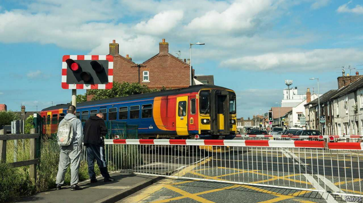

# Britain’s railways go from one extreme to another

Departing: privatisation. Destination: centralisation

出发:私有化。目的地:集中化

depart：出发

privatisation：美 [ˌpraɪvətaɪ'zeɪʃən] 私有化；民营化；私营化

原文：

When britain’s railways were nationalised for the first time, in 1948,

politicians steamed. Conservative peers called it “a most ghastly mistake”

and “by far the biggest measure of Socialism which had ever been proposed

in the world outside Russia”. By contrast, the new government’s

renationalisation programme is chugging along quietly. A bill to bring

passenger-train operations into public ownership passed its second reading

in the House of Commons on July 29th, following a thinly attended debate.

Polls show that most people, including most Conservative voters, approve.

1948年，当英国铁路第一次被国有化时，政治家们怒火中烧。保守派同僚称之为“最可怕的错误”和“迄今为止在俄罗斯以外的世界提出的最大的社会主义措施”。相比之下，新政府的再国有化计划进展缓慢。7月29日，一项将客运列车运营收归国有的法案在下议院通过了第二次正式讨论和辩论阶段，之前的辩论很少有人参与。民调显示，大多数人，包括大多数保守派选民，都赞成。

学习：

steam：生气；发怒；

>在这个上下文中，**steam**（蒸汽）作为动词使用，表示愤怒或气愤地说话或表现。
>
>**例子**：When the new policy was announced, employees steamed with frustration. (当新政策公布时，员工们愤怒地表示不满。)

ghastly：美 [ˈɡæstli] 可怕的；恐怖的；令人毛骨悚然的；

ghastly mistake：极大的错误          

>
>
>**Ghastly mistake** 意思是极其可怕的错误，通常指对某事的强烈反对或认为这是一个非常严重的错误。
>
>**例子**：The decision to cut down the ancient forest was seen as a ghastly mistake by environmentalists. (环保人士认为砍伐古老森林的决定是一个极其可怕的错误。)

chugging：美 ['tʃʌgɪŋ] 发出轧轧声；发出突突声；一口气喝完；（chug的现在分词形式）

>**Chugging**（缓慢且稳定地前进）通常用于描述列车的运行方式，这里用来比喻政府的重新国有化计划在稳步推进。
>
>**例子**：The project is chugging along despite some initial setbacks. (尽管有一些初期的挫折，项目仍在稳步推进。)

passenger-train：客运列车

House of Commons：下议院，众议院

thinly attended：很少有人出席

second reading:

>**Second reading** 是议会立法过程中法案的第二次正式讨论和辩论阶段，在此阶段，议员们会对法案的主要原则进行辩论。
>
>**例子**：The environmental bill passed its second reading in Parliament last week. (上周，环境法案通过了议会的第二次辩论。)

原文：

This smooth passage is a surprise, because if you take a long view, Britain is

doing something extraordinary. In the 1990s a Conservative government

dismembered British Rail, which had run the railways since nationalisation,

and embarked on a radical programme of privatisation. Once the new

government has finished its work, Britain will end up with one of the rich

world’s most centrally controlled railways. That may not leave it better off

这一顺利通过令人惊讶，因为如果你从长计议，英国正在做一些非同寻常的事情。20世纪90年代，保守党政府拆分了自国有化以来一直经营铁路的英国铁路公司，并开始了激进的私有化计划。一旦新政府完成其工作，英国将成为发达国家中最集中控制的铁路之一。这可能不会让它过得更好

学习：

dismembered：分割；（dismember的过去式和过去分词）          

embark on：着手，开始

>**Embark on**（开始）表示开始一项新的或重要的活动或任务，通常是需要计划和努力的。
>
>**例子**：The company decided to embark on a new marketing campaign to boost sales. (公司决定开始一项新的营销活动以提高销售额。)

passage：顺利通过

>在这个上下文中，**passage**（通过）指的是某事顺利进行或顺利通过，例如法案在议会中的通过。
>
>**例子**：The passage of the new law was met with widespread approval. (新法律的通过得到了广泛的认可。)

原文：

The government’s plans are in two parts, and will take two bills to achieve.

First comes the renationalisation of passenger services. At present most

intercity trains are run by firms that contract with the Department for

Transport. As their contracts expire or reach break points, the department

will not renew them. All the services should be in public hands by October 2027.

A second bill will create Great British Railways, a powerful quango

that will oversee train operations, railway infrastructure and much else.

政府的计划分为两部分，需要两个法案才能实现。首先是客运服务的重新国有化。目前，大多数城际列车是由与交通部签订合同的公司运营的。当他们的合同到期或达到临界点时，该部将不再续签合同。到2027年10月，所有的服务都将掌握在公众手中。第二项法案将创建大英国铁路，一个强大的半官方机构，将监督列车运行，铁路基础设施和许多其他方面。

学习：

quango：美 [ˈkwæŋɡoʊ] 准自治管理机构；半自治政府机构

原文：

If this does not seem like a lurch, it is partly because of what has happened

in the past few years. Since 2018 the Department for Transport has taken

over four railway franchises from companies that ran into trouble. Most of

the remaining private train operators are firmly under the state’s thumb.

They used to have considerable freedom to innovate and set ticket prices,

but lost it when the state bailed them out during the covid-19 pandemic.

“Effectively, the railway is already nationalised,” says Andy Bagnall, the

head of Rail Partners, which represents train operators.

如果这看起来不像是突然的，部分原因是因为过去几年发生的事情。自2018年以来，运输部已经从陷入困境的公司手中接管了四个铁路特许经营权。大多数现存的私人火车运营商都被国家牢牢控制着。他们曾经有相当大的创新和设定票价的自由，但在新冠肺炎疫情期间，当国家对他们进行救助时，他们失去了这种自由。“实际上，铁路已经被国有化了，”代表铁路运营商的铁路合作伙伴的负责人安迪·巴格纳尔说。

学习：

lurch：蹒跚；突然的转变

>
>
>**Lurch**（突然的改变）在这个上下文中指的是一个突然的或剧烈的变化。
>
>**例子**：The sudden lurch in the stock market caused panic among investors. (股市的突然剧变引起了投资者的恐慌。)

franchises：美 [ˈfræntʃaɪzɪz]

>**Franchise**（特许经营权）在这个上下文中指的是政府授予公司经营铁路的权利。
>
>**例子**：The fast-food chain granted a new franchise to an entrepreneur in the city. (快餐连锁店向该市的一位企业家授予了新的特许经营权。)
>
>
>
>在NBA等体育联盟中，**franchise**指的是一个特许经营队伍或俱乐部。每个**franchise**是由联盟授权在特定地区运营的独立球队，通常由私人或集团拥有和管理。
>
>例子
>
>1. **NBA中的Franchise**
>   - **解释**：在NBA中，洛杉矶湖人队（Los Angeles Lakers）就是一个特许经营队伍，或者说是一个**franchise**。他们被授权在洛杉矶地区运营和比赛。
>   - **例子**：The Los Angeles Lakers franchise has won multiple NBA championships. (洛杉矶湖人队这个特许经营队伍赢得了多个NBA冠军。)
>
>2. **NFL中的Franchise**
>   - **解释**：在NFL中，新英格兰爱国者队（New England Patriots）是一个**franchise**，他们在波士顿地区运营。
>   - **例子**：The New England Patriots franchise is known for its successful history in the NFL. (新英格兰爱国者队这个特许经营队伍以其在NFL中的成功历史而闻名。)
>
>3. **NHL中的Franchise**
>   - **解释**：在NHL中，多伦多枫叶队（Toronto Maple Leafs）是一个**franchise**，他们在多伦多地区比赛。
>   - **例子**：The Toronto Maple Leafs franchise has a passionate fan base. (多伦多枫叶队这个特许经营队伍拥有一群热情的粉丝。)
>
>中文解释
>
>在NBA等体育联盟中，**franchise**（特许经营权）指的是由联盟授权在特定地区运营的独立球队。每个**franchise**都是一个独立的商业实体，拥有自己的管理团队和财务安排，但在竞技和运营上遵循联盟的规定和标准。

effectively：实际上；事实上

under one's thumb: 被xxx控制或支配

>**Under one's thumb**（在某人的掌控之下）表示完全被某人控制或支配。
>
>**例子**：The manager kept all his employees under his thumb, monitoring their every move. (经理将所有员工都掌控在手中，监控他们的一举一动。)

原文：

Another reason for the smooth journey to central control is that almost

nobody likes the current arrangements. Poor co-ordination between private

train operators, Network Rail (which looks after the infrastructure) and other

parts of the system wrecked the transition to a new timetable in 2018.

Innovations like digital signalling, which ought to allow more trains to run

on a line, are far harder than they should be. Andrew Haines, Network Rail’s

boss, recently called the introduction of digital signalling on one short

stretch of track “as close to impossible as anything I’ve ever encountered in

my life”.

中央控制之旅顺利的另一个原因是几乎没有人喜欢目前的安排。私营火车运营商、网络铁路(负责基础设施)和系统其他部分之间的不协调破坏了2018年向新时间表的过渡。像数字信号这样的创新，本应允许更多的列车在一条线路上运行，却比想象中困难得多。Network Rail的老板Andrew Haines最近称在一小段轨道上引入数字信号“几乎是我一生中遇到的最不可能的事”。

学习：

wreck：毁坏；破坏；摧毁

one short stretch of track：一小段轨道

原文：

Even so, Britain is travelling in an unusual direction. Under pressure from

the EU, other European countries are allowing more room for private

operators. Long-distance trains in France remain a virtual state monopoly,

but in May the regulator approved a deal that will allow a private company

to compete. The firm’s name, Kevin Speed, evokes the Porsche-driving,

wide-tied chancers who appeared in Britain in the era of privatisation and

deregulation.

即便如此，英国正朝着一个不寻常的方向前进。在欧盟的压力下，其他欧洲国家允许私人运营商有更多的空间。法国的长途火车实际上仍然是国家垄断的，但是在五月，监管机构批准了一项交易，允许一家私营公司参与竞争。该公司的名字，凯文·斯比德，让人想起在私有化和放松管制的时代出现在英国的开着保时捷的宽领带投机者。

学习：

long-distance trains：长途火车

chancer：尽力利用机会的人; 冒险家，投机者

>**解释**：chancer 是指冒险家或投机者，通常用来形容那些愿意冒险以获取机会和利益的人，带有一些负面意味。
>
>**例子**：He's a bit of a chancer, always looking for the next big opportunity. (他有点儿像个冒险家，总是在寻找下一个大机会。)

evoke: 唤起，让人联想到

>
>
>**解释**：evoke 的意思是唤起、引起或让人联想到某事物。它通常指通过形象或描述使人们想起某种感觉或记忆。
>
>**例子**：The smell of fresh bread evoked memories of my grandmother's kitchen. (新鲜面包的味道唤起了我对祖母厨房的记忆。)
>
>**句中**：The firm’s name, Kevin Speed, evokes the Porsche-driving, wide-tied chancers who appeared in Britain in the era of privatisation and deregulation. (该公司的名字 Kevin Speed 让人联想到在英国私有化和放松管制时代出现的那些开着保时捷、打着宽领带的冒险家。)

wide-tied：

>wide-tied 是指打着宽领带的，通常用来形容一种特定的时尚风格，尤其是在20世纪80年代较为流行。这种打扮常与自信、甚至是自负的人联系在一起。
>
>**例子**：In the 80s, many businessmen were known for their wide-tied suits. (在80年代，许多商人以他们的宽领带西装而闻名。)

原文：

Britons probably like the idea of renationalisation because they believe it

will improve performance. If it creates a more integrated railway, with better

co-ordination between infrastructure and train operation, they might be

proved right. But running a railway is not easy, as the previous government

showed over the course of recent years. The Office of Rail and Road, a

regulator, tracks the performance of 24 passenger-railway operators. Over

the year to March 2024, three of the franchises run by the Department for

Transport were among the top five with the most cancellations (if you

include services removed from the schedule in advance, not just on the day

they were due to run).

英国人可能喜欢重新国有化的想法，因为他们相信这将提高业绩。如果它创造了一条更加一体化的铁路，基础设施和列车运行之间有更好的协调，他们可能会被证明是正确的。但是经营一条铁路并不容易，正如前一届政府在最近几年中所显示的那样。监管机构铁路和公路办公室追踪了24家客运铁路运营商的表现。在截至2024年3月的一年中，运输部运营的三个特许经营权是取消最多的五大特许经营权之一(如果你包括提前从日程表中删除的服务，而不仅仅是在预定运营的那一天)。

学习：

course：进展

>**解释**：course 在这里指的是一段时间内的进展或发展。
>
>**例子**：Over the course of the project, we encountered several unexpected challenges. (在项目进行的过程中，我们遇到了几个意想不到的挑战。)
>
>**句中**：But running a railway is not easy, as the previous government showed over the course of recent years. (但是经营铁路并不容易，正如前任政府在最近几年的过程中所显示的那样。)

due to run：计划运行的

>**解释**：due to run 指预定要运行或计划要运行的。常用于描述列车或交通工具的计划运行时间。
>
>**例子**：The train was due to run at 9 AM but was delayed due to technical issues. (火车原定于上午9点运行，但由于技术问题被延误了。)

原文：

Nor has the state managed to respond intelligently to the railways’ greatest

problem: the huge changes in travel patterns since the pandemic. Railway

journeys are still one-tenth lower than in 2019 despite the popularity of the

new Elizabeth Line in south-east England. As office drones have taken to

working from home, season-ticket sales have collapsed by two-thirds. In

2021 the government tried to lure people back by introducing a new flexible

season ticket, but sales have been slow.

国家也没有设法明智地应对铁路最大的问题:自疫情以来交通方式的巨大变化。尽管英格兰东南部的新伊丽莎白线很受欢迎，但铁路旅行仍比2019年低十分之一。随着办公室职员开始在家里工作，季票销售额已经下降了三分之二。2021年，政府试图通过引入一种新的灵活的季票来吸引人们回来，但销售一直缓慢。

学习：

office drones：办公室职员

>**解释**：office drones 指的是在办公室工作中从事单调、重复性任务的员工，通常带有些许贬义，暗示他们像机器一样工作，没有创造性。
>
>**例子**：Many office drones feel unappreciated and unfulfilled in their repetitive tasks. (许多办公室职员在重复的工作中感到没有得到认可和不满足。)
>
>**句中**：As office drones have taken to working from home, season-ticket sales have collapsed by two-thirds. (由于办公室职员开始在家工作，季票销售量下降了三分之二。)

原文：

Other troubles lie ahead. The calamity of HS2, an endlessly overrunning

infrastructure project, means less money for other initiatives and perhaps

less confidence that Britain is capable of transforming its railways. A few

hours before the railway nationalisation bill passed its second reading in the

Commons, the chancellor, Rachel Reeves, nixed a scheme that might have

brought some old railway lines back into use. Meanwhile, metropolitan

mayors such as Andy Burnham in Greater Manchester and Sadiq Khan in

London are demanding more control over railway services in their

territories. Renationalisation and the creation of Great British Railways

might only end up providing travelling Britons with new targets for their

anger. ■

其他麻烦还在前面。HS2的灾难，一个永无止境的基础设施项目，意味着用于其他项目的资金减少，或许也减少了对英国有能力改造其铁路的信心。铁路国有化法案在下议院通过第二次正式讨论和辩论阶段的几个小时前，财政大臣雷切尔·里夫斯否决了一项可能使一些旧铁路线重新投入使用的计划。与此同时，大曼彻斯特的安迪·伯纳姆(Andy Burnham)和伦敦的萨迪克·汗(Sadiq Khan)等大都市市长要求对其辖区内的铁路服务进行更多控制。重新国有化和伟大的英国铁路的建立可能只会给旅行中的英国人提供新的愤怒目标。■

学习：

calamity：美 [kəˈlæməti] 灾难；灾祸；不幸；悲剧

nixed：阻止；拒绝；（nix的过去式和过去分词）

lie ahead：在前方等待，指未来即将发生或面临的事情。

>
>
>**解释**：指未来即将发生或面临的事情。
>
>**例子**：Challenges lie ahead as the company prepares to launch its new product. (随着公司准备推出新产品，挑战在前方等待。)
>
>**句中**：Other troubles lie ahead. (其他麻烦在前方等待。)

HS2: High Speed 2高铁项目

>High Speed 2 (HS2) 是英国的一个高铁项目，旨在提高从伦敦到中部和北部城市的铁路运输速度和容量。
>
>**例子**：HS2 aims to connect London with Birmingham, Manchester, and Leeds with high-speed rail. (HS2旨在通过高铁连接伦敦、伯明翰、曼彻斯特和利兹。)
>
>**句中**：The calamity of HS2, an endlessly overrunning infrastructure project, means less money for other initiatives. (HS2项目的灾难性进展，这个无休止超支的基础设施项目，意味着其他计划的资金减少。)

overrunning: 超支或超时，指项目或计划超出预计的时间或预算。

>**解释**：指项目或计划超出预计的时间或预算。
>
>**例子**：The construction project is overrunning both its budget and schedule. (这个建筑项目的预算和进度都超出了预期。)
>
>**句中**：The calamity of HS2, an endlessly overrunning infrastructure project. (HS2项目的灾难性进展，这个无休止超支的基础设施项目。)

## 后记

2024年8月5日18点40分于上海。

