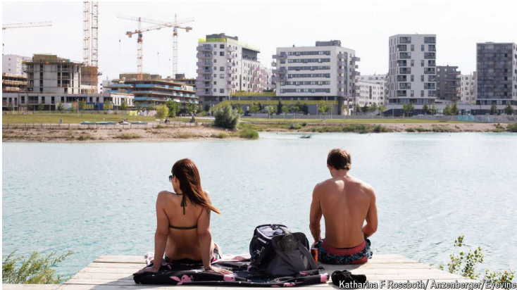

# Vienna’s social housing, lauded by progressives, pushes out the poor

The city’s most hard-up rely on the private sector

social housing：公共住房

lauded：美 [lɔ:did] 赞美；称赞；（laud的过去式）

push out：排除在外

>**解释**：迫使或挤出，通常指把某人或某群体排除在外或使其无法进入某个地方或系统。
>
>**例子**：High property prices are pushing out low-income families from the city center. (高昂的房价正在把低收入家庭挤出市中心。)
>
>**句中**：Vienna’s social housing, lauded by progressives, pushes out the poor. (维也纳的社会住房，受到进步人士的赞扬，却将穷人排挤出去。)>

hard-up: 经济苦难的

>**解释**：经济困难的，拮据的。
>
>**例子**：Many families are hard-up and struggling to pay their bills. (许多家庭经济困难，难以支付账单。)
>
>**句中**：The city’s most hard-up rely on the private sector. (城市中最困难的居民依赖私营部门。)

the poor：穷人

原文：

With the mercury hitting 35°C this summer, many Viennese have headed for

rooftop pools. At Aspern Seestadt, one of Europe’s largest housing projects,

they can plunge into an artificial lake or take the kayak out for a paddle.

Such are the joys of the projects, Viennese-style. Aquatics for the many, not

the few.

随着今年夏天气温达到35摄氏度，许多维也纳人都去了屋顶泳池。在欧洲最大的住宅项目之一Aspern Seestadt，他们可以一头扎进人工湖或者划着皮划艇出去玩。这就是维也纳风格的项目的乐趣。大众游泳，而不是少数人。

学习：

rooftop：屋顶；房顶

plunge：（尤指向水中）纵身投入；一头进入；

plunge into：跳入；跳进；投入

plunge into an artificial lake：一头扎进人工湖

kayak：美 [ˈkaɪæk] 皮划艇；小型划艇；

paddle：船桨

aquatics： 美 [ə'kwætɪks] 水上运动；水生动植物；（aquatic的复数）

mercury：在这里是指温度计中的水银，代表温度。

>**解释**：在这里是指温度计中的水银，代表温度。
>
>**例子**：With the mercury rising, people are looking for ways to cool down. (随着气温上升，人们在寻找降温的方法。)
>
>**句中**：With the mercury hitting 35°C this summer, many Viennese have headed for rooftop pools. (今年夏天气温达到35摄氏度，许多维也纳人前往屋顶游泳池。)

**摄氏度用英文怎么说**：

- **解释**：Celsius
- **例子**：The temperature is 35 degrees Celsius today. (今天的气温是35摄氏度。)

for a paddle： 划桨

>**解释**：划桨，指使用皮划艇或独木舟等小船在水上划行。
>
>**例子**：They took the kayak out for a paddle on the lake. (他们把皮划艇拿出来在湖上划行。)
>
>**句中**：At Aspern Seestadt, one of Europe’s largest housing projects, they can plunge into an artificial lake or take the kayak out for a paddle. (在阿斯彭海城，这是欧洲最大的住房项目之一，他们可以跳进人工湖或划皮划艇。)

原文：

About 60% of Vienna’s population of 2m or so live in “social housing”,

where rents are kept low by the city. Apartments are often small, but the

amenities—kindergartens, laundries and pools—generous. A two-bedroom

unit of 80 square metres (861 square feet) with a garden costs as little as

€900 ($975) a month. Vienna is regularly voted the world’s most liveable

city: cheap housing means more money for the good life. Just 44% of

Viennese spend over a quarter of their income on housing (including energy

costs); in London it is 86%, in Paris 67%. Renters can keep their apartments

for life at roughly the same rent.

维也纳200万左右的人口中，约有60%住在“社会住房”里，这里的租金由市政府维持在较低水平。公寓通常很小，但设施——幼儿园、洗衣房和游泳池——非常丰富。一套80平方米(861平方英尺)带花园的两居室公寓，月租金低至900€(975美元)。维也纳经常被评为世界上最适宜居住的城市:廉价的住房意味着更多的钱来享受美好的生活。只有44%的维也纳人将超过四分之一的收入用于住房(包括能源成本)；伦敦是86%，巴黎是67%。租房者可以以大致相同的租金终身保有他们的公寓。

学习：

amenities：美 [əˈmenətiz] 便利设施；礼仪；（amenity的复数）

liveable：英 [ˈlɪvəb(ə)l] 适宜居住的；宜居的

most liveable city：最宜居的城市

原文：

This housing model is a legacy of “Red Vienna”, a period after the first

world war when a socialist city council started building proletarian fortresses

such as the gigantic Karl-Marx-Hof. It has recently been attracting enormous

interest from abroad. Droves of American city planners grappling with

homelessness and soaring rents have come over to learn whether the

Viennese model can work in places like San Diego. The *New York Times* has

lauded Vienna as a “renters’ utopia”.

这种住宅模式是“红色维也纳”的遗产，这是一战后的一段时期，当时一个社会主义市议会开始建造无产阶级堡垒，如巨大的Karl-Marx-Hof.。它最近吸引了国外的巨大兴趣。成群结队的美国城市规划者正在努力解决无家可归和房租飙升的问题，他们前来学习维也纳模式是否能在圣地亚哥等地奏效。《纽约时报》称赞维也纳是“租房者的乌托邦”。

学习：

proletarian：美 [ˌproʊləˈtɛriən] 无产阶级的；工人阶级的

fortresses： 美 [ˈfɔrtrəs] 堡垒；要塞；（fortress的复数）

city council：市议会；市政局          

droves of：一群人；

grappling with：与xxx搏斗

laud：称赞

原文：

That all depends on who is renting. True, young people can ditch their

parents in their early 20s. But even many Viennese acknowledge that the

model is no longer fit for purpose in a fast-growing, prosperous city.

Designed to provide housing for the poorest, Vienna’s social housing now

mostly benefits the well-off.

那完全取决于谁在租房。诚然，年轻人可以在20岁出头就离开父母。但甚至许多维也纳人也承认，这种模式不再适合这个快速发展、繁荣的城市。旨在为最贫穷的人提供住房的维也纳社会住房现在主要惠及富人。

学习：

ditch：抛弃；摆脱；丢弃；

well-off：富有的；有钱的

原文：

The council owns and runs about 220,000 apartments directly, including old

fashioned *Gemeindebauten* (community flats) such as the Karl-Marx-Hof.

Most of the action, however, centres on 58 “limited-profit housing

associations” (LPHAs), which account for some 20% of the city’s housing. A

national housing tax of 1% divided equally between employers and

employees helps these schemes. The council reduces the LPHAs’ costs, for

example by letting them buy land at knock-down rates.

委员会直接拥有和经营约220，000套公寓，包括老式的社区公寓，如Karl-Marx-Hof。然而，大部分行动都集中在58个“有限利润住房协会”(LPHAs)上，这些协会占了该市住房的20%。雇主和雇员均分1%的国家住房税有助于这些计划。委员会降低了LPHAs的成本，例如让他们以低价购买土地。

学习：

knock-down：低廉的；

原文：

About 80% of Vienna’s population qualify for social housing, so high are the

income limits: €57,600 after tax for one person and over €100,000 for a

couple with two children. The council boasts that this makes it “inclusive”:

the entire middle class gets access to subsidised housing. But the barriers to

entry are such that it is mostly the middle class that benefits.

大约80%的维也纳人有资格申请社会住房，收入限制很高:一个人税后57，600欧元，一对夫妇带两个孩子超过100，000欧元。该委员会夸口说这使其具有“包容性”:整个中产阶级都能获得补贴住房。但准入门槛如此之高，以至于受益的大多是中产阶级。

原文：

For a start, people can enter the housing queue (sometimes two years long or

more) only if they are citizens of an EU country and have been registered for

two years at the same address in Vienna. Applicants also have to

demonstrate a regular income. These criteria knock out many immigrants,

new arrivals and those without regular jobs. Non-Austrians make up 34% of

Vienna’s population and Austria has very low naturalisation rates.

首先，只有当人们是某个欧盟国家的公民，并且在维也纳的同一个地址登记了两年，他们才能进入住房队列(有时长达两年或更久)。申请人还必须证明有固定收入。这些标准将许多移民、新来者和没有固定工作的人排除在外。非奥地利人占维也纳人口的34%，奥地利的入籍率非常低。

学习：

regular income：固定收入

knock out：淘汰

naturalisation：英 [ˌnætʃərəlɪ'zeɪʃən] 同化；归化；（外国的习惯、语言等的）移入

naturalisation rate：入籍率

原文：

Moreover, rent is not the only cost for an LPHA apartment. Prospective renters

must make a down payment of up to €500 per square metre to meet building

costs. So-called “smart apartments” charge much less, but are often tiny, just

40 square metres. The council argues that such fees “protect the system from

being overrun”; critics say they simply keep immigrants and the poor out of

middle-class enclaves. Only 9% of renters in the LPHA sector have low

incomes. Since residents can stick around for life, the council has struggled

to prevent tenants with houses elsewhere from renting out their municipal

flats.

此外，租金并不是LPHA公寓的唯一成本。未来的租户必须支付每平方米500€的首付，以满足建筑成本。所谓的“智能公寓”收费低得多，但通常很小，只有40平方米。该委员会认为，这种费用“保护系统不被超支”；批评者说，他们只是把移民和穷人挡在中产阶级的飞地之外。在LPHA地区，只有9%的租房者收入较低。由于居民可以终身居住，市政委员会努力阻止在其他地方有房子的租户出租他们的市政公寓。

学习：

down payment: 首期付款；（分期付款中的）头期款；首付；订金；预付定金          

enclave: 美 [ˈɛnˌkleɪv]  飞地；孤立区（指完全被另一国家领土包围的一小块领土）；被包围的区域

tenants: 美 [ˈtenənts] 房客；占用者；承租人；（tenant的复数）

原文：

Ironically, the poorest quarter of Vienna’s residents often have to rent in the

private sector. There, rents are needlessly high, argues Hans Ulreich, a

property developer. Private builders must follow the same dense

bureaucratic procedures as the municipal housing sector. Mr Ulreich thinks

regulations could be significantly reduced without losing safety or quality.

Vienna’s population is growing by 20,000 per year, and social housing alone

cannot meet the demand. The Viennese model was ground-breaking in the

1920s, but it is no panacea—and is due for an update. ■

具有讽刺意味的是，维也纳最贫穷的四分之一居民经常不得不租住在私人住宅。房地产开发商Hans Ulreich认为，那里的租金高得没有必要。私人建筑商必须遵循与市政住房部门相同的繁琐官僚程序。乌尔赖希先生认为，在不损失安全和质量的情况下，可以大大减少监管。维也纳的人口每年增长20，000人，单靠社会住房无法满足需求。维也纳模式在20世纪20年代是开创性的，但它不是万灵药——是时候更新了。■

学习：
property developer：房地产开发商

panacea：美 [ˌpænəˈsiə] 万能药；灵丹妙药；万灵药

## 后记

2024年8月5日19点43分于上海。

