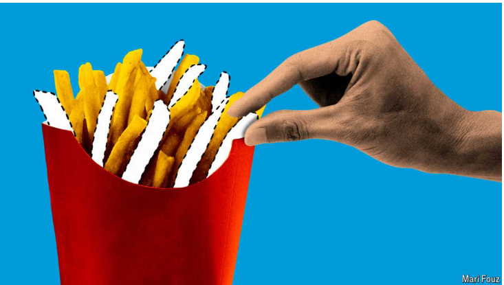

# What Chipotle and McDonald’s say about the consumer slowdown

Americans still want more than just the lowest price

原文：

Near Schumpeter’s home in Los Angeles are two fast-food restaurants

almost kitty-corner to each other, as Americans quaintly put it. In different

ways, both help explain one of the biggest puzzles in today’s business

environment: the state of the American consumer. One is Chipotle Mexican

Grill, a canteen-like restaurant famous for its burritos and bowls of chicken,

the cheapest of which comes with rice, beans, salsa and various other

toppings, and which costs $10.60. The other is McDonald’s, home of the

hamburger. Its cheapest meal deal is $5. It comes with a burger, nuggets,

fries and such generous quantities of salt it is a blessing that there is a fizzy

drink to wash it down with.

正如美国人奇怪地说的那样，在洛杉矶熊彼特的家附近，有两家快餐店几乎是相邻的。两者都以不同的方式解释了当今商业环境中最大的困惑之一:美国消费者的状况。其中一家是Chipotle Mexican Grill，这是一家类似食堂的餐厅，以墨西哥卷饼和鸡肉碗闻名，最便宜的有米饭、豆子、莎莎酱和各种其他配料，售价10.60美元。另一个是麦当劳，汉堡包之乡。它最便宜的一餐是5美元。它配有汉堡、鸡块、薯条和如此大量的盐，幸好有碳酸饮料可以下咽。

学习：
kitty-corner：在……斜对面的（地）

put it: 表达，说
>**Put it** 的意思是“表达”或“说”。在这个语境中，它指的是美国人如何用“kitty-corner”这个词来描述两个位置几乎对角线相对的餐馆。
>
>- 例子：He put it very clearly: we need to finish the project by Friday. (他表达得很清楚：我们需要在星期五之前完成这个项目。)

quaintly：美 [kweɪntlɪ] 优雅地；古雅地；离奇有趣地

>**Quaintly** 的意思是“古雅地”或“古怪地”，通常带有一种怀旧或特殊的感觉。在这个语境中，它指的是美国人用“kitty-corner”这个词有一种古怪或独特的方式。
>
>- 例子：The village has a quaintly charming atmosphere with its cobblestone streets and old houses. (这个村庄有着一种古雅迷人的氛围，街道上铺满了鹅卵石，房子也很古老。)

burrito：美 [bəˈridoʊ]  墨西哥卷饼

salsa：辣番茄沙司；辣番茄调味汁

fizzy drink：汽水；气泡饮料；碳酸饮料

nuggets：鸡块

>- **Nuggets**：指的是小块鸡肉，通常被涂上面糊并油炸，常见于快餐店的菜单中。
>
>例子：The children were excited to see chicken nuggets on the menu. (孩子们看到菜单上有鸡块时很兴奋。)

**Chipotle** 的发音是 /tʃɪˈpoʊtleɪ/

原文：

You might think Chipotle would be suffering more in a world where

consumers face high housing costs, utility bills and petrol prices, their

savings are running down, and the job market is getting shakier. Not only is

its menu dearer. In recent months the chain, a darling of millennials and gen-

Zs, has found a hit squad of TikTok influencers on its case, filming

themselves jabbing its bowls of chicken with their forks and accusing it of

scrimping on the size of its famously generous portions.

你可能会认为，在一个消费者面临高住房成本、公用事业账单和汽油价格，他们的储蓄正在减少，就业市场越来越不稳定的世界里，Chipotle会遭受更多的痛苦。不仅它的菜单更贵。最近几个月，作为千禧一代和Z时代的宠儿，这家连锁店在它的案子上找到了一个由抖音有影响力的人组成的热门团队，拍摄他们用叉子戳鸡肉碗，指责它在众所周知的慷慨份量上节省开支。

学习：

utility bills: 水电费、煤气费等生活设施的费用

>**Utility bills** 指的是水电费、煤气费等基本生活设施的费用。通常包括电费、水费、燃气费和其他公用事业服务费用。
>
>- 例子：Many families are struggling to pay their utility bills due to rising energy prices. (由于能源价格上涨，许多家庭在支付水电费方面遇到了困难。)

petrol：汽油

shakier：摇晃的；不可靠的；不稳固的；（shaky的比较级）

the job market is getting shakier：就业市场不稳定

dearer：昂贵的；（dear的比较级）

squad：小队；小组

hit squad：一队人评论批评

>**Hit squad** 通常指的是一组特定的人员，任务是针对某人或某事进行批评或攻击。在这个语境中，它指的是一群 TikTok 网红，他们专门拍摄视频来批评 Chipotle，指责其鸡肉碗的份量减少。
>
>- 例子：The company's latest product was targeted by a hit squad of online reviewers, who quickly pointed out its flaws. (该公司的最新产品遭到一群网络评论者的攻击，他们迅速指出了产品的缺陷。)

jabbing：戳；猛击；刺 （jab的现在分词）

scrimpling：美 [skrɪmpɪŋ] 过度缩减；节省；（scrimp的现在分词形式）

原文：

But you would be wrong. In an earnings call on July 24th, its boss, Brian

Niccol, acknowledged the portion-size problem in a small number of its

restaurants and pledged to fix it. Despite the fuss, business boomed in the

quarter from April to June. Chipotle’s sales grew by a whopping 18% in the

period, compared with the same three months in 2023. Demand increased in

every income group, Mr Niccol said.

但是你错了。在7月24日的收益电话会议上，它的老板Brian Niccol承认在它的少数餐馆中存在份量不足的问题，并承诺解决这个问题。尽管如此，从4月到6月的这个季度里，生意还是蒸蒸日上。与2023年同期相比，Chipotle的销售额在此期间增长了18%。尼科尔表示，每个收入群体的需求都在增加。

学习：

portion-size：份量大小

>**Portion-size** 指的是食物的份量。在这个上下文中，它指的是 Chipotle 餐厅所提供的食物分量。
>
>- 例子：Many customers complained about the reduced portion-size at their favorite restaurant. (许多顾客抱怨他们最喜欢的餐厅减少了食物的份量。)

fuss：美 [fʌs] 麻烦；争论；抗议；争议

>**Fuss** 指的是骚动、争议或过度的关注。在这里，它指的是消费者和社交媒体上的影响者对 Chipotle 食物分量问题的关注和批评。
>
>- 例子：There was a lot of fuss about the new policy, but it was implemented anyway. (关于新政策有很多争议，但它还是被实施了。)

whopping：非常大的

>**Whopping** 是一个非正式的形容词，意思是非常大的。在这里，它用于描述 Chipotle 销售增长的幅度。
>
>- 例子：The company reported a whopping 25% increase in profits this year. (公司报告称今年利润增长了高达 25%。)

原文：

Under the Golden Arches, it was a different story. The lower-income

customers of McDonald’s have been feeling the pinch since last year, said

Chris Kempczinski, its boss. In the latest quarter the chain’s sales on a like

for-like basis fell by 1%, compared with the previous year. Even the recently

introduced $5 meal deal had yet to boost revenues.

在金色拱门下，是一个不同的故事。麦当劳老板克里斯·凯宾斯基(Chris Kempczinski)说，自去年以来，麦当劳的低收入顾客一直感到手头拮据。最近一个季度，与去年相比，该连锁店的同类销售额下降了1%。甚至最近推出的5美元套餐也没有增加收入。

学习：

arches： 美 [ˈɑrtʃəz] 拱；拱门；拱顶；拱形物；足弓；（arch的复数）**注意发音**

pinch：困难时刻；经济拮据；

>**Pinch** 在这个上下文中指的是经济压力或困境。意思是低收入顾客感受到经济紧张的压力。
>
>- 例子：Many families are feeling the pinch due to rising prices. (由于物价上涨，许多家庭感受到经济压力。)

like-for-like: 同店销售额
>**Like-for-like** 是一个经济术语，指的是在排除新店开张或旧店关闭等因素后的同店销售额比较。这个比较方式用于衡量公司真实的销售表现。
>
>- 例子：The company's like-for-like sales have increased by 3% this year. (公司的同店销售额今年增长了3%。)

meal deal: 特价套餐

>**Meal deal** 指的是餐饮连锁店提供的特价套餐。通常包含多个食品和饮料的组合，以较优惠的价格出售。
>
>- 例子：The fast-food chain introduced a new meal deal to attract more customers. (这家快餐连锁店推出了新的特价套餐来吸引更多顾客。)

原文：

The contrasting fortunes of these two chains may befuddle those looking to

understand the state of America’s consumers, especially when other

industries are also sending mixed messages. But two lessons can be drawn.

The first is that it is too soon to conclude that growth in American

consumption has stalled. The second is that, even if it has, it is too simplistic

to say that the best response for firms is to cut prices.

这两家连锁店截然不同的命运可能会让那些希望了解美国消费者状况的人感到困惑，尤其是当其他行业也在发出混杂的信息时。但是我们可以从中吸取两个教训。首先，现在断定美国消费增长停滞还为时过早。第二，即使有，说企业的最佳反应是降价也太简单了。

学习：

contrasting fortunes：截然不同的命运

befuddle：使糊涂；使迷惑不解

two lessons can be drawn：可以吸取两个教训

cut prices：降价

原文：

The most recent economic indicators and quarterly earnings bear out the first

point with a maddening (lack of) clarity. According to a University of

Michigan survey published on July 26th, consumer sentiment hit its lowest

point in eight months in July. A few days later, the Conference Board, a

business group, said that in the same month shoppers’ confidence rose. Like

McDonald’s, food and drink giants such as Coca-Cola, PepsiCo and

Starbucks signalled weakness in America in recent months. So did Diageo,

the world’s bartender-in-chief. But Procter & Gamble (P&G), the mammoth

purveyor of non-food brands such as Pampers nappies and Gillette razors,

saw no sign that American shoppers were in retreat. “So far, so good,” said

its boss, Jon Moeller. The consensus is that low-income shoppers are hurting

the most. But the degree to which others are feeling the pinch is hard to say.

Sales in America of Hermès, maker of the Birkin bag, soared; those of LVMH,

another high-society stalwart, did not.

最近的经济指标和季度收益非常清晰地证明了第一点。根据密歇根大学7月26日公布的一项调查，消费者信心在7月份达到了八个月来的最低点。几天后，一个商业团体——世界大型企业联合会表示，同一个月，消费者的信心有所上升。像麦当劳一样，食品和饮料巨头如可口可乐、百事可乐和星巴克最近几个月在美国表现疲软。世界首席调酒师帝亚吉欧也是如此。但是宝洁(P&G)，非食品品牌如帮宝适尿布和吉列剃须刀的大型供应商，没有看到美国消费者撤退的迹象。“到目前为止，一切顺利，”它的老板乔恩·默勒说。人们普遍认为，低收入购物者受到的伤害最大。但其他人感受到的压力程度很难说。柏金包制造商爱马仕在美国的销量飙升；另一个上流社会的忠实拥护者LVMH则没有。

学习：

bear out： 证明；支持；

maddening：使人恼火的；令人恼怒的；令人生气的

bartender：美 [ˈbɑːrtendər] 酒保；调酒师

mammoth：美 [ˈmæməθ] 巨大的；庞大的；

purveyor： 美 [pərˈveɪə(r)] 供应商

nappy：美 [ˈnæpi]  尿布；纸尿裤

Pampers nappies：帮宝适纸尿裤

Gillette：美 [dʒə'let] 吉列公司（财富500强公司之一）

razors：美 [ˈreɪzəz] 剃刀；（razor的复数）

high-society：上流社会

stalwart：美 [ˈstɔːlwərt] 忠诚的；忠实的；坚定的 坚定的支持者；忠实支持者；

>**A maddening (lack of) clarity** 指的是在经济指标和公司业绩报告中，缺乏清晰性和一致性，这种混乱让人感到沮丧。它暗示着数据不一致，使人难以得出明确的结论。
>
>- 例子：The mixed messages from the reports create a maddening (lack of) clarity for analysts. (报告中传达的混杂信息让分析师感到缺乏清晰性，令人沮丧。)

are hurting: 受到打击

>**Are hurting** 在这里指的是受到经济压力或困难。意思是低收入购物者在经济上受到了打击。
>
>- 例子：Many families are hurting due to the recent economic downturn. (由于最近的经济衰退，许多家庭受到了打击。)

Birkin bag：爱马仕的一种手袋

>**Birkin bag** 是法国奢侈品牌 Hermès 生产的高端手袋，以其昂贵的价格和精致的工艺而著名。
>
>- 例子：Owning a Birkin bag is a status symbol among the wealthy. (拥有一只 Birkin 手袋是富人中的一种地位象征。)

原文：

If anything, consumers appear more picky than panicky. The higher costs of

living mean more are staying at home rather than going out. Prices at

restaurants are rising faster than at supermarkets, so even chains like

McDonald’s no longer seem as cheap as they used to. In California, this is

particularly true. A law implemented in April requiring fast-food chains to

pay a minimum wage of \$20, up from \$16, has raised prices, scaring many

customers away, says John Gordon, an independent analyst. When diners do

go out, the novelty of doing so may lead them to spend more, helping

explain why Chipotle is doing better than McDonald’s.

如果有什么不同的话，消费者似乎更挑剔而不是恐慌。更高的生活成本意味着更多的人呆在家里而不是出去。餐馆的价格上涨比超市快，所以即使像麦当劳这样的连锁店似乎也不再像以前那样便宜。在加州，尤其如此。独立分析师王渊源表示，4月份实施的一项法律要求快餐连锁店将最低工资从16美元提高到20美元，这提高了价格，吓跑了许多顾客。当用餐者外出时，这样做的新奇感可能会导致他们花费更多，这有助于解释为什么Chipotle比麦当劳做得更好。

学习：

picky：挑剔的；吹毛求疵的

panicky：恐慌的；惊慌失措的

diner：用餐者

>这里的“novelty of doing so”指的是外出就餐的新鲜感和特殊性。由于生活成本的提高，更多人选择呆在家里而不是外出用餐，因此当他们真的决定外出就餐时，这种行为变得更加特别和罕见。因为外出就餐变得不那么频繁了，所以当人们决定外出就餐时，他们可能会花费更多，以充分体验和享受这一难得的机会。
>
>- **涨价和新鲜感的关系**：虽然餐厅价格上涨使得外出就餐变得更加昂贵，但外出就餐的罕见性和新鲜感可能促使消费者在这种特别的机会中花费更多，从而弥补了价格上涨带来的影响。这解释了为什么 Chipotle 的业绩优于 McDonald's，因为当人们外出用餐时，他们可能更愿意选择一种更独特或更有品质的用餐体验。

原文：

Even those who stay at home still splash out on the odd treat, says Sally

Lyons Wyatt of Circana, a market-research firm. Those wanting to save

money buy retailers’ own-label products, look for bargains online, or go to

dollar stores. But they have not forsaken pricier brands, especially those that

offer something fresh, or a cheaper option than going out. She calls this

bifurcation.

市场研究公司Circana的Sally Lyons Wyatt说，即使是那些呆在家里的人也仍然会花钱买些特别的东西。那些想要省钱的人会购买零售商自有品牌的产品，在网上寻找便宜货，或者去一元店。但是他们没有放弃更贵的品牌，尤其是那些提供新鲜事物或者比外出更便宜的选择的品牌。她称之为分叉。

学习：

splash out：大手大脚地花钱；挥霍；花大笔钱（买奢侈品）

dollar stores：一元店

forsaken：放弃；断念；舍弃；（forsake的过去分词）

bifurcation：美 [ˌbaɪfərˈkeɪʃən] 分枝；分支；分叉

odd treat： 偶尔的小享受

>**Odd treat**：这里的“odd treat”指的是偶尔的小享受或特别款待。即使那些选择呆在家里的人，也会偶尔花钱买一些特别的东西来犒劳自己，比如高档食品、甜点或者其他奢侈品。

bargains：便宜货

>**Bargains**：这里的“bargains”指的是便宜货或打折商品。消费者为了省钱，会寻找那些在价格上有优惠的商品。

原文：

Consider food. Because they go out less, diners have more money to splurge

on meals at home: an “Italian” night in, say, with premium-priced pasta and

wine. They behave similarly with non-edible goods, such as personal care.

Consumers may no longer feel their budgets stretch to pampering at beauty

salons or barber shops on the high street. But they can afford to spend a bit

more on upmarket products for use at home. Sellers of branded goods such

as P&G are taking advantage of this trend by, for example, peddling fancy

new grooming kits. Input costs may be higher, but the premium prices

protect their profit margins.

考虑食物。因为外出少了，就餐者有更多的钱在家里挥霍:一个“意大利”之夜，比如说，有高价意大利面和葡萄酒。他们对不可食用的物品也有类似的行为，比如个人护理品。消费者可能不再觉得他们的预算被用于大街上的美容院或理发店。但是他们有能力在家用的高端产品上多花一些钱。P&G等品牌商品的卖家正在利用这一趋势，比如兜售新奇的美容套装。投入成本可能会更高，但溢价保护了他们的利润率。

学习：

premium-priced：高价的

pasta：美 [ˈpɑːstə] 意大利面

beauty salons：美容院

barber shops：理发店

high street：商业街；主要街道

upmarket：高档的；高级的；

upmarket products：高端产品

branded goods:品牌商品；品牌货；名牌货          

peddling: 兜售；散播；（peddle的现在分词形式）

grooming kits: 美容套件

profit margins：利润率

stretch：预算的延申或扩展

>- **Stretch**：在这里指的是预算的延伸或扩展，即消费者可能不再觉得他们的预算足以支付美容院或理发店的奢侈享受。
>
>例子：With rising costs, many people feel their budgets don't stretch to cover luxury expenses like spa treatments. (随着成本上升，许多人觉得他们的预算不足以支付像水疗这样的奢侈消费。)

pampering： 犒劳自己

>- **Pamper**：指的是享受或纵容自己，尤其是在美容或个人护理方面。
>
>例子：After a long week, she decided to pamper herself with a luxurious bubble bath. (在忙碌了一周之后，她决定通过奢华的泡泡浴来犒劳自己。)

## **Nuggets of truth**

原文：

In sum, even if American consumers are feeling the pinch, companies that

cater to them can still do well if they think creatively. Cutting prices is not

the only option. It can spur a race to the bottom, says Danilo Gargiulo of

Bernstein, a broker: McDonald’s may be able to cut prices, but so can

Burger King. Better to provide value for money, that hard-to-define concept

that attracts customers whatever the price. It encompasses both quantity and

quality.

总之，即使美国消费者感到手头拮据，如果他们创造性地思考，迎合他们的公司仍然可以做得很好。降价不是唯一的选择。经纪公司Bernstein的Danilo Gargiulo说，这可能会刺激一场逐底竞争:麦当劳可能会降价，但汉堡王也可以。更好地提供物有所值，这是一个难以定义的概念，无论价格如何都能吸引顾客。它包括数量和质量。

原文：

As an illustration, consider, if you will, two of Schumpeter’s recent lunches.

At Chipotle, his $10.60 chicken bowl overflowed with tasty food. He ate

half, and took the other half home for supper. In other words, two meals for

the price of one. His $5 McDonald’s meal deal was not as skimpy as he

expected. But it was so salty, he threw half of it away. ■

作为一个例子，如果你愿意的话，可以考虑一下熊彼特最近的两次午餐。在Chipotle，他10.60美元的鸡肉碗里堆满了美味的食物。他吃了一半，把另一半带回家吃晚饭。换句话说，两餐的价格是一餐的价格。他的5美元麦当劳套餐并不像他预期的那么少。但是太咸了，他扔掉了一半。■

学习：

supper：晚餐；晚饭

skimpy：（数量或大小）不足的；不够的

## 后记

2024年8月8日15点44分于上海。

