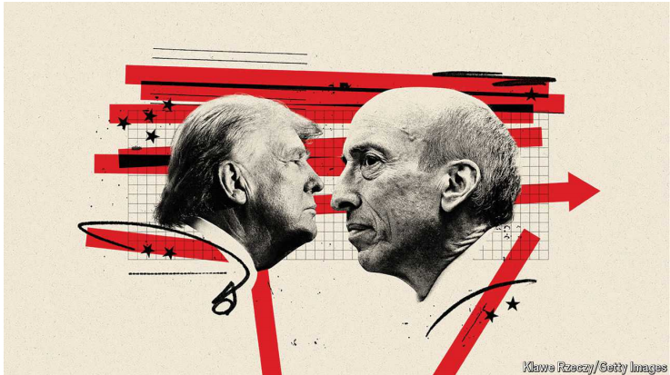

# Gary Gensler is the most controversial man in American finance

Donald Trump is just the latest to take a swing. In an interview with The Economist, the SEC chair defends his record

原文：

How many Securities and Exchange Commission chairs can you name?

Even in Washington it is hard to imagine a passer-by being able to come up

with more than one. Perhaps the best known is Joe Kennedy, the SEC’s first

chairman, who took office during the Depression when Americans had lost

faith in markets and were clamouring for protection against conmen and

fraudsters. And he is most famous for fathering a president.

你能说出多少证券交易委员会主席的名字？即使在华盛顿，也很难想象一个路人能拿出不止一个。也许最著名的是证券交易委员会的第一任主席乔·肯尼迪，他在大萧条时期上任，当时美国人对市场失去了信心，并大声疾呼保护人们免受骗子和诈骗犯的侵害。他最出名的是作为总统的父亲。

学习：

chair：主席

passer-by：行人；途经者；过路人          

clamouring：美 ['klæmərɪŋ] 喧嚷；大声的要求或抗议；叫嚷；（clamour的现在分词形式）

conmen：骗子

frauster：美 [ˈfrɔdstər]  诈骗犯；欺诈者；骗子

father: 成为xxx的父亲

>这里的 "father" 是动词，意思是 "成为...的父亲" 或 "生育"。在这个句子中，意思是乔·肯尼迪 (Joe Kennedy) 最著名的原因是他是美国总统约翰·肯尼迪 (John F. Kennedy) 的父亲。

原文：

Yet during his time at the SEC, Gary Gensler, the current chair, has become

remarkably well-known, even notorious. So much so that on July 27th, when

Donald Trump, the Republican presidential candidate, gave a speech at a

bitcoin convention, his biggest cheer came when he announced: “On day one

I will fire Gary Gensler and appoint a new SEC chairman.” Mr Trump appeared

taken aback by the roar. “I didn’t know he was that unpopular. Wow...Let me

say it again.” He repeated: “On day one I will fire Gary Gensler.”

然而，现任主席加里·詹斯勒(Gary Gensler)在美国证券交易委员会任职期间，变得非常出名，甚至臭名昭著。以至于7月27日，在比特币大会上，唐纳德·特朗普发表演讲时，他宣布上任第一天会解雇加里·根斯勒并任命新的美国证券交易委员会主席，获得了最大的欢呼声。特朗普对观众的反应感到惊讶，因为他没想到加里·根斯勒会这么不受欢迎，以至于他还重复了一遍自己的话。

学习：

notorious：美 [noʊˈtɔːriəs] 臭名昭著的；声名狼藉的

taken aback：大吃一惊；吃惊；受惊          

>**Take aback**：意思是“震惊”或“惊讶”。在这个句子中，指的是唐纳德·特朗普被观众的反应吓到了。

so much so that：如此之多以至于；到这样的程度以至于；极其…以致于

>**So much so that**：意思是“以至于”，用来引出一个结果或后果。在这个句子中，意思是“以至于在唐纳德·特朗普在比特币大会上发表演讲时，他获得的最大欢呼声是在宣布他将在上任第一天解雇加里·根斯勒并任命新的美国证券交易委员会主席。”

原文：

In reality, Mr Trump will do no such thing. Every SEC chair since the agency

was set up in 1934 has resigned when the presidency changed party,

allowing the new administration to make its own pick.

事实上，特朗普不会这么做。自1934年成立以来，每一位SEC主席都在总统更换政党时辞职，让新政府做出自己的选择。

原文：

The crypto crowd is just the noisiest example of the criticism Mr Gensler

has faced during his time in office. He has also riled the likes of Ken Griffin,

boss of Citadel, a mighty hedge fund, with rule changes in the Treasury

market and ticked off bosses of private-market funds with new disclosure

rules. With his term possibly near its end, he sat down for an interview with

*The Economist* on July 30th.

Crypto人群只是Gensler先生在任期间所面临的批评中最喧闹的例子。他还因美国国债市场的规则变化激怒了像Citadel(一家强大的对冲基金)老板肯·格里芬这样的人，并因新的信息披露规则让私募基金的老板恼火。随着他的任期可能接近尾声，他在7月30日接受了《经济学人》的采访。

学习：

noisiest：喧闹的；（noisy的最高级）          

riled：激怒；惹怒；搅浑；（rile的过去式和过去分词）          

the likes of： 像…这样的人          

Treasury market：国债市场

tick off: 使人生气

>Tick off 是指使人生气或恼火。在这里，这个短语表示私募市场基金的老板们因新的披露规则而感到不满或被激怒。
>
>例子：The new regulations have ticked off many private-market fund managers. (新的法规让许多私募市场基金经理感到恼火。)

原文：

There is no disputing that Mr Gensler has been productive. “We laid out an

agenda to propose around 50 sets of new rules,” he points out. “And we’ve

now...completed about three-quarters.” If he finishes the rest, his tally will

amount to 15% more rules than Jay Clayton, his predecessor, and more than

double the number of Mary Jo White, Mr Clayton’s predecessor.

毫无疑问，詹斯勒先生卓有成效。“我们制定了一个议程，提出了大约50套新规则，”他指出。“而我们现在已经...完成了大约四分之三。”如果他完成了剩下的部分，他的总数将比他的前任杰伊·克莱顿多15%的规则，是克莱顿先生的前任玛丽·乔·怀特的两倍多。

学习：

disputing：争执；争论；怀疑；辩论；（dispute的现在分词）          

there is no disputing：无可争议，毫无疑问

tally：美 [ˈtæli] 记录；账单；积分表；计分牌；

原文：

Mr Gensler’s detractors portray this as overreach. Yet he entered office with

an urgent to-do list. His appointment in 2021 came a year after the Treasury

market, the world’s most important capital market, briefly ceased to

function; a few months after retail traders pushed up GameStop shares 15-

fold in a fortnight, forcing brokerage firms to the brink; and at the time of a

crypto frenzy. Mr Gensler has pushed through sweeping changes—not

because he is meddling, he says, but because they were required.

詹斯勒先生的批评者认为这是不自量力。然而，他上任时有一份紧急的待办事项清单。他在2021年获得任命的一年前，全球最重要的资本市场美国国债市场短暂停止运作；几个月前，散户投资者在两周内将GameStop的股价推高了15倍，迫使经纪公司濒临破产；在加密狂潮的时候。Gensler先生推动了彻底的变革——他说，不是因为他在干预，而是因为这是必须的。

学习：

detractor：美 [dəˈtræktər]  诋毁者；恶意批评者；

overreach：伸得过远；贪功致败；不自量力

retail trader：散户投资者

fortnight：十四天；两周；两星期

in a fortnight：两周内

brokerage：美 [ˈbroʊk(ə)rɪdʒ] 经纪公司；经纪业务；经纪人佣金

to the brink：将某事物或某人推到崩溃或危险的边缘

>To the brink 是指将某事物或某人推到崩溃或危险的边缘。在这里，这个短语表示零售交易者在短时间内将 GameStop 股票价格推高了 15 倍，导致经纪公司几乎陷入崩溃的境地。
>
>例子：The intense speculation pushed the brokerage firms to the brink of collapse. (激烈的投机行为使经纪公司几乎陷入崩溃的境地。)

meddle： 干涉

>Meddle 是指干涉或插手不属于自己的事务。在这里，这个词表示 Mr. Gensler 强推的重大变革不是因为他在干涉，而是因为这些变革是必要的。
>
>例子：He argues that he is not meddling but making necessary changes. (他认为自己不是在干涉，而是在进行必要的变革。)

原文：

If there is a philosophy to his agenda it is that more transparency is better,

competition is good and regulators must keep moving because markets do.

“We’ve updated our rules, because technology rapidly changes, because

business models change. Nothing stands still in life,” he says. Mr Gensler

sees much of crypto as being securities, and therefore under his remit (the

industry vehemently disagrees). His actions against the sector have had

mixed results, with lawsuits progressing against big players like the crypto

exchanges, even as some have stalled.

如果说他的议程有什么哲理的话，那就是透明度越高越好，竞争越好，监管者必须保持行动，因为市场就是这样。“我们已经更新了我们的规则，因为技术在快速变化，因为商业模式在变化。他说:“生活中没有什么是一成不变的。Gensler先生认为大部分加密是安全的，因此在他的职权范围内(业界强烈反对)。他针对该领域的行动产生了喜忧参半的结果，针对加密交易所等大型参与者的诉讼正在进行，尽管有些诉讼已经停止。

学习：

remit：职权范围

under his remit：在他的职权范围内      

behemently：美 [ˈviəməntlɪ] 激烈地；热烈地

原文：

It is his other actions, though, that are more consequential. Take the

stockmarket. In 2021, in part owing to growing settlement risk associated

with GameStop trading, clearinghouses, the institutions that settle equity

trades, “said to the main brokerage houses, ‘We can’t take any more buy

orders for these listed stocks like GameStop,’” recalls Mr Gensler. “The

investing public was shut out of the market. That wasn’t right.” Since May

28th, equities in America have settled “t+1”, the day after a trade occurs,

rather than “t+2”, reducing the risk of a repeat. Mr Gensler is also planning

changes to how exchanges operate, such as by allowing them to quote stock

prices in smaller increments, as marketmakers, their competitors, already do.

然而，更重要的是他的其他行为。以股票市场为例。詹斯勒回忆道，2021年，部分由于与GameStop交易相关的结算风险越来越大，结算股票交易的机构清算所“对主要经纪公司说，‘我们不能再接受像GameStop这样的上市股票的购买订单了’”。“投资大众被市场拒之门外。这是不对的。”自5月28日以来，美国的股票结算是“t+1”，交易发生后的第二天，而不是“t+2”，减少了重复交易的风险。Gensler先生还计划改变交易所的运作方式，比如允许他们以较小的增量报价，就像他们的竞争对手做市商已经做的那样。

学习：

clearinghouse：票据交换所

>**Clearinghouse** 是指一个金融机构，它充当交易双方之间的中介，确保交易顺利完成，并减少违约风险。在股票市场中，清算所负责协调和管理交易的结算过程。
>
>例子：The clearinghouse ensures that all stock trades are settled correctly and on time. (清算所确保所有股票交易正确及时地结算。)

quote：为（企业的股份）上市；挂牌；出价；报价；

>
>
>**Quote** 在这里指的是报价，即市场参与者提供的证券的买入或卖出价格。
>
>例子：The broker quoted a price of $100 per share for the stock. (经纪人报价每股 100 美元。)

settlement: 结算

>**Settlement** 是指在交易发生后完成支付和转移资产的过程。在股票市场中，结算涉及买卖双方之间的资金和证券的转移。
>
>例子：The settlement of the trade will occur two days after the transaction date. (交易的结算将在交易日期后的两天进行。)

>
>
>**T+1 和 T+2** 分别代表交易发生后一个工作日和两个工作日的结算周期。"T" 代表交易日，“+1” 或 “+2” 代表在交易日后多少个工作日进行结算。
>
>例子：Under the T+2 settlement system, a trade made on Monday will be settled on Wednesday. (在 T+2 结算系统下，周一进行的交易将在周三结算。)

原文：

In the Treasury market, trades will be routed through clearinghouses by the

end of 2025, a change Mr Gensler hopes will usher in more trading between

a greater range of counterparties. Rather than trades going through a bank

and dealers, as is common now, it might be possible for hedge funds to trade

directly with asset managers. As well as functioning better in times of stress,

he thinks these changes will promote competition: “On the margin if we

save just one basis point—and I’m not making any predictions—but even if

we save one basis point, that’s quite dramatic for the US taxpayer in a $28trn

market.”

在美国国债市场，到2025年底，交易将通过清算所进行，詹斯勒希望这一变化将在更大范围的交易对手之间带来更多交易。对冲基金有可能直接与资产管理公司进行交易，而不是像现在这样通过银行和交易商进行交易。除了在压力时期更好地发挥作用之外，他认为这些变化将促进竞争:“在边际上，如果我们只节省一个基点——我不做任何预测——但即使我们节省一个基点，对美国纳税人来说，在一个28万亿美元的市场中，那也是相当惊人的。”

学习：

routed：按某路线发送；给…规定路线；（route的过去式和过去分词）          

原文：

Mr Gensler is not surprised that he and the financial industry do not always

see eye to eye. “Whether you’re a diamond dealer, an auto dealer, or a stock

or bond dealer…opacity, darkness, tends to help,” he says. “Adam Smith

wrote about this in the 18th century: transparency helps markets.” This is a

lesson that his own time in industry drilled home. “I worked at Goldman

Sachs for many years. And there were a number of sayings...one was

‘opacity or darkness [is] the friend of the firm.’”

Gensler先生对他和金融行业并不总是意见一致并不感到惊讶。“无论你是钻石经销商、汽车经销商，还是股票或债券经销商……不透明、黑暗往往会有所帮助，”他说。"亚当·斯密在18世纪写道:透明度有助于市场."这是他自己在工业界的经历中深刻体会到的一个教训。“我在高盛工作多年。有很多说法...一个是“不透明或黑暗是公司的朋友。”"

学习：

see eye to eye：看法（或态度）一致          

drill

>**Drill** 在这里指的是反复训练或灌输某种理念或习惯。
>
>例子：The importance of safety was drilled into the workers during training sessions. (在培训课程中，工人们反复被灌输安全的重要性。)

>This is a lesson that his own time in industry drilled home.  这句话的意思是，在金融行业的工作经历让他深刻体会到这一点。这里的 **drill** 是指通过反复的实践或经验让某个理念变得深刻和熟悉。

原文：

Yet this enthusiasm for transparency has led him to push boundaries. His

proposals for climate disclosure, which would be onerous, have been

challenged in the courts. Sweeping regulations for private-market funds,

which would have required quarterly statements on performance and fees,

and also restricted their ability to charge levies, have been thrown out.

然而，这种对透明度的热情让他突破了界限。他关于气候信息披露的提议将会很麻烦，已经在法庭上受到挑战。对私募市场基金的全面监管已被否决，这些监管要求每季度提交业绩和费用报告，并限制它们收取费用的能力。

学习：

onerous：美 [ˈoʊnərəs] 繁重的；费力的；劳累的

sweeping：广泛的；全面的；影响深远的；影响广泛的

sweeping regulations：全面监管

原文：

Mr Gensler expresses a willingness to adapt. “If a court rules one way, I

adjust. What do you do?” But he will adapt, not relent. Rather like Lina

Khan, the chair of the Federal Trade Commission, another regulator, his

term has been defined by a dogged pursuit of a big agenda. Yet unlike Ms

Khan, he has more to show for his efforts, and has suffered fewer setbacks.

If he remains in post, Wall Street and crypto should expect more of the

same. ■

Gensler先生表达了适应的意愿。“如果法院以一种方式裁决，我会做出调整。你是做什么的？”但他会适应，而不是放松。很像另一个监管机构美国联邦贸易委员会的主席Lina Khan，他的任期被定义为对一个大议程的执着追求。然而，与可汗女士不同的是，他有更多的努力可以展示，也遭受了更少的挫折。如果他继续留任，华尔街和crypto应该会期待更多同样的事情。■

学习：

relent： 美 [rɪˈlent] 变得温和；变得宽容；松懈；放松；妥协

dogged：坚持不懈的；不屈不挠

>
>
>这里的 **adapt 而不是 relent** 的意思是，尽管他会根据法院的裁决进行调整，但他不会因此而放弃或妥协。**adapt** 指的是根据情况做出调整或适应，而 **relent** 则意味着屈服或让步。

>
>
>**remain in post** 的意思是继续留在现有的职位上。

## 后记

2024年8月10日14点43分于上海。

