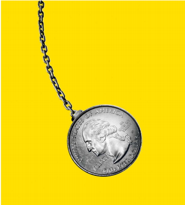

# Will America’s economy swing the election?

It is not entering recession, but it is slowing down. That is bad news for Kamala Harris

swing:  美 [swɪŋ] 摆动；摇荡；使改变（意见、情绪等）

原文：

AMERICA’S VOTERS have not given credit to the Biden White House for their

country’s economic boom. Will they punish Kamala Harris for a bust? After

growing at rates that were the envy of the rich world, the American economy

now seems to be slowing. Investors are worried that a recession is just

around the corner. On August 2nd, following a disappointing survey of

manufacturers and a rise in claims for jobless benefits, they took fright at the

news that the country’s unemployment rate had risen to 4.3% in July, its

highest since 2021. On August 5th stockmarkets slumped worldwide, before

recovering a little lost ground the next day.

美国选民并没有把他们国家的经济繁荣归功于拜登白宫。他们会因为经济萧条而惩罚卡玛拉·哈里斯吗？在以令发达国家羡慕的速度增长后，美国经济现在似乎正在放缓。投资者担心衰退即将来临。8月2日，在令人失望的制造商调查和失业救济金申领人数上升后，他们对7月份美国失业率上升至4.3%的消息感到震惊，这是自2021年以来的最高水平。8月5日，全球股市暴跌，第二天又收复了一点失地。

学习：

credit to：归功于

economic boom：经济繁荣

bust： 经济衰退；不景气时期；失败；破产；

jobless benefits：失业救济金      

claims for jobless benefits：申领失业救济金

unemployment rate：失业率

take fright at：对xxx感到恐惧，感到震惊

recover a little lost ground：收复一点失地

原文：

The economy does not determine elections in America, but it is important.

Its course over the next 90 days will weigh on the incumbent Democrats’

chances in November’s presidential election. An outright recession would

probably spell doom for Ms Harris. But even if the economy is only cooling,

as is likely, it could harm her and help Donald Trump

经济并不能决定美国的选举，但它很重要。未来90天的进程将影响现任民主党在11月总统选举中的胜算。一场彻底的衰退可能会给哈里斯女士带来厄运。但即使经济只是在降温(这是有可能的)，也可能对她不利，对唐纳德·特朗普有利

学习：

outright： 美 [ˈaʊtraɪt] 彻底的；完全的；绝对的；直接的

spell doom：引来厄运          

原文：

Is America really on the brink of recession? Some indicators look ominous

for America’s economy. The unemployment rate has risen significantly from

its recent lows, a move that has often signalled recessions in the past. Rules

of thumb suggest that, given the state of the economy, interest rates are

probably one to two percentage points too high. Indeed, yields on long-term

Treasuries have fallen below those on short-term bonds, in anticipation of a

weakening economy and steep interest-rate cuts by the Federal Reserve.

美国真的处于衰退的边缘吗？一些指标看起来对美国经济不利。失业率从最近的低点大幅上升，这在过去常常是衰退的信号。经验表明，鉴于目前的经济状况，利率可能高了一到两个百分点。事实上，由于预期经济疲软和美联储大幅降息，长期国债收益率已经低于短期债券收益率。

学习：

brink：边缘

on the brink of：在xxx的边缘

ominous：美 [ˈɑːmɪnəs] 不祥的；预兆性的；凶兆的；不吉利的

rules of thumb：经验规则；经验法则          

weakening economy：经济疲软

steep interest-rate cuts：大幅降息

原文：

Yet by most measures America seems to be experiencing not a crash landing

but a gradual slowdown. High interest rates have gradually cooled the labour

market since the unemployment rate reached its lowest in April 2023. That

in turn has suppressed the growth in wages and dented shoppers’ confidence.

Some consumer-facing companies, such as McDonald’s, have reported

disappointing sales. But others have done much better and GDP is still

expanding. In the second quarter of the year it grew at an annualised pace of

2.8%, which is above its long-term trend. Estimates of economic growth in

the current quarter stand comfortably above 2%. Restaurant bookings, air

travel and tax collections all suggest that growth continues to be strong.

然而，从大多数方面来看，美国似乎并没有经历一场硬着陆，而是在逐渐减速。自2023年4月失业率达到最低水平以来，高利率逐渐冷却了劳动力市场。这反过来抑制了工资的增长，打击了购物者的信心。一些面向消费者的公司，如麦当劳，报告了令人失望的销售额。但其他公司做得更好，GDP仍在增长。今年第二季度，其年化增长率为2.8%，高于其长期趋势。对当前季度经济增长的估计超过了2%。餐馆预订、航空旅行和税收都表明增长依然强劲。

学习：

by most measures：从大多数角度来看

crash landing：硬着陆

dented：美 ['dentɪd] 削弱；（dent的过去式）

dent shoppers' confidence ：削弱了消费者的信心

disappointing sales：销量不佳；令人失望的营收；销售不理想          

GDP is still expanding：GDP仍然在增长

tax collections：税收

growth continues to be strong：增长依旧强劲

原文：

Moreover, lower long-term interest rates are already giving the economy a

prophylactic shot in the arm—and it has become more powerful as skittish

investors have rushed into bonds this week. Surveys of banks show some

easing in credit conditions. The Fed will need to cut its policy interest rate in

September in order to fulfil investors’ expectations, but that is a formality.

Rates on mortgages and credit-card debt are falling in anticipation.

此外，较低的长期利率已经给经济打了一剂预防针——随着不安的投资者本周涌入债券市场，这一针变得更加有力。对银行的调查显示，信贷状况有所缓解。美联储将需要在9月份下调政策利率，以满足投资者的预期，但这只是一种形式。抵押贷款和信用卡债务的利率预计会下降。

学习：

prophylactic：美 [ˌproʊfəˈlæktɪk] 预防药；预防剂

skittish：美 [ˈskɪdɪʃ] 易变的；顽皮的；受惊的

skittish investors：不安的投资者

formality：美 [fɔːrˈmæləti] 例行公事；礼节；拘泥形式；必经程序；常规；

原文：

What, then, of the political consequences of a slowdown but not a recession?

Ms Harris still has a problem. Even if voters deny Democrats any credit for

the economic boom, they may nonetheless blame her if the economy loses

steam.

那么，经济放缓而非衰退的政治后果是什么？哈里斯女士仍然有一个问题。即使选民否认民主党在经济繁荣中的任何功劳，如果经济失去动力，他们仍然会责怪她。

学习：

lose steam：失去动力

原文：

On the face of it, Ms Harris should be able to campaign on the Biden

administration’s economic record. Workers’ median real earnings are 9.4%

higher than when Americans went to the polls in 2016. Even among men

without a high-school diploma, the unemployment rate is only 5.1%. As we

report this week, swing states such as Pennsylvania have enjoyed mostly

lower inflation and unemployment than the national average. Given all that,

the complaint of J.D. Vance, Mr Trump’s protectionist running-mate, that

America has sacrificed jobs to import “knockoff toasters” is nonsensical.

从表面上看，哈里斯女士应该能够利用拜登政府的经济记录开展竞选活动。工人的实际收入中值比2016年美国人投票时高9.4%。即使是没有高中文凭的男性，失业率也只有5.1%。正如我们本周所报道的，像宾夕法尼亚这样的摇摆州的通货膨胀率和失业率比全国平均水平都要低。鉴于这一切，特朗普的保护主义竞选搭档万斯(J.D. Vance)抱怨美国牺牲就业来进口“山寨烤面包机”是荒谬的。

学习：

on the face of：在表面上看

knockoff：名牌仿制品；冒牌服装；冒牌货          

toasters：美 [ˈtoʊstərz] 烤箱；烤面包器；（toaster的复数）

nonsensical：美 [nɑnˈsensɪkl] 无意义的；荒谬的；愚蠢的

原文：

Republicans’ perceptions of the economy are warped by their politics—as

are Democrats’ in the other direction. But voters as a whole give the

Democrats’ economic management a worse rating than Mr Trump’s and one

reason may be because every time they go shopping, they suffer sticker-

shock. Even if inflation is falling, prices are nearly 20% higher than when

Mr Biden entered office.

共和党人对经济的看法被他们的政治扭曲了——民主党人也是如此。但选民总体上给民主党的经济管理的评分比特朗普更差，一个原因可能是因为每次他们去购物时，都会受到价格冲击。即使通货膨胀在下降，物价还是比拜登先生上任时高出近20%。

学习：

perceptions：美 [pərˈsepʃənz] 看法；观念；知觉

warped：美 [wɔrpt] 使变形；（warp的过去式）

sticker-shock: 看到商品价格时感到震惊或被高价吓到的情绪反应

>**Sticker-shock** 是指看到商品价格时感到震惊或被高价吓到的情绪反应，通常因为价格超出预期。
>
>例子：消费者每次购物时都感受到 sticker-shock，因为尽管通货膨胀在下降，但价格比拜登上任时高了近20%。 (Every time consumers go shopping, they suffer sticker-shock, because even if inflation is falling, prices are nearly 20% higher than when Biden entered office.)

原文：

Today’s bout of stockmarket wobbles are unlikely to make this worse on

their own. Nor do they deserve to—even if Mr Trump has, with predictable

hyperbole, christened them “the Kamala crash”. As we published this, the

S&P 500 index of stocks was 8% below its peak, yet the stockmarket had

been due for a correction, because it was priced so dearly relative to firms’

earnings. The index is still up by 9% this year and American firms have on

average beaten profit forecasts. The biggest slump has taken place not on

Wall Street but in Japan.

今天的一轮股票市场动荡不太可能使情况变得更糟。他们也不配——即使川普以可预见的夸张方式，将他们命名为“卡玛拉崩溃”。当我们发表这篇文章时，标准普尔500股票指数比最高点低了8%,然而股票市场已经到了调整的时候了，因为相对于公司的收益来说，它的定价是如此的昂贵。该指数今年仍然上涨了9%,美国公司的平均利润超过了预期。最大的衰退不是发生在华尔街，而是发生在日本。

学习：

bout：一阵；一段时间；一次（活动或事件）

wobbles： 美 ['wɑbls] 不稳定；摇晃；（wobble的复数）

hyperbole：英 [haɪˈpɜːbəli] 夸张；夸张的修辞；夸张手法； **注意发音**

christen：美 [ˈkrɪs(ə)n]   为（表示显著性质或特征的人或物）命名；首次使用

原文：

The real threat to Democrats is the underlying slowdown that helped

unnerve the markets. Research suggests that voters weight recent economic

events most heavily, meaning that the performance of the economy in the

run-up to the election matters most for the result. Growth in after-tax real

incomes per person in just the two quarters before a poll, combined with the

time a party has been in office, is closely correlated with American

presidential-election results.

民主党面临的真正威胁是导致市场不安的潜在经济放缓。研究表明，选民最看重最近的经济事件，这意味着选举前的经济表现对选举结果至关重要。投票前两个季度的人均税后实际收入增长，加上一个政党执政的时间，与美国总统选举结果密切相关。

学习：

unnerve：美 [ˌənˈnərv] 使紧张；使焦虑；使不安

run-up：（重要事情的）前期

in the run-up to the election：选举前

原文：

Here the Democrats have something to worry about. At the start of the year,

real incomes were rising at an annualised quarterly pace of about 1%. As the

economy has cooled, this has fallen by roughly half. Consumer confidence

was already unusually low, given strong growth and a jobs boom. With the

slowdown, it is even lower today than in January and it may take another

knock from stockmarket falls, or a surge in oil prices if war spreads in the

Middle East.

在这一点上，民主党有些担心。今年年初，实际收入以大约1%的年化季度速度增长。随着经济降温，这一数字下降了大约一半。考虑到强劲的增长和就业繁荣，消费者信心已经非常低了。随着经济的放缓，增长速度甚至比一月份还要低，而且如果战争在中东蔓延，它可能会受到股票市场下跌或油价飙升的打击。

## **A swing and a miss**

原文：

None of this means that Mr Trump is destined to win. Barack Obama

returned to the White House in 2012 despite a poor economy, and Mr Trump

is vulnerable on other issues. In a tight race, many factors could be the

difference between victory and defeat.

所有这些都不意味着特朗普注定会赢。尽管经济不景气，巴拉克奥巴马(Barack Obama)还是在2012年重返白宫，而特朗普在其他问题上也很脆弱。在一场势均力敌的比赛中，许多因素都可能决定胜负。

学习：

tight race：势均力敌的比赛

原文：

A surge of enthusiasm for Ms Harris gives her a narrow lead in our poll

tracker this week—though not yet enough to carry the electoral college. She

is also favoured by voters on subjects such as abortion and health care. But

if she wins, it will not be because she was helped by the economy. ■

对哈里斯女士高涨的热情使她在本周的民意调查中以微弱优势领先——尽管还不足以赢得选举团的支持。在堕胎和医疗保健等问题上，她也受到选民的青睐。但是如果她赢了，那也不是因为她得到了经济的帮助。■

## 后记

2024年8月10日18点56分于上海。

