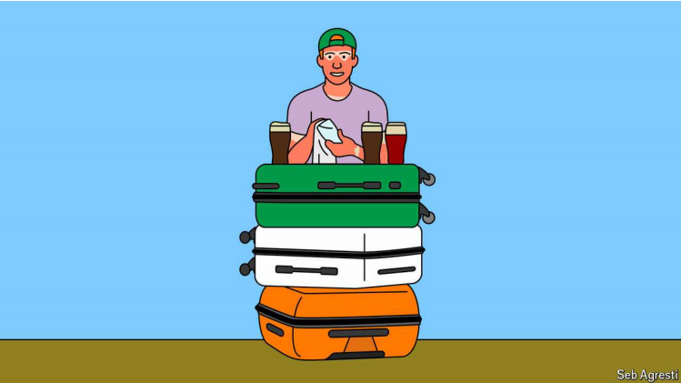

# A short-term work visa shows the benefits of immigration

America’s J1 visa programme shows how open borders can build cultural links

原文：

In popular imagination, it is around St Patrick’s Day that Chicago reaches

peak Irish. Each year, on the Saturday before March 17th, the city’s

plumbers union dyes the river green and thousands of people flock

downtown to swig pints of green beer. In a more real sense, though, Chicago

is probably at its most Irish on a Saturday somewhere in early July. That is

when the J1 visa-holders are in town.

在大众的想象中，芝加哥的爱尔兰人在圣帕特里克节前后达到顶峰。每年3月17日之前的周六，该市的管道工工会将河水染成绿色，成千上万的人涌入市中心痛饮几品脱绿色啤酒。然而，从更真实的意义上来说，芝加哥可能在七月初的某个周六最具爱尔兰风情。那是J1签证持有者在城里的时候。

学习：

plumbers：美 [ˈplʌməz] 水管工；（plumber的复数）

dyes：美 [ˈdaɪz] 染；给…染色；（dye的第三人称单数）

flock：聚集；蜂拥；群集

swig：（尤指对着瓶口）大口喝；痛饮；猛喝；豪饮

>**"St Patrick's Day"** 是指圣帕特里克节，这是爱尔兰的文化和宗教节日，每年3月17日庆祝，以纪念爱尔兰的守护圣人圣帕特里克。
>
>例子：在大众想象中，芝加哥在圣帕特里克节前后达到最浓厚的爱尔兰氛围。 (In popular imagination, it is around St Patrick’s Day that Chicago reaches peak Irish.)

>**"reach peak Irish"** 是指某个地方在特定时间段内展现出最浓厚的爱尔兰文化氛围。
>
>例子：在大众想象中，芝加哥在圣帕特里克节前后达到最浓厚的爱尔兰氛围。 (In popular imagination, it is around St Patrick’s Day that Chicago reaches peak Irish.)

原文：

The J1 is a visa issued by the State Department for various sorts of “cultural

exchange” programmes. The largest of these is a short-term summer work

programme, which allows recipients to work in seasonal jobs in America for

three months during university summer holidays. For Chicago, it means at

least 1,000 young Irish men and women descending on the city to work in

bars and restaurants. Stop somewhere for a drink downtown in the summer

and you are very likely to be served by somebody sporting a melodic accent,

a bad case of sunburn and quite possibly a Gaelic-football jersey.

J1是美国国务院为各种“文化交流”项目签发的签证。其中最大的一项是短期暑期工作计划，它允许接受者在大学暑假期间在美国从事三个月的季节性工作。对芝加哥来说，这意味着至少有1000名年轻的爱尔兰男女来到这座城市，在酒吧和餐馆工作。夏天在市中心的某个地方停下来喝一杯，你很可能会被一个带着旋律口音、严重晒伤、很可能穿着盖尔足球球衣的人招待。

学习：

recipients：美 [rɪˈsɪpiənts] 接受者；容器；受领者；（recipient的复数）

descending：降临；（descend的现在分词形式）

descending on the city：来到这座城市

>**"Descending"** 在这里是指大量的人群突然涌入某个地方。
>
>例子：每年夏天，游客们都会涌入这个小镇，享受阳光和海滩。 (Every summer, tourists descend on this small town to enjoy the sun and the beach.)

sport：展示；炫耀；故意显示

>
>
>**"Sport"** 在这里是指穿戴或展示某物。
>
>例子：他总是穿着那件他最喜欢的棒球队服。 (He always sports his favorite baseball team's jersey.)

melodic：美 [məˈlɑdɪk] 旋律性的；有旋律感的；音调优美的；和谐的

>
>
>**"Melodic accent"** 是指具有旋律感的口音。
>
>例子：她说英语时带着优美的意大利口音，让人听起来像是在听音乐。 (She speaks English with a melodic Italian accent, making it sound like music to the ears.)

jersey： 美 [ˈdʒɜːrzi] 球衣

Gaelic-football: 盖尔足球

>**"Gaelic football"** 是指盖尔足球，一种流行于爱尔兰的传统体育运动。
>
>例子：他在学校时是盖尔足球队的明星选手。 (He was a star player on the Gaelic football team during school.)

downtown：市中心，在篮球中表示三分线外

>**"Downtown"** 在篮球中通常指的是远距离投篮区，特别是三分线外。
>
>例子：那个球员以他的远距离投篮闻名，总是从远处得分。 (The player is famous for his downtown shots, always scoring from long range.)

原文：

The J1 programme rarely features in discussions of American immigration

policy. Each year around 300,000 are issued, but the vast majority are for

very short stints and so there is no lasting demographic change. Yet as visa

programmes go, it has an outsize impact. Recipients get a hint of what life in

America is like. American businesses get an influx of labour. And restaurant

patrons can meet people from countries that do not otherwise send all that

many workers to America.

J1项目很少出现在美国移民政策的讨论中。每年大约发行300，000张，但是绝大多数都是短期的，所以没有持久的人口变化。然而，就签证项目而言，它有着巨大的影响。签证获得者得到了美国生活的暗示。美国企业获得大量劳动力。餐馆的顾客可以遇到来自那些不会向美国输送那么多工人的国家的人。

学习：

outsize：巨大的；过大的；

have an outsize impact：有着巨大的影响力

patrons：美 [ˈpeɪtrənz] 主顾；庇护人；（patron的复数）

stint: 短暂的时期

>**"Stints"** 在这里指的是短暂的工作或活动时期。
>
>例子：她在咖啡馆工作了几个月，然后又去旅行了。(She worked a stint at a café for a few months before going traveling again.)

>**"As xxx go"** 是用来表示与同类事物相比某事的情况或标准。
>
>例子：作为跑步比赛来说，这次马拉松赛程相对较短。(As marathons go, this one was relatively short.)
>
>as visa programmes go, it has an outsize impact.  就签证项目而言，它有着巨大的影响

原文：

The largest sending country is in fact the United Kingdom—over 13,000

Brits came to America last year on J1s. A large majority of them worked as

camp counsellors, another part of the programme. If you send your children

to summer camp, there is a chance they will come back with an English

accent. That is probably because Camp America, one of the biggest

providers, has an extensive recruitment programme in Britain. Similarly, if

you visit a ski resort in Colorado in winter, your lift ticket may well be

scanned by somebody from Argentina or Peru, where the summer holidays

coincide with the North American ski season.

事实上，最大的输出国是英国——去年有超过13，000名英国人通过J1s来到美国。他们中的大多数人担任营地辅导员，这是该方案的另一部分。如果你送你的孩子去夏令营，他们很可能带着英国口音回来。这可能是因为最大的供应商之一，美国营，在英国有一个广泛的招聘计划。同样，如果你冬天去科罗拉多的一个滑雪胜地，你的缆车票很可能会被来自阿根廷或秘鲁的人扫描，那里的暑假正好与北美的滑雪季节相吻合。

学习：

Brit：美 [brɪt]  英国人；不列颠人；（泛指）来自英国的人

ski resort：滑雪胜地

原文：

Proportionate to their population, however, the Irish are among the largest

recipients of all. And they run the bars. Each year as many as 5,000 Irish

students visit America to work. That is more than a tenth of the number of

Irish students who enrol in universities each year.

然而，就人口比例而言，爱尔兰是最大的接受者之一。他们经营酒吧。每年有多达5000名爱尔兰学生去美国工作。这一数字超过了每年爱尔兰大学生人数的十分之一。

学习：

proportionate：美 [prəˈpɔːrʃənət] 使成比例；使相称；调整比例；

enrol：注册；登记；报名；

enrol in：注册

原文：

To “do your J1” is “like a rite of passage”, says Siun O’Connor, a 22-year-

old politics student from Dublin working at D4, an Irish pub in downtown

Chicago. The Irish often take advantage of long-standing links with Irish

businesses to find jobs; hence they flock to places like Chicago and Boston

with lots of Irish pubs. Ms O’Connor says she found her summer job

through her father, who knows the bar’s Irish owner. Her sister had also

previously worked on a J1 in Chicago.

“做你的J1”是“像一个通过仪式”，Siun O'Connor说，一个来自都柏林的22岁的政治学生，在芝加哥市中心的爱尔兰酒吧D4工作。爱尔兰人经常利用与爱尔兰企业的长期联系来寻找工作；因此，他们涌向像芝加哥和波士顿这样有很多爱尔兰酒吧的地方。奥康纳女士说，她通过她父亲找到了她的暑期工作，她父亲认识酒吧的爱尔兰老板。她的姐姐之前也在芝加哥的J1上工作过。

学习：

rite：仪式；（宗教等的）典礼；宗教仪式；习俗；

pub: <英>酒馆；酒吧；<澳>旅馆；客栈

原文：

A century or more ago, Irish immigrants in America filled up crowded

tenements and spent time mostly with one another. So it is today. Ms

O’Connor is living in a student-accommodation building south of

downtown, paying around €700 ($765) a month for a bunk bed in a small

apartment with five others. At least 500 Irish students are living there, she

guesses; the provider is a company in Dublin. It is a bit grotty, Ms O’Connor

admits, but nobody cares. Free hours are spent at the beach, or in nightclubs

that cater specifically to Irish visitors. “We’ve gone up [to] a few bars that

are, like, American,” she says. “But there’s a lot of Irish nights.”

一个世纪或更久以前，美国的爱尔兰移民挤满了拥挤的房屋，大部分时间都是在一起度过的。今天也是如此。奥康纳女士住在市中心南部的一栋学生宿舍楼里，和其他五个人一起住在一个小公寓里，一个月要花大约700€(765美元)租一个上下铺床位。她猜测，至少有500名爱尔兰学生住在那里；提供商是都柏林的一家公司。奥康纳女士承认，这有点难受，但没人在乎。空闲时间是在海滩或专门迎合爱尔兰游客的夜总会度过的。“我们去了几个类似美国的酒吧，”她说。“但是有很多爱尔兰之夜。”

学习：

tenements： 美 ['tenəmənts] 房屋；住户；（tenement的复数）

bunk bed：双层床；双层床铺；上下铺床

grotty：美 [ˈɡrɑdi] 令人讨厌的；劣质的；粗鄙的；身体不适；难受

原文：

Unlike Irish immigrants of the past, almost all go home. And almost none of

the money they earn leaves with them. Instead, they spend it on cross-

country trips at the end of their stints. “Maybe I will?”, says David Walsh,

another J1 student, on being asked if he will take any cash home. “If I win

big, you know, in Vegas.” What many do leave with is a desire to come

back. “No one’s had a bad experience,” says Ms O’Connor. She wants to

move to America full-time after graduating. Three months is a short stint,

but it is perhaps a first craic at immigrant life.■

不像过去的爱尔兰移民，几乎所有人都回家了。他们挣的钱几乎没有一分带走。相反，他们在任期结束时会把钱花在跨国旅行上。“也许我会？”另一名J1的学生大卫沃尔什(David Walsh)在被问及是否会带现金回家时表示。"如果我赢了，你知道，在拉斯维加斯."许多人带着回来的愿望离开了。“没有人有过不好的经历，”奥康纳女士说。她想毕业后全职搬到美国。三个月是很短的一段时间，但这可能是移民生活的第一次尝试。■

学习：

cross-country trips：跨国旅游

craic：美 [kræk] 好时光；欢乐时光；

## 后记

2024年8月11日14点51分于上海。

