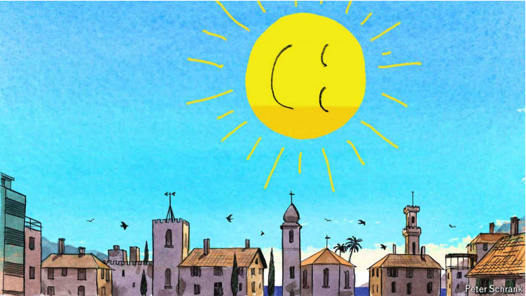

# The siesta is still a serious business in Europe’s south

siesta：美 [siˈɛstə]  午休；小憩；日中休息 **注意发音**

It should be copied more widely

Choose the snooze

snooze：美 [snuːz] （尤指在白天）小睡；打盹；瞌睡；打个盹儿

原文：

WHILE ON HOLIDAY in Europe this summer, the *Washington Post* advises

American readers, bear in mind a few things to avoid being seen as clueless.

Reset your air-conditioning expectations, observe local tipping customs and

say *bonjour* or *bonsoir* to a French shopkeeper at all costs.

《华盛顿邮报》建议美国读者，今年夏天在欧洲度假时，要记住几件事，以免被视为无知。重置你对空调的期望，观察当地的小费习俗，不惜一切代价对一位法国店主说你好或晚安。

学习：

bear in mind：牢记；记住；铭记在心

clueless：无知的；不了解的；不懂事的；愚昧的

shopkeeper：（通常指小商店的）店主；零售商；小商贩；商店老板；

tipping：小费

原文：

That is, if the shop is open. But many American travellers to the south of

Europe, especially in smaller towns, will find to their dismay that just as

they are hoping for a little post-prandial retail therapy, they are confronted

with a wall of iron shutters. The charming town that was so lively at ten that

morning has now apparently closed for business. It is, of course, time for the

siesta. In countries from Spain through France and Italy all the way to

Greece, the workday is very different from the northern European and

American one. After lunch comes the long break that divides the day in two.

Some sleep. Others merely read the paper or visit friends. Only late in the

afternoon do the shutters rise again; refreshed by their breaks, owners of

even small businesses may stay behind their counters until nine, refreshed by

their *riposino*, *messimeri*, or siesta.

如果商店还开着的话。但是，许多去欧洲南部的美国游客，尤其是在小城镇，会沮丧地发现，就在他们希望进行一点餐后购物疗法时，他们面对的是一堵铁百叶窗墙。这个迷人的小镇在早上十点钟还非常热闹，现在显然已经停止营业了。当然，午睡时间到了。从西班牙到法国和意大利，一直到希腊，这些国家的工作日与北欧和美国截然不同。午饭后是长时间的休息，一天分为两天。一些睡眠。其他人只是看报纸或拜访朋友。只有在下午晚些时候，百叶窗再次上升；休息之后，即使是小企业的老板也可能会呆在柜台后面，直到九点，通过他们的riposino、messimeri或午睡来恢复精力。

学习：

prandial：美 [ˈprændiəl] 正餐的；午餐的；进食的；饭间的

post-prandial：餐后

shutters：美 ['ʃʌtəz] 百叶窗；（shutter的复数）

visit friends：拜访朋友

原文：

Though English gets the word from Spanish, siesta is ultimately derived

from the Latin phrase *sexta [hora]*, for the sixth hour after sunrise, when it

was typically taken in Roman times. Like the skilful employment of

architecture, gardens and water, it is one of the ancient coping mechanisms

that makes life in blisteringly hot places possible. But the siesta has

persisted, partially, to this day, giving those who do not know it the slight

impression that yes, life down south is good—because people don’t take

work too seriously there. Thierry Paquot, a French philosopher, wrote in a

book from 2003, “the siesta is a means for us to reclaim our own time,

outside the clockmakers’ control. The siesta is our liberator.” Just like an

idle French philosopher.

虽然英语从西班牙语中得到这个词，但午睡最终是从拉丁语短语sexta [hora]中得到的，代表日出后的第六个小时，这在罗马时代是很典型的。就像建筑、花园和水的巧妙运用一样，它是古老的应对机制之一，使酷热地区的生活成为可能。但是午睡部分地一直持续到今天，给那些不知道它的人一个轻微的印象，是的，南方的生活很好——因为那里的人不会太认真地对待工作。法国哲学家Thierry Paquot在2003年的一本书中写道:“午睡是我们重新获得自己时间的一种方式，不受钟表匠的控制。午睡是我们的解放者。“就像一个游手好闲的法国哲学家。

学习：

skilful：熟练的；娴熟的；精通的；技艺高超的；

blisteringly：美 ['blɪstərɪŋli] 极度地；极快地；猛烈地；

blisteringly hot：非常热

coping mechanisms：应对机制

to this day：至今；迄今；直到今天

clockmaker：钟表匠

原文：

But for those who take it, the siesta is a serious undertaking. Camilo José

Cela, a Nobel-prizewinning Spanish author, called it “Iberian yoga”, and

said it should be taken with “pyjamas, chamber pot and Our Father”. Just

like a Spanish novelist, perhaps. But for those still unconvinced, consider

this endorsement: “You must sleep sometime between lunch and dinner, and

no halfway measures. Take off your clothes and get into bed…When the war

started, I had to sleep during the day because that was the only way I could

cope with my responsibilities.” Whatever other qualities Winston Churchill

had, laziness was not one of them.

但是对于那些睡午觉的人来说，午睡是一件严肃的事情。诺贝尔奖得主、西班牙作家卡米洛·何塞·塞拉称之为“伊比利亚瑜伽”，并说它应该与“睡衣、夜壶和我们的父亲”一样。或许，就像西班牙小说家一样。但是对于那些仍然不相信的人来说，考虑一下这种支持:“你必须在午餐和晚餐之间的某个时间睡觉，不要中途停止。脱掉衣服，上床睡觉……当战争开始时，我不得不在白天睡觉，因为这是我能够应付我的责任的唯一方式。”不管温斯顿·丘吉尔有什么其他品质，懒惰绝不是其中之一。

学习：

undertaking：事业；企业；项目；任务

prizewinning：有得奖可能的；已获奖的          

pyjamas：美 [pəˈdʒæməz] （一套）睡衣裤；睡衣

chamber：美 [ˈtʃeɪmbər] （作特定用途的）房间；议会；（议会的）议院；大厅；

chamber pot：夜壶

halfway：在中途的；部分的；在中间的；

get into bed：上床睡觉

原文：

Sleep researchers believe that the siesta is not just a cultural artefact. An

early afternoon slump in alertness and energy seems to be universal, even in

cultures that lack the tradition of big and wine-soaked lunches. The world’s

few remaining hunter-gatherers, such as the Hadza of Tanzania or the San of

the Kalahari Desert, typically sleep in the afternoon, and these are people

who must work to eat. Other hunter-gatherer groups take a siesta only in the

hot months. But the post-prandial snooze is not only a warm-country

practice. An observer of independent weavers in late 17th-century

Birmingham said that “they live like the inhabitants of Spain”, starting work

before sunrise, then taking a long afternoon break (some sleeping, others

drinking and talking) before returning to a long evening period of renewed

work.

睡眠研究者认为午睡不仅仅是一种文化产物。下午早些时候的警觉性和精力下降似乎是普遍现象，即使在缺乏丰盛的葡萄酒浸泡午餐传统的文化中。世界上仅存的几个狩猎采集者，如坦桑尼亚的哈扎人或卡拉哈里沙漠的桑人，通常在下午睡觉，这些人必须工作才能吃饭。其他狩猎采集群体只在炎热的月份午睡。但是餐后小睡不仅仅是温暖国家的习俗。一位观察17世纪晚期伯明翰独立织工的人说，“他们像西班牙的居民一样生活”，在日出前开始工作，然后下午休息一段时间(一些人睡觉，另一些人喝酒聊天)，然后晚上继续工作。

学习：

artefact: 美 [ˈɑrtəˌfækt] 人工制品；手工艺品；工艺品

cultural artefact：文化产物

hunter-gatherers：狩猎采集者；原始采集者；

Tanzania：美 [ˌtænzəˈniə] 坦桑尼亚（东非国家）

weavers：美 ['wi:vəz] 织工；（weaver的复数）

before sunrise：日出之前；爱在黎明破晓前（电影名）；日出以前          

原文：

Why doesn’t everyone siesta, then? The answer is of course the industrial

condition: those clocks Mr Paquot decries, and workplaces outside one’s

control. And that is the reason so few southern Europeans actually manage

to sleep today. Urban life means working too far from home to get back in

time to eat and get a decent kip before the afternoon. A study of Spaniards

found that 60% never take siestas, and those who do, do so more often on

their free days. Naps are even less common in Italy and France.

那为什么不是所有人都午睡呢？答案当然是工业条件:那些被帕考特指责的时钟，以及不受人控制的工作场所。这也是为什么今天很少有南欧人能真正入睡的原因。城市生活意味着在离家太远的地方工作，无法及时赶回来吃饭，也无法在下午之前睡个好觉。一项针对西班牙人的研究发现，60%的人从不午睡，而那些午睡的人，在空闲时间会更频繁地午睡。在意大利和法国，午睡更不常见。

学习：

manage to：设法；设法处理；设法做到

kip：睡觉；睡眠；小憩；

get a decent kip：睡个好觉（小憩）

Spaniard：美 [ˈspænjərd]  西班牙人

take siestas：午睡

naps：小睡；绒毛；打盹；（nap的复数）

原文：

That leads to a possible worst-of-both-worlds situation. Spanish workdays

are punishingly long. The traditional lunchtime (two o’clock) followed by a

long break pushes the afternoon shift far into the evening; it is common to

finish working at eight or later, making life especially hard for parents.

Spanish dinner can be at ten, possibly followed by nightlife. On such a

schedule people must find time for the siesta, or force themselves along with

stimulants—and live in an unhealthy state of chronic sleep deprivation. A

study at Harvard University of 23,000 Greeks found a 37% increase in risk

of death from heart disease in those who had abandoned the siesta. The

effect was particularly pronounced among working men.

这导致了一种可能是两头不讨好的情况。西班牙的工作日时间特别长。传统的午餐时间是两点，然后是长时间的午休，这使得下午的工作时段推迟到晚上。通常下班时间是八点或更晚，对于父母来说尤其辛苦。西班牙的晚餐可以在十点进行，可能还会有晚间活动。在这样的时间安排下，人们必须找时间午睡，或者用兴奋剂强撑着自己——并在慢性睡眠不足的状态下生活。哈佛大学对 23,000 名希腊人的一项研究发现，那些放弃午睡的人死于心脏病的风险增加了 37%。这个影响在工作男性中尤为显著。

学习：

worst-of-both-worlds：两败俱伤；两头不讨好

>
>这里的 **"worst-of-both-worlds"** 是指从两种情况中都得到了最坏的结果。放在这里表达的意思是，西班牙的工作和生活安排结合了两种情况的缺点，使人们在工作和休息之间都无法得到平衡，导致了不利的后果。

shift：工作时段

>这里的 **"shift"** 是指工作班次或工作时段。
>
>例子：工厂的夜班从晚上 10 点开始，一直持续到第二天早上 6 点。(The night shift at the factory starts at 10 PM and lasts until 6 AM the next day.)

stimulants：美 [ˈstɪmjələnts] 兴奋剂；刺激物；（stimulant的复数）

chronic sleep deprivation：长期睡眠不足

pronounced：明显的；显著的；突出的

## **See for yourself**

原文：

If you are unconvinced by the scientists, then, as the conspiracy theorists

say, do your own research. Your guest columnist (the usual Charlemagne is

taking part in another European sin, the long holiday) has been the Spain

correspondent for the past several years. He has often found it hard to get

anything done in the afternoons, sometimes because of a long lunch with

contacts, and sometimes because those contacts have had lunch with

someone else and are not picking up the phone.

如果你不相信科学家的话，那么，正如阴谋论者所说的，做你自己的研究。在过去的几年里，你的客座专栏作家(通常的查理曼正在参与另一个欧洲的罪恶，漫长的假期)一直是西班牙记者。他经常发现下午很难完成任何事情，有时是因为与联系人一起吃了很长时间的午餐，有时是因为那些联系人已经与其他人一起吃了午餐，并且没有接电话。

学习：

conspiracy：美 [kənˈspɪrəsi] 阴谋；密谋；共谋

conspiracy theorist：阴谋论者

long lunch：漫长的午餐          

contacts：联系人

pick up the phone：接电话

原文：

So he has occasionally found it only efficient to do as the Madrileños do. A

quick lie-down around three has invariably resulted in an automatic waking

almost exactly 45 minutes later. A few minutes to shake the resulting

cobwebs off and the rest of the afternoon was inevitably more productive,

and the occasional late night with friends or late shift at the keyboard

survivable.

因此，他偶尔发现效仿马德里人的做法是最有效的。下午三点左右快速打个盹，总是会在大约45分钟后自动醒来。花几分钟时间清醒过来，接下来的下午工作就会更有效率，而偶尔与朋友的晚聚或在键盘前的晚班也能应付得过来。

学习：

lie-down：卧床小睡；小憩          

automatic waking：自动醒来

invariably： 美 [ɪnˈveriəbli] 总是；始终；不变地；

cobwebs：美 [ˈkɔbˌwebz] 蜘蛛网；蛛丝；（cobweb的复数）人在小睡或休息后可能会感到的一种迷糊状态或疲倦感

shake the cobwebs off: 清醒头脑、恢复清晰思维的过程。

>这里的 **"cobwebs"** 是指人在小睡或休息后可能会感到的一种迷糊状态或疲倦感。这个短语 "shake the cobwebs off" 通常用来形容清醒头脑、恢复清晰思维的过程。

原文：

Don’t call it a power nap—that would tarnish the siesta, suggesting that

everything must be about competing ever harder. But consider it restorative,

not lazy. The siesta matches deep-seated biological rhythms you can fight

only at a cost. If you do make it to southern Europe this summer, forget

trying to find new shoes in the afternoon. Put your feet up, and your head

down, instead. ■

不要称之为“强力午睡”——那会玷污午睡，暗示一切都必须是为了更加努力地竞争。但是把它当作恢复，而不是懒惰。午睡符合根深蒂固的生物节律，你只能付出代价才能与之对抗。如果你今年夏天真的去了南欧，那就别想着下午去找新鞋了。相反，抬起你的脚，低下你的头。■

学习：

power nap：恢复精力的小睡；小憩；能量小睡；短暂补眠；提神小睡          

tarnish：美 [ˈtɑːrnɪʃ] 玷污；（使）失去光泽；暗淡；损坏（名声等）

restorative：美 [rəˈstɔrədɪv] 恢复健康的；促使康复的；补养的；滋补的

deep-seated：根深蒂固的；深入骨髓的；深植的；内在的；难以改变的；

biological rhythms：生物节律

## 后记

2024年8月11日18点50分于上海。

