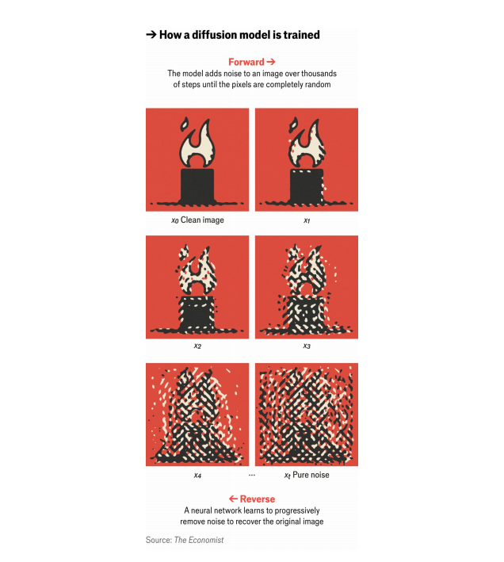

# How AI models are getting smarter

Deep neural networks are learning diffusion and other tricks

原文：

Type in a question to ChatGPT and an answer will materialise. Put a prompt

into DALL\-E 3 and an image will emerge. Click on TikTok’s “for you” page and

you will be fed videos to your taste. Ask Siri for the weather and in a

moment it will be spoken back to you.

在ChatGPT上输入一个问题，答案就会出现。在DALL-E 3上输入一个提示，就会出现一个图像。点击抖音的“为你”页面，你会看到符合你口味的视频。向Siri询问天气，一会儿它就会回答你。

学习：

type in: 键入；输入；

materialize: 具体化

原文：

All these things are powered by artificial-intelligence (AI) models. Most rely

on a neural network, trained on massive amounts of information—text,

images and the like—relevant to how it will be used. Through much trial and

error the weights of connections between simulated neurons are tuned on the

basis of these data, akin to adjusting billions of dials until the output for a

given input is satisfactory.

所有这些都是由人工智能(AI)模型驱动的。大多数依赖于一个神经网络，在大量信息——文本、图像等——上接受训练，这些信息与它将如何被使用有关。通过反复试验，模拟神经元之间的连接权重根据这些数据进行调整，类似于调整数十亿个转盘，直到给定输入的输出令人满意

学习：

and the like：诸如此类的东西；等等；

dials：美 [ˈdaɪəlz] 拨号盘；刻度盘；转盘；（dial的复数）

原文：

There are many ways to connect and layer neurons into a network. A series

of advances in these architectures has helped researchers build neural

networks which can learn more efficiently and which can extract more

useful findings from existing datasets, driving much of the recent progress in

AI.

有许多方法可以将神经元连接和分层成一个网络。这些架构中的一系列进展帮助研究人员建立了神经网络，这些网络可以更有效地学习，并可以从现有数据集中提取更多有用的发现，推动了人工智能的许多最新进展。

原文：

Most of the current excitement has been focused on two families of models:

large language models (LLMs) for text, and diffusion models for images. These

are deeper (ie, have more layers of neurons) than what came before, and are

organised in ways that let them churn quickly through reams of data.

目前最令人兴奋的是两类模型:文本的大型语言模型(LLM)和图像的扩散模型。这些比以前的更深(即有更多层的神经元),而且组织方式让它们可以快速处理大量数据。

学习：

reams of data：大量数据

>"Ream" 在这里指大量的数据。
>
>- 例子：大型语言模型能够处理大量的数据，从而进行有效的训练。(Large language models can process reams of data, enabling effective training.)

churn: 大量处理数据

>"Churn" 在这里表示快速处理或大量处理数据。
>
>- 例子：高级机器学习算法可以快速处理大量的数据。(Advanced machine learning algorithms can churn through vast amounts of data quickly.)

原文：

LLMs—such as GPT, Gemini, Claude and Llama—are all built on the so-called

transformer architecture. Introduced in 2017 by Ashish Vaswani and his

team at Google Brain, the key principle of transformers is that of “attention”.

An attention layer allows a model to learn how multiple aspects of an input

—such as words at certain distances from each other in text—are related to

each other, and to take that into account as it formulates its output. Many

attention layers in a row allow a model to learn associations at different

levels of granularity—between words, phrases or even paragraphs. This

approach is also well-suited for implementation on graphics-processing unit

(GPU) chips, which has allowed these models to scale up and has, in turn,

ramped up the market capitalisation of Nvidia, the world’s leading GPU-maker.

LLM——如GPT, Gemini, Claude and Llama——都是建立在所谓的transformer 架构上的。2017年，Ashish Vaswani和他在谷歌大脑的团队推出了transformer 的关键原则是“注意力”。注意力层允许模型了解输入的多个方面(例如文本中彼此相距一定距离的单词)是如何相互关联的，并在制定输出时考虑到这一点。一行中的许多注意力层允许模型学习不同粒度级别的关联——单词、短语甚至段落之间的关联。这种方法也非常适合在图形处理单元(GPU)芯片上实施，这使得这些模型可以扩大规模，从而增加了全球领先的GPU制造商英伟达的市值。

学习：

Gemini：美 [ˈdʒɛməˌnaɪ] 双子座；双子宫（黄道第3宫）

granularity：美 [grænjʊ'lærɪtɪ] 粒度

market capitalization：市值

ramp up：提高

原文：

Transformer-based models can generate images as well as text. The first

version of DALL\-E, released by OpenAI in 2021, was a transformer that learned

associations between groups of pixels in an image, rather than words in a

text. In both cases the neural network is translating what it “sees” into

numbers and performing maths (specifically, matrix operations) on them.

But transformers have their limitations. They struggle to learn consistent

world-models. For example, when fielding a human’s queries they will

contradict themselves from one answer to the next, without any

“understanding” that the first answer makes the second nonsensical (or vice

versa), because they do not really “know” either answer—just associations

of certain strings of words that look like answers.

基于Transformer的模型可以生成图像和文本。OpenAI在2021年发布的DALL-E的第一个版本是一个transformer ，它学习图像中像素组之间的关联，而不是文本中的单词。在这两种情况下，神经网络都将其“看到的”转化为数字，并对其进行数学运算(具体来说，就是矩阵运算)。但是transformer有其局限性。他们很难是一致的世界模型。例如，当回答一个人的问题时，他们会从一个答案到下一个答案自相矛盾，而没有任何“理解”第一个答案使第二个答案变得无意义(反之亦然)，因为他们并不真正“知道”任何一个答案——只是看起来像答案的某些字符串的关联。

原文：

And as many now know, transformer-based models are prone to so-called

“hallucinations” where they make up plausible-looking but wrong answers,

and citations to support them. Similarly, the images produced by early

transformer-based models often broke the rules of physics and were

implausible in other ways (which may be a feature for some users, but was a

bug for designers who sought to produce photo-realistic images). A different

sort of model was needed.

正如许多人现在所知道的，基于transformer的模型容易产生所谓的“幻觉”，他们编造看似合理但错误的答案，以及支持这些答案的引文。类似地，早期基于transformer的模型生成的图像通常打破了物理规则，在其他方面也不可信(这可能是一些用户的一个功能，但对于寻求生成照片级逼真图像的设计师来说是一个缺陷)。需要一种不同的模式。

学习：

prone to： 容易发生；容易出现；易于；倾向于

plausible-looking：看似合理的

photo-realistic：照片般逼真      

## **Not my cup of tea**

原文：

Enter diffusion models, which are capable of generating far more realistic

images. The main idea for them was inspired by the physical process of

diffusion. If you put a tea bag into a cup of hot water, the tea leaves start to

steep and the colour of the tea seeps out, blurring into clear water. Leave it

for a few minutes and the liquid in the cup will be a uniform colour. The

laws of physics dictate this process of diffusion. Much as you can use the

laws of physics to predict how the tea will diffuse, you can also reverse-

engineer this process—to reconstruct where and how the tea bag might first

have been dunked. In real life the second law of thermodynamics makes this

a one-way street; one cannot get the original tea bag back from the cup. But

learning to simulate that entropy-reversing return trip makes realistic image

generation possible.

进入扩散模型，它能够生成更真实的图像。他们的主要想法受到了扩散的物理过程的启发。如果你把茶包放进一杯热水中，茶叶开始浸泡，茶的颜色渗出，模糊清澈的水。让它保持几分钟，杯子里的液体就会变成均匀的颜色。物理定律决定了这一扩散过程。就像你可以用物理定律来预测茶叶如何扩散一样，你也可以逆向工程这个过程——重建茶包可能在哪里以及如何第一次被浸泡。在现实生活中，热力学第二定律使这成为不可逆的；人们无法从杯中取回原来的茶包。但是，学会模拟熵反转的回程，就有可能产生真实的影像。

学习：

tea bag：袋泡茶；茶包；泡茶用的茶包；一袋茶叶          

thermodynamics：美 [ˌθərmoʊdaɪˈnæmɪks] 热力学

原文：

Training works like this. You take an image and apply progressively more

blur and noise, until it looks completely random. Then comes the hard part:

reversing this process to recreate the original image, like recovering the tea

bag from the tea. This is done using “self-supervised learning”, similar to

how LLMs are trained on text: covering up words in a sentence and learning to

predict the missing words through trial and error. In the case of images, the

network learns how to remove increasing amounts of noise to reproduce the

original image. As it works through billions of images, learning the patterns

needed to remove distortions, the network gains the ability to create entirely

new images out of nothing more than random noise.

训练是这样的。你拍摄一张图像，并逐渐应用更多的模糊和噪声，直到它看起来完全随机。接下来是困难的部分:反转这个过程来重新创建原始图像，就像从茶叶中恢复茶袋一样。这是通过“自监督学习”完成的，类似于LLM如何在文本上训练:覆盖句子中的单词，并通过试错学习预测缺失的单词。在图像的情况下，网络学习如何去除越来越多的噪声以再现原始图像。随着它处理数十亿张图像，学习消除失真所需的模式，网络获得了完全从随机噪声中创建全新图像的能力。

学习：

distortions：扭曲；变形；曲解；失真；（distortion的复数）          

原文：

Most state-of-the-art image-generation systems use a diffusion model,

though they differ in how they go about “de-noising” or reversing

distortions. Stable Diffusion (from Stability AI) and Imagen, both released in

2022, used variations of an architecture called a convolutional neural

network (CNN), which is good at analysing grid-like data such as rows and

columns of pixels. CNNs, in effect, move small sliding windows up and down

across their input looking for specific artefacts, such as patterns and corners.

But though CNNs work well with pixels, some of the latest image-generators

use so-called diffusion transformers, including Stability AI’s newest model,

Stable Diffusion 3. Once trained on diffusion, transformers are much better

able to grasp how various pieces of an image or frame of video relate to each

other, and how strongly or weakly they do so, resulting in more realistic

outputs (though they still make mistakes).

大多数最先进的图像生成系统使用扩散模型，尽管它们在如何“去噪”或逆转失真方面有所不同。2022年发布的Stability Diffusion(来自Stability AI)和Imagen使用了一种称为卷积神经网络(CNN)的架构变体，这种架构擅长分析网格状数据，如像素的行和列。实际上，CNN在输入时上下移动小滑动窗口，寻找特定的假象，比如图案和角落。但是，尽管CNN在像素方面工作得很好，但一些最新的图像生成器使用所谓的扩散transformers，包括Stability AI的最新型号Stability Diffusion 3。一旦接受了扩散训练，transformers就能更好地掌握图像或视频帧的各个部分之间的关系，以及它们之间的关系有多强或多弱，从而产生更真实的输出(尽管它们仍会出错)。

原文：

Recommendation systems are another kettle of fish. It is rare to get a

glimpse at the innards of one, because the companies that build and use

recommendation algorithms are highly secretive about them. But in 2019

Meta, then Facebook, released details about its deep-learning

recommendation model (DLRM). The model has three main parts. First, it

converts inputs (such as a user’s age or “likes” on the platform, or content

they consumed) into “embeddings”. It learns in such a way that similar

things (like tennis and ping pong) are close to each other in this embedding

space.

推荐系统是另一回事。人们很难一窥其中的内幕，因为开发和使用推荐算法的公司对此高度保密。但在2019年，Meta，然后是脸书，发布了其深度学习推荐模型(DLRM)的细节。该模型有三个主要部分。首先，它将输入(如用户的年龄或平台上的“喜欢”或他们消费的内容)转换为“嵌入”。它以这样的方式学习，相似的东西(像网球和乒乓球)在这个嵌入空间中彼此靠近。

学习：

kettle：壶；水壶

another kettle of fish：另一回事

innards：美 [ˈɪnərdz] 内脏；内部结构

secretive：私密的；保密的

原文：

The DLRM then uses a neural network to do something called matrix

factorisation. Imagine a spreadsheet where the columns are videos and the

rows are different users. Each cell says how much each user likes each

video. But most of the cells in the grid are empty. The goal of

recommendation is to make predictions for all the empty cells. One way a

DLRM might do this is to split the grid (in mathematical terms, factorise the

matrix) into two grids: one that contains data about users, and one that

contains data about the videos. By recombining these grids (or multiplying

the matrices) and feeding the results into another neural network for more

number-crunching, it is possible to fill in the grid cells that used to be empty

—ie, predict how much each user will like each video.

然后，DLRM使用神经网络来做一种叫做矩阵分解的事情。想象一个电子表格，其中列是视频，行是不同的用户。每个单元格表示每个用户喜欢每个视频的程度。但是网格中的大部分单元格都是空的。推荐的目标是对所有空单元格进行预测。DLRM可以做到这一点的一个方法是将网格(用数学术语来说，分解矩阵)分成两个网格:一个包含用户数据，另一个包含视频数据。通过重新组合这些网格(或乘以矩阵)，并将结果输入另一个神经网络进行更多的数字处理，有可能填充过去是空的网格单元——即，预测每个用户对每个视频的喜欢程度。

学习：

spreadsheet：美 [ˈsprɛdˌʃit] 数据表；计算表；电子表格

number-crunching：数字运算

原文：

The same approach can be applied to advertisements, songs on a streaming

service, products on an e-commerce platform, and so forth. Tech firms are

most interested in models that excel at commercially useful tasks like this.

But running these models at scale requires extremely deep pockets, vast

quantities of data and huge amounts of processing power.

同样的方法也适用于广告、流媒体服务上的歌曲、电子商务平台上的产品等等。科技公司最感兴趣的是擅长商业用途的模型。但大规模运行这些模型需要极其雄厚的财力、大量的数据和巨大的处理能力。      

## **Wait until you see next year’s model**

原文:

In academic contexts, where datasets are smaller and budgets are

constrained, other kinds of models are more practical. These include

recurrent neural networks (for analysing sequences of data), variational

autoencoders (for spotting patterns in data), generative adversarial networks

(where one model learns to do a task by repeatedly trying to fool another

model) and graph neural networks (for predicting the outcomes of complex

interactions)

在学术环境中，数据集较小，预算有限，其他类型的模型更实用。这些包括递归神经网络(用于分析数据序列)、变分自动编码器(用于发现数据中的模式)、生成对抗网络(其中一个模型通过反复试图欺骗另一个模型来学习完成任务)和图形神经网络(用于预测复杂交互的结果)

原文：

Just as deep neural networks, transformers and diffusion models all made the

leap from research curiosities to widespread deployment, features and

principles from these other models will be seized upon and incorporated into

future AI models. Transformers are highly efficient, but it is not clear that

scaling them up can solve their tendencies to hallucinate and to make logical

errors when reasoning. The search is already under way for “post-transformer” 

architectures, from “state-space models” to “neuro-symbolic”AI, that can 

overcome such weaknesses and enable the next leap forward.

Ideally such an architecture would combine attention with greater prowess at

reasoning. Right now no human yet knows how to build that kind of model.

Maybe someday an AI model will do the job. ■

正如深度神经网络、transformers 和扩散模型都从研究好奇到广泛部署，这些其他模型的功能和原理将被抓住并融入未来的人工智能模型。transformers 效率很高，但还不清楚扩大它们的规模能否解决它们产生幻觉和推理时犯逻辑错误的倾向。从“状态空间模型”到“神经符号”人工智能，对“后transformer ”架构的研究已经开始，可以克服这些弱点，实现下一次飞跃。理想情况下，这种架构将注意力与更强的推理能力结合起来。现在还没有人知道如何建造这种模型。也许有一天人工智能模型会做这项工作。■

## 后记

2024年8月12日17点51分于上海。

