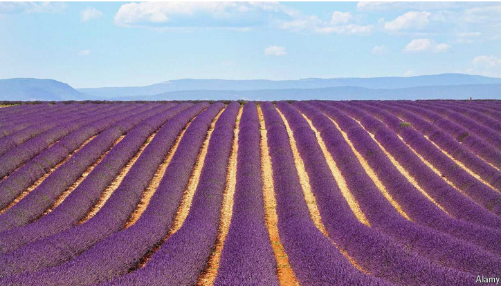

# Lavender extract makes excellent mosquito-repellent

薰衣草提取物是极好的驱蚊剂

Scientists have turned it into clothing

lavender：美 [ˈlævəndər] 熏衣草；干熏衣草花（用以熏香衣物等）；淡紫色；薰衣草色

extract：提取物；精华；浓缩物

mosquito：美 [məˈskiːtoʊ] 蚊子

repellent：美 [rɪˈpelənt] 驱虫剂；防水剂；抗污剂

mosquito-repellent：驱虫剂

原文：

A MOSQUITO’S BITE can do more than leave an itchy rash. Depending on

the pathogens the insect carries, it can lead to a host of nasty diseases

including dengue, malaria and yellow fever.

被蚊子咬了不仅仅会留下发痒的皮疹。根据昆虫携带的病原体，它可以导致一系列严重的疾病，包括登革热、疟疾和黄热病。

学习：

itchy：美 [ˈɪtʃi] 发痒的

rash： 美 [ræʃ] 皮疹；疹子；

pathogens：美 [ˈpæθədʒənz] 病原体（物）；（pathogen的复数）

nasty：美 [ˈnæsti] 危险的； 恶心的；有害的；有损伤的；

nasty disease：严重的疾病

dengue：美 [ˈdɛŋɡi] 登革热（由蚊子传播的热带疾病，症状为发烧和关节剧痛）；

malaria：美 [məˈleriə] 疟疾

yellow fever：黄热病（热带疾病，可导致死亡）

原文：

To date, synthetic repellents have been the best way to keep the little blood-

suckers at bay. These work, but can cause a range of health problems

including rashes, eye inflammation and respiratory distress. This has led

many to search for alternatives. The compounds responsible for lavender’s

fragrance, for example, known as essential oils, have long been shown to

deter mosquitoes. Unfortunately, the ease with which they evaporate, and the

speed with which they break down under ultraviolet light, has made it

impossible to turn them into long-lasting protection.

迄今为止，合成驱虫剂是阻止小吸血虫的最好方法。这些方法有效，但会导致一系列健康问题，包括皮疹、眼部炎症和呼吸困难。这导致许多人寻找替代品。例如，薰衣草的香味成分，即所谓的精油，长期以来一直被证明可以驱蚊。不幸的是，它们很容易蒸发，在紫外线下分解的速度很快，这使得它们不可能成为持久的保护。

学习：

to date：迄今；迄今为止；到目前为止

repellent：驱虫剂

health problems：健康问题

inflammation：美 [ˌɪnfləˈmeɪʃn] 炎症；发炎

respiratory distress： 呼吸窘迫；呼吸道窘迫          

fragrance：美 [ˈfreɪɡrəns] 香气；芬芳；香味

essential oils：精油

deter mosquitoes：驱蚊

ultraviolet light：紫外线光

原文：

In a paper in the *Journal of Pest Science*, Zeeshan Tariq and Xiaoqin Wang

at Soochow University in China use their background as textile engineers to

turn the oils into long-lasting mosquito-repellent fabric that can be fashioned

into outerwear.

在《害虫科学杂志》上的一篇论文中，中国苏州大学的齐山·塔里克和Xiaoqin Wang利用他们纺织工程师的背景，将这些油转化为长效驱蚊织物，可以制成外衣。

学习：

Soochow University：苏州大学

textile：美 [ˈtekstaɪl] 纺织品；纺织原料；纺织业；

outerwear：外套；外穿衣物；外层服装

原文：

The researchers took inspiration from another, less noisome, insect. The silk

threads produced by silkworms, among other bugs, are tough, flexible and

biodegradable. The crucial ingredient is silk fibroin, a protein that can be

fashioned into structures that let the liquids they contain leak out slowly. Dr

Tariq and Dr Wang speculated that if microscopic silk fibroin capsules could

be filled with lavender oil, this liquid would gradually be released.

研究人员从另一种不那么讨厌的昆虫那里获得了灵感。在其他昆虫中，蚕产生的丝线坚韧、柔韧、可生物降解。关键的成分是丝心蛋白，这种蛋白质可以被制成结构，让其中包含的液体慢慢泄漏出来。塔里克博士和Wang 博士推测，如果微观丝心蛋白胶囊可以填充薰衣草油，这种液体将逐渐释放出来。

学习：

noisome：令人生厌的；使人不愉快的

silk：丝绸；蚕丝

silk threads：丝线

silkworms：蚕；桑蚕；家蚕；（silkworm的复数）

biodegradable：英 [ˌbʌɪə(ʊ)dɪˈɡreɪdəb(ə)l] 可生物分解的；生物可降解性的

fibroin：美 [ˈfaɪbrəwən] 丝心蛋白

fashioned：改变；制作；使适应；塑造；（fashion的过去式和过去分词）

microscopic：美 [ˌmaɪkrəˈskɑːpɪk] 极小的；微小的；微观的；肉眼难以看见的

原文：

Working with a team of colleagues at universities across China, the

researchers created a solution of silk fibroin and gum arabic, a polymer

found in the sap of acacia trees, which is used to help materials form into

stable structures. The solution was stirred continuously at warm

temperatures as lavender oil and water were added. Under these conditions,

the silk fibroin and gum arabic formed into tiny oil-containing capsules.

When the solution was cooled, the stirring halted and other important

ingredients added, the capsules drifted to the bottom for collection. By

adjusting the amount of lavender oil added, Dr Tariq and Dr Wang could

vary the lavender oil content from 5% to 15%. They then bound many

thousands of these capsules to strips of cotton fabric.

通过与中国各地大学的同事合作，研究人员创造了一种丝素蛋白和阿拉伯树胶的溶液，阿拉伯树胶是在金合欢树的汁液中发现的一种聚合物，用于帮助材料形成稳定的结构。随着薰衣草油和水的加入，溶液在温热下持续搅拌。在这些条件下，丝心蛋白和阿拉伯树胶形成微小的含油胶囊。当溶液冷却后，停止搅拌并加入其他重要成分，胶囊漂浮到底部收集。通过调整薰衣草油的添加量，塔里克博士和Wang 博士可以使薰衣草油的含量在5%到15%之间变化。然后他们将数千个胶囊绑在棉布条上。

学习：

gum：树胶；树脂

polymer：美 [ˈpɑːlɪmər] 聚合物；聚合体

sap：树液；体液；液体

acacia：美 [əˈkeɪʃə] 金合欢属植物；金合欢树；刺槐；阿拉伯树胶

solution：溶液

capsules：美 [ˈkæpsəlz] 胶囊；（capsule的复数）

cotton fabric：棉纺织物；纯棉织物；棉布          

原文：

Keen to see if the fabric would repel mosquitoes, Dr Tariq and Dr Wang

turned it into arm-length gloves. They then recruited three volunteers willing

to repeatedly plunge gloved arms into enclosures teeming with starving

mosquitoes for five minutes at a time. The researchers noted how many of

the bugs landed on the volunteers’ arms during each trial. As a control, each

volunteer was also asked to wear a glove with no lavender capsules.

塔里克博士和Wang博士非常想知道这种织物是否能驱蚊，于是他们把它变成了一种手臂长度的手套。然后，他们招募了三名志愿者，这些志愿者愿意将戴着手套的手臂反复投入充满饥饿蚊子的围栏中，每次五分钟。研究人员记录了每次试验中有多少虫子落在志愿者的手臂上。作为对照，每个志愿者也被要求戴上没有薰衣草胶囊的手套。

学习：

repel mosquitoes：驱蚊

enclosure：封闭场地；圈地；

teeming with：充满

原文：

The authors report that the capsules containing 15% lavender oil solution

offered excellent deterrence. Whereas an average of 15 mosquitoes landed

on each control glove, the average landing on each scented arm was less

than one.

作者报告说，含有15%薰衣草油溶液的胶囊提供了极好的威慑。尽管平均有15只蚊子落在每只对照手套上，但平均落在每只有气味的手臂上的蚊子不到一只。

学习：

scented：有香味的；有气味的；洒了香水的

原文：

The researchers were also keen to test how well the fabric held up in the

wash. They, therefore, threw the gloves into ordinary washing machines and

repeated the trials. Even after 40 washes, an average of only 2.5 mosquitoes

landed on the 15% gloves during trials. Success has rarely smelled sweeter.■

研究人员还热衷于测试这种织物在洗涤中的耐久性。因此，他们把手套扔进普通的洗衣机，重复试验。即使在40次洗涤后，在试验期间，平均只有2.5只蚊子落在含量15%的手套上。成功很少闻起来更甜蜜。■

学习：

in the wash：待洗的；正在洗的          

washing machine：洗衣机

## 后记

2024年8月12日20点13分于上海。

