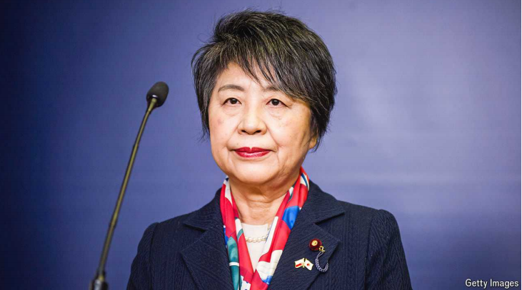

# Could Kamikawa Yoko be Japan’s next prime minister?

She would be the first woman to hold the top role

原文：

WHEN UNNO Fumiko first met Kamikawa Yoko, she was left wondering:

“Why would such an earnest person want to go into politics?” Ms Unno was

a leader among the green-tea farmers of Shizuoka prefecture; Ms Kamikawa

was a think-tank researcher, with no political connections, who wanted to

enter parliament to represent the region. Having graduated from the

University of Tokyo and Harvard University, Ms Kamikawa “could do

anything”, Ms Unno thought. Politics, long the domain of men from political

families, seemed “like a waste”. It took Ms Kamikawa seven years and two

election cycles to win her first seat in Japan’s lower house, in 2000. Now

Japan’s foreign minister, her career has been anything but a waste.

当宇野文子第一次见到神川洋子时，她感到很疑惑:“为什么这么认真的人会想从政？”Unno女士是静冈县绿茶农民的领袖；Kamikawa女士是一名智囊团研究员，没有政治背景，她想进入议会代表该地区。Unno女士认为，从东京大学和哈佛大学毕业后，Kamikawa女士“可以做任何事情”。长期以来，政治一直是来自政治世家的男人的领地，现在看来“像是一种浪费”。2000年，神川花了七年时间和两次选举才赢得了她在日本众议院的第一个席位。现在的日本外相，她的职业生涯一点也不浪费。

学习：

earnest：诚挚的；热心的；认真的；

go into politics：从政

prefecture：美 [ˈpriːfektʃər] 县；省；专区；辖区；管区；行政区

with no political connections：没有政治背景

lower house：众议院；下（议）院          

anything but：一点也不；绝不

原文：

Indeed, she has emerged as one of a handful of serious contenders to win the

ruling Liberal Democratic Party’s (LDP) leadership vote in late September. Aso

Taro, a party kingmaker, ignited such speculation by calling her a “rising

star” late last year. By this spring, she had soared from relative anonymity to

become one of voters’ three most popular choices for prime minister.

Though her star has faded slightly, she remains among the top five in most

polls. If chosen, she would become Japan’s first-ever female prime minister.

事实上，她已经成为9月下旬赢得执政的自民党(LDP)领导人选举的少数几个有力竞争者之一。麻生太郎，一个政党的拥王者，去年底称她为“冉冉升起的新星”,引发了这样的猜测。到今年春天，她已经从相对默默无闻一跃成为选民最喜欢的三个总理候选人之一。尽管她的明星地位略有下降，但在大多数民意调查中，她仍名列前五。如果当选，她将成为日本有史以来第一位女首相。

学习：

a handful of：一小撮；一把；少数

serious contenders：有力竞争者

kingmaker：能扶植领导人的有影响人物；政界元老；幕后操纵者

anonymity：美 [ˌænəˈnɪməti] 匿名；匿名者

first-ever：首次；破天荒；第一次          

原文：

In an interview, Ms Kamikawa is cagey about her own trajectory. She insists

that she is “devoting everything to the field of diplomacy” and “not thinking

about” her next move. As a member of prime minister Kishida Fumio’s

parliamentary faction, she cannot say anything else as long as he remains in

the race.

在一次采访中，Kamikawa女士对自己的轨迹守口如瓶。她坚持说，她正在“把一切都奉献给外交领域”，“不考虑”她的下一步行动。作为首相岸田文雄议会派系的成员，只要他还在竞选中，她就不能说别的。

学习：

cagey：美 [ˈkeɪdʒi] 不愿透露信息的；含糊其辞的；守口如瓶的

原文：

Yet the contest may well open up as the vote approaches. The LDP is still

reeling from a financial scandal that dragged its ratings down to their lowest

levels in decades. The party has lost a series of crucial by-elections in recent

months. Approval of Mr Kishida’s administration has been rock-bottom for

much of the year, dipping below 20% in some polls. With a general election

deadline looming next year, many in the party are clamouring for new

leadership. While the 71-year-old Ms Kamikawa is an uninspiring speaker,

she is respected across the party’s disparate wings and could emerge as a

compromise candidate.

然而，随着投票的临近，这场竞争很可能会公开化。自民党仍然受到金融丑闻的困扰，该丑闻导致其支持率跌至几十年来的最低水平。最近几个月，该党输掉了一系列至关重要的补选。今年大部分时间，岸田文雄政府的支持率一直处于谷底，在一些民调中跌至20%以下。随着明年大选最后期限的临近，党内许多人都在呼吁选出新的领导人。尽管71岁的上川女士是一个不令人振奋的演讲者，但她受到了党内不同派系的尊重，可能会成为一个妥协的候选人。

学习：

by-election：递补选举；

rock-bottom：最低水平的；最低限度的；最低的；

dipping：美 ['dɪpɪŋ] 下降；（dip的现在分词）

原文：

Despite her decades in politics, her views are little known even within Japan.

Who is she? The Japanese words *majime*, meaning “serious” or “diligent”,

and *jimi*, meaning “low key” or “modest”, come up most often in

conversations with those who know her. She credits her time at a private

Catholic high school with instilling a sense of responsibility. “The pillar of

my education was to serve others to the best of my ability,” she reflects.

尽管她从政数十年，但她的观点甚至在日本国内也鲜为人知。她是谁？日语单词majime的意思是“认真”或“勤奋”，而jimi的意思是“低调”或“谦虚”，这两个词在与认识她的人的交谈中出现得最多。她认为自己在一所私立天主教高中的时光灌输了一种责任感。“我所受教育的支柱是尽我所能为他人服务，”她反思道。

学习：

low key：低调的；不招摇的          

原文：

But her awakening to politics came later, while studying in America and

working as an intern in the office of a senator, Max Baucus. At the time, in

the late 1980s, Japan’s economy was booming and its populace was

confident. But from afar, Ms Kamikawa grasped that Japan’s inward-looking

politics left it “very weak” on the international stage. She resolved to change

her country’s politics from within, and wrote one of her term papers at

Harvard on her future campaign strategy

但她对政治的觉醒是后来的事，那时她在美国学习，在参议员马克斯·鲍克斯的办公室实习。当时，在上世纪80年代末，日本经济蓬勃发展，民众信心十足。但是从远处看，神川女士明白日本的内向政治使其在国际舞台上“非常虚弱”。她决心从内部改变日本的政治，并在哈佛大学写了一篇关于她未来竞选策略的学期论文

学习：

populace： 美 [ˈpɑːpjələs] 民众；平民；群众；公众

from afar：从远处          

inward-looking：冷漠的；只关心自己的；对他人不感兴趣的；不关心他人的          

from within：从内部；从内；来自内部          

resolve：决定；决心；

原文：

Back home in Shizuoka she built a grassroots support base. With her elite

credentials, “at first the farmers found her a bit hard to approach—but now

everyone supports her”, Ms Unno says.

回到家乡静冈，她建立了一个基层支持基地。由于她的精英资历，“起初农民觉得她有点难以接近——但现在每个人都支持她”，Unno女士说。

grassroots：乡村的；基层的；基本的；草根的

原文：

Ms Kamikawa made her name as justice minister, serving in the role three

times under former prime ministers Abe Shinzo and Suga Yoshihide. Her

most consequential decision was signing the execution order for 13 members

of Aum Shinrikyo, the doomsday cult responsible for a sarin gas attack on

the Tokyo subway in 1995. The move left her under lifelong police

protection—and earned her the respect of the LDP’s conservative wing. Her

selection as foreign minister was somewhat unexpected, given her

domestically focused roles.

上川女士作为司法部长而出名，在前首相安倍晋三和菅义伟手下三次担任该职务。她最重大的决定是签署了对奥姆真理教13名成员的处决令，奥姆真理教是世界末日邪教，对1995年东京地铁沙林毒气袭击负有责任。这一举动使她终身处于警方保护之下，并赢得了自民党保守派的尊重。鉴于她专注于国内事务，她被选为外交部长有些出人意料。

学习：

 justice minister：司法部长

doomsday：美 [ˈdumzˌdeɪ] 世界末日；最后的审判日；大灾难

cult：邪教；异教；

原文：

Much has changed since her first foray abroad. These days America seems

to be “feeling lonely and exhausted as a leader”, she says. Japan’s message,

delivered by Mr Kishida during an address to Congress this spring, is that

“American leadership remains essential in the international community, and

that America does not have to shoulder that responsibility alone”.

自从她第一次出国以来，情况发生了很大变化。她说，如今美国似乎“作为一个领导者感到孤独和疲惫”。岸田文雄在今年春天的国会演讲中传达了日本的信息，即“美国的领导力在国际社会中仍然至关重要，美国不必独自承担这一责任”。

学习：

foray：美 [ˈfɔrˌeɪ] （改变职业、活动的）尝试；短暂尝试；初步尝试；短暂访问（新地方）

原文：

Japan’s position has also undergone an inversion of sorts. These days, the

mood at home is sombre. “People have the image that Japanese society is

diminishing from an economic point of view—the population is declining,

the birth rate is falling, the population is ageing,” she says. But abroad,

Japan is recognised for its contributions. The image there “is not one of

Japan shrinking,” she says. “I hope that people of Japan will know more

about our achievements and feel proud.” ■

日本的地位也经历了某种逆转。这些天，国内的气氛很阴郁。“从经济角度来看，人们认为日本社会正在衰落——人口减少，出生率下降，人口老龄化，”她说。但在国外，日本的贡献得到了认可。她说，那里的形象“不是日本在萎缩”。“我希望日本人民更多地了解我们的成就，并为此感到自豪。”■

学习：

inversion：倒置；倒转；逆转；

sombre：英 [ˈsɒmbə] 暗淡的；低沉的；阴沉的 **注意发音**

## 后记

2024年8月13日17点35分于上海。