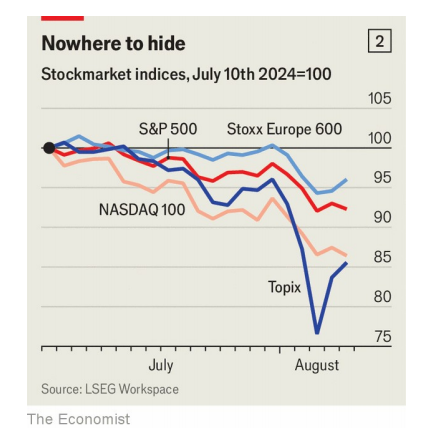
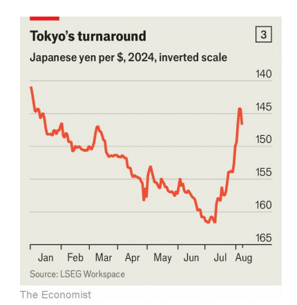

# The stockmarket rout may not be over

As investors pause for breath, we assess what could turn a correction into a crash

rout：美 [raʊt] 溃败；彻底失败；崩盘

correction: 市场调整

>在这段话中：
>
>- **Rout**：指的是溃败或崩溃，特别是在金融市场中指的是大规模的抛售导致的股市暴跌。
>- **Pause for breath**：指的是暂时停下来休息或观望。在这里，它指的是投资者在市场动荡中暂时停止交易以评估形势。
>- **Correction**：指的是市场调整，通常是指股市在经历一段时间的上涨后出现的下跌，幅度一般在10%左右，属于正常的市场波动。
>
>详细解释：
>
>- **Rout**: 溃败，崩溃。例如：The unexpected announcement led to a rout in the stock market. 意外的公告导致股市崩溃。
>- **Pause for breath**: 暂时停下来休息或观望。例如：After a hectic week, she paused for breath before tackling the next task. 忙碌了一周后，她暂时停下来休息，然后再处理下一个任务。
>- **Correction**: 市场调整。例如：The recent correction in the stock market was expected after the prolonged rally. 在经历了长时间的上涨之后，最近的股市调整是预期中的。
>
>在这段话中，作者描述了当前股市的状况，并指出虽然投资者暂时停下来休息和评估市场，但仍需要评估什么因素可能会将一次市场调整（correction）转变为全面的市场崩溃（crash）。

原文：

For a while on August 5th things were looking truly awful. During the Asian

trading session Japan’s benchmark Topix share index had fallen by 12%,

marking its worst day since 1987. Stocks in South Korea and Taiwan had

tanked by 9% and 8% respectively, and European markets were faltering.

Before trading began in America, the VIX index, which measures how wildly

traders expect share prices to swing, was at a level it had reached only early

during the covid-19 pandemic and after Lehman Brothers collapsed in 2008

(see chart 1). Ominously, though gold is usually a hedge against chaos, its

price was falling—suggesting that investors might be selling assets they

would rather hold on to in order to stay afloat. The previous week’s rout in

global markets seemed to be spiralling into a full-blown crisis.

在8月5日的一段时间里，事情看起来真的很糟糕。在亚洲交易时段，日本基准的东证股票指数下跌了12%，是自1987年以来最糟糕的一天。韩国和台湾的股票分别下跌了9%和8%，欧洲市场也摇摇欲坠。在美国开始交易之前，衡量交易者预期股价波动幅度的VIX指数处于新冠肺炎疫情时期和2008年雷曼兄弟破产后才达到的水平(见图表1)。不祥的是，尽管黄金通常是对混乱的对冲，但其价格正在下跌——这表明投资者可能正在出售他们宁愿持有的资产，以维持运营。上周全球市场的崩溃似乎正在演变成一场全面的危机。

学习：
tank：（在比赛或考试中）表现极差；故意输掉比赛；遭受重大损失；暴跌

>
>
>**Tank**: 暴跌。例如：The company's stock tanked after the disappointing earnings report. 公司的股票在令人失望的财报发布后暴跌。

had tanked by 9%：下跌了9%

ominously：美 [ˈɑmənəslɪ] 不吉利地；恶兆地；

falter: 指的是动摇或表现不佳。在这里，它指的是欧洲市场表现不佳或出现动摇。

>**Falter**: 动摇，表现不佳。例如：The economy began to falter after a series of policy missteps. 在一系列政策失误之后，经济开始动摇。

afloat：经济上周转自如的；有偿债能力的；

stay afloat: 指的是维持生存或避免破产。在这里，它指的是投资者可能在卖出他们不愿意卖的资产，以保持资金周转或避免财务危机。

>**Stay afloat**: 维持生存，避免破产。例如：The business struggled to stay afloat during the recession. 该企业在经济衰退期间艰难维持生存。

full-blown：完全发展的；成熟的；全面形成的；

manic：美 [ˈmænɪk]  躁狂的；狂热的；疯狂的

原文：

Mercifully, the panic started to ebb once Wall Street opened for business.

The VIX fell back to only its highest during the crash of 2022; by the end of the

day the S&P 500 index of large American companies was down by a mere

3%. Over the next few days American and European stocks recovered a

little, and Japanese ones bounced back. The losses made over the past few

weeks have nevertheless been brutal, stretching into the double digits for the

Topix and America’s tech-heavy NASDAQ 100 (see chart 2). And as ever after a

rout—while traders pause for breath and attempt to catch up on some sleep

—one question looms large. Did markets simply succumb to a brief bout of

madness, or is there worse to come?

幸运的是，华尔街一开门营业，恐慌就开始消退了。VIX跌回到2022年崩盘时的最高水平；当天收盘时，美国大公司的标准普尔500指数仅下跌了3%。在接下来的几天里，美国和欧洲股市略有回升，日本股市也有所反弹。然而，过去几周的损失是残酷的，东证指数和美国科技股为主的纳斯达克100指数的跌幅都达到了两位数(见图2)。和以往一样，在暴跌之后，当交易者停下来喘口气，试图补上一些睡眠时，一个问题迫在眉睫。市场只是屈服于短暂的疯狂，还是会有更糟糕的事情发生？

学习：

mercifully：美 [ˈmərsəf(ə)li] （不幸中）幸运地；值得庆幸地

ebb：退潮；落潮；衰退；减少

tech-heavy：高科技含量的

succumb：美 [səˈkʌm] 屈服；屈从；投降

a brief bout of madness：短暂的疯狂

原文：

Since mid-July, three developments have combined to unsettle investors.

The first was a dawning realisation that artificial intelligence (AI), and

especially the chipmaking industry that powers it, had been imbued with

unrealistic hopes. Donald Trump, the Republican presidential candidate, sent

semiconductor stocks into a tailspin on July 17th by suggesting that Taiwan,

where the vast majority of the world’s advanced chips are made, should pay

for its own defence against China. The Biden administration, meanwhile,

was said to be planning curbs on exports of chipmaking equipment to China.

自7月中旬以来，三个事态发展共同令投资者不安。首先，人们开始意识到，人工智能(AI)，尤其是为其提供动力的芯片制造业，一直充满了不切实际的希望。7月17日，共和党总统候选人唐纳德·特朗普(Donald Trump)暗示，世界上绝大多数先进芯片的制造地台湾应该为自己抵御中国大陆的能力买单，这让半导体类股陷入混乱。与此同时，据说拜登政府正计划限制向中国出口芯片制造设备。

学习：

unsettle：扰乱；搅乱；使心绪不宁

unsettle invectors：使投资者不安

dawning realisation：逐渐认识到；（dawn的现在分词）          

tailspin：混乱；慌乱；失控；

curbs：限制

原文：

A lacklustre earnings season for America’s tech giants then added to the

geopolitical woes. Over the course of ten days from July 23rd Alphabet,

Amazon, Apple, Meta and Microsoft all released results that left

shareholders crestfallen. Even Alphabet and Microsoft, whose revenues beat

expectations, saw their share prices fall the day after they reported. Those of

Amazon, which undershot expectations, were punished far more. Investors’

euphoria over all things AI was evaporating.

美国科技巨头低迷的财报季加剧了地缘政治的困境。从7月23日开始的十天里，亚马逊、苹果、Meta和微软都发布了让股东沮丧的业绩。就连收入超出预期的Alphabet和微软，也在报告发布后第二天股价下跌。那些低于预期的亚马逊公司受到的惩罚要大得多。投资者对所有人工智能事物的欢欣鼓舞正在消失。

学习：

lacklustre：英 [ˈlaklʌstə] 缺乏活力的；缺少信念的；；暗淡的；低迷的

woe：美 [woʊ]   困苦；苦恼；灾祸；不幸；问题

crestfallen：美 [ˈkrɛs(t)ˌfɔlən] 失望的；沮丧的；垂头丧气的

原文：

At the same time, a rally by the Japanese yen was roiling stocks on the other

side of the world—the second development to give investors an attack of the

vapours (see chart 3). This was in part caused by the Bank of Japan’s

surprise decision to raise interest rates to around 0.25% on July 31st. A

rising yen automatically depresses Japanese share prices, since many of the

country’s largest globetrotting firms, such as Hitachi, Sony and Toyota,

make their earnings in foreign currencies.

与此同时，日元的反弹正在搅动世界另一端的股票——这是第二个让投资者感到恐慌的发展(见图表3)。这部分是由于日本银行在7月31日出人意料地决定将利率提高到0.25%左右。日元升值自然会压低日本股价，因为该国许多最大的环球公司，如日立、索尼和丰田，都是以外币盈利的。

学习：

rally：上涨，反弹

vapour：美 [ˈveɪpər] 空想；幻想; 水蒸气，雾气

>在这里，"vapours" 是一个比喻性的表达，指的是投资者的紧张或焦虑状态。在这个语境中，"an attack of the vapours" 意味着投资者因市场不确定性或突然的变化而感到恐慌或不安。
>
>详细解释：
>- **Vapours**: 原本是指水蒸气或雾气，但在这里用作比喻，表示焦虑、紧张或不安。
>
>例句：
>英文: The sudden market crash gave investors an attack of the vapours, causing widespread panic selling.
>中文: 突然的市场崩盘让投资者感到极度不安，引发了广泛的恐慌性抛售。
>
>在这段话中，作者描述了由于日本央行意外决定将利率提高到约0.25%，导致日元走强，进而引发全球市场的波动，给投资者带来不安情绪。日元升值会自动压低日本股票价格，因为该国许多大型跨国公司（如日立、索尼和丰田）是以外币赚取收入的。

depress share prices：压低股价

globetrotting： 美 [ˈgloʊbtrɑtɪŋ] 游历世界的；环球旅行的；环球旅行；（globetrot的现在分词）

Hitachi：（日本）日立（一个全球500强综合跨国集团）

Sony：美 [sɑnɪ] 索尼（日本电子娱乐公司）

Toyota：美 [toʊˈjoʊtə] 丰田

原文：

The third development—an unexpectedly weak American jobs report

released on August 2nd—then supercharged the effects of the other two. The

report revealed that the unemployment rate rose to a three-year high of 4.3%

in July, while the economy added just 114,000 jobs, against a consensus

forecast beforehand of 175,000. That put the world’s biggest economy closer

to a recession than most had thought. American Treasury yields plummeted,

with the two-year rate falling to 3.9%, more than a percentage point below

its level at the end of April. And share prices around the world went into free

fall.

第三个发展——8月2日发布的美国就业报告出人意料的疲软——则加剧了其他两个因素的影响。报告显示，7月份失业率升至4.3%的三年高点，而经济仅增加了114，000个就业岗位，而此前的共识预测为175，000个。这使得世界上最大的经济体比大多数人想象的更接近衰退。美国国债收益率暴跌，两年期利率降至3.9%，比4月底的水平低了一个多百分点。世界各地的股票价格直线下跌。

学习：

free fall：自由落体；自由落体运动

share prices went into free fall：股价直线下跌

## **My heart cries out**

原文：

Even then, there was still room for a fair few winners. Although America’s

headline indices sank, shares in companies such as Johnson & Johnson,

Procter & Gamble and UnitedHealth enjoyed a bounce on the day of the jobs

report. Such firms are in sectors well placed to weather a downturn (pharma,

consumer staples and health care, respectively), and pay healthy dividends,

raising their value as the Federal Reserve becomes more likely to cut interest

rates.

即便如此，仍有相当多的赢家。尽管美国整体指数下跌，但在就业报告发布当天，强生、宝洁和联合健康等公司的股票却出现反弹。这些公司所处的行业能够很好地度过低迷时期(分别是制药、消费品和医疗保健)，并支付健康的股息，随着美联储更有可能降息，这些公司的价值也随之上升。

学习：

sank：下沉；沉没；使下沉 （sink的过去式）          

weather：经受住；安全度过（困难或危机）

pharma：制药公司

staple：标准品；常用品；（某国的）主要产品；支柱产品

consumer staples：消费品

headline: 主要的，最重要的

headline indices：主要指数

>在这里，"headline" 指的是主要的或最重要的。具体来说，"headline indices" 是指美国股市的主要指数，如道琼斯工业平均指数（Dow Jones Industrial Average）、标准普尔500指数（S&P 500）和纳斯达克综合指数（Nasdaq Composite Index）。
>
>详细解释：
>- **Headline indices**: 主要指数，指的是代表市场总体表现的关键股票指数。
>
>例句：
>英文: Despite the drop in headline indices, some sectors managed to perform well.  
>中文: 尽管主要指数下跌，一些行业依然表现良好。
>
>在这段话中，作者指出尽管美国主要股指下跌，但像强生（Johnson & Johnson）、宝洁（Procter & Gamble）和联合健康（UnitedHealth）这样的公司股票在当天的就业报告发布后反而上涨。这些公司所在的行业（制药、消费必需品和医疗保健）在经济衰退期间表现相对较好，并支付丰厚的股息，使它们在美联储可能降息的情况下更具吸引力。

原文：

However, by August 5th that was little help: the sell-off had broadened out.

Investors were ditching virtually every stock in the S&P 500, along with those

across global markets. What had started as the unwinding of a few popular

trades had transformed into a slump encompassing pretty much everything.

然而，到了8月5日，这已无济于事:抛售已经扩大。投资者几乎抛弃了标准普尔500的所有股票，以及全球市场的所有股票。一些热门交易的平仓已经转变为几乎涵盖所有领域的暴跌。

学习：

ditch：抛售，放弃

>在这个语境中，它指的是投资者正在抛售几乎所有的股票。
>
>**Ditch**: 抛售，放弃。例如：Investors decided to ditch their stocks amid market uncertainty. 投资者在市场不确定性中决定抛售他们的股票。

unwind: 平仓

>**Unwind**: 平仓，解除（交易头寸）。例如：Traders began to unwind their positions as market conditions changed. 随着市场状况的变化，交易员们开始平仓。
>
>**Unwind**：指的是平仓或解除（交易头寸）。在这个语境中，它指的是投资者在结束一些流行交易时引发了更广泛的市场下跌。

平仓：

>平仓是指在金融交易中，为了结束一个持仓而进行相反方向的交易。具体来说，如果你之前买入了一定数量的资产（例如股票、期货合约等），那么平仓就是指你卖出这些资产，从而结束持有的头寸。同样，如果你之前卖出了一定数量的资产，那么平仓就是指你买回这些资产，以结束你的空头头寸。
>
>例子：
>- **买入平仓**：如果你之前卖出了100手期货合约，现在你买回这100手期货合约，以结束你的空头头寸。
>- **卖出平仓**：如果你之前买入了500股股票，现在你卖出这500股股票，以结束你的多头头寸。
>
>平仓的目的通常是为了锁定利润、止损或者结束交易。
>
>例句：
>英文: The trader decided to close out his position to lock in profits.
>中文: 交易员决定平仓以锁定利润。

原文：

Such indiscriminate selling may well resume. Christian Raute, a trading-

strategy boss at Citigroup, a bank, says that the breadth of the selling

suggests professional investors have received a “tap on the shoulder” from

above, ordering them to reduce their risk no matter what they need to offload

to do so. For large funds, that will take more than just a few days of sales. In

the meantime, other outfits will hesitate to buy even assets they think have

become underpriced, fearing a behemoth somewhere still has a big position

to dump into the market. The gut-churning drops, in other words, appear to

be far from over.

这种不加选择的抛售很可能会继续。花旗银行的交易策略主管Christian Raute说，抛售的广度表明专业投资者已经收到了来自上面的“轻拍肩膀”,命令他们降低风险，不管为此他们需要放弃什么。对于大型基金来说，这将需要几天的销售时间。与此同时，其他机构将会犹豫是否购买他们认为已经被低估的资产，担心某个地方的一个庞然大物仍有大量头寸可以投入市场。换句话说，令人反胃的下跌似乎远未结束。

学习：

dump into：倾倒入；大量倾销          

gut-churning：令人作呕的      

>是的，这里的 "has a big position to dump into the market" 指的是某个大型机构（例如对冲基金或投资基金）持有大量的资产，并可能会在市场上大量抛售这些资产。
>
>详细解释：
>- **Big position**: 指的是在某种资产（如股票、期货合约等）上持有的大量头寸。
>- **Dump into the market**: 指的是大量抛售这些资产。
>
>在这个语境中，作者提到由于一些大型基金被要求降低风险，可能会在市场上大量抛售它们的持仓。这种大量抛售会导致市场价格进一步下跌，甚至让其他投资者也不敢买入那些他们认为价格已经低估的资产，因为他们担心市场上还有其他大型机构可能会继续抛售，进一步压低价格。
>
>例句：
>英文: Fearing that a major hedge fund still has a big position to dump into the market, many investors are hesitant to buy undervalued assets.
>中文: 由于担心某大型对冲基金仍可能会大量抛售资产，许多投资者对购买被低估的资产犹豫不决。

原文：

Investors may be forced out of especially crowded bets for other reasons.

The astonishing speed with which the Japanese yen has strengthened in

recent weeks, for instance, is probably because of the unravelling of “carry

trades”. These involve borrowing yen cheaply and using the proceeds to buy

other assets—perhaps a higher-yielding currency, such as the American

dollar or Mexican peso, or even stocks. But should the yen suddenly

strengthen relative to the other asset, the trade quickly plunges into the red

and may need to be terminated. Doing so involves selling the other asset and

buying yen to pay back the debt, exacerbating the move and quite possibly

forcing others into the same position, creating a vicious circle. If this

generates a big loss, the investor may also need to leave other positions to

meet it.

投资者可能因为其他原因被迫退出特别拥挤的赌注。例如，最近几周日元以惊人的速度升值，很可能是因为“套息交易”的瓦解。这包括低息借入日元，并用所得购买其他资产——也许是高收益货币，如美元或墨西哥比索，甚至是股票。但如果日元相对于另一种资产突然走强，这种交易就会迅速陷入亏损，可能需要终止。这样做涉及出售另一项资产，买入日元来偿还债务，加剧了这一举动，很可能迫使其他人陷入同样的境地，形成恶性循环。如果这产生了巨大的损失，投资者可能还需要放弃其他头寸来弥补。

学习：

unravelling：美 [ʌnˈrævlɪŋ] 解开；阐明；（unravel的现在分词）

carry trades：套息交易

>在这里：
>
>- **Unravelling of “carry trades”**：指的是“套息交易”（carry trades）被迫平仓或解除。“套息交易”是指投资者借入低息货币（例如日元），并用借来的资金购买高息货币或资产（例如美元、墨西哥比索或股票）以赚取利差。如果借入的低息货币（如日元）突然升值，相对于其他资产的价值上升，那么这种交易会迅速亏损，从而可能需要被终止（即平仓）。
>
>- **Position**：指的是投资者在某种资产上的持仓。在这个语境中，指的是投资者持有的其他资产或交易头寸。
>
>详细解释：
>
>1. **Unravelling of “carry trades”**：套息交易被迫平仓
>   - **Carry trades**：借入低息货币，投资于高息货币或资产，以赚取利差。
>   - **Unravelling**：指交易由于亏损而被迫结束或平仓。
>
>2. **Position**：持仓，头寸
>   - 在金融市场中，**position** 指的是投资者在某种资产上的投资数量和方向（多头或空头）。
>
>例句：
>- 英文: The unravelling of carry trades can lead to significant market volatility as investors rush to cover their positions.
>  中文: 套息交易的平仓可能导致市场的显著波动，因为投资者急于平仓。
>
>在这段话中，作者解释了日元的快速升值可能是由于“套息交易”的平仓造成的。投资者借入日元购买其他资产，如果日元突然升值，相对于其他资产的价值上升，交易会迅速亏损，从而被迫平仓。平仓需要卖出其他资产并买入日元以偿还债务，这进一步推动了日元升值，并可能迫使其他投资者处于同样的境地，形成恶性循环。如果这导致巨大的亏损，投资者可能还需要平仓其他持仓以满足损失。

原文：

Some of the recent violent swings in the yen, Japanese and American stocks,

and indeed the Mexican peso, may thus be the result of yen-based carry

trades. Moreover, any popular trade that some investors have funded through

borrowing can fall victim to the same sort of doom loop. Bets on firms

linked to AI euphoria are a prime candidate. The VIX index’s hair-raising spike

on August 5th, caused by hordes of investors clamouring to buy insurance

on the same stocks at once, suggests quite how crowded such positions are

even after the recent unwinding. It also shows quite how much this crowding

can move markets. And so there is plenty of potential for future sales,

whether forced or voluntary, to cause further ructions.

因此，日元、日本和美国股票，甚至墨西哥比索最近的剧烈波动可能是日元套利交易的结果。此外，一些投资者通过借贷融资的任何热门交易都可能成为同一种厄运循环的受害者。押注与人工智能热潮相关的公司是一个主要候选对象。VIX指数在8月5日令人毛骨悚然的飙升，是由成群结队的投资者叫嚣着立刻购买相同股票的保险引起的，这表明即使在最近的平仓之后，这样的头寸是多么拥挤。这也显示了这种拥挤对市场的影响有多大。因此，未来的销售，无论是被迫的还是自愿的，都有很大的潜力引起进一步的骚动。

学习：

fall victim to：成为…的牺牲品；成为…的受害者；受到…的侵害

hair-raising：令人毛骨悚然的；惊悚的；惊险的；令人恐惧的；

hordes of：成群结队的

unwinding：平仓

ruction：骚动

原文：

The most dangerous escalation would come if the turbulence has left a

sizeable investment vehicle unable to raise the money required to meet

margin calls or close loss-making positions. That is what happened to

Archegos, a family office, in 2021, prompting fire-sales of its assets and

losses for its banks stretching into the billions of dollars. At a bigger outfit,

such a collapse could spread contagion across the market and imperil other

companies. As yet, “there is not sufficient pain to suggest a big player is in

danger,” says Citi’s Mr Raute. “But if we see five more days of this, that

may change.”

如果市场动荡导致一家规模可观的投资公司无法筹集到满足追加保证金要求或结清亏损头寸所需的资金，最危险的升级就会到来。这就是2021年发生在家族理财室Archegos身上的事情，促使其资产被贱卖，银行损失高达数十亿美元。在一家更大的公司，这种崩溃可能会蔓延到整个市场，危及其他公司。到目前为止，“还没有足够的痛苦来表明一个大玩家处于危险之中，”花旗的Raute先生说。“但如果我们看到这种情况再持续五天，情况可能会有所改变。”

学习：

loss-making：亏损的；亏本；赔钱的          

margin calls：追加保证金的通知      

family office：家族办公室

>**家族办公室**是指专门为富裕家族（此类家族一般其可用于[投资](https://zh.wikipedia.org/wiki/投资)的资产超过1亿美元）提供[投资管理](https://zh.wikipedia.org/wiki/投资学)和[财富管理](https://zh.wikipedia.org/wiki/财富管理)的[私人公司](https://zh.wikipedia.org/wiki/私人公司)，家族办公室的目的是帮助富裕家族实现财富的跨代增长。家族办公室的理财资金来源为家族的自有资金

prompt：促使

fire-sales：大甩卖

contagion：美 [kənˈteɪdʒən] （负面影响的）扩散；传播；蔓延

imperil：美 [ɪmˈperəl] 危及；使陷入危险；使受到威胁；

## **Nothing but joy**

原文：

Another cause for panic could come from surprises on the economy, or

further doubts about the viability of the AIboom. There are plenty of potential

flashpoints in the weeks ahead. Around a quarter of firms in the S&P 500 are

still due to report their second-quarter earnings. These include Home Depot

and Walmart, barometers of American consumer sentiment, and Nvidia, on

which the fortunes of AI investors everywhere depend. Inflation data released

on August 14th will hint at whether the Fed can indeed cut rates by 0.5

percentage points in September, which many are convinced it must in order

to stave off a recession. Given the carnage that followed the most recent jobs

report, the next, on September 6th, is another obvious catalyst.

恐慌的另一个原因可能来自经济上的意外，或者对AIboom可行性的进一步怀疑。未来几周有很多潜在的爆发点。大约四分之一的标准普尔500公司仍将公布第二季度的收益。这些包括家得宝和沃尔玛，美国消费者情绪的晴雨表，以及英伟达，世界各地人工智能投资者的命运都取决于它。8月14日公布的通货膨胀数据将暗示美联储是否真的能在9月份降息0.5个百分点，许多人认为为了避免经济衰退，美联储必须降息0.5个百分点。鉴于最近的就业报告之后的不好表现，9月6日的下一份报告是另一个明显的催化剂。

学习：

flashpoints：（政治动乱地区的）燃点；导火线；（flashpoint的复数）

barometers：美 [bə'rɒmɪtəz] 晴雨表；气压计；（barometer的复数）

stave：美 [steɪv] 破坏；击碎；抵挡；挡开；打破

stave off：避开；延缓          

stave off a recession：避免经济衰退

carnage： 美 [ˈkɑrnɪdʒ] 大屠 杀；残杀；（尤指战争中被杀的）尸体

原文：

Even now America’s stockmarket remains more expensive relative to firms’

underlying earnings than at almost any point in history. Greed has given way

to fear, and the bulls have taken a battering. But if valuations are to return to

normality, there is still a long way to go. ■

即使是现在，美国的股票市场相对于公司的潜在收益仍然比历史上任何时候都要贵。贪婪让位于恐惧，多头遭受重创。但如果估值要回归正常，还有很长的路要走。■

学习：

batter：连续猛击；殴打；

>在这里，"battering" 指的是严重的打击或重创。在这个语境中，它形容那些对股市持乐观看法的投资者（称为“牛市”投资者）遭受了严重的打击，表明市场情绪已经从贪婪转向恐惧。
>
>详细解释：
>
>- **Battering**: 严重的打击，重创。例如：The team took a battering in their last game, losing by a large margin. 在最后一场比赛中，球队遭受了重创，以大比分失利。
>
>例句： 英文: The company's reputation took a battering after the scandal was revealed.
>中文: 丑闻曝光后，公司声誉遭受了严重打击。
>
>在这段话中，作者指出尽管美国股市相对于公司实际盈利而言仍然处于历史上几乎最高的估值水平，但市场情绪已经从贪婪转向恐惧，那些看好股市上涨的投资者（“牛市”投资者）遭受了严重的打击。要使估值回归正常水平，还需要很长的路要走。

return to normality：回归正常

## 后记

2024年8月14日17点43分于上海。

