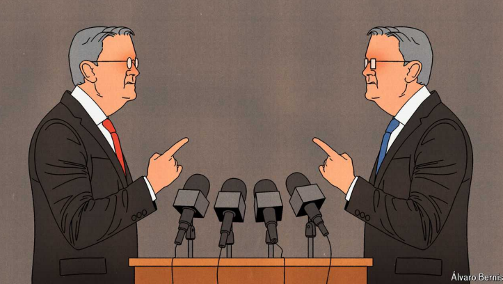

# Should central bankers argue in public?

Division is not always a weakness

原文：

Jerome Powell’s tenure as chairman of the Federal Reserve has been

admirably sure-footed. But on July 31st he may have stumbled when he

announced that interest rates would remain at 5.25-5.5%. This was soon

followed by unexpectedly weak employment data. Markets around the world

then plunged as investors worried that the Fed had fallen behind the curve.

杰罗姆·鲍威尔担任美联储主席期间，脚步稳健，令人钦佩。但是在7月31日，当他宣布利率将保持在5.25-5.5%时，他可能犯了一个错误。紧接着，就业数据出人意料地疲软。随后，由于投资者担心美联储已经落后于形势，全球市场大幅下挫。

学习：

tenure：美 [ˈtenjər] 任期；任职期间；

admirably：极好地；美好地；令人钦佩地          

sure-footed：不会摔倒的；步履稳健的；自信的；能干的

stumbled：绊倒；犯错误；（stumble的过去式和过去分词）

原文：

Bank of England (BoE) policymakers were, meanwhile, sitting as comfortably

as could be expected given the circumstances. On August 1st they had voted

to cut rates from 5.25% to 5%. What at first glance may appear a

straightforward story of better judgment in fact reveals deeper truths about

how monetary policy is set. The BoE’s decision was made by the barest of

margins. Five doveish members outvoted four more hawkish colleagues,

who wanted to hold firm. The Fed, which puts far more value on consensus,

would be unlikely to see such a split. In many other countries, it would be

impossible: monetary policymakers debate behind closed doors and then

present a united front in public.

与此同时，鉴于目前的形势，英国央行(BoE)的政策制定者们正如预期的那样舒舒服服地坐着。8月1日，他们投票决定将利率从5.25%下调至5%。乍一看，这似乎是一个更好判断的简单故事，实际上揭示了货币政策如何制定的更深层次的真相。英国央行的决定是以微弱优势做出的。五名鸽派成员在投票中击败了四名想要坚持立场的鹰派同事。更看重共识的美联储不太可能看到这种分裂。在许多其他国家，这是不可能的:货币政策制定者关起门来辩论，然后公开展示统一战线。

学习：

>
>
>在这里，"barest of margins" 指的是以极小的差距或最微小的优势。在这个语境中，它描述了英国央行（BoE）决策者以极小的差距做出了降息的决定。
>
>详细解释：
>- **Barest of margins**: 极小的差距，最微小的优势。例如：The election was decided by the barest of margins, with the winner receiving only a few more votes than the opponent. 选举结果以极小的差距决定，获胜者仅比对手多得了几票。
>
>例句：
>英文: The team won the championship by the barest of margins, scoring just one point more than their rivals.  
>中文: 这支球队以极小的差距赢得了冠军，只比对手多得了一分。
>
>在这段话中，作者指出，英国央行的降息决定是以极小的优势通过的。五名持鸽派立场的成员以微弱的优势超过了四名持鹰派立场的成员，后者希望保持现有利率不变。

原文：

Economists now broadly agree on how a central bank ought to operate. It

should be independent, rather than following the whims of politicians. It

should focus on controlling inflation over the medium term. And it should

be staffed by judicious technocrats who have been appointed on merit. Yet

one question remains unanswered. How, exactly, should central banks set

monetary policy? This is not about whether a hawkish or doveish approach

is superior, but about the mechanics of decision-making—a matter on which

there remains remarkably wide variation.

经济学家现在对央行应该如何运作达成了广泛共识。它应该是独立的，而不是跟随政客的突发奇想。它应该把重点放在控制中期通胀上。它应该由明智的技术官僚组成，这些人是根据能力任命的。然而有一个问题仍然没有答案。央行到底应该如何制定货币政策？这不是鹰派或鸽派方法孰优孰劣的问题，而是关于决策机制的问题——在这个问题上仍然存在着显著的差异。

学习：

whims：美 ['wɪmz] 一时的兴致；奇想；幻想；怪念头；（whim的复数）

judicious：美 [dʒuˈdɪʃəs] 明智的；明断的；有见地的

merit：优点；长处；价值

be appointed on merit: 根据能力任命

原文：

Until 2019 the Reserve Bank of New Zealand, normally a leader when it

comes to monetary-policy innovation, took an extreme approach. Its

governor simply set rates by himself. New Zealand’s move to a committee

system was wise, since such a structure mitigates against the risk that the

person in office might not be up to the job. In the 2000s researchers

conducted experiments with economics students at the London School of

Economics, Princeton University and the University of California. These

used a simple computer-run economic model, which was subjected to

random shocks. Students had to respond by moving interest rates, and were

scored on how well they kept unemployment at 5% and inflation at 2% over

the course of 20 financial quarters. In every case committees outperformed

individuals. Indeed, a large body of empirical work suggests that well-run

committees help smooth extreme perspectives, drive out poor judgment and

provide more insulation from both political and personal pressure.

直到2019年，通常在货币政策创新方面处于领先地位的新西兰储备银行采取了极端的方法。该行行长只是自己设定利率。新西兰转向委员会制度是明智的，因为这样的结构减轻了在职者可能无法胜任工作的风险。21世纪初，研究人员对伦敦经济学院、普林斯顿大学和加州大学的经济学学生进行了实验。他们使用了一个简单的计算机运行的经济模型，这个模型会受到随机的冲击。学生们必须通过调整利率做出回应，并根据他们在20个财政季度内将失业率保持在5%和通胀率保持在2%的表现进行评分。在每一个案例中，委员会都胜过个人。事实上，大量的实证研究表明，运行良好的委员会有助于消除极端观点，排除糟糕的判断，并为政治和个人压力提供更多隔离。

学习：

insulation：美 [ˌɪnsəˈleɪʃn] 绝缘；隔热；隔音；孤立；隔热材料；绝缘层

原文：

Beyond the relatively straightforward question of whether interest rates

should be set by an individual or a group, the divide in the monetary-policy

world is between an individualistic approach to committees—as found in

Britain and the Nordic countries—and collegiate committees, as at the

European Central Bank. In the individualistic model, policymakers express

their own views, argue for a desired policy position and then vote for the

action they prefer, with the votes later published. Members can and do

disagree in public. By contrast, in a collegial system, the approach is to

debate the options and then come to a collective decision, which all

members stand behind. At the ECB, the aim is to achieve consensus and

individual voting records are not publicised.

除了利率应该由个人还是团体来设定这个相对简单的问题之外，货币政策世界的分歧在于个人主义的委员会(如英国和北欧国家)和合议委员会(如欧洲中央银行)之间。在个人主义模式中，决策者表达自己的观点，为理想的政策立场辩护，然后投票支持他们喜欢的行动，投票结果稍后公布。成员们可以公开表达不同意见，也确实这样做了。相比之下，在合议制度中，方法是对选项进行辩论，然后做出集体决定，所有成员都支持这一决定。在欧洲央行，目标是达成共识，个人投票记录不会公开。

学习：

Nordic： 美 [ˈnɔrdɪk] 北欧的；北欧国家的

express their own views：表达自己的观点

原文：

The Fed is something of a hybrid. Members of the Federal Open Market

Committee (FOMC) can go their own way and individual voting records are

published. At the same time, the institution places a high value on

collegiality. Alan Blinder, an economist at Princeton and former FOMC member,

has argued that under Alan Greenspan, the Fed’s chairman from 1987 to

2006, the FOMC was an “autocratically collegial system”, in which the chairman

dictated the consensus and other members were expected to fall in line. A

split vote, Mr Greenspan once lectured colleagues, would risk “serious

problems for this organisation”. Under Ben Bernanke, Janet Yellen and Mr

Powell the Fed has been less dominated by one individual. The FOMC is made

up of the seven permanent Fed governors, together with the president of the

New York Fed and four of the other 11 regional Fed presidents on a rotating

basis. No governor has dissented on a policy decision since 2005, but

presidents are more willing to go against the grain.

美联储是某种混合体。联邦公开市场委员会(FOMC)的成员可以走自己的路，个人投票记录被公布。与此同时，该机构高度重视共事合议。普林斯顿大学的经济学家、前FOMC成员艾伦·布林德(Alan Blinder)认为，在1987年至2006年担任美联储主席的艾伦·格林斯潘(Alan Greenspan)的领导下，FOMC是一个“专制的合议系统”，主席决定了共识，其他成员则被期望遵从。格林斯潘曾对同事们说，分裂投票可能会“给这个组织带来严重问题”。在本伯南克(Ben Bernanke)、珍妮特耶伦(Janet Yellen)和鲍威尔的领导下，美联储不再那么由一个人主导。FOMC由七位美联储常任理事、纽约联邦储备银行行长和其他11位地区联邦储备银行行长中的四位轮流担任。自2005年以来，没有美联储的理事对政策决定提出异议，但地区分行的总裁们更愿意违背主流观点。
>在这段话中，作者描述了美联储的决策过程。尽管美联储成员可以有自己的看法，并且每个成员的投票记录都是公开的，但该机构非常重视集体性。在艾伦·格林斯潘担任主席期间，美联储实行了一种“独裁式的集体制度”，即主席制定共识，其他成员被期望遵守。尽管如此，自2005年以来，没有任何理事在政策决定上持反对意见，但地区分行的总裁们更愿意违背主流观点。

学习：

collegiality：美 [kəˌlidʒɪ'ɑlətɪ] 共同掌权；（天主教的）联合领导

grain: 主流或普遍的看法或做法

>**Grain**：在这里，"grain" 指的是主流或普遍的看法或做法。"Go against the grain" 的意思是反对或违背主流或普遍的看法或做法。
>
>例如：Her unconventional views often go against the grain of the academic community. 她的非传统观点常常与学术界的主流观点背道而驰。

governer: 美联储（Federal Reserve）的理事会成员

>
>
>**Governor**：指的是美联储（Federal Reserve）的理事会成员。美联储理事会由七名成员组成，他们由美国总统提名，并由参议院确认。
>
>**Governor**: 美联储理事会成员。例如：The Board of Governors of the Federal Reserve System oversees the operations of the Federal Reserve Banks. 美联储系统的理事会负责监督联邦储备银行的运作。

president: 美联储各地区分行的总裁

>**President**：在这里，"president" 指的是美联储各地区分行的总裁。美联储系统包括12个地区分行，每个分行由一位总裁领导。
>
>例如：The president of the New York Fed is a permanent member of the Federal Open Market Committee (FOMC). 纽约联邦储备银行的总裁是联邦公开市场委员会（FOMC）的常任成员。

## **Put the pedal to the floor**

原文：

Which system is best? The question is a bit like asking if an automatic or

manual car is superior—it depends on what you are after. Individualistic

committees often move faster. It is easier to corral five votes among the nine

members of the BoE’s Monetary Policy Committee to change policy than it is

to generate a near-consensus at the ECB or the Fed. The BoE was one of the

earliest rich-country central banks to begin tightening policy in 2021 and

among the first to begin cutting this year. Such a system also defends against

the danger of groupthink.

哪个系统最好？这个问题有点像问自动挡车和手动挡车孰优孰劣——这取决于你追求的是什么。个人主义委员会通常行动更快。在英国央行货币政策委员会的9名成员中获得5票来改变政策要比在欧洲央行或美联储形成近乎一致的意见容易。英国央行是最早在2021年开始收紧政策的富裕国家央行之一，也是最早在今年开始收紧政策的央行之一。这样一个系统也能抵御群体思维的危险。

学习：

automatic car：自动挡的车

manual car：手动挡的车

corral： 美 [kəˈræl] 将（一群人或物）集合在一起

groupthink：群体思维；团体迷思；团体思维定势；从众思维

原文：

However, this nimbleness comes at a cost. Although the need for consensus

may slow down decision-making, it also allows policymakers to speak with

a clear voice to financial markets and avoids the cacophony of conflicting

signals with which BoE-watchers are all too familiar. When it comes to

monetary policy, the expected path of interest rates can be just as important a

tool as the level of rates now. The ability to send markets a single message is

extremely useful.

然而，这种灵活性是有代价的。尽管对共识的需求可能会减缓决策的速度，但这也让政策制定者能够对金融市场发出清晰的声音，并避免英国央行观察人士再熟悉不过的相互矛盾的不和谐信号。就货币政策而言，利率的预期走势可能与目前的利率水平一样重要。向市场传递单一信息的能力极其有用。

学习：

nimbleness： 美 ['nimblinis]敏捷

cacophony：美 [kəˈkɑfəni] 刺耳的声音；杂音；嘈杂声；不和谐音

原文：

Most of the time influence over interest-rate expectations is more valuable

than nimbleness. But not always. Imagine a situation in which there are

signs the labour market is weakening, inflation is stubbornly above target

and markets are in turmoil. At such an inflection point, when a change in the

monetary-policy regime is required, it might be better to be more open about

disagreement. For once, it is better to be British than American. ■

大多数时候，对利率预期的影响比灵活性更有价值。但并不总是如此。想象一下这样一种情形:有迹象表明劳动力市场正在走弱，通胀率顽固地高于目标水平，市场陷入混乱。在这样一个转折点，当货币政策体制需要改变时，更开放地对待分歧可能会更好。这一次，做英国人比做美国人好。■

学习：

inflection point：拐点；变形点；转折点；

## 后记

2024年8月15日13点15分于上海。

