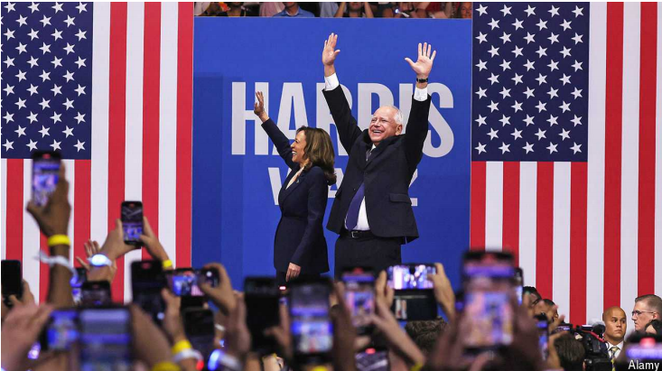

# Tim Walz’s life story is appealing, but his record is complex

Kamala Harris’s running-mate is hard to categorise

原文：

Almost everything about the scene in a packed 10,000-seat basketball arena

in Philadelphia on the evening of August 6th would have been unimaginable

just six weeks ago. First, there was the sheer size and Swiftie-like zeal of a

Democratic crowd waving their glow-in-the-dark wristbands, fired by belief

that their ticket might actually win in November. Then there were the star

attractions on stage: Kamala Harris, now formally ratified as the party’s

presidential nominee, and Tim Walz, the governor of Minnesota, her new

vice-presidential running-mate. Not since 1968 has one of America’s two

major parties switched out a presumptive presidential nominee months

before an election. On current evidence of the move’s effects, they might

consider doing so more often.

8月6日晚上，在费城拥挤的10，000个座位的篮球场上，几乎所有的场景在六周前都是不可想象的。首先，民主党人群挥舞着他们在黑暗中发光的腕带，人数众多，热情高涨，他们相信自己的选票可能会在11月赢得大选。接下来是舞台上引人注目的明星:现已被正式批准为该党总统候选人的卡玛拉·哈里斯，以及她的新副总统竞选伙伴、明尼苏达州州长蒂姆·瓦尔兹。自1968年以来，美国两大政党中还没有一个在选举前几个月就放弃了假定的总统候选人。根据目前证据显示的这一举措的效果，他们可能会考虑更频繁地这样做。

学习：

packed：充满…的；塞满了…的

arena：美 [əˈriːnə] 体育场馆；演出场地；斗争场所；竞争舞台；比赛场地；

wristbands：美 [ˈrɪstbændz] 手腕带；袖口边；护腕；（wristband的复数）

ratified：美 ['rætɪfaɪd] 认可；批准；（ratify的过去式和过去分词）

原文：

The rally’s purpose was to begin selling the rich Americana in Mr Walz’s

biography. Ms Harris selected him after a moderately fraught veepstakes in

which progressives campaigned to prevent the possible choice of

Pennsylvania’s governor, Josh Shapiro, who is Jewish, and who has voiced

support for Israel and school choice. The left rallied around Mr Walz and Ms

Harris went their way. Republicans accused her of capitulating to her party’s

base, but many Democrats rejoiced, as was evident at Mr Walz’s raucous

debut.

集会的目的是开始宣传沃尔兹先生传记中丰富的美国特色。哈里斯女士在一场充满紧张气氛的副总统竞选中选择了他。在这场竞选中，进步派竞选活动阻止了可能选择宾夕法尼亚州州长乔什·夏皮罗的可能性，夏皮罗是犹太人，并且公开支持以色列和学校选择。左派支持沃尔兹先生，哈里斯女士选择了他们的方向。共和党人指责她向党内基本盘屈服，但许多民主党人对此感到欢欣鼓舞，这在沃尔兹先生热闹的首次亮相中显而易见。

学习：

Americana: 美国特色；有关美洲的事物

>**The rally’s purpose was to begin selling the rich Americana in Mr Walz’s biography.** 这句话的意思是：“集会的目的是开始宣传沃尔兹先生传记中丰富的美国特色。” 这里的“selling”并非指实际销售，而是推广和宣传。

>**Americana** 是指与美国文化、历史和传统相关的事物或特征。它通常包括美国的民俗、音乐、文学、艺术、食品、习俗等方面的元素，反映了美国特有的文化遗产和生活方式。在这段话中，“the rich Americana in Mr Walz’s biography” 意思是沃尔兹先生的传记中包含了丰富的美国文化和传统元素。
>
>例如：
>- **Music**: 包括美国乡村音乐、蓝草音乐、摇滚乐等。
>- **History**: 包括美国独立战争、拓荒者的历史、民权运动等。
>- **Traditions**: 包括感恩节、独立日、万圣节等节日习俗。
>
>所以，**Americana** 指的是沃尔兹先生传记中能够代表和反映美国文化和历史的各种元素和故事。

capitulate：美 [kəˈpɪtʃəˌleɪt]  停止抵抗；投降

>
>
>**Fraught**：在这里表示“充满”的意思，通常与紧张或困难相关。在此语境中，指的是竞选副总统的过程充满了紧张和争议。

rejoiced：高兴；庆祝；（rejoice的过去式和过去分词）

raucous：美 [ˈrɔkəs] 喧闹的

debut：美 [deɪˈbjuː] 演员、运动员）首次亮相；（新事物的）问世；初次登台（或上场） **注意发音**

>**Veepstakes**：指的是竞选副总统候选人的过程。Veep 是“副总统”（Vice President）的缩写，stakes 意味着竞争或赌注。

原文：

Mr Walz vaulted to prominence in recent weeks as an energetic advocate for

Ms Harris on television. It was his critique of Republicans—“these guys are

just weird”—that became a popular Democratic attack line. Mr Walz’s

personal history also contrasts with Ms Harris’s Californian upbringing. He

was born in rural Nebraska in 1964—six months before Ms Harris—and he

likes to say that half his school classmates were his cousins. He taught social

studies for two decades, served in the National Guard for 24 years, and

retired as a command sergeant major in 2005. He is a committed hunter, and

in his early years in Congress he was given an A rating by the National Rifle

Association. Ms Harris seemed particularly impressed by Mr Walz’s long

ago side job as a “Friday Night Lights” American-football coach at his high

school.

最近几周，作为哈里斯女士在电视上的积极支持者，瓦尔兹一举成名。正是他对共和党人的批评——“这些家伙就是奇怪”——成为了民主党的一条流行攻击线。瓦尔兹先生的个人经历也与哈里斯女士在加州的成长经历形成了鲜明对比。他于1964年出生在内布拉斯加州的乡村——比哈里斯女士早六个月——他喜欢说他一半的同学都是他的表兄弟。他教了20年的社会学，在国民警卫队服役了24年，2005年以军士长的身份退役。他是一个忠诚的猎手，早年在国会时，他被全国步枪协会评为A级。哈里斯女士似乎对瓦尔兹先生很久以前的兼职印象特别深刻，那是他高中时的“周五之光”美式足球教练。

学习：

vaulted：美 [ˈvɔːltɪd] 用手支撑跃过；撑杆跃过；腾跃：（vault的过去式和过去分词）

vault to prominence：一举成名

personal history：个人经历

upbringing：美 [ˈʌpbrɪŋɪŋ] 教养；抚养；养育；培养

rifle：美 [ˈraɪfl] 步枪；猎枪

side job：兼职；副业；兼职工作

原文：

Ms Harris describes her running-mate’s life story, which is appealingly free

of law school or Wall Street fortune-hunting, as a testament to her

campaign’s Bidenesque focus on the middle class. At the rally, Ms Harris

made no mention of foreign policy or immigration, and her forays into

domestic policy largely stuck to familiar ground. Apart from relentless

attacks on Donald Trump, Ms Harris’s still-incipient campaign remains long

on autobiography and short on an agenda for governing. This is likely to

continue through the made-for-TV Democratic convention in Chicago later

this month—and perhaps all the way to the election in November, if strong

polling numbers allow the campaign to get away with it

哈里斯女士描述了她的竞选伙伴的生活故事，吸引人的是没有法学院或华尔街的财富追逐，作为她的竞选活动拜登式关注中产阶级的证明。在集会上，哈里斯女士没有提到外交政策或移民问题，她对国内政策的尝试基本上停留在熟悉的领域。除了对唐纳德·特朗普(Donald Trump)的无情攻击之外，哈里斯仍处于初期阶段的竞选活动仍以自传见长，执政议程则很短。这种情况可能会持续到本月晚些时候在芝加哥举行的电视民主党大会——也许会一直持续到11月的选举，如果强劲的民调数字允许竞选活动得逞的话

学习：

life story：生活故事；人生故事

testament：美 [ˈtestəmənt] 证据；证明；见证

forays：美 [ˈfɔ:rˌeɪz] 尝试；涉足；短途旅程；（foray的复数）

incipient：初期的；早期的

autobiography：自传；自传体作品；

get away with：侥幸成功做；应付过去；

原文：

The Trump campaign’s glaringly obvious strategy is to paint Ms Harris and

Mr Walz as “dangerous liberals”. At a competing rally in Philadelphia on the

6th, J.D. Vance, Mr Trump’s running-mate, called Mr Walz “one of the most

far-left radicals in the entire United States government”. The rhetoric was

over-the-top, but it raises the question of what sort of Democrat Mr Walz has

actually been during his Minnesota career, and therefore, what his selection

says about Ms Harris’s still-elusive brand of liberalism.

特朗普竞选团队显而易见的策略是将哈里斯和瓦尔兹描绘成“危险的自由主义者”。在6日费城的一场竞争集会上，特朗普的竞选搭档J.D .万斯称瓦尔兹是“整个美国政府中最极左的激进分子之一”。言辞有些过火，但它提出了一个问题，即Walz先生在明尼苏达州的职业生涯中实际上是怎样的一个民主党人，因此，他的选择说明了哈里斯女士仍然难以捉摸的自由主义品牌。

学习：

glaringly： 美 ['ɡleərɪŋlɪ] 显目地；十分显眼地

rhetoric：言辞

elusive：难以捉摸的；难以理解的；

原文：

The answer is nuanced. Mr Walz first won office in 2006, when he stood for

Congress in Minnesota’s first district, a heavily rural area where only one

other Democrat had won in the preceding century. Ken Martin, the chairman

of the Democratic-Farmer-Labour Party (DFL), Minnesota’s affiliate of the

Democratic Party, says that he remembers hearing of Mr Walz’s candidacy

and thinking: “There’s no way in hell he’s going to win.” But Mr Walz got

53% of the vote. During 12 years in Congress, he won marksmanship

contests against other gun-toting members and voted with moderates in his

party caucus, which helped him hold onto his district even as other rural

Democrats lost theirs.

答案是微妙的。Walz先生在2006年第一次赢得了公职，当时他在明尼苏达州的第一选区代表国会，这是一个农村地区，在上个世纪只有一个民主党人在这里获胜。民主党在明尼苏达州的分支——民主-农民-劳工党(DFL)的主席肯·马丁说，他记得听到Walz先生的候选资格时想:“他绝对不会赢。”但是Walz先生获得了53%的选票。在国会的12年里，他赢得了与其他持枪议员的射击比赛，并在党内核心小组中与温和派投票，这帮助他保住了自己的选区，即使其他农村民主党人失去了他们的选区。

学习：

nuanced：有细微差别的；微妙的；精确细腻地表演；细致入微地描绘；（nuance的过去式和过去分词）          

affiliate：英 [əˈfɪlieɪt , əˈfɪliət] 分支机构；附属机构；附属单位；分支团体

marksmanship：美 [ˈmɑrksmənʃɪp] 射击术；枪法

gun-toting：持枪

caucus：美 [ˈkɔkəs] 政党内部会议；小组会议；政治集会

原文：

It is as Minnesota’s governor, since his initial election in 2018, that Mr Walz

has developed an unambiguously progressive record. When he was re-

elected in 2022, his party won the state house and senate. Mr Walz used the

opportunity of this trifecta to increase spending on public schools, introduce

free school meals, create a system of paid family leave (due to start

operating in 2026), legalise marijuana, expand background checks for gun

buyers and strengthen abortion rights. He does not apologise for this record.

“Don’t ever shy away from our progressive values,” he told attendees on a

fundraising call in late July, adding that “one person’s socialism is another

person’s neighbourliness.”

正是作为明尼苏达州州长，自2018年首次当选以来，瓦尔兹创造了一个明确的进步记录。当他在2022年再次当选时，他的政党赢得了州众议院和参议院。Walz先生利用这三连胜的机会增加了公立学校的支出，引入了免费的学校膳食，创建了一个带薪家庭假期系统(将于2026年开始运作)，大麻合法化，扩大了对枪支购买者的背景调查，并加强了堕胎权。他没有为这些记录道歉。“永远不要回避我们的进步价值观，”他在7月下旬的一次筹款电话会议上告诉与会者，并补充说，“一个人的社会主义是另一个人的邻居关系。”

学习：

trifecta：美 [traɪˈfɛktə] 三连胜（尤指赛马等体育竞赛中的前三名投注）

marijuana：美 [ˌmærəˈwɑːnə] 大麻；大麻毒品； **注意发音**

shy away from：回避；逃避；羞于          

neighbourliness：和睦；亲切          

## **Heartland and soul**

原文：

That folksy formulation reflects a long tradition of progressive and populist

politics in the upper Midwest. Mr Walz is best understood as part of the

same heartland liberal strain that produced other national candidates,

including two vice-presidents from Minnesota who failed in their bids to win

the White House: Hubert Humphrey in 1968 and Walter Mondale in 1984,

whom Ronald Reagan defeated in a landslide.

这种民间的表述反映了中西部北部进步和民粹主义政治的悠久传统。Walz先生最容易被理解为产生了其他的国家候选人的同样的心脏地带自由主义的一部分，包括两位来自明尼苏达州的副总统，他们在争取入主白宫的努力中失败了:1968年的Hubert Humphrey和1984年的沃尔特·蒙代尔，后者被Ronald Reagan以压倒性优势击败。

学习：

formulation：（想法的）阐述方式；表述；阐述；

heartland： （国家或地区的）腹地；中心区域；中心部分

landslide：压倒性胜利；选举中的压倒性多数票；一边倒的胜利；

原文：

Mr Walz’s greatest vulnerability to attack advertising down the campaign

stretch may arise from the riots that hit Minneapolis in 2020, following the

murder of George Floyd. Mr Walz waited a full day to respond to a call from

the city’s mayor to send in the National Guard. While he hesitated, a mob set

a police station on fire. Mr Walz argued that the National Guard could not be

deployed that quickly, but Republicans are already attacking him for being

soft on looters and aligned with left advocates who want to “defund the

police”. Rather awkwardly for them, there is tape of then President Trump

calling Mr Walz and praising him for calling in the Guard and subduing the

riots.

在竞选活动中，沃尔兹最容易受到广告攻击的地方可能是2020年乔治·弗洛伊德(George Floyd)被谋杀后袭击明尼阿波利斯的骚乱。Walz先生等了整整一天才回应市长派遣国民警卫队的call。就在他犹豫不决的时候，一群暴徒放火烧了一个警察局。Walz先生认为国民警卫队不可能这么快部署，但共和党人已经开始攻击他对抢劫者手软，并与想要“撤销警察经费”的左翼倡导者结盟。对他们来说，相当尴尬的是，有一段录音显示，时任总统特朗普打电话给瓦尔兹，称赞他召集了警卫并平息了骚乱。

学习：

looters：美 ['lu:təz] 掠夺者；抢劫者；强夺者；（looter的复数）

subduing：美 [səb'duɪŋ] 征服；压制；减弱；使服从；（subdue的现在分词形式）

subduing the riots：平息了骚乱

原文：

Mr Walz has in fact consistently been a thorn in the side of the defund

caucus and a strong proponent of policing. In 2021 the Minneapolis city

council proposed to genuinely defund the Minneapolis police department

and replace it with a new department of public safety. When the idea came

to a public ballot, Mr Walz opposed it. Last year he proposed making more

than half a billion dollars available to hire police.

事实上，瓦尔兹一直是撤销经费核心小组的眼中钉，也是警务的强烈支持者。2021年，明尼阿波利斯市议会提议真正撤销明尼阿波利斯警察局，代之以新的公共安全部。当这个想法进行公开投票时，Walz先生表示反对。去年，他提议拨出5亿多美元用于雇佣警察。

学习：

thorn：刺；棘刺；荆棘

原文：

The day after their debut in Philadelphia, Ms Harris and Mr Walz carried

their pre-convention barnstorming tour of swing states to Eau Claire,

Wisconsin, where they appeared before another fervent crowd of thousands.

The candidates beamed again and reprised their set list from the night

before. Ms Harris said she and her running-mate would be “joyful warriors”

on the campaign trail. Mr Trump has long taken pride in his emotive, well-

attended rallies as an expression of his committed support. For now, at least,

he has credible competition. ■

在费城的首次亮相之后的第二天，哈里斯女士和沃尔兹先生继续他们在摇摆州的竞选造势之旅，来到了威斯康星州的欧克莱尔，在那里他们再次面对成千上万热情的群众。两位候选人再次笑容满面，重演了前一天晚上的讲话内容。哈里斯女士表示，她和她的竞选搭档将在竞选途中成为‘快乐的战士’。特朗普一直以来都为他那些情绪激动、参与度高的集会感到自豪，认为这是他坚定支持的表现。至少目前，他有了一个可信的竞争对手。■

学习：

barnstorming：英 [ˈbɑːnstɔːmɪŋ] 充满激情的；成功的

set list: 表演曲目

>**Set list**：通常指演出中要表演的曲目列表。在这个语境中，指的是哈里斯和沃尔兹在竞选集会中要发表的讲话内容或要讨论的主题列表。也就是说，他们在费城的首次亮相中所讨论的内容和要点在威斯康星州的集会中再次呈现。

fervent：热情的；热烈的；热诚的；

reprised：重奏；重演；（reprise的过去式）

beam：笑容；眉开眼笑；

emotive：情绪性的；激发情感的；感性的；有感染力的；激动人心的

well-attended：有很多人参加的（会议等）

trail：竞选活动

>**Trail**：在这里指的是竞选活动。全称是“campaign trail”，指的是候选人在竞选过程中前往各地进行宣传和拉票的行程。

## 后记

2024年8月15日18点45分于上海。

