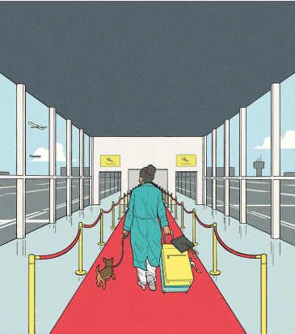

# America is sabotaging itself in the global battle for talent

Some countries are much more serious about attracting the highly skilled

sabotaging：美 [ˈsæbəˌtɑʒɪŋ] 蓄意破坏；（sabotage的现在分词形式）

原文：

Who said the following? “You graduate from a college, I think you should

get, automatically as part of your diploma, a green card [permanent

residence in the United States].” The surprising answer is Donald Trump.

Whether he meant it or not—and his record in office suggests not—his

words suggest that even a nativist politician understands, at some level, that

highly skilled foreigners can be useful.

以下是谁说的？“你从大学毕业，我认为你应该自动获得绿卡(美国永久居留权)，作为你文凭的一部分。”令人惊讶的答案是唐纳德·特朗普。不管他是否真心实意——他的执政记录表明并非如此——他的话表明，即使是本土主义政治家也在某种程度上明白，高技能的外国人可能是有用的。

学习：

diploma： 美 [dɪˈploʊmə] 文凭；毕业证书；毕业文凭

nativist：美 ['neɪtɪvɪst] 本土主义者；本土文化保护者

原文：

In fact they are extra-useful, since their skills tend to complement those of

locals. They bring different experiences, knowledge and contacts, making

local co-workers more productive. A Harvard study tried to measure this by

looking at what happened to researchers when a colleague died. The loss of

an immigrant brainbox reduced co-workers’ productivity (measured in

patents) by nearly twice as much as the loss of a native. From this, the study

estimated that immigrants in America, though only 14% of the population,

are responsible for a colossal 36% of innovation. As the globalisation of

capital stagnates, the flow of brains across borders becomes an ever-more

important way for new ideas to spread.

事实上，他们是特别有用的，因为他们的技能往往是当地人的补充。他们带来不同的经验、知识和人脉，让当地员工更有效率。哈佛大学的一项研究试图通过观察同事去世时研究人员的反应来衡量这一点。失去一个移民智囊团降低了同事的生产力(以专利衡量),几乎是失去一个本地人的两倍。由此，该研究估计美国的移民，尽管只占人口的14%，却贡献了巨大的36%的创新。随着资本全球化的停滞，人才跨境流动成为新思想传播的一种越来越重要的方式。

学习：

extra-useful：特别有用的

contacts：联系人；人脉

brainbox：非常聪明的人

colossal：美 [kəˈlɑːsl] 巨大的；庞大的；极大的；

stagnates：[stægneɪts]  停滞；（stagnate的第三人称单数）

flow of brains：人才流动

原文：

Most rich countries are reluctant to let in many more labourers or asylum-

seekers), but claim to be eager to attract top talent, especially in fields

deemed strategic (such as AI) or of obvious benefit to voters (such as

medicine). America, China and most European countries all profess to

welcome such people. Monaco even has an “attractiveness secretary” to lure

high-flying entrepreneurs.

大多数富裕国家不愿意让更多的劳动力或寻求庇护者进入，但声称渴望吸引顶级人才，特别是在被认为具有战略意义的领域(如人工智能)或对选民有明显好处的领域(如医药)。美国、中国和大多数欧洲国家都声称欢迎这样的人。摩纳哥甚至有一个“吸引力秘书”来吸引雄心勃勃的企业家。

学习：

labourers：劳工；劳动者；（labourer的复数）

profess：声称；宣称；自称；公开表明

high-flying：胸怀大志的；雄心勃勃的

lure：吸引

asylum：政治庇护

原文：

Yet other priorities often intrude. China’s obsession with security has made

life irksome for foreigners there. Police snoop on them, their local lovers are

warned they may be spies, and consultants they hire may be arrested for

sharing information subsequently deemed a national secret. In Britain an

obsession with cutting overall migration has led the Labour government to

urge tech firms to hire fewer foreign engineers, on the false premise that this

will create more high-tech jobs for natives. As for America, though it has the

world’s most attractive labour market, it has one of the world’s most

dysfunctional immigration systems.

然而，其他的优先事项经常闯入。中国对安全的痴迷让外国人在那里的生活变得令人厌烦。警察监视他们，他们当地的情人被警告他们可能是间谍，他们雇佣的顾问可能会因为分享后来被视为国家机密的信息而被捕。在英国，对减少整体移民的痴迷导致工党政府敦促科技公司雇佣更少的外国工程师，错误的前提是这将为本地人创造更多的高科技工作。至于美国，尽管它拥有世界上最具吸引力的劳动力市场，却拥有世界上最不健全的移民体系。

学习：
irksome： 美 [ˈərksəm] 令人厌烦的；使人烦恼的；令人生气的

snoop：打探；窥探；探听；偷看；暗中监视

national secret：国家机密

## **The border brain barrier**

原文：

When a company applies for an H-1B (temporary work visa) on behalf of a

highly skilled worker with a six-figure job offer, there is a 75% chance it

will be rejected. But not quickly. It can take a year of faffing: an eternity in

the tech business. And if the over-achiever in question eventually wants

permanent residence—so she can settle in, plan for the future and not worry

about her children being deported when they turn 21 and are no longer

deemed dependants—she had better not be from a populous country. Thanks

to a ludicrous rule that no more than 7% of work-based green cards may go

to any one country each year, Indian citizens can expect to wait 134 years

for one.

当一家公司代表一名拥有六位数工作机会的高技能工人申请H-1B(临时工作签证)时，有75%的几率会被拒绝。但不是很快。这可能需要一年的忙碌:这在科技行业是永恒的。如果有问题的成功人士最终想要永久居留——这样她就可以安顿下来，规划未来，不用担心她的孩子在21岁时被驱逐出境，不再被视为受抚养人——她最好不要来自人口稠密的国家。由于一个可笑的规则，即每年任何一个国家获得的工作绿卡不得超过7%,印度公民可能要等134年才能获得一个。

学习：

faffing：美 [fæfɪŋ] 无事奔忙；（faff的现在分词）

eternity：美 [ɪˈtɜːrnəti] 永恒；不朽；永生；永世；无限的时间；（似乎）无止境的时间

in the tech business：在科技行业

ludicrous：美 [ˈluːdɪkrəs] 荒谬的；不合理的；不能当真的；

原文：

Many give up and go elsewhere. Some 73% of foreign graduates of

American universities tell pollsters they want to stay in America, but only

41% actually do so. The blockage in the pipeline from campus to job is one

reason why American universities, though the best in the world, have been

losing market share to Australian and Canadian ones for two decades.

许多人放弃了，去了别处。大约73%的美国大学外国毕业生告诉民意调查者他们想留在美国，但只有41%的人真的这么做了。从校园到工作的管道堵塞是为什么美国大学，尽管是世界上最好的，二十年来一直被澳大利亚和加拿大的大学夺走市场份额的原因之一。

学习：
blockage：阻塞；堵塞；闭塞；封锁

原文：

Contrast this with Dubai, where anyone with a salary above a certain

threshold can get a work visa in a week. Settling in is easy—a fully digitised

system lets you obtain a driving licence, open a bank account and so forth in

a few days. Expats can sponsor nannies for work visas, so both halves of a

power couple can work. This extraordinarily welcoming system has helped

turn Dubai from an obscure port on the edge of the desert into a global

business hub in barely a generation.

相比之下，在迪拜，任何工资超过一定门槛的人都可以在一周内获得工作签证。安顿下来很容易——一个完全数字化的系统可以让你在几天内获得驾驶执照、开立银行账户等等。外籍人士可以赞助奶奶和姥姥获得工作签证，这样夫妻双方都可以工作。这一异常受欢迎的系统帮助迪拜在仅仅一代人的时间里，从沙漠边缘的一个默默无闻的港口变成了一个全球商业中心。

学习：

expats：美 [ˈekspæts] 旅居国外者；侨民；

driving licence：驾照

nannies：美 [ˈnæniz] 奶奶；保姆；外婆；姥姥；（nanny的复数）

原文：

Democracies cannot simply copy autocratic Dubai. Voters like to feel in

control, and would not tolerate being outnumbered nearly nine to one by

migrants. And few welfare states could get by without an income tax.

Nonetheless, Dubai is a useful benchmark for how a government can make

an immigration system nearly frictionless for the people it most wishes to

attract. Its success is an implicit rebuke of places that still have paper forms

and surly border officials, such as America. If they want to, democracies can

quickly improve their immigration systems, as Portugal has, turning itself

from a relative backwater into an oasis for digital nomads in a decade or so.

民主国家不能简单地复制专制的迪拜。选民喜欢掌控一切的感觉，不会容忍移民数量接近9比1。几乎没有哪个福利国家能够在没有所得税的情况下生存。尽管如此，迪拜是一个有用的基准，表明政府如何让移民系统对它最希望吸引的人几乎没有摩擦。它的成功是对那些仍然有纸质表格和粗暴的边境官员的地方的含蓄谴责，比如美国。如果他们愿意，民主国家可以迅速改善他们的移民系统，就像葡萄牙所做的那样，在十年左右的时间里把自己从一个相对闭塞的地方变成数字游牧民族的绿洲。

学习：

rebuke： 美 [rɪˈbjuːk] 指责；责备

surly：脾气暴躁的；脾气坏的

surly border officials：粗暴的边境官员

backwater：闭塞的环境；不发达地区；落后地区；

oasis：美 [oʊˈeɪsɪs] （沙漠中有树、水的地方）绿洲；慰藉物；慰藉所；宜人之地；乐土； **注意发音**

nomads：美 [ˈnəʊˌmædz] 流浪者；游牧民；（nomad的复数）

digital nomads：数字游民

原文：

A smart system for attracting talent should observe two principles. First,

removing obstacles is more effective than offering inducements for specific

professions, as many governments do. Second, the criteria for deciding

whom to admit should be as simple and objective as possible. For example,

a country could accept anyone who earns more than a certain amount, or

who has graduated from a reputable university. Some guardrails are needed,

to avoid salaries being faked or diploma mills offering shoddy degrees solely

for the purpose of obtaining work visas, as Canada has found. But objective

measures are quicker and fairer than allowing too much bureaucratic

discretion. Immigration officials are poor judges of business plans or

research projects.

一个聪明的吸引人才的系统应该遵守两个原则。首先，消除障碍比许多政府为特定职业提供激励更有效。第二，决定录取谁的标准应该尽可能简单客观。例如，一个国家可以接受任何收入超过一定数额的人，或者从一所著名大学毕业的人。正如加拿大所发现的那样，一些护栏是必要的，以避免工资造假或文凭工厂仅仅为了获得工作签证而提供劣质学位。但是客观的措施比允许过多的官僚自由裁量权更快更公平。移民官员对商业计划或研究项目判断不准。

学习：

observe：遵守（规则、法律等）

observe two principles：遵守两个原则

inducements： 美 [ɪnd'jusmənts] 诱因；诱导；（inducement的复数）

reputable university：著名大学

guardrails：护栏；栏杆；护轨；（guardrail的复数）

mills：工厂；

diploma mills：文凭工厂

shoddy：劣质的；低劣的；粗制滥造的；

discretion：美 [dɪˈskreʃn] 自主决定权；自由裁量权；

原文：

The downsides of attracting more talent are mostly manageable. If expat

bankers bid up the price of housing, allow more house-building. Another

worry, that talent-poaching rich countries may leave poor places bereft of

human capital, is more complex. When scientists move to better labs, they

innovate more, to the greater benefit of humankind. When people emigrate

from poorer countries they earn more and send money home, often paying

for their relatives’ education.

吸引更多人才的不利因素大多是可控的。如果外籍银行家哄抬房价，就允许更多的房屋建设。另一个更复杂的担忧是，富国挖走人才可能会让穷国失去人力资本。当科学家搬到更好的实验室时，他们会有更多的创新，为人类带来更大的利益。当人们从较贫穷的国家移民时，他们会赚更多的钱，并寄钱回家，通常是支付他们亲属的教育费用。

学习：

bid up：哄抬价格          

talent-poaching：挖走人才的

bereft：完全没有；丧失的；失去的；被剥夺的

原文：

Studies find that developing countries benefit from a “brain drain” of up to

about 10% of their graduates, meaning India and China could afford to lose

a lot more. Many poorer nations suffer from higher outflows, though the

migrants themselves benefit hugely, and it is not obvious that their countries’

interests should trump theirs. In any case, it is not altruism that stops most

rich countries from poaching footloose talent more effectively. It is

incompetence. Those that fail to roll out a better welcome mat will squander

a chance to speed the spread of knowledge and make themselves more

prosperous. ■

研究发现，发展中国家可以从多达约10%的毕业生“人才流失”中受益，这意味着印度和中国可以承受更多的人才流失。然而，许多较贫穷国家面临更高的外流率，尽管移民本身受益巨大，但并不明显其国家的利益应当凌驾于他们之上。不管怎样，阻止大多数富裕国家更有效地挖掘流动人才的并不是利他主义，而是无能。那些未能提供更好欢迎待遇的国家将浪费一个加速知识传播并使自己变得更加繁荣的机会。■

学习：

brain drain：人才外流

trump：胜过；赢；打败；

poach：偷猎；偷捕；挖走（他人员工）

footloose：英 [ˈfʊtluːs] 自由自在的；无拘无束的；行动自如的

## 后记

2024年8月16日12点35分于上海。

