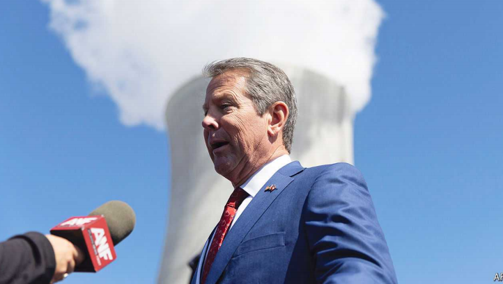

# Donald Trump plays with fire in Atlanta

 Going after Georgia’s popular Republican governor will do him no good in the state

go after: 攻击，针对

原文：

Among many odd moves Donald Trump has made since Kamala Harris

swooped into the presidential race, one of the strangest came at a rally in

Atlanta on August 3rd. Mr Trump devoted 11 minutes of his speech to

insulting Brian Kemp, Georgia’s Republican governor. He reprimanded

“little Brian” for being “disloyal” by refusing to overturn Georgia’s election

results in 2020. He said that under Mr Kemp the state had “become a

laughing-stock” and Atlanta a “killing field”, suggested the governor was

behind his criminal prosecution in Fulton County and accused him of “doing

everything possible” to make Republicans lose in November.

自卡玛拉·哈里斯突然加入总统竞选以来，唐纳德·特朗普做出了许多奇怪的举动，其中最奇怪的一次是在8月3日的一次集会上。特朗普在演讲中用了11分钟时间侮辱佐治亚州共和党州长布莱恩·坎普。他斥责“小布莱恩”拒绝推翻格鲁吉亚2020年的选举结果是“不忠诚的”。他说，在坎普先生的领导下，该州“成了一个笑柄”，亚特兰大成了一个“杀戮场”，暗示州长是他在富尔顿县刑事诉讼的幕后黑手，并指责他“尽一切可能”让共和党人在11月落败。

学习：

swooped：突然袭击；俯冲；猛扑；（swoop的过去式和过去分词）

reprimanded：美 ['reprɪmændid] 谴责；训斥；惩戒；责难；（reprimand的过去式）

laughing-stock：笑柄

原文：

Georgia’s Republicans swiftly came to their governor’s defence. “History

has taught us this type of message doesn’t sell well here in Georgia, sir,”

Brad Raffensperger, the secretary of state, wrote on X. Yet Mr Trump

doubled down in a press conference on August 8th. Patricia Murphy, a

columnist at the *Atlanta Journal Constitution*, summed it all up as a strategy

for “how to lose a state in ten days”.

佐治亚州的共和党人迅速为州长辩护。“历史告诉我们，先生，这种信息在佐治亚州不太受欢迎，”国务卿布拉德·拉芬斯佩格在x上写道。然而，特朗普在8月8日的新闻发布会上加倍下注(继续坚持自己已经采取的立场或行为)。《亚特兰大宪法报》的专栏作家帕特里夏·墨菲(Patricia Murphy)将其总结为“如何在十天内输掉一个州”的策略。

学习：
double down: 继续坚持自己已经采取的立场或行为

>在这里，"double down" 的意思是加倍下注，继续坚持自己已经采取的立场或行为，即使有很多反对意见或可能带来不利后果。在这个上下文中，尽管受到来自乔治亚州共和党人的反对和批评，特朗普在8月8日的新闻发布会上进一步重申和强化了对布莱恩·坎普的批评。
>
>详细解释：
>- **Double down**: 坚持立场或行为，即使有反对意见或风险。
>- 例如：After facing criticism for his controversial policy, the politician decided to double down and continued to defend it.（在面对对其有争议政策的批评后，这位政治家决定坚持自己的立场，继续为其辩护。）
>
>在这段话中，特朗普在面对乔治亚州共和党人的反对时，坚持并进一步批评了坎普州长。

原文：

Trash-talking the home team is never a good idea. But there are three

reasons why this move looks like a massive misstep. First, Mr Kemp is

wildly popular. At 63%, his approval rating is better than that of any other

battleground leader. He has brought new business to Georgia and passed a

slate of conservative bills, including an election-integrity law, an abortion

ban and permitless carry for gun-owners, without the bomb-throwing

rhetoric of the MAGA movement. The cool-headed conservatism he has come to

represent in Georgia has kept establishment Republicans on board. His

southern drawl and love of Georgia’s football make him the type of

politician voters want to get a beer with.

说主队坏话从来都不是个好主意。但是有三个原因可以解释为什么这一举动看起来像是一个巨大的失误。首先，肯普先生非常受欢迎。他的支持率为63%，比任何其他战场上的领导人都高。他给佐治亚州带来了新的业务，并通过了一系列保守的法案，包括选举诚信法、堕胎禁令和持枪许可，没有MAGA运动的扔炸弹言论。他在佐治亚州所代表的冷静的保守主义让当权派共和党人留了下来。他的南方口音和对佐治亚足球的热爱使他成为选民想与之共饮啤酒的那种政治家。

学习：
home team：主队；主场球队

misstep：失误；过失；错误；

a slate of：一连串的

cool-headed：头脑冷静的；镇定的          

drawl：美 [drɔːl] 慢吞吞地说话；拉长声调讲话

原文：

Second, when Mr Trump feuds with Mr Kemp, he tends to lose. The tiff

between them began years ago when the governor appointed a senator

without the president’s input. It simmered when Mr Trump criticised Mr

Kemp for opening nail salons and gyms during the pandemic. And it boiled

over in 2021, when Mr Kemp refused to recognise fake electors planning

falsely to verify the president’s re-election. When Mr Trump went after Mr

Kemp the next year it did not go well. The governor trounced David Perdue,

a former senator whom Mr Trump recruited to challenge him in the primary,

by 52 points. Georgia’s Republicans sent a clear message: if it is between

their governor and their former president, they choose the governor.

其次，当特朗普与肯普不和时，他往往会输。他们之间的争吵始于几年前，当时州长未经总统同意就任命了一名参议员。当特朗普批评坎普在疫情期间开设美甲沙龙和健身房时，这种情绪开始升温。2021年，当肯普先生拒绝承认假选举人错误地计划验证总统的连任时，它沸腾了。第二年，当特朗普对坎普穷追不舍时，事情进展得并不顺利。这位州长以52个百分点的优势击败了特朗普招募来挑战他的前参议员大卫·珀杜。佐治亚州的共和党人发出了一个明确的信息:如果在他们的州长和他们的前总统之间，他们选择州长。

学习：
feuds：美 [fju:dz] 长期不和；经常争吵；（feud的第三人称单数）

tiff： 美 [tɪf] 争执；口角；小争吵；拌嘴

simmered：美 [ˈsɪmərd] 即将爆发；（simmer的过去分词）微微沸腾

trounced：美 [traʊnst] 痛打；严责；（trounce的过去式和过去分词）

input：意见，建议

>**Input**：在这里指的是“意见”或“建议”。当州长在没有总统意见的情况下任命一位参议员时，这引发了两人之间的矛盾。
>
>- 例如：The manager made the decision without any input from the team.（经理在没有团队意见的情况下做出了决定。）

go after: 攻击，针对

>**Go after**：指的是“攻击”或“针对”。在这个上下文中，指的是特朗普在之后的一年里试图对抗坎普。
>
>- 例如：The media went after the politician for his controversial remarks.（媒体因为这位政治家的有争议言论而攻击他。）

原文：

The main reason Mr Trump’s attack looks like a blunder is that most paths

back to the White House run through Georgia—and the state is not looking

nearly as locked in as his campaign had hoped. Before Joe Biden dropped

out in mid-July, polls suggested Mr Trump would easily win there. New

numbers released last week show Mr Trump and Ms Harris in a dead heat.

With 16 electoral-college votes, Georgia is the biggest prize after

Pennsylvania among swing states. Mr Trump himself told the crowd at that

same Atlanta rally that “If we lose Georgia, we lose the whole thing and our

country goes to hell.”

特朗普的攻击看起来像一个错误的主要原因是，大多数返回白宫的道路都要经过佐治亚州——而该州看起来远没有他的竞选团队所希望的那样锁定。在乔·拜登(Joe Biden七月中旬退出之前，民调显示特朗普将在那里轻松获胜。上周发布的新数据显示，特朗普和哈里斯势均力敌。拥有16张选举人票的乔治亚州在摇摆州中是仅次于宾夕法尼亚州的最大的奖品（重要目标）。特朗普本人在同一个亚特兰大集会上告诉人群，“如果我们失去了佐治亚州，我们就失去了一切，我们的国家会下地狱。”

学习：

blunder：严重错误；愚蠢的错误；粗心的错误

in a dead heat: 旗鼓相当，平分秋色

>**In a dead heat**：指的是“旗鼓相当”或“平分秋色”，表示两者在竞争中几乎不分胜负。在这个上下文中，指的是特朗普和哈里斯的民调结果非常接近。
>
>- 例如：The two runners finished the race in a dead heat.（两位跑步者几乎同时到达终点。）

prize： 指的是“奖品”或“奖项”，比喻性的用法，表示在选举中的重要目标或奖励

>**Prize**：在这里指的是“奖品”或“奖项”，比喻性的用法，表示在选举中的重要目标或奖励。乔治亚州被视为一个重要的“奖品”，因为它有16张选举人票。
>
>- 例如：The championship title was the ultimate prize for the team.（冠军头衔是这支球队的最终目标。）

## **Ridin’ the storm out**

原文：

Mr Kemp has never swung back at Mr Trump. But there are signs of

displeasure. In April Marty Kemp, Georgia’s First Lady, said she plans to

write her husband’s name on the ballot in November rather than voting for

Mr Trump. And in an interview in June, the governor admitted he had cast a

blank ballot in the presidential primary.

坎普从未回击过特朗普。但是也有不愉快的迹象。今年4月，佐治亚州第一夫人马蒂·坎普(Marty Kemp)表示，她计划在11月的选票上写下丈夫的名字，而不是投票给特朗普。在6月的一次采访中，州长承认他在总统初选中投了一张空白票。

学习：

swing: 回击，反击

>**Swung**：这是动词 **swing** 的过去式，意思是“回击”或“反击”。
>
>- 例如：He swung at his opponent during the argument.（在争论中他回击了对方。）
>
>因此，在这段话里，“Mr Kemp has never swung back at Mr Trump” 意思是“凯姆从未反击特朗普”。

原文：

Since the Atlanta rally, which he did not attend, he has been polite but firm.

“My focus is on winning this November and saving our country from

Kamala Harris and the Democrats—not engaging in petty personal insults,

attacking fellow Republicans, or dwelling on the past,” he wrote on X,

asking Mr Trump to “do the same”.

自从他没有参加的亚特兰大集会以来，他变得礼貌而坚定。“我的重点是赢得今年11月的选举，从卡玛拉·哈里斯和民主党手中拯救我们的国家——而不是进行琐碎的人身侮辱，攻击共和党人，或沉湎于过去，”他在X上写道，并要求特朗普“也这样做”。

学习：

petty：不重要的；微不足道的；琐碎的

原文：

At a conservative conference in Atlanta days later he reiterated his pledge to

use his political machine to turn out Republican voters and help Mr Trump

win Georgia (without mentioning him by name). Nonetheless he alluded to

Mr Trump’s barbs, joking about the two “big storms” that came through the

state that week—one caused by the man at the top of his party’s ticket, the

other a tropical hurricane. Charles Bullock, a political scientist at the

University of Georgia, reckons that Mr Kemp will not actively campaign for

Mr Trump this autumn, but instead distance himself as he did from Herschel

Walker, a Trump-endorsed Senate candidate who lost to Raphael Warnock in

the midterms.

几天后，在亚特兰大举行的一次保守派会议上，他重申了自己的承诺，即利用自己的政治机器争取共和党选民，帮助特朗普赢得佐治亚州(但没有提到他的名字)。尽管如此，他还是提到了特朗普的冷嘲热讽，拿那周席卷该州的两次“大风暴”开玩笑——一次是由该党候选人名单上的第一名引发的，另一次是热带飓风。乔治亚大学的政治学家查尔斯·布洛克(Charles Bullock)认为，坎普今年秋天不会积极为特朗普竞选，而是像他与赫歇尔·沃克(Herschel Walker)一样保持距离。赫歇尔·沃克是特朗普支持的参议院候选人，在中期选举中输给了拉斐尔·沃诺克(Raphael Warnock)。

学习：

reiterated：重申；反复地做；（reiterate的过去式和过去分词）

barb：挖苦（或伤人、带刺）的话

allude： 间接提到；

原文：

Pundits suspect that Mr Trump will struggle to redeem himself from his

Georgia snafu. At a Chamber of Commerce event in Atlanta, where Mr

Kemp won standing ovations, business leaders who had previously backed

Mr Trump talked about following in Ms Kemp’s footsteps and writing their

governor’s name on their ballots in November. Others loyal to Mr Kemp

might just stay at home—as they did after Mr Trump complained about how

“rigged” Georgia’s elections were on the eve of two run-offs that handed

Democrats control of the Senate in 2021.

专家们怀疑，特朗普将很难从他在佐治亚州的混乱中自我救赎。在亚特兰大的商会活动上，凯姆赢得了热烈的掌声，以前支持特朗普的商业领袖们谈论跟随凯姆夫人的脚步，在十一月的选票上写上州长的名字。那些忠于凯姆的人可能会留在家里——正如他们在2021年两次决选前夕特朗普抱怨乔治亚州选举‘被操纵’时所做的那样，这两次决选使民主党控制了参议院。

学习：

snafu：美 [snæˈfu] 混乱局面；混乱状态；混乱；

pundit： 专家；评论员

rigged：作弊的；非法操纵的          

Chamber of Commerce：商会

>**Chamber**：指的是 **Chamber of Commerce**，即“商会”，通常是指一个地区或国家的商业和企业界的协会，致力于促进当地经济发展。
>
>- 例如：The Chamber of Commerce organized a business networking event.（商会组织了一次商业网络活动。）

run-off：决选

>**Run-off**：在选举中指的是 **run-off election**，即“决选”，通常是在没有候选人在初选中获得足够多数票的情况下进行的再次选举。
>
>- 例如：The two candidates will face each other in a run-off election next month.（这两位候选人将在下个月的决选中对决。）

原文：

Swing voters want Mr Trump to show some restraint, respect and

appreciation “for the kind of governance in Georgia that they’ve been

blessed by”, says Cole Muzio, a Christian lobbyist close to Mr Kemp.

“Georgia is not a state that wants to vote for Kamala Harris,” he believes.

“But they will vote for Kamala Harris if Donald Trump cannot clear a basic

hurdle of showing that he cares more about cause and country than his

personal grievances.”■

与坎普关系密切的基督教游说者科尔穆齐奥(Cole Muzio)表示，摇摆选民希望特朗普表现出一些克制、尊重和欣赏“他们有幸得到的格鲁吉亚治理”。“佐治亚州不是一个想投票给卡玛拉·哈里斯的州，”他认为。“但如果唐纳德·特朗普无法扫清一个基本障碍，表明他更关心事业和国家，而不是个人恩怨，他们会投票给卡玛拉·哈里斯。”■

学习：

grievances：美 [ˈgrivənsəz] 不满；抱怨；（grievance的复数）

personal grievances：个人恩怨

## 后记

2024年8月17日19点23分于上海。

