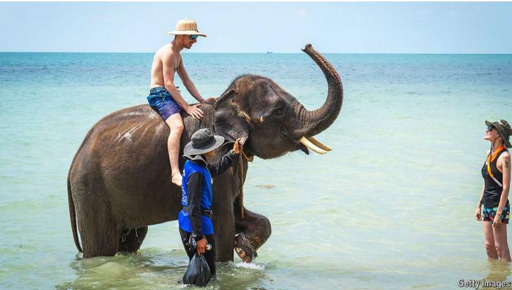
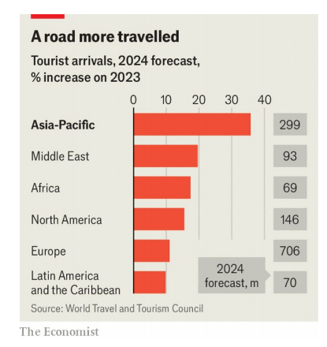

# The global tourism boom is shifting to Asia

Travel in the region is roaring after a difficult few years

原文：

Tourism is back, at last. This year the number of trips abroad is expected to

overtake levels reached in 2019. Spending by travellers, too, is projected to

exceed what was shelled out in 2019, according to the World Travel and

Tourism Council (WTTC), a trade body. Cruising is afloat again. The return of

mass tourism has sparked protests in Western hotspots such as Barcelona

and Majorca. Talk to a hotelier or a travel agent, though, and the real action

is further east.

旅游业终于回来了。今年出国旅行的次数预计将超过2019年的水平。据世界旅行和旅游理事会（WTTC）称，旅行者的花费也预计将超过2019年的支出。邮轮旅游重新活跃起来了。大众旅游的回归在西方热点城市如巴塞罗那和马略卡引发了抗议。然而，与酒店业者或旅行代理交谈，你会发现真正的活跃区域在更东边。

学习：

hotelier： 英 [həʊˈtɛlɪeɪ] 旅馆业主；旅馆经理

shell out： 支付

>**Shell**：在这里是“支付”的意思，指花费或支出。
>
>- 例如：Travellers are expected to shell out more money this year than in 2019.（预计今年旅行者的花费将超过2019年。）

>**Cruising is afloat**：这是一个双关语。**Cruising**（邮轮旅游）本身就是在水上的活动，**afloat** 意味着“漂浮”，但在这里比喻的是邮轮旅游重新恢复并变得活跃起来。
>
>- 例如：After the pandemic, cruising is afloat again, with many people booking cruises.（疫情过后，邮轮旅游重新恢复，许多人开始预订邮轮旅行。）

原文：

Travel to Asia had been slower to recover from the covid-19 pandemic than

in the West. Strict quarantine measures from China to Malaysia were in

place for longer than in Europe or America, keeping the number of tourists

down. Now, however, business on the continent is roaring back. The number

of travellers arriving in Asian countries is set to surge by a third this year,

according to the WTTC, more than in any other region (see chart).

亚洲旅游从新冠肺炎疫情的恢复比西方要慢。从中国到马来西亚，严格的检疫措施实施的时间比欧洲或美国更长，使得游客数量下降。然而现在，亚洲大陆的商业正在迅速复苏。根据WTTC的数据，今年到达亚洲国家的游客数量将激增三分之一，超过其他任何地区(见图表)。

学习：

quarantine：美 [ˈkwɔːrəntiːn] 隔离期；检疫期；隔离；检疫

原文：

Even as business in the rest of the world stabilises, industry bosses are

touting rapid growth in Asia. On August 6th Michael Glover, the finance

chief of IHG, a hotel group, pointed to its booming business in Thailand and

Vietnam. On August 7th Mark Galardo, an executive at Air Canada, a

carrier, said that new routes to Seoul and Osaka were performing

“exceedingly well”.

即使世界其他地方的商业稳定下来，行业老板们也在吹捧亚洲的快速增长。8月6日，IHG酒店集团的首席财务官Michael Glover指出其在泰国和越南的业务蒸蒸日上。8月7日，加拿大航空公司的一名高管Mark Galardo表示，飞往首尔和大阪的新航线表现“非常好”。

学习：

touting：兜售；吹捧；招徕；（tout的现在分词形式）

hotel group：酒店集团

原文：

Westerners are turning up in droves. The number of trips Americans took to

Asia doubled last year. The dollar, which has appreciated strongly against

Asian currencies, is part of the explanation. Catherine Heald, the boss of

Remote Lands, a travel agency for the rich, notes that more of her clients are

scuba diving off Indonesia’s Komodo island, temple-hopping in Japan and

taking gastronomical excursions across Thailand.

西方人正成群结队地出现。去年，美国人去亚洲旅游的次数翻了一番。对亚洲货币大幅升值的美元是部分原因。为富人服务的旅行社Remote Lands的老板凯瑟琳·希尔德(Catherine Heald)指出，她越来越多的客户在印度尼西亚的科莫多岛潜水，在日本逛寺庙，在泰国进行美食之旅。

学习：

scuba：带水肺潜水（活动）

scuba diving：潜水

temple-hoping：

>
>
>**Temple-hopping**：意思是“寺庙游览”，指的是在短时间内参观多个寺庙的活动。
>
>- 例如：Tourists often go temple-hopping in Japan to explore various historic and cultural sites.（游客们经常在日本进行寺庙游览，探访多个历史和文化景点。）

hopping: 快速移动

>**Hopping**：在这里的意思是“跳跃”或“快速移动”，但在组合词**temple-hopping**中，它表示从一个地方（寺庙）快速移动到另一个地方（寺庙）的行为。
>
>- 例如：Island-hopping involves traveling from one island to another, often in quick succession.（岛屿游览包括从一个岛快速移动到另一个岛。）

gastronomical：美 [ˌgæstrə'nɑmɪkəl] 美食学的ˌ美食法的

excursions：美 [ɪkˈskɜrʒənz] 短途旅行；游览；远足；（excursion的复数）

 

原文：

The range of destinations and activities is widening. Well-heeled tourists can

travel aboard the recently redeveloped Eastern & Oriental Express through

Singapore and Malaysia, run by Belmond, the hotels business of LVMH, a

French luxury giant. Over 500,000 hotel rooms were under construction

across Asia as of June, up by over 4% from last year. Getting to Asia is also

becoming easier, with home-grown and Western airlines increasing the

number of flights to and from the continent. British Airways, for instance, is

relaunching flights to Bangkok and Kuala Lumpur.

目的地和活动的范围正在扩大。富有的游客可以乘坐最近重新开发的东方快车穿越新加坡和马来西亚，该快车由法国奢侈品巨头LVMH旗下的酒店业务Belmond运营。截至6月，亚洲各地正在建设的酒店客房超过50万间，比去年增长了4%以上。进入亚洲也变得越来越容易，本土和西方航空公司增加了往返亚洲的航班数量。例如，英国航空公司正在重新启动飞往曼谷和吉隆坡的航班。

学习：

well-heeled：富有的

Bangkok：曼谷

Kuala Lumpur：吉隆坡

原文：

The biggest boost to Asian tourism, though, is coming from the region’s own

travellers. Chinese consumers have begun to holiday abroad again, with

international trips forecast to double this year compared with 2023,

according to Oxford Economics, a research firm. Even then, the number of

trips will be below pre-pandemic levels, leaving plenty of room for growth.

Much of the travel by Chinese tourists will happen within their

neighbourhood. Three-quarters of the flights that left China last month went

to East and South-East Asia.

然而，亚洲旅游业的最大推动力来自该地区自己的游客。根据研究公司牛津经济研究院的数据，中国消费者已经开始再次出国度假，预计今年的国际旅行将比2023年翻一番。即便如此，旅游人次仍将低于疫情危机前的水平，这为增长留下了充足的空间。中国游客的大部分旅行将发生在他们的邻近国家内。上个月离开中国的航班中，有四分之三去了东亚和东南亚。

原文：

Thanks to rising disposable incomes, India’s consumers are also heading

overseas in growing numbers. They spent close to $20bn on foreign trips in

the year to March, more than three times the amount they spent five years

ago. Many also prefer to travel closer to home, not least because of looser

visa restrictions in the region. As incomes rise, Indian tourists will only

become bigger spenders. The WTTC reckons that by the end of the decade only

Americans and Chinese will splurge more on overseas travel than Indians.

Asia’s travel boom is just beginning. ■

由于可支配收入的增加，越来越多的印度消费者也开始转向海外。在截至今年3月的一年里，他们在海外旅行上花费了近200亿美元，是5年前的3倍多。许多人也更喜欢离家近的地方旅行，尤其是因为该地区的签证限制更宽松。随着收入的增加，印度游客只会成为更大的消费群体。WTTC估计，到2030年，只有美国人和中国人会比印度人在海外旅游上花费更多。亚洲的旅游热潮才刚刚开始。■

学习：
disposable：可支配的；

dispensable incomes：可支配收入

## 后记

2024年8月17日19点49分于上海。

