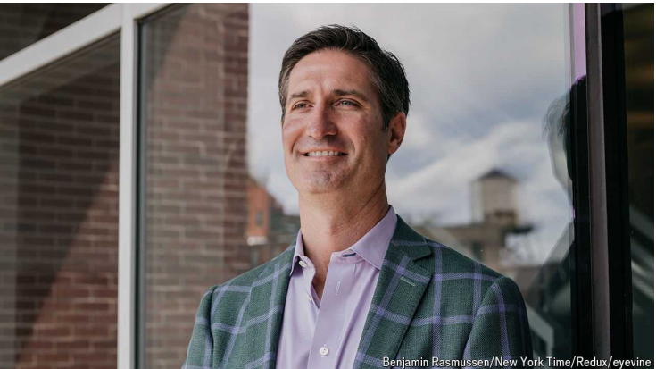

# Can Chipotle’s boss turn Starbucks around?

Brian Niccol faces three big challenges

turn around: 扭转局面， 情况好转

>
>这里的“turn around”意思是“扭转局面”或“使（企业或情况）好转”。
>
>例如：The new CEO was hired to turn around the struggling company and make it profitable again.（新任首席执行官被雇用来扭转这家陷入困境的公司并使其再次盈利。）
>
>在这个上下文中，“turn Starbucks around”指的是布赖恩·尼科尔（Brian Niccol）将面临的任务是扭转星巴克的局面，使其重新走上正轨或变得更成功。

原文：

Chief executives like to measure their worth in hard currency. One yardstick

is their pay. Another is the market’s reaction when they move jobs. Howard

Schultz has twice returned to the helm of Starbucks, the coffee giant he built

up from a handful of trendy shops in Seattle. Shareholders greeted him

cautiously both times. But they have given a rapturous welcome to Brian

Niccol, the current boss of Chipotle Mexican Grill, a chain of restaurants,

who was named Starbucks’ next chief executive and chairman on August

13th. Since then, its market value has risen by $19bn (see chart), adding the

equivalent of roughly ten Cheesecake Factories or one Domino’s Pizza.

首席执行官们喜欢用硬通货来衡量他们的价值。一个衡量标准是他们的薪酬。另一个是他们跳槽时市场的反应。霍华德·舒尔茨曾两次执掌星巴克，这家咖啡巨头是他从西雅图的几家时尚店铺起家的。股东们两次都小心翼翼地迎接他。但是他们热烈欢迎连锁餐厅Chipotle Mexican Grill的现任老板Brian Niccol，他在8月13日被任命为星巴克的下一任首席执行官兼董事长。自那以后，它的市值增加了190亿美元(见图表)，大约相当于10家芝士蛋糕工厂或一家达美乐比萨店的市值。

学习：

yardstick：准绳；码尺；（好坏或成败的）衡量标准

move jobs：跳槽，换工作

helm：领导地位；掌舵装置；

trendy：时尚的；时髦的；流行的

rapturous：美 [ˈræp(t)ʃərəs] 狂喜的；欢天喜地的；兴高采烈的

give a rapturous welcome：热烈欢迎

Chipotle：美 [tʃəˈpoʊtleɪ] **注意发音**

>
>
>Chipotle Mexican Grill，通常简称为Chipotle，是一家专注于墨西哥菜的美国快休闲餐厅连锁店。以下是对这家公司的介绍：
>
>**概述**
>
>**成立年份:** 1993年
>
>**创始人:** 史蒂夫·艾尔斯 (Steve Ells)
>
>**总部:** 美国加利福尼亚州纽波特比奇
>
>**CEO:** 布莱恩·尼科尔 (Brian Niccol) （自2018年起）
>
>**概念和菜单**
>
>Chipotle以新鲜食材和可定制菜单选项而闻名。主要菜单包括：
>
>- **卷饼 (Burritos):** 大号面粉玉米饼，内含米饭、豆类、肉类、莎莎酱和其他配料。
>- **碗装卷饼 (Burrito Bowls):** 类似于卷饼，但不含玉米饼，直接盛在碗中。
>- **玉米饼 (Tacos):** 软玉米饼或脆玉米饼，内含各种配料。
>- **奶酪卷饼 (Quesadillas):** 面粉玉米饼夹上奶酪和其他可选配料，然后烤制。
>- **沙拉 (Salads):** 床状生菜，配上各种配料和酱汁。
>
>**理念和实践**
>
>Chipotle强调“诚信食品 (Food With Integrity)”的理念，包括：
>
>- **食材采购:** 使用新鲜、高品质的食材，包括不含抗生素或激素的天然养殖肉类。
>- **可持续性:** 注重可持续农业实践，支持本地农场。
>- **透明度:** 提供清晰的食材和营养成分信息。
>
>**增长和扩展**
>
>- **扩展:** 自成立以来，Chipotle已经在主要是美国的多个地点开设了数千家餐厅，并在加拿大、英国、法国和德国也有分店。
>- **上市:** Chipotle于2006年上市，成为快休闲餐饮行业的重要参与者。
>
>**挑战与创新**
>
>- **健康问题:** 2015-2016年，公司因大肠杆菌和诺如病毒爆发面临重大挑战，之后更加重视食品安全。
>- **菜单创新:** 近年来，Chipotle推出了新的菜单项，如奶酪酱 (queso)、适合各种饮食偏好的生活碗 (lifestyle bowls) 以及数字专供菜品，以适应不断变化的消费者需求。
>- **数字化转型:** 投资于数字订餐平台、送餐服务和移动应用程序，以满足在线订餐的日益增长的需求。
>
> **当前领导层**
>
>在布莱恩·尼科尔的领导下（他之前领导了Taco Bell），Chipotle专注于重振品牌、改进运营、扩展数字能力和创新菜单。
>
>Chipotle已成为快休闲餐饮领域的领导者，以其对高质量食材和可定制菜单选项的承诺而闻名。公司对可持续性和透明度的强调继续吸引那些寻求更健康和道德来源食品的消费者。
>
>Chipotle Mexican Grill, commonly known simply as Chipotle, is an American chain of fast-casual restaurants specializing in Mexican cuisine. Here is an overview of the company:
>
> **Overview**
>
>**Founded:** 1993
>
>**Founder:** Steve Ells
>
>**Headquarters:** Newport Beach, California, USA
>
>**CEO:** Brian Niccol (since 2018)
>
> **Concept and Menu**
>
>Chipotle is known for its focus on fresh ingredients and customizable menu options. The menu primarily features:
>
>- **Burritos:** Large flour tortillas filled with a choice of rice, beans, meat, salsa, and other toppings.
>- **Burrito Bowls:** Similar to burritos but served in a bowl without the tortilla.
>- **Tacos:** Soft or crispy corn tortillas filled with a choice of ingredients.
>- **Quesadillas:** Flour tortillas filled with cheese and optional additional ingredients, then grilled.
>- **Salads:** A bed of lettuce topped with a choice of ingredients and dressing.
>
> **Philosophy and Practices**
>
>Chipotle emphasizes a commitment to "Food With Integrity," which includes:
>
>- **Sourcing ingredients:** Using fresh, high-quality ingredients, including naturally raised meat without antibiotics or added hormones.
>- **Sustainability:** Focusing on sustainable farming practices and supporting local farms.
>- **Transparency:** Providing clear information about ingredients and nutritional content.
>
> **Growth and Expansion**
>
>- **Expansion:** Since its founding, Chipotle has grown to thousands of locations primarily in the United States, with a presence in Canada, the United Kingdom, France, and Germany.
>- **Public Listing:** Chipotle went public in 2006 and has since become a significant player in the fast-casual dining sector.
>
> **Challenges and Innovations**
>
>- **Health Scares:** The company faced significant challenges in 2015-2016 due to E. coli and norovirus outbreaks, leading to a renewed focus on food safety.
>- **Menu Innovation:** In recent years, Chipotle has introduced new menu items such as queso, lifestyle bowls catering to various dietary preferences, and digital-only offerings to adapt to changing consumer trends.
>- **Digital Transformation:** Investment in digital ordering platforms, delivery services, and mobile app enhancements to cater to the growing demand for online food orders.
>
> **Current Leadership**
>
>Under the leadership of Brian Niccol, who previously led Taco Bell, Chipotle has focused on revitalizing the brand, improving operations, expanding digital capabilities, and innovating the menu.
>
>Chipotle has positioned itself as a leader in the fast-casual dining space, known for its commitment to quality ingredients and customizable menu options. The company's emphasis on sustainability and transparency continues to resonate with consumers seeking healthier and ethically sourced food options.

原文：

Starbucks’ surging share price also reflects the disastrous 512-day tenure of

Laxman Narasimhan, its departing boss. He inherited a business struggling

with an excessively long menu and inefficient stores. In the 2006 film “The

Devil Wears Prada”*,* Anne Hathaway is tasked with collecting a “no foam

skimmed latte with an extra shot” for a stony fashion editor played by Meryl

Streep. Today that would pass for an easy order. Most drinks are cold and

customised. Food now makes up a fifth of sales. After tapping into the

Starbucks app, Ms Hathaway might abandon hope after seeing the wait time.

She would not be the first. Sales in America declined by 2%, year on year,

during the most recent quarter, despite the average order costing 4% more.

Critics dismissed Mr Narasimhan’s response (the “triple shot reinvention

with two pumps” strategy) as a verbose laundry list. Starbucks needed a

well-caffeinated visionary. In Mr Narasimhan it got a sugary management

consultant.

星巴克飙升的股价也反映了其即将离职的老板拉克斯曼·纳拉辛汗灾难性的512天任期。他继承了一家在过长的菜单和低效商店中苦苦挣扎的企业。在2006年的电影《穿普拉达的女王》中，安妮·海瑟薇的任务是为梅丽尔·斯特里普扮演的冷酷的时尚编辑收集一杯“多加一杯无泡沫脱脂拿铁”。今天，这将被视为一个简单的订单。大多数饮料都是冰镇的，而且是定制的。食品现在占销售额的五分之一。在进入星巴克应用程序后，看到等待时间后，哈撒韦可能会放弃希望。她不会是第一个。尽管平均订单成本增加了4%,但最近一个季度，美国的销售额同比下降了2%。批评者对Narasimhan先生的回应(即“双泵三重改造”战略)不屑一顾，认为这是一份冗长的清单。星巴克需要一个咖啡因含量高的梦想家。Narasimhan先生为公司带来了一位和蔼可亲的管理顾问。

学习：
stony：美 [ˈstoʊni] 坚硬如石的；冷漠的；无情的；铁石心肠的

foam：泡沫；

skimmed：脱脂的

sugary：美 [ˈʃʊɡəri] 含糖的；甜的；充满甜味的

原文：

Mr Niccol, by contrast, is well-suited to the challenge. Some consider him

the industry’s finest. When he took over at Chipotle in 2018, the company

was still suffering after an outbreak of *E. coli* at its stores in 2015. Since

then, the firm’s sales have doubled and its market value has increased eight-

fold, briefly surpassing that of Starbucks in May. Analysts credit Mr Niccol

with increasing the efficiency of Chipotle’s stores. Given the complexity of

Starbucks’ menu, Mr Niccol’s old job, where each burrito would be

customised, has lots in common with his new one.

相比之下，尼科尔非常适合迎接这一挑战。有人认为他是业内最优秀的。当他在2018年接管Chipotle时，该公司仍在2015年其门店爆发大肠杆菌后遭受痛苦。自那以后，该公司的销售额翻了一番，市值增长了8倍，在5月份短暂超过了星巴克。分析师们认为尼科尔提高了Chipotle商店的效率。鉴于星巴克菜单的复杂性，尼克先生的旧工作——每份墨西哥卷饼都是定制的——与他的新工作有很多相似之处。

学习：

well-suited：适当的          

burrito：英 [bʊˈriːtəʊ] 墨西哥卷饼（常以玉米薄饼包裹肉、豆、蔬菜等馅料）；

原文：

But transforming Starbucks will be tough, not least because America’s

previously indefatigable consumer is showing signs of lassitude. According

to a University of Michigan survey published on July 26th, consumer

sentiment is at its lowest since November. The day Mr Niccol’s appointment

was announced, Home Depot slashed its profit guidance, saying that more

consumers were delaying home renovations. At least for now, Starbucks

should avoid the slump. According to figures from Hundred X, a data

provider, lower-income customers are planning to curtail their spending

more than others. But Starbucks, like Chipotle, relies far less on them than

do fast-food chains such as McDonald’s.

但是改造星巴克将是艰难的，尤其是因为美国以前不知疲倦的消费者正显示出疲倦的迹象。根据密歇根大学7月26日公布的一项调查，消费者信心处于11月以来的最低点。宣布任命尼克尔的当天，家得宝大幅削减了利润指导，称更多的消费者推迟了家庭装修。至少现在，星巴克应该避免衰退。根据数据提供商百视通的数据，较低收入的消费者比其他人更计划缩减开支。但是像Chipotle一样，星巴克对他们的依赖远不如麦当劳这样的快餐连锁店。

学习：

indefatigable：美 [ˌɪndɪˈfætɪɡəbl] 不知疲倦的；坚持不懈的

lassitude：英 [ˈlasɪtjuːd] 疲乏；疲倦；无力

slash：削减（价格、预算等）

renovations：美 [ˈrɛnəˌveɪʃəns] 革新；翻新；（renovation的复数）

home renovations：家庭装修

原文：

Starbucks’ business in China poses a more vexing problem. Since 2019 its

footprint has doubled in size, to 7,306 stores, without any meaningful

increase in revenue. Sales in the country declined by 14%, year on year,

during the most recent quarter as the business faced stiff competition from

cheaper local rivals such as Luckin Coffee. Starbucks’ gloomy prospects in

China have been clear since the start of Mr Narasimhan’s tenure, but only a

few weeks ago did he broach the possibility of shaking up the operation

through “strategic partnerships”. Mr Niccol should split off the business and

focus his attention on America. Starbucks could follow the lead of Yum!

Brands, owner of Pizza Hut and Taco Bell, which spun off its Chinese

operation in 2016. It is a move Mr Niccol knows well—he ran Taco Bell at

the time.

星巴克在中国的业务提出了一个更棘手的问题。自2019年以来，它的规模翻了一番，达到7306家商店，但收入没有任何实质性增加。最近一个季度，该国的销售额同比下降了14%，因为该行业面临着来自Luckin Coffee等更廉价的本地竞争对手的激烈竞争。自纳拉西姆汉上任以来，星巴克在中国的黯淡前景就很明显，但就在几周前，他才提出了通过“战略合作伙伴关系”重组运营的可能性。尼科尔应该剥离业务，将注意力集中在美国。星巴克可以效仿百胜。Brands是必胜客和塔可钟的所有者，于2016年剥离了中国业务。这是尼科尔非常熟悉的一步棋——他当时经营着塔可钟。

学习：

vexing：使人烦恼的，令人焦虑的

stiff competition：激烈的竞争

broach： 美 [broʊtʃ] 开始谈论；提出（讨论话题）

split off：剥离；分拆；

split off the operation：剥离业务

原文：

Mr Niccol must do all this under the watchful eye of Starbucks’ owners.

Earlier this year Elliott Management, a notorious activist, bought a position

in the company and began lobbying for change. Starboard Value, another

such firm, has also taken a position. And there is another activist Mr Niccol

must avoid displeasing: Mr Schultz. The coffee guru looms large over the

business, and remains one of its biggest shareholders. Earlier this year he

wrote a public letter saying the firm needed a “reset”, and was proved

correct. He will not go away anytime soon. ■

Niccol先生必须在星巴克老板的监督下完成所有这些工作。今年早些时候，臭名昭著的激进分子艾略特管理公司购买了该公司的一个职位，并开始游说变革。另一家这样的公司Starboard Value也弄了一个职位。还有一个尼克尔必须避免得罪的活动家:舒尔茨。这位咖啡大师对整个行业影响巨大，并且仍然是其最大的股东之一。今年早些时候，他写了一封公开信，称公司需要“重置”，事实证明他是对的。他不会很快离开。■

学习：

guru：专家；权威；导师；大师；

## 后记

2024年8月18日14点52分于上海。

