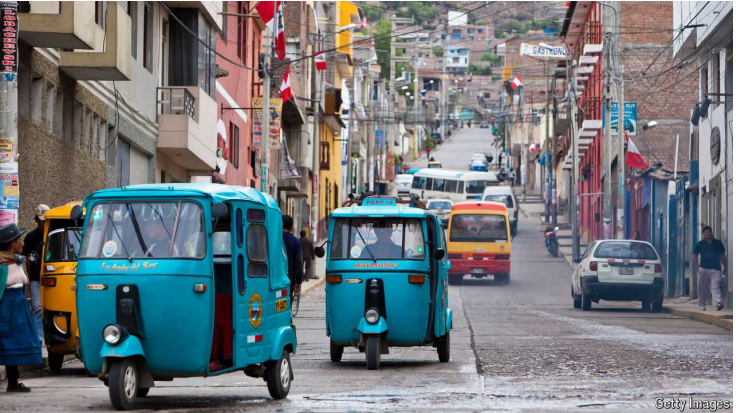

# Peru’s crazy drivers offer a data deluge for self-driving cars

A startup sees value in the chaos of the country’s streets

deluge：美 [ˈdeljuːdʒ] 洪水；暴雨；泛滥；水灾；倾盆大雨；（比喻）蜂拥而至的事物；信息或工作的过量负荷

data deluge：数据泛滥，大量数据

原文：

Tuk-tuks with precarious cargo zoom down highways. Street vendors, angry

protesters and careless llamas weave through vehicles. Buses literally

overflow with passengers. Welcome to Peru, home to some of the world’s

most chaotic streets. According to Compare the Market, a car insurance

aggregator, Peruvian drivers are the world’s worst after Thailand’s. The

ranking considers factors such as deaths caused by car accidents and time

wasted in traffic. Typical road journeys in the capital, Lima, take nearly

twice as long as they need to as a result of congestion. Police prefer asking

for bribes to enforcing rules.

嘟嘟车载着危险的货物在公路上飞驰。街头小贩、愤怒的抗议者和粗心的美洲驼穿梭于车辆之间。公共汽车确实挤满了乘客。欢迎来到秘鲁，这里有世界上最混乱的街道。根据汽车保险聚合公司Compare the Market的调查，秘鲁司机是继泰国之后世界上最差的。该排名考虑了车祸造成的死亡和交通浪费的时间等因素。由于交通堵塞，首都利马典型的公路旅行时间几乎是正常时间的两倍。比起执行规则，警察更喜欢索贿。

学习：

precarious：美 [prɪˈkeriəs] 不稳定的；不牢固的；摇摇欲坠的；危险的；不安全的；

zoom：迅速前往；飞速移动；疾驰；

llama：美洲驼；无峰驼；

weave：迂回行进；穿行（以避开障碍）

Peruvian：美 [pə'ruvɪrn] 秘鲁的；秘鲁人的

bribes：贿赂；（bribe的复数）

原文：

One startup sees opportunity in the chaos. “It’s a hidden goldmine of data,”

says Arturo Deza of Artificio Inc, which is creating a dataset from Peru’s

shoddy roads to train self-driving cars. Many tech firms train autonomous

cars in Europe and the United States. But conditions there “are too clean and

pristine”, says Mr Deza, a former researcher at MIT and Harvard University.

Such cars still struggle to identify traffic cones, and would fare hopelessly

amid roving livestock. Artificio plans to collect 10m hours of driving data

from Peru and other Latin American countries by getting transport

companies to install cameras on their fleets of vehicles. It would then license

its dataset to tech firms.

一家初创公司在混乱中看到了机会。“这是一个隐藏的数据金矿，”Arturo Deza说，他来自Artificio Inc .，该公司正在从秘鲁的劣质道路上创建一个数据集，用于训练自动驾驶汽车。许多科技公司在欧洲和美国培训自动驾驶汽车。但是那里的条件“太干净和原始了”，曾在麻省理工学院和哈佛大学担任研究员的Deza先生说。这种汽车仍然很难识别交通锥标，并且在流动的牲畜中行驶无望。通过让运输公司在他们的车队上安装摄像头，Artificio计划从秘鲁和其他拉丁美洲国家收集1000万小时的驾驶数据。然后，它会将其数据集授权给科技公司。

学习：

goldmine：金矿；金山；财源；宝库

shoddy：劣质的；低劣的；粗制滥造的；

pristine：清新的；崭新的；原始的；未经触碰的；纯净的；

cones：圆锥体；球果；圆锥形；（cone的复数）

fare：进展；进行；表现；

roving：巡回的；流动的；漫游的

roving livestock：流动的牲畜，来回走动的牲畜

原文：

Other startups also see value in the unruly roads of emerging-market

countries. Swaayatt Robots and Minus Zero, two Indian tech firms, have

tested their algorithms on the streets of Bengaluru, Bhopal and Jalandhar.

Minus Zero recently partnered with Ashok Leyland, one of India’s largest

commercial vehicle-makers, to develop self-driving lorries. In June Swaayatt

Robots said that it had secured $4m as part of a larger fund-raising round.

其他创业公司也看到了新兴市场国家难以驾驭的道路的价值。两家印度科技公司Swaayatt Robots和Minus Zero已经在孟加拉鲁鲁、博帕尔和贾朗达尔的街道上测试了他们的算法。Minus Zero最近与印度最大的商用车制造商之一Ashok Leyland合作开发无人驾驶卡车。今年6月，Swaayatt Robots表示，作为更大一轮融资的一部分，它已经获得了400万美元。

学习：
lorries：卡车；（lorry的复数）

secure：获得

原文：

Far more money and data are needed to scale up such projects. Artificio, for

example, has gathered a scattering of videos from three Peruvian cities in a

pilot phase. Even 10m hours of driving data is puny compared with what

companies like Tesla own. But if the likes of Tesla want to sell in developing

countries, they may need to shift gear. ■

扩大这些项目需要更多的资金和数据。例如，在试验阶段，Artificio从秘鲁的三个城市收集了一些零散的视频。与特斯拉等公司拥有的数据相比，即使是1000万小时的驾驶数据也微不足道。但是，如果像特斯拉这样的公司想在发展中国家销售，他们可能需要改变策略。■

学习：

puny：美 [ˈpjuni] 弱小的；微弱的；质差的；量少的；

shift gear：改变方法，改变策略

the likes of：像…这样的人          

## 后记

2024年8月19日15点54分于上海。

