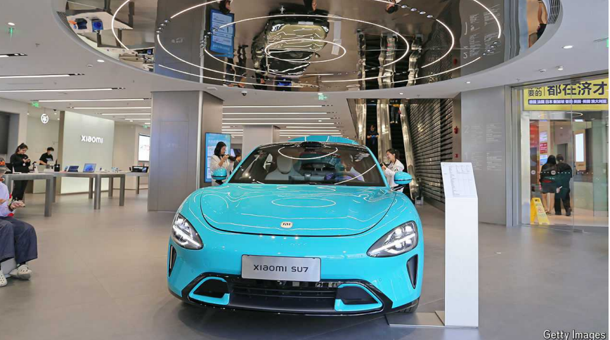

# Apple can’t do cars. Meet the Chinese tech giants that can

Baidu, Huawei and Xiaomi have built thriving auto businesses

原文：

As he screeches around corners at wildly unsafe speeds, one of the designers

of the JIDU Robocar 07 calmly talks your correspondent through how the

electric vehicle (EV) works. An alluring feature is its entertainment system—

on which he is competing in a race-car game (thankfully, the actual car is

stationary). Many of the EV’s features are controlled by voice command and

there are almost no buttons or knobs. It has autonomous-driving functions, a

sporty design and, its maker claims, can travel 900km on a single charge that

takes 12 minutes. When it goes on sale in early September it is expected to

cost just 220,000 yuan ($30,850). “It’s the future of driving,” the designer

says, right as he smashes his virtual race car into a railing

JIDU Robocar 07的设计者之一以极其不安全的速度尖叫着绕过弯道，平静地向记者讲述了电动汽车(EV)的工作原理。一个吸引人的特点是它的娱乐系统——他正在这个系统上参加一场赛车游戏(谢天谢地，实际的车是静止的)。电动汽车的许多功能都是由语音命令控制的，几乎没有按钮或旋钮。它具有自动驾驶功能，运动型设计，其制造商声称，一次充电12分钟可以行驶900公里。当它在9月初上市销售时，预计价格仅为22万元人民币(30，850美元)。“这是驾驶的未来，”设计师说，就在他把他的虚拟赛车撞上栏杆的时候

学习：
screech：美 [skriːtʃ]    尖叫；尖啸；发出尖锐刺耳的声音；（行驶时）发出刺耳声

alluring：迷人的；诱惑的；诱人的；吸引人的

stationary：静止的；不动的；固定的；

knob：（用以开关电视机等的）旋钮；

railing：属栏杆；金属围栏；护栏

smash：冲撞；撞击；

原文：

Another noteworthy feature of this EV is that it has been bankrolled by Baidu,

a tech firm that runs China’s leading search engine. Baidu is one of a

growing number of Chinese tech giants that have ventured into the car

business in recent years. Huawei, a telecoms-equipment company, has also

entered the industry. Xiaomi, best known for its smartphones and home

appliances, is another example. In March it launched its own EV, the SU 7.On

August 21st it announced that it sold over 27,000 of the cars in the quarter

from April to June; it aims to have sold 120,000 by the end of the year.

Xiaomi’s EV business now has 87 sales centres across 30 Chinese cities.

这款电动车另一个值得注意的特点是，它得到了百度的资助，百度是一家运营中国领先搜索引擎的科技公司。百度是近年来越来越多涉足汽车业务的中国科技巨头之一。电信设备公司华为也进入了这个行业。以智能手机和家电闻名的小米是另一个例子。三月份，它推出了自己的电动车SU7。8月21日，该公司宣布，从4月到6月，该季度共售出27000多辆汽车；它的目标是在年底前售出12万辆。小米的电动汽车业务目前在中国30个城市拥有87个销售中心。

学习：
bankrolled：提供资金；（bankroll的过去式）

原文：

For Western tech companies, cars have been a source of disappointment.

Amazon invested heavily in Rivian, a maker of electric trucks that has shed

about 90% of its market value since its initial public offering in 2021.

Waymo, an autonomous-vehicle project controlled by Alphabet, has faced

regulatory scrutiny over its safety record. Apple spent nearly a decade and

some $10bn on a project codenamed “Titan”, but gave up earlier this year

with little to show for the effort. Dyson, a British company known for its

whizzy vacuum cleaners and hairdryers, also tried and failed to develop an

EV.

对于西方科技公司来说，汽车一直是失望的来源。亚马逊对电动卡车制造商Rivian进行了大量投资，自2021年首次公开发行以来，该公司的市值已缩水约90%。Alphabet控制的自动驾驶汽车项目Waymo因其安全记录面临监管审查。苹果在一个代号为“泰坦”的项目上花费了近10年时间和大约100亿美元，但今年早些时候放弃了，没有取得什么成果。以其神奇的真空吸尘器和吹风机而闻名的英国公司戴森也试图开发电动汽车，但失败了。

学习：
shed：（股票）下跌；

whizzy：英 [ˈwɪzi] 新奇的；高效的；时髦的；先进的

vacuum cleaner：真空吸尘器

hairdryer：吹风机

原文：

China is different, partly because the average car buyer in the country is

much younger than in the West. Many in China judge cars based on their

software and entertainment systems—Chinese EVs are often described as

“smartphones on wheels”. That has made the market easier for tech firms to

crack. Tellingly, several of China’s successful EV brands were founded by

tech veterans. Li Auto, one of China’s largest makers of EVs and hybrids, was

founded in 2015 by Li Xiang, an internet entrepreneur. He Xiaopeng, who in

2014 co-founded Xpeng, another big Chinese EV business, started off in

software development.

中国则不同，部分原因是中国的普通购车者比西方年轻得多。许多中国人根据软件和娱乐系统来判断汽车——中国的电动汽车经常被描述为“车轮上的智能手机”。这使得科技公司更容易进入这个市场。很明显，中国几个成功的电动汽车品牌都是由技术老手创立的。理想汽车是中国最大的电动汽车和混合动力汽车制造商之一，由互联网企业家Li Xiang在2015年创立。He Xiaopeng，2014年与人联合创办了中国另一家大型电动汽车企业Xpeng，最初从事软件开发。

学习：

crack：成功进入某个市场

>Crack: 这里的 "crack" 意思是成功进入或打入某个市场。结合上下文，这句话的意思是，由于中国消费者对汽车软件和娱乐系统的重视，科技公司更容易成功进入中国电动汽车市场。
>
>例句：With innovative strategies, the startup managed to crack the highly competitive tech market.（通过创新策略，这家初创公司成功打入了竞争激烈的科技市场。）

tellingly：很显然

原文：

Chinese tech firms have approached the industry in varying ways. Baidu

established JIDU as a joint venture with Geely, a Chinese carmaker; the tech

firm holds a 48% stake in the business. That has saved it the trouble of

learning how to make cars, allowing it to focus instead on providing

technology such as voice-recognition and autonomous-driving software. For

Apollo Go, Baidu’s robotaxi business, the vehicles are similarly supplied by

Chinese car brands such as Hongqi and Arcfox.

中国科技公司以不同的方式接触了这个行业。百度建立了JIDU，作为与中国汽车制造商吉利的合资企业；这家科技公司持有该公司48%的股份。这省去了它学习如何制造汽车的麻烦，使它能够专注于提供语音识别和自动驾驶软件等技术。对于百度旗下的机器人平台萝卜快跑，车辆同样由红旗(Hongqi)和Arcfox等中国汽车品牌提供。

学习：

hold a 48% stake：占有48%的股份

Apollo Go：萝卜快跑

原文：

Huawei has steered in a different direction. In return for a cut of sales, it

assists carmakers such as Seres, maker of the AITO brand of EVs, with software,

hardware, design and marketing. In the first half of the year it helped

develop and sell 200,000 cars. At Huawei’s flagship store on Beijing’s main

shopping street the windows are lined with cars, as if to taunt the Apple

store lying directly opposite. Investors are piling in. A regulatory disclosure

on August 20th by Avatr, a state-backed EV brand, showed it had purchased a

stake in one of Huawei’s auto-solutions businesses, valuing it at $16bn.

华为已经转向不同的方向。作为销售提成的回报，该公司向AITO品牌电动汽车制造商Seres等汽车制造商提供软件、硬件、设计和营销方面的帮助。今年上半年，它帮助开发和销售了20万辆汽车。在北京主要购物街上的华为旗舰店，橱窗前排满了汽车，仿佛在嘲讽正对面的苹果店。投资者正在涌入。国家支持的电动汽车品牌Avatr在8月20日披露的监管信息显示，它已经购买了华为汽车解决方案业务的部分股份，估值为160亿美元。

学习：

flagship store：旗舰店

taunt：嘲讽；讥讽

Avatr：阿维塔

AITO：问界

原文：

Xiaomi has travelled the furthest towards becoming a full-fledged carmaker.

The company, which announced its plan to produce a car only three years

ago, initially enlisted BAIC, a Chinese carmaker, as its contract manufacturer.

Last month it was given permission by the Chinese government to produce

vehicles itself. That may prove transformative for the company, which got

its start in 2011 selling sleek but cheap smartphones online and has since

grown into one of the country’s leading makers of gadgets. Success in

carmaking would also be the ultimate vindication for a business that has

long been accused of copying Apple’s products.

小米在成为成熟汽车制造商的道路上走得最远。该公司三年前才宣布生产汽车的计划，最初选择中国汽车制造商BAIC作为其合同制造商。上个月，中国政府批准该公司自行生产汽车。这对该公司来说可能是变革性的，该公司于2011年开始在网上销售时尚但便宜的智能手机，此后发展成为中国领先的电子产品制造商之一。

学习：

full-fledged：完全成熟的；充分发展的；羽翼丰满的；正式的；合格的          

sleek：美 [sliːk] 造型优美的；流线型的；整洁的；时髦的

sleek but cheap：时尚但便宜

原文：

Still, the road to profitability may be bumpy. Although self-driving cars are

gaining popularity in China, regulatory hurdles could limit opportunities

from the technology. More important, every newcomer to China’s EV industry

intensifies its already vicious price war. Xiaomi will probably have to sell

around 300,000-400,000 vehicles a year to turn a profit. Huawei has said

that its auto unit breaks even when cars sell for 300,000 yuan; some AITOs

currently sell at 250,000. China’s tech firms have become formidable

competitors in its car industry. Making money, though, is another matter. ■

尽管如此，盈利之路可能并不平坦。尽管自动驾驶汽车在中国越来越受欢迎，但监管障碍可能会限制这项技术带来的机遇。更重要的是，中国电动汽车行业的每一个新来者都加剧了本已恶性的价格战。小米每年可能要卖出30万至40万辆左右才能实现盈利。华为曾表示，当汽车售价达到30万元时，其汽车部门就能实现盈亏平衡；一些AITOs目前售价为25万元。中国的科技公司已经成为其汽车行业强大的竞争对手。然而，赚钱是另一回事。■

学习：

bumpy：颠簸的；崎岖不平的；不平整的；

## 后记

2024年8月23日12点41分于上海。

