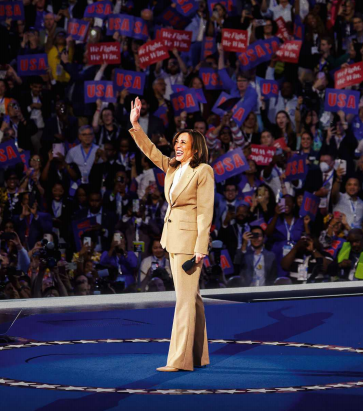

# Kamala Harris can beat Donald Trump. But how would she govern?

Being a politician is about more than campaigning. More policy detail is needed

原文：

A FEW WEEKS ago the Democratic convention looked as if it would be a wake.

Instead it has been a love-in. Delegates’ ebullience has been spiced with

relief that their nominee has saved the party from almost-certain defeat.

几周前，民主党大会看起来好像是一场悼念会。相反，这是一次恋爱。代表们因被提名人挽救了几乎肯定会失败的政党而松了一口气。

学习：

ebullience：英 [ɪ'bʊlɪəns] 奔放；兴高采烈；

spiced：使增添兴趣；使更刺激；使更兴奋：（spice的过去式和过去分词）          

almost-certain：几乎确定的

wake: 悼念会

>**Wake**: 这里的 "wake" 通常指的是一个悼念会，特别是为去世的人举行的聚会。在这个上下文中，它被用作一种比喻，暗示最初预计民主党大会将会是一场令人悲伤或沮丧的集会，可能因为对选举前景感到悲观。

love-in:

>**Love-in**: 这里的 "love-in" 是一种集体表达爱意或团结的场合，通常指一种充满积极情感的聚会。结合上下文，这句话的意思是，民主党大会本来被认为会很悲伤，但实际上却成了一场充满热情和团结的盛会，代表们对他们的提名人表示出极大的喜悦和宽慰。
>
>例句：The event, expected to be a somber occasion, turned into a love-in, with everyone celebrating the positive outcome.（这个本以为会是一个严肃场合的活动，结果却变成了一个充满喜庆气氛的聚会，每个人都在庆祝这个积极的结果。）

原文：

Kamala Harris has accomplished this less because of who she is than who

she is not. For a start she is not Joe Biden, who showed in a valedictory

speech in Chicago that age has turned him into a scold. And neither is she

Donald Trump. Now that President Biden is out of the race, the Republican

nominee is the old man on the ballot, and he drives voters away with his

petty insults and his dark obsessions.

卡玛拉·哈里斯取得这样的成就，与其说是因为她是谁，不如说是因为她不是谁。首先，她不是乔·拜登，他在芝加哥的告别演说中表明，年龄已经把他变成了一个唠叨的人。她也不是唐纳德·特朗普。现在拜登总统退出了竞选，共和党提名人是选票上的老人，而选民因为他的琐碎侮辱和阴暗执念而感到反感，因此远离他。

学习：

valedictory：美 [ˌvæləˈdɪkt(ə)ri] 告别的；离别的；

scold：爱责骂的人；好斥责的人；唠叨的人；

insults：侮辱；辱骂；（insult的复数）

>最后一句话表达的意思是：随着拜登总统退出竞选，特朗普成为了共和党的候选人，而选民因为他的琐碎侮辱和阴暗执念而感到反感，因此远离他。这句话暗示，特朗普的言行举止使得他不受选民欢迎，特别是在他与其他候选人相比时显得不利。

原文：

However, Ms Harris needs more. Our forecast model has the race tied. In a

bid to make her someone people actually want to vote for, the convention

was all about her character and her life-story. Americans now know she

worked at McDonald’s and that every year she teases her husband by

playing the rambling voicemail he left asking her for a first date.

然而，哈里斯女士需要更多。我们的预测模型显示这场比赛不分胜负。为了让她成为人们真正想为之投票的人，大会完全是关于她的性格和她的生活故事。美国人现在知道她在麦当劳工作，每年她都会播放丈夫留在语音信箱里的杂乱无章的第一次约会的留言来戏弄他。

学习：

rambling：散漫的；不连贯的；杂乱无章的；冗长的；啰嗦的

原文：

Unfortunately, how that would translate into a Harris presidency remains

disconcertingly vague. She has reasons for building her campaign around

personality: policy can be a liability, Mr Trump is no wonk and, with him as

an opponent, character matters. Yet, worryingly, her tactics may also signal

something more fundamental.

不幸的是，这将如何转化为哈里斯总统仍然令人不安的模糊。她有理由围绕个性展开竞选:政策可能是一个不利因素，特朗普不是书呆子，有他作为对手，个性很重要。然而，令人担忧的是，她的策略可能也暗示了一些更基本的东西。

学习：

disconcertingly：使人窘迫地; 令人仓皇失措地

liability：不利条件；累赘；障碍

wonk：书呆子；学究；

worryingly：令人担忧地

原文：

Politically, Ms Harris is still an unknown quantity—and she is partly

responsible for keeping it that way. In the Biden administration she was

overshadowed, as vice-presidents usually are. She became the nominee

without being tested in a primary. Since Mr Biden’s withdrawal, she has not

given interviews and she has taken few questions from reporters. Her policy

platform was mostly inherited from her boss, and it is even sparser than Mr

Trump’s. When she takes positions—such as vowing to deal with corporate

price-gouging—they may not be expressions of her political beliefs so much

as campaign manoeuvres designed to placate voters worried about the cost

of living.

在政治上，哈里斯女士仍然是一个未知数——她对保持这种状态负有部分责任。在拜登政府中，她被遮蔽了，副总统通常都是这样。她未经初选测试就成为了被提名人。自从拜登退出后，她没有接受过采访，也很少回答记者的问题。她的政策纲领大部分是从她的老板那里继承来的，甚至比特朗普的还要稀疏。当她采取立场时——比如发誓要处理企业价格欺诈——这些立场可能与其说是表达她的政治信仰，不如说是旨在安抚担心生活成本的选民的竞选策略。

学习：

platform：纲领

vowing：起誓；（vow的现在分词）

gouging：美 ['gaʊdʒɪŋ] 欺骗；欺诈；（gouge的现在分词形式）

manoeuvre：美 [məˈnuːvər]  策略；计谋；手段；

原文：

Our briefing this week sets out to make sense of all this—and Ms Harris’s

record in the Senate and as a politician in California. She is not one of those

whose career reveals a set of deep convictions or an inner core of beliefs.

Instead, like Mr Biden, she positions herself slightly to the left of centre of

her party and adjusts as it evolves. Worse than him, her policies on the

economy and in foreign affairs seem to be unanchored.

我们本周的简报旨在解释这一切，以及哈里斯女士在参议院和作为加州政治家的记录。她不是那种职业生涯显示出一系列深刻信念或内在核心信念的人。相反，与拜登一样，她将自己定位于党内中间偏左的位置，并随着党内形势的发展进行调整。比他更糟糕的是，她在经济和外交事务上的政策似乎并不坚定。

学习：

unanchored：无锚的；未固定的；

原文：

Pragmatism has its virtues in a politician. Mr Trump may call Ms Harris a

communist, but she is no ideologue. Her positions as a primary candidate in

2019 included single-payer health care, outlawing fracking and

decriminalising crossing the border illegally. Yet the way Ms Harris has

abandoned all that in 2024 suggests it was never serious. Her recent anti-

price-gouging proposal would be hard to enact. She is probably not about to

launch a crusade against corporate America. Pragmatism also means that Ms

Harris is open to other people’s ideas. There is every reason to think that in

foreign policy and the environment she will set out to create continuity.

实用主义在政治家身上有其优点。特朗普可能会称哈里斯为共产主义者，但她不是理论家。她在2019年作为主要候选人的立场包括单一支付者医疗保健，禁止水力压裂和非法越境合法化。然而，哈里斯在2024年放弃所有这些的方式表明，这从来都不是认真的。她最近的反价格欺诈提案很难实施。她可能不会发起一场反对美国企业的运动。实用主义也意味着哈里斯女士对其他人的想法持开放态度。有充分的理由认为，在外交政策和环境方面，她将着手创造连续性。

学习：
ideologue：英 [ˈʌɪdɪəlɒɡ] 意识形态家；思想家；理论家；空想家；

decriminalize：使合法化

crusade: （长期而坚定的） 努力奋斗；奋斗；（Crusade）十字军东征

原文：

But when pragmatism signals a lack of thought-through principles, it can

spell danger. Every day the president has to handle politically charged

problems that have no simple solution. In this Ms Harris’s weakness for bad

ideas and political gimmicks threatens to be a liability. The claim of price-

gouging is simply not supported by the evidence, but it nonetheless erodes

the faith in open markets that makes America prosperous. Promising

$25,000 grants is supposed to help first-time homebuyers afford a property.

Yet unless she also succeeds in her plan to increase the supply of housing—a

tall order—subsidies will raise house prices instead. Her proposals to

increase child tax credits, to \$6,000 during the first year from \$2,000 now,

would indeed reduce child poverty. But when America’s budget deficit is 7%

of GDP, her failure to finance it through taxes would be rash and inflationary

(we would choose it only as an alternative to Mr Trump’s even wilder

profligacy).

但当实用主义表明缺乏深思熟虑的原则时，它可能意味着危险。总统每天都不得不处理那些没有简单解决办法的政治难题。在这一点上，哈里斯女士对于坏主意和政治花招的弱点可能会成为一种不利因素。价格欺诈的说法根本没有证据支持，但它仍然侵蚀了让美国繁荣的开放市场的信心。承诺提供25，000美元的资助是为了帮助首次购房者买得起房子。然而，除非她增加住房供应的计划也获得成功——这是一项艰巨的任务——否则补贴反而会提高房价。她提议将儿童税收抵免从现在的2000美元增加到第一年的6000美元，这确实会减少儿童贫困。但当美国预算赤字占GDP的7%时，她无法通过税收融资将是轻率的和通胀性的(我们只会选择它作为特朗普更加疯狂的挥霍的替代方案)。

学习：

thought-through：深思熟虑

spell：招致，意味着（通常指坏事）

gimmick：(为引人注意或诱人购买而搞的)花招，把戏，噱头

liability：不利条件；累赘；障碍

grant：(政府、机构的)拨款

a tall order：难办的事情;棘手的问题

tax credits：税收抵免

profligacy：美 [ˈprɑːflɪɡəsi] 挥霍; 浪费

原文：

Likewise, without strong fundamental beliefs and a set of guiding priorities,

a president can easily be blown off-course by events. When presidents are

reactive or indecisive, they may be challenged abroad. If Ms Harris struggles

to knit together her biography, her principles and her policies, she will also

struggle in a president’s crucial role: explaining to the nation how it should

meet adversity.

类似地，如果没有坚定的基本信念和一套指导性的优先事项，总统很容易被事件击得偏离轨道。当总统被动或优柔寡断时，他们可能会在国外受到挑战。如果哈里斯女士努力将她的传记、她的原则和她的政策结合在一起，她也将努力扮演一个总统的关键角色:向全国解释它应该如何应对逆境。

学习：
off-course：偏离航线的；偏离目标的

indecisive：优柔寡断的；无决断力的；

knit：紧密结合；使紧密结合；

原文：

It may seem unfair to criticise Ms Harris for being sparing about her

policies. Her overriding task is to defeat Mr Trump, and it is a vital one in

which guile and cunning are permitted. For good or ill, political

campaigning is often about finding wedge issues to stir up your base. If

wonkery and reams of policy papers were the secret to electoral success,

Hillary Clinton would not have lost in 2016.

批评哈里斯女士对自己的政策保守似乎不公平。她压倒一切的任务是击败特朗普，这是一个允许使用诡计和狡猾的关键任务。不管是好是坏，政治竞选经常是寻找一些尖锐的问题来刺激你的基础。如果wonkery和大量的政策文件是选举成功的秘诀，希拉里·克林顿就不会在2016年失败。

学习：

sparing：节俭的；节约的；吝惜的；保守的；

overriding：首要的；最重要的；主宰的；

guile： 美 [ɡaɪl] 狡猾；奸诈；诈欺；

cunning：狡猾；狡诈；

wedge："楔形问题"，即一种能够引起争议或分裂的议题

>"Wedge" 在这里指的是 "楔子" 或 "楔形问题"，即一种能够引起争议或分裂的议题。政治家使用这些问题来激起支持者的情绪，或者在选民中制造分歧，以获得支持。

>"Base" 指的是政党的基本支持者或核心选民群体。在这句话中，"stir up your base" 意思是通过引起核心支持者的共鸣和情绪反应来巩固他们的支持。

wonkery:对政策或专业知识的痴迷
>Wonkery: 这里的 "wonkery" 指的是对政策或专业知识的痴迷，特别是对复杂、细致的政策问题的研究或讨论。结合上下文，这句话的意思是，如果仅仅依靠对政策的痴迷和大量的政策文件能够赢得选举的话，希拉里·克林顿在2016年就不会失败。
>
>例句：The candidate's focus on wonkery failed to connect with everyday voters.（这位候选人对政策细节的痴迷未能与普通选民产生共鸣。）

原文：

But there are reasons to press Ms Harris for more. One is that to do so could

soon be in her political interest. Should personality lose its power to propel

her campaign forward, policy could be one way to revive it. Imagine if her

whole platform were like her position on women’s reproductive rights,

where her policy is clearly derived from principles drawn out of her own

experience. When, in the debate due on September 10th, Mr Trump attacks

her for being too weak to stand up to Russia and China, or too much of a

radical socialist to deal with immigration or create a healthy economy, she

will need more than platitudes to rebut him. If it is the first time she tries to

unspool a single thread running through her life, her principles and her

policies, she is unlikely to do her best.

但是有理由向哈里斯女士施压要求更多。一是这样做可能很快会符合她的政治利益。如果人格失去了推动她竞选的力量，政策可能是重振它的一种方式。想象一下，如果她的整个政纲就像她在女性生育权问题上的立场一样，她的政策显然是从她自己的经历中得出的原则。当在9月10日的辩论中，特朗普攻击她太软弱，无法对抗俄罗斯和中国，或者太激进的社会主义者，无法处理移民问题或创造健康的经济时，她需要的不仅仅是陈词滥调来反驳他。如果这是她第一次试图解开贯穿她的生活、她的原则和她的政策的一根线，她不太可能做到最好。

学习：
stand up to：抵抗；对抗；抗争（比自己强的人）

platitude：英 [ˈplatɪtjuːd]  陈词滥调；老生常谈

rebut：英 [rɪˈbʌt] 反驳；驳斥；辩驳；

unspool：展开；解开；放开

原文：

The other, more important reason to press Ms Harris is that being a

politician is about more than campaigning. Governing matters, too. And, for

a party that wants to strengthen democracy, governing is better if its winning

mandate contains a programme. You can be desperate for Ms Harris to

defeat Mr Trump and still wonder how good she will be in office. As the

vice-president in a one-term administration, she might be tempted to govern

with victory in 2028 as a focus. Unless she is clearer about what she wants

to do with power, her term will be dominated by campaigning—with all its

vices. ■

向哈里斯施压的另一个更重要的原因是，作为一名政治家不仅仅是竞选。治理也很重要。此外，对于一个想要加强民主的政党来说，如果其获胜的授权包含一个计划，那么执政会更好。你可以不顾一切地希望哈里斯击败特朗普，但仍想知道她执政后会有多好。作为一届政府的副总统，她可能会试图以2028年的胜利为重点。除非她更清楚地知道她想用权力做什么，否则她的任期将被竞选活动所主导——及其所有的弊端。■

学习：

vice：恶习；邪恶；缺点；

mandate：选民授予当选者的授权或委托，通常是通过选举赢得的权力和责任

>这里的 "mandate" 指的是选民授予当选者的授权或委托，通常是通过选举赢得的权力和责任。结合上下文，这句话的意思是，执政对一个想要加强民主的政党来说很重要，而执政会更好，前提是它赢得的授权包含一个明确的施政计划。
>
>例句：The government’s mandate from the election was to improve the economy and reduce inequality.（政府从选举中获得的授权是改善经济和减少不平等。）

## 后记

2024年8月24日17点56分于上海。

