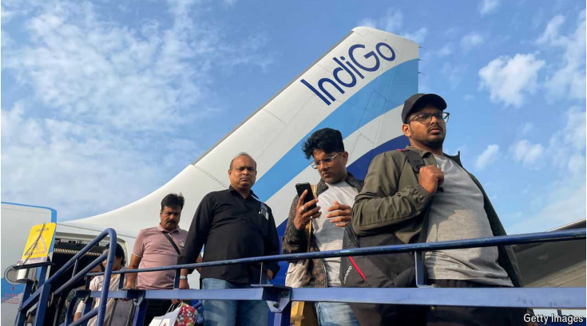

# How to attract Indian tourists

Destinations are competing for the travelling rupee

原文：

INDIANS ARE on the move. In 2019 international departures from India hit

27m, a number that will surely be exceeded this year and is predicted to rise

to 90m by 2040. Annual spending on foreign travel by Indians will nearly

triple to $89bn in three years, reckons Bernstein, a research firm. Airlines’

networks are being expanded and redesigned to handle larger numbers of

Indian tourists. Many trips are for business or to visit friends and family. But

about 40% are pure leisure, and holidaymakers pack fat wallets.

印度人正在行动。2019年，从印度出发的国际游客达到2700万，这个数字今年肯定会被超过，预计到2040年将升至9000万。据研究公司Bernstein估计，印度人每年在国外旅游上的花费将在三年内增长近两倍，达到890亿美元。航空公司的网络正在扩大和重新设计，以应对更多的印度游客。许多旅行是为了商务或拜访朋友和家人。但大约40%是纯粹的休闲，度假者会带着很多钱。

学习：

foreign travel：国外旅游

holidaymakers：度假者；（holidaymaker的复数）          

fat wallets：钱包很鼓

原文：

Around the world tourism boards, hotels and restaurateurs are starting to

compete for Indian travellers, especially in the Middle East and South-East

Asia. That makes sense. Tourism accounts for 3% of global GDP. It creates

jobs, boosts exports and builds cultural ties. A long boom in tourism from

China is flagging: its travellers made only 87m trips last year, 40% fewer

than they did before covid-19 prompted China to turn inward. All the more

reason, then, to lay out the red carpet for Asia’s other giant. But how should

countries attract Indian travellers?

世界各地的旅游局、酒店和餐馆开始争夺印度游客，尤其是在中东和东南亚。有道理。旅游业占全球GDP的3%。它创造就业机会，促进出口，建立文化联系。China 旅游业的长期繁荣正在衰退:去年中国游客只有8700万人次，比covid-19促使China转向内向之前少了40%。因此，更有理由为亚洲的另一个巨人铺上红地毯。但是各国应该如何吸引印度游客呢？

学习：
restaurateur：美 [ˌrɛstərəˈtər]   餐馆经营者；饭店老板

build cultural ties：建立文化联系

flagging：疲乏；衰退；（flag的现在分词）

原文：

Step one is to make it easier for them to get in. India has long had a “weak”

passport, which allows visa-free travel to only a few places. As the country

grows more powerful, that is changing. Malaysia and Thailand have

abolished visa requirements and seen a surge in visitors. Digitising the

process and keeping fees low boosts numbers, too. But many Western

countries have onerous visa policies, which put off both Indian tourists and

those visiting their relatives in the diaspora. A ten-year multi-entry tourist

visa to Britain costs £1,000 ($1,300), seven times as much as an American

one. America’s consulates are slow: it takes over a year to get an

appointment. Continental European countries are stingy, rewarding

painstakingly submitted paperwork with visas that last as few as four days.

第一步是让他们更容易进入。印度长期以来一直有一种“弱”护照，只允许免签证前往少数几个地方。随着印度变得更加强大，这种情况正在改变。马来西亚和泰国取消了签证要求，游客数量激增。将流程数字化并保持低收费也提高了数字。但许多西方国家有繁琐的签证政策，这让印度游客和那些探访海外亲属的人望而却步。去英国的十年多次入境旅游签证需要1000英镑(1300美元)，是美国签证的7倍。美国的领事馆很慢:需要一年多才能预约到。欧洲大陆国家很吝啬，用签证奖励煞费苦心提交的文书工作，签证有效期只有四天。

学习：
onerous：繁重的；费力的；劳累的；艰巨的；麻烦的；

onerous visa policies：繁琐的签证政策

diaspora：美 [daɪˈæspərə] 移民群体；族群分散；

consulates：领事馆；领事任期；（consulate的复数）

paperwork：文书工作；书面工作；

原文：

Once a country has made its tourist-visa regime more welcoming, what

next? One way to win the attention of Indian globetrotters is to collaborate

with Bollywood. Spain’s tourism agency worked with the makers of

“Zindagi Na Milegi Dobara” (“You Only Live Once”), a hit film from 2011.

Arrivals from India doubled the following year. Yash Chopra, an Indian

director, made movies in Switzerland in the 1990s, introducing many to its

Alpine charm. A grateful Swiss nation erected a statue of the man and

named a train after him. Many Indian films have scenes shot in Dubai for a

dose of glamour: last year more Indians used Dubai’s airport than any other

nationality.

一旦一个国家让其旅游签证制度变得更受欢迎，接下来会发生什么？赢得印度环球旅行者关注的一个方法是与宝莱坞合作。西班牙旅游局与2011年的热门电影《你只能活一次》的制片人合作。第二年，来自印度的游客翻了一番。印度导演雅什·乔普拉上世纪90年代在瑞士拍摄电影，向许多人介绍了瑞士阿尔卑斯山的魅力。一个心怀感激的瑞士国家为这个人竖立了一座雕像，并以他的名字命名了一列火车。许多印度电影都有在迪拜拍摄的迷人场景:去年，使用迪拜机场的印度人比其他任何国家的人都多。

学习：
globetrotter：美 [ˈɡloʊbˌtrɑdər]  环球旅行者；世界旅行者

hit film：热门电影

Alpine：美 [ˈælˌpaɪn] 尤指中欧）阿尔卑斯山的；高海拔的

erect a statue：设立雕像

原文：

Diplomacy can also help put a country on the Indian tourist map. Narendra

Modi, the prime minister, travels a lot and loves to be filmed against

dramatic backdrops. India’s fawning news channels follow his every step,

providing the sort of exposure a tourism board cannot buy. After each visit,

say tour operators, interest in that destination shoots up—though perhaps not

for Ukraine, where Mr Modi arrives this week on what will be his 80th

foreign trip.

外交也可以帮助一个国家出现在印度的旅游地图上。印度总理纳伦德拉·莫迪经常出差，喜欢在引人注目的背景下拍摄。印度谄媚的新闻频道跟踪他的每一步，提供了旅游局买不到的曝光率。旅游运营商表示，每次访问之后，人们对该目的地的兴趣都会激增。

学习：
backdrop：背景幕；背景

fawning：奉承的；乞怜的

tourism board：旅游局

原文：

Once a place has captured Indian tourists’ imagination and let them in, there

is one more thing: it must offer them food they enjoy. Good Indian—and

especially vegetarian—food tops the list of requirements for outbound

tourists. Indian cuisine takes many forms, from the kebabs of the north to the

dosas of the south. Its consumers vary too, from hard-core vegetarians who

eschew even potatoes and onions, to the urban rich who fancy the sort of

modern Indian food unavailable at home, such as at Michelin-starred

Gaggan in Bangkok. Offering a wide variety of Indian nosh to Indians who

have just got off the plane from India may sound absurd. But it works. ■

一旦一个地方抓住了印度游客的想象力并让他们进入，还有一件事:它必须为他们提供他们喜欢的食物。好的印度食物——尤其是素食——是出境游客的首要要求。印度美食有多种形式，从北方的烤肉串到南方的dosas。它的消费者也各不相同，从甚至不吃土豆和洋葱的铁杆素食主义者，到喜欢在家吃不到的现代印度食物的城市富人，比如曼谷米其林星级的Gaggan。给刚从印度下飞机的印度人提供种类繁多的印度小吃，听起来可能很荒谬。但这很有效。■

学习：
outbound：出境的；开往外地的

kebabs：美 [kəˈbɑbz] 烤肉串；（kebab的复数）

eschew：美 [ɪsˈtʃuː] 避免；（有意地）避开

nosh：小吃；点心；零食；

## 后记

2024年8月24日19点44分于上海。

