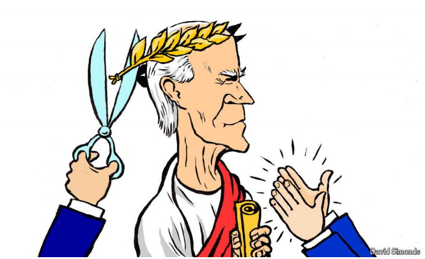

# History will judge Joe Biden by Kamala Harris

A victory would be her triumph, and his, but a loss would be his responsibility

原文：

THE DEMOCRATS came to their convention in Chicago to praise Joe

Biden, and to bury him. No one wanted to dwell on the recent

unpleasantness, on how a handful of party eminences pried the nomination

from his clenched hands like so many adult children compelling their fading

father to surrender the car keys. Suddenly, it was hard to find anyone who

thought nominating Mr Biden again, at the age of 81, was ever a good idea,

no matter how many Democratic officials used to insist it was. By the time

the convention began on August 19th the last of Joe Biden’s many

campaigns had come to seem sad, even scary, certainly embarrassing: time

to leave it behind.

民主党人在芝加哥的大会上赞扬了乔·拜登，并埋葬了他。没有人想去细想最近的不愉快，细想一小撮党内要人是如何从他紧握的手中夺走提名的，就像许多成年孩子迫使他们日渐衰弱的父亲交出汽车钥匙一样。突然间，很难找到任何人认为再次提名81岁的拜登先生是一个好主意，不管过去有多少民主党官员坚持认为这是一个好主意。当大会于8月19日开始时，乔·拜登众多竞选活动中的最后一场似乎变得悲伤，甚至可怕，当然也令人尴尬:是时候把它抛在脑后了。

学习：
dwell on：细想；反复思考；仔细研究；

unpleasantness：不愉快；令人不快的事物；不悦

eminences：名人；要人；权威人士；阁下；（eminence的复数）

pry：窥探；探听；打听；探查（隐私）；撬开；撬动。这里是以强迫的方式获得某物

>**Pry**: 这里的 "pry" 意思是费力地打开或撬开，通常指的是以强迫的方式获得某物。结合上下文，这句话的意思是，党内一些重要人物费力地从乔·拜登的手中夺取了提名权，就像成年子女迫使年迈的父亲交出汽车钥匙一样。
>
>**例句**：She had to pry the lid off the can because it was stuck.（她不得不费力地撬开罐子的盖子，因为它卡住了。）

clenched：紧握的

clenched hand：紧握的手

compelling：强迫；迫使； （compel的现在分词）

surrender：放弃（权利、位置）；缴械

surrender the car keys：交出车钥匙

原文：

Mr Biden is playing along, consummate politician that he is. Just a few

weeks ago he was railing against “elites in the party” who thought they

knew the voters better than he did. When the convention opened less than a

month had passed since he yielded the nomination to his vice-president,

Kamala Harris, who his own aides had been saying would be a weaker

candidate. But Mr Biden has come to accept his new role. It is a familiar

one, as supporting player to a more charismatic politician, one who may not

have lived as much history but, unlike him, could make it.

拜登正在顺势而为，展现出他作为一个老练的政治家的风范。就在几周前，他还在抨击“党内精英”，认为他们自认为比他更了解选民。当大会召开时，距离他将提名让给他的副总统卡马拉·哈里斯还不到一个月，而他的助手们一直在说，哈里斯会是一个更弱的候选人。但拜登已经开始接受他的新角色。这是一个他熟悉的角色，作为一个更具魅力的政治家的配角，尽管这个政治家可能没有他经历过那么多历史，但却有可能创造历史。

学习：

consummate：美 [ˈkɑːnsəmət , ˈkɑːnsəmeɪt] 完美的；技艺超群的；圆满的

railing：抱怨；责骂；怒斥；（rail的现在分词）

supporting player：配角

charismatic：美 [ˌkærɪzˈmætɪk] 有魅力的；有吸引力的；领袖气质的；

原文：

In Chicago the delegates chanted “Thank you, Joe”, and Mr Biden gave

every appearance of basking in their backhanded gratitude for his enforced

act of self-sacrifice, with its implicit reminder that they no longer wanted

him for the job. “He showed what it means to be a true patriot,” Hillary

Clinton declared, ushering Mr Biden into the past tense as she went on to

say, “And now we are writing a new chapter in American history.”

在芝加哥，代表们高呼“谢谢你，乔”，拜登先生表现出对他被迫做出自我牺牲的间接感谢，这暗示着他们不再需要他的工作。“他展示了作为一名真正的爱国者意味着什么，”希拉里·克林顿宣称，她接着说，“现在我们正在书写美国历史的新篇章。”这让拜登先生进入了过去时

学习：
chanted：吟唱；诵扬；（chant的过去式和过去分词）          

backhanded：间接的；反手的；讽刺的；

give the appearance of: “表现出…的样子”或“看起来像…”

>"Give the appearance of" 的意思是“表现出…的样子”或“看起来像…”。它指的是某人或某物表面上看起来如何，可能并不反映真实的情况。例如，在句子 “Mr. Biden gave every appearance of basking in their backhanded gratitude” 中，意思是“拜登表现得完全是在享受他们那种间接的感激之情”，但这并不一定说明他内心真的在享受这种感激。

basking: 享受或陶醉于某种情感或情景

>"Basking" 在这里的意思是享受或陶醉于某种情感或情景。结合上下文，这句话的意思是拜登看起来很享受代表们对他的感激之情，尽管这种感激实际上是因为他被迫做出了自我牺牲，暗示他们不再希望他继续担任总统。

原文：

The president even delivered his own eulogy, though he was elbowed into

well after prime viewing hours for American television. It lacked the grace

the moment called for and he himself deserved. His aides had said he would

look ahead and make the case for Ms Harris, and he did. But he spent far

more time recounting his accomplishments.

总统甚至为自己做了悼词，不过他是在美国电视的黄金时段之后才勉强挤进去的。他的演讲缺乏应有的优雅，而这正是这一时刻和他本人应得的。他的助手们曾表示，他会展望未来并为卡马拉·哈里斯辩护，而他确实这么做了。但他花了更多的时间回顾自己的成就。

学习：

eulogy：悼词；（颂扬死者的）悼文；赞美词；颂文；

原文：

His tone was forceful and even angry, as has been true of most of his

speeches in the past year; it is as though this once wildly riffing performer

has become stuck at the sombre end of the keyboard. He insisted that he was

not aggrieved. “I love the job, but I love my country more,” he said. “All

this talk about how I’m angry at all the people who said I should step down,

that’s not true.” Then he left the convention, with plans to disappear on

holiday to southern California.

他的语气强硬甚至愤怒，就像过去一年他的大多数演讲一样；就好像这个曾经疯狂即兴表演的表演者已经被困在了键盘的阴暗一端。他坚持说他没有受委屈。“我热爱这份工作，但我更爱我的国家，”他说。“所有这些关于我对所有说我应该下台的人感到愤怒的说法，都不是真的。”然后他离开了大会，计划去南加州度假。

学习：

riff：即兴演奏（尤指爵士或摇滚音乐中的短而重复的旋律）

aggrieved：感到不公平的；感到委屈的；

原文：

How hard it must be for a man so sensitive to disrespect or dishonour.

Biographers of Mr Biden have noted he still remembers the names of

children who humiliated him in primary school. Back then they treated him

as stupid and called him “Joe Impedimenta” (the nuns drilled them all in

Latin) or “Bye-Bye” because of the stutter he fights to this day. Even once

he finally became president, Mr Biden kept noting that the man he had

served as vice-president, Barack Obama, preferred Mrs Clinton to him as the

party’s standard-bearer in 2016, though, as Mr Biden also liked to say, he

would have won. Now Mr Obama, the friend Mr Biden served so loyally,

had reportedly once again expressed a lack of faith in him, contributing to

his displacement from the ticket.

对一个对不尊重和耻辱如此敏感的人来说，这有多难。拜登先生的传记作者指出，他仍然记得在小学羞辱他的孩子们的名字。那时，他们认为他很愚蠢，称他为“乔·因佩迪门塔”(修女们用拉丁语对他们进行操练)或“拜拜”，因为他至今仍患有口吃。甚至在他最终成为总统后，拜登一直指出，他曾给巴拉克·奥巴马(Barack Obama)做过副总统，奥巴马在2016年更喜欢希拉里而不是他作为该党的旗手，尽管正如拜登也喜欢说的那样，他会赢。现在，奥巴马先生，拜登先生忠诚服务的朋友，据报道，再次表示对他缺乏信任，导致他从候选人名单中被取代。

学习：

impedimenta：英 [ɪmˌpɛdɪˈmɛntə] 累赘；随身物品；障碍物；拖累

nuns：修女；尼姑；（nun的复数）

drilled：操练，训练；（drill的过去式和过去分词）

stutter：口吃；结巴

displacement：取代；代替；

原文：

But despite, or because of, Mr Biden’s many tribulations, self-pity has never

been one of his flaws. “No one owes you anything,” he likes to quote his

father as having said. “You gotta get up.” And Mr Biden needs Ms Harris to

win. Not only does he believe, as he warned the delegates, that Mr Trump

threatens “the very soul of America”, but his own place in history rides on

her success. For all his concern about democratic institutions, Mr Biden

failed in a fundamental task of an institutional leader, properly preparing the

way for a successor and stepping aside at the right moment to ensure

continuity. If Ms Harris loses her whirlwind campaign, Mr Biden will bear

the responsibility.

但是尽管，或者说因为，拜登先生经历了许多磨难，自怜从来不是他的缺点之一。“没有人欠你什么，”他喜欢引用他父亲说过的话。"你得站起来"拜登先生需要哈里斯女士来赢得选举。正如他警告代表们的那样，他不仅认为特朗普威胁到了“美国的灵魂”，他自己在历史上的地位也取决于她的成功。尽管拜登对民主制度有所担忧，但他未能完成一个制度领袖的基本任务，即妥善为继任者铺平道路，并在适当的时候让位以确保连续性。如果哈里斯女士输掉她的旋风式竞选，拜登先生将承担责任。

学习：
tribulation：美 [ˌtrɪbjuˈleɪʃn]  苦难；磨难；艰难；困苦；患难；考验；痛苦的经历

ride on：依取决于

whirlwind：快速的；旋风似的；匆匆忙忙的；旋风；旋流；猛烈的力量；激烈的过程；快速发生的事件

原文：

Mr Biden is back to playing the “transition” president he once promised to

be, having tried to become a transformational one. He has often said, as he

did again at the convention, that he came out of semi-retirement in 2019 in

order to run a third time for president to stop Donald Trump. But he began to

see a chance to accomplish Democratic goals on a scale not achieved since

Franklin Delano Roosevelt was in the White House. Maybe the sense of

economic and social crisis created by the covid-19 pandemic and the attack

of January 6th 2021 caused Mr Biden to raise his ambitions. More likely it

was just his nature. A certain audacity has characterised his politics since, at

29, he launched his first Senate campaign against a popular incumbent,

renting the biggest ballroom in Delaware for his victory party when he was

at 3% in the polls. He won; Mr Biden has never been beaten by a

Republican, only, as now, by Democrats.

拜登先生试图成为一个变革型总统，现在又回到了他曾经承诺的“过渡”总统的角色。他经常说，就像他在大会上再次说的那样，他在2019年摆脱了半退休状态，以便第三次竞选总统，阻止唐纳德·特朗普。但他开始看到了一个机会，以自富兰克林·德拉诺·罗斯福(Franklin Delano Roosevelt)入主白宫以来从未达到的规模实现民主党的目标。也许是新冠肺炎疫情和2021年1月6日的袭击造成的经济和社会危机感让拜登先生提高了他的雄心。更有可能这只是他的本性。自29岁时，他首次发起针对一位受欢迎的现任参议员的参议员竞选活动以来，他的政治就有了某种大胆，在他民调支持率为3%时，他租用了特拉华州最大的舞厅作为他的庆功宴。他赢了；拜登从未被共和党击败过，只是像现在一样，被民主党击败过。

学习：

audacity：美 [ɔːˈdæsəti] 大胆；无畏；鲁莽；

ballroom：舞厅；跳舞场所；宴会厅；

## **Did not go gentle**

原文：

From years before that first Senate race, Mr Biden had envisioned himself as

president, and by the time he got the job at last he was impatient to make the

most of it. He succeeded in passing more far-reaching legislation, including

some with more bipartisan support, than even his supporters imagined

possible at a time of deep polarisation in American politics. His term, he told

the delegates in Chicago, was “one of the most extraordinary four years of

progress ever. Period.”

在第一次参议员竞选之前的几年，拜登先生就设想自己成为总统，当他最终得到这份工作时，他迫不及待地要充分利用这份工作。他成功地通过了更多影响深远的立法，包括一些获得了更多两党支持的立法，甚至比他的支持者在美国政治严重两极分化时期所能想象的还要多。他告诉芝加哥的代表们，他的任期是“有史以来最非凡的四年进步时期之一”

原文：

But he put all of it at risk. He kept Mr Trump’s most potent issue warm for

him by ignoring the crisis at the southern border for two years, and then he

made the hubristic choice to run one more time. Still, he, and the country,

could prove lucky. A victory by Ms Harris may yet affirm the image he tried

to project in Chicago, of a forward-looking, generous leader—even, in the

end, a transformational one, in part because of the vice-president he chose. ■

但是他把一切都置于危险之中。他对特朗普最有力的问题保持热情，在两年时间里忽视了南部边境的危机，然后他傲慢地选择再次参选。尽管如此，他和这个国家可能会被证明是幸运的。哈里斯女士的胜利可能会巩固他试图在芝加哥树立的形象，一个有远见的、慷慨的领导人——甚至，最终，一个变革的领导人，部分是因为他选择的副总统。■

学习：
potent：美 [ˈpoʊtnt] 强有力的；有效的；有权势的；有影响力的；

hubristic：傲慢的

## 后记

2024年8月25日18点33分于上海。

