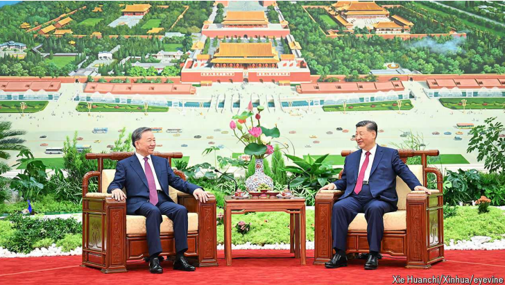
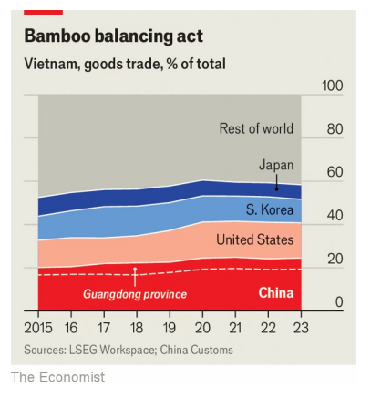

# Vietnam’s new ruler: hardman, capitalist, hedonist

To Lam, the Communist Party’s new leader, has just met Xi Jinping. America is next

hardman：硬汉；强硬的人；铁腕人物；强悍的人；狠角色

hedonist：英 [ˈhi:dənɪst] 快乐主义者；享乐主义者

原文：

What should you make of To Lam, the enigmatic new leader of Vietnam’s

Communist Party, who has emerged victorious from a savage power

struggle over the past year? On his first trip abroad Mr Lam (pictured, left)

met his Chinese counterpart, Xi Jinping, on August 19th. The two signed 14

documents on everything from Communist Party schools to crocodile

exports. Mr Lam reaffirmed the importance of Vietnam’s biggest trading

partner. Next month he will head to America. It is a sign that he intends to

continue Vietnam’s “bamboo diplomacy”, swaying between the two.

你应该如何看待这位神秘的越南共产党新领导人，他在过去一年的残酷权力斗争中脱颖而出？8月19日，林先生(图左)第一次出国访问时会见了中国领导人。两人签署了14份文件，内容涉及从共产党学校到鳄鱼出口的方方面面。Lam重申了越南最大贸易伙伴的重要性。下个月他将去美国。这是一个迹象，表明他打算继续越南的“竹子外交”，在两者之间摇摆。

学习：

make of：理解；认为；看待

enigmatic：美 [ˌenɪɡˈmætɪk] 神秘的；费解的；难以理解的；

savage：美 [ˈsævɪdʒ] 野蛮的；残暴的；凶悍的；凶恶的；

crocodile：美 [ˈkrɑːkədaɪl] 鳄鱼

原文：

Nothing new there. The more striking aspect of Mr Lam’s trip came the day

before. En route to Beijing, he retraced the steps of a revolutionary known as

Ly Thuy, who in 1924 arrived in the port city of Canton, then the seat of the

Republican government in China. Better known today as Ho Chi Minh, he

set about establishing the forerunner of the Communist Party of Vietnam in

Canton, now Guangzhou.

没什么新鲜的。Lam此行更引人注目的一面出现在前一天。在前往北京的途中，他重走了一位名叫Ly Thuy的革命者的足迹，Thuy于1924年抵达当时的中国共和政府所在地——港口城市广州。他以胡志明闻名于世，着手在广州建立越南共产党的前身。

学习：

en route：在途中；路上；

set about：开始；着手；动手进行；

forerunner：前身；先例          

原文：

Mr Lam’s pilgrimage notionally commemorated the centenary of Ho’s time

there. Revolutionary ancestor-worship is a prerequisite for the top job in

Vietnam. His predecessor, Nguyen Phu Trong, was a Marxist theorist until

the day he died in July. Yet Mr Lam, who became general secretary on

August 3rd, is no revolutionary or intellectual. A former policeman, he cut

his teeth in the fearsome Ministry of Public Security. The choice of

Guangzhou, the capital of Guangdong province, as his first port of call was

intended to signal a revival of Vietnam’s capitalist animal spirits. Its trade

with Guangdong accounts for more than 20% of its total with China (see

chart). Vietnam trades about as much with the province as it does with the

whole of Japan.

Lam先生的朝圣名义上是纪念Ho在那里的100周年。革命祖先崇拜是越南最高职位的先决条件。他的前任阮富仲(Nguyen Phu Trong)在7月去世前一直是马克思主义理论家。然而，于8月3日成为总书记的Lam既不是革命者，也不是知识分子。作为一名前警察，他在令人生畏的公安部崭露头角。选择广东省省会广州作为他的第一个停靠港，意在表明越南资本主义动物精神的复兴。其与广东的贸易占其与中国贸易总额的20%以上(见图表)。越南与该省的贸易额相当于它与整个日本的贸易额。

学习：

pilgrimage：美 [ˈpɪlɡrɪmɪdʒ] 朝圣；朝圣之旅；参拜之行；

notionally：假设地；理论上          

commemorated：美 [kəˈmeməreitid] 纪念；成为…的纪念；庆祝；（commemorate的过去式和过去分词）

centenary：百年纪念；百年纪念日；百年庆典

worship： 美 [ˈwɜːrʃɪp] （对上帝或神的）崇拜；敬神；尊敬；崇敬；爱慕；仰慕；礼拜；

fearsome：令人害怕的；吓人的；可怕的；

port of call：停靠港；中途站；访问港；

原文：

Mr Lam was implicitly celebrating capitalism, not socialism. To understand

why, you have to grasp Vietnam’s troubled past decade. The country is a

burgeoning powerhouse, with 100m people, a young population and labour

costs that are half those of Chinese coastal areas. It is being wooed by China

and America. Vietnam has benefited from America’s effort to “de-risk”

supply chains. And facing higher tariffs in America, many Chinese firms are

relocating some stages of production and assembly to Vietnam, which has

become integrated into the supply chains of suppliers in Guangdong, and

through them, to the rest of the world.

林先生含蓄地赞美资本主义，而不是社会主义。要理解其中的原因，你必须了解越南动荡的过去十年。越南是一个新兴的国家，拥有1亿人口，人口年轻，劳动力成本仅为中国沿海地区的一半。它正受到中国和美国的青睐。越南从美国“去风险化”供应链的努力中获益。面对美国更高的关税，许多中国公司将一些生产和组装环节转移到越南，越南已经融入广东供应商的供应链，并通过他们走向世界其他地方。

学习：

burgeoning：美 [ˈbɜːrdʒənɪŋ] 迅速发展的；生机勃勃的

powerhouse：强大的集团（或组织）

coastal areas：沿海地区

wooed：求爱；（woo的过去式和过去分词）

原文：

Yet Vietnam’s potential has been throttled in a wave of crackdowns. As

general secretary from 2011 until his death, Trong implemented a “blazing

furnace” anti-corruption drive that has paralysed officials. Some 200,000

were disciplined; from 2021 to 2023 another 60,000 resigned. Public

services have suffered, from health to education. Proposals for new

infrastructure or industrial projects have languished on the desks of officials

who are terrified their decisions will be scrutinised by graft-busters.

然而，越南的潜力在镇压浪潮中被扼杀了。自2011年担任总书记直至去世，Trong 实施了“熔炉”式的反腐运动，令官员们陷入瘫痪。大约20万人受到纪律处分；从2021年到2023年，又有6万人辞职。从医疗到教育，公共服务都受到了影响。新基础设施或工业项目的提案被搁置在官员们的办公桌上，他们害怕自己的决定会被反贪人员仔细审查。

学习：

throttled：美 [ˈθrɔtld] 压制；使窒息；（throttle的过去式和过去分词）

blazing：炽热的；灼热的；

furnace：美 [ˈfɜːrnɪs] 熔炉；炉子；火炉；

paralysed：美 ['pærəlaɪzd] 使麻痹；使瘫痪：（paralyze的过去式和过去分词）

disciplined：处罚；惩罚；

languish：被忽视；遭冷落；被迫滞留；未能取得进展

graft：美 [ɡræft] 贪污；腐败行为

buster：遏制者；破坏者

graft-buster：反贪人员

原文：

Though the campaign was devised by Trong as a means of preserving the

party’s legitimacy through a cleansing fire, it has instead begun to consume

its most important source of legitimacy: economic growth. Delays to power-

sector projects have meant that factories looking to increase capacity cannot

get reliable electricity. Improvements to transport infrastructure have been

too slow to keep up with the increase in industrial output.

尽管这场运动是由Trong 设计的，作为通过清洗之火维护该党合法性的一种手段，但它已经开始消耗其最重要的合法性来源:经济增长。电力行业项目的延期意味着希望提高产能的工厂无法获得可靠的电力供应。交通基础设施的改善速度太慢，跟不上工业产出的增长。

学习：
cleansing：净化；清洁；有去污作用的；清洁用的；清洗；（cleanse的现在分词）          

increase capacity：增加产能

原文：

Mr Lam was Trong’s enforcer. But he appears to have craftily used the anti-

corruption campaign as an opportunity to purge the party of his rivals, not

just rid Vietnam of graft. Earlier this year, the burning furnace claimed its

second president in two years, Vo Van Thuong; Mr Lam succeeded Mr

Thuong. Vietnam’s presidency is mostly symbolic, but capturing it put Mr

Lam in prime position to become general secretary when Trong died two

months later.

Lam先生是Trong的执行者。但他似乎巧妙地利用反腐运动作为清除党内对手的机会，而不仅仅是清除越南的腐败。今年早些时候，燃烧的熔炉在两年内宣布了它的第二任主席，Vo Van Thuong；林先生接替了Thuong先生。越南的主席职位基本上是象征性的，但当Trong 两个月后去世时，夺取这一职位使他处于成为总书记的首要位置。

学习：

enforcer：实施者；强制执行者；

craftily：美 [krɑftlɪ] 狡猾地; 熟练地; 诡诈地

purge：清除；肃清；清洗

rid：清除；摆脱；消除；

原文：

In his first meeting as general secretary with the party’s graft-busters on

August 14th, a newly ascendant Mr Lam told them that the anti-corruption

push must not stand in the way of the country’s development, even as he

pledged that it would continue. Perhaps it will, as a means of extending his

control of the party.

在8月14日作为总书记与党内反贪官员的第一次会议上，新近得势的林先生告诉他们，反腐运动不能阻碍国家的发展，尽管他承诺反腐运动将会继续。也许会，作为扩大他对党的控制的一种手段。

学习：

ascendant：上升的；占优势的；主导的；兴旺的；权势日增的

原文：

But Mr Lam’s connections to the private sector suggest that he may be

sensitive to the concerns of the bourgeoisie. The austere Trong developed

few links with business, preferring his ideological obsessions. In contrast the

Ministry of Public Security that Mr Lam ran until recently is a player in the

economy, owning several conglomerates and a telecoms firm. And To Dung,

Mr Lam’s brother, is a business owner who has acquired interests in several

industries including property, energy and rare earths, as well as the Piaggio

distributorship in Vespa-mad Vietnam.

但Lam与私营部门的关系表明，他可能对资产阶级的担忧很敏感。简朴的Trong 很少与商业联系，更喜欢他的意识形态痴迷。相比之下，直到最近，Lam掌管的公安部是经济中的一员，拥有几家企业集团和一家电信公司。至于Lam的哥哥To Dung，他是一名企业主，收购了包括房地产、能源和稀土在内的多个行业的权益，还在Vespa盛行的越南获得了Piaggio的经销权。

学习：

bourgeoisie：英 [ˌbʊəʒwɑːˈziː] 中产阶级；资产阶级 **注意发音**

austere：美 [ɔːˈstɪr] 简朴的；朴质的；朴素的；

conglomerates：美 [kənˈglɑmərət] 企业集团；多元化公司；大公司

rare earths：稀土

distributorship：美 [dɪst'rɪbjutəʃɪp] 分销权

原文：

Mr Lam also has an epicurean streak. In his early years as a minister, he was

little known outside political and business circles. But on a visit to London

in 2021, after inevitably paying respects at the gravesite of Karl Marx, the

*Das Kapital*-devouring corruption-buster was captured on video being fed a

steak wrapped in gold leaf by Nusret Gokce, a celebrity chef better known as

Salt Bae. Mr Gokce deleted social-media posts featuring the video, but it led

to a backlash. During Mr Lam’s time as Vietnam’s top cop, his ministry built

a concert hall in Hanoi that opened to the music of Chopin, one of his

favourite composers.

林先生也有享乐主义的倾向。在担任部长的最初几年，他在政界和商界之外鲜为人知。但在2021年访问伦敦时，在不可避免地向卡尔·马克思的墓地致敬后，这位吞噬《资本论》的腐败克星被一段视频捕捉到，视频中，努斯雷特·格克切(NUS ret Marx)正给马克思喂一块裹着金箔的牛排，这位名厨更为人所知的名字是Salt Bae。格克切删除了展示该视频的社交媒体帖子，但这引发了强烈反对。在林先生担任越南最高警察期间，他的部门在河内建了一个音乐厅，向他最喜欢的作曲家之一肖邦的音乐开放。

学习：

epicurean：英 [ˌɛpɪkjʊ(ə)ˈriːən] 享乐主义的；伊壁鸠鲁学派的；美食家的；讲究饮食的

streak：美 [striːk] 特性；倾向

business circle：商界

gravesite：英 [ˈɡreɪvˌsaɪt] 墓地

devouring：美 [dɪˈvaʊərɪŋ] 吞食；（devour的现在分词）

celebrity chef：名厨

Hanoi: 美 [hɑˈnɔɪ] 河内（越南首都）

Chopin: 美 [ˈʃoʊpæn] 肖邦（波兰钢琴家及作曲家） **注意发音**

原文：

The new leader needs to keep the army at bay. It is concerned about the

number of policemen at the head of government. The prime minister, Pham

Minh Chinh, is another alumnus of the Ministry of Public Security. As

vacancies in the Politburo created by the anti-corruption campaign have

been filled this year, the armed forces have unexpectedly claimed four of the

fifteen seats, second only to the police, with five. Usually the army gets only

one; four is their highest total since Vietnam’s *Doi Moi* reform era began in

1986, according to Nguyen Khac Giang, at the ISEAS-Yusof Ishak Institute, a

think-tank in Singapore. One savvy move may be to promote a loyal army

general to keep the peace between the two security forces.

新领导人需要控制军队。它对政府首脑的警察人数感到关切。总理范明钦也是公安部的校友。随着今年反腐运动造成的政治局空缺得到填补，军队出人意料地占据了15个席位中的4个，仅次于警察，占5个席位。通常军队只能得到一个；根据新加坡智库ISEAS-Yusof Ishak Institute的Nguyen Khac Giang的说法，这是自1986年越南改革以来的最高数字。一个明智的举措可能是提拔一名忠诚的将军来维持两支安全部队之间的和平。

学习：

alumnus：美 [əˈlʌmnəs] 校友；毕业生；前学生；大学毕业生

Politburo：美 [ˈpɑlɪtˌbjʊroʊ] 政治局（共产党中央委员会的执行委员会）；政策制定委员会

savvy：有洞察力的；精明能干的；懂行的；

原文：

Mr Lam, having spent a career focused on internal security, could be less

attuned to external threats than a rival from the armed forces might have

been. He might therefore look towards a fellow communist and authoritarian

superpower on Vietnam’s northern border more than to America, even as

Chinese and Vietnamese ships occasionally square off in the South China

Sea. But Mr Lam will be mindful that the party’s legitimacy also demands

that it should defend Vietnam’s sovereignty against aggression from the

north. The two fought a brief border war in 1979, and China remains

unpopular in Vietnam. Le Kha Phieu, who was general secretary from 1997

to 2001, was removed by the Politburo, in part for getting too close to

Beijing.

Lam的职业生涯一直专注于国内安全，与来自军队的对手相比，他可能不太适应外部威胁。因此，尽管中国和越南的船只偶尔会在南海对峙，他可能会更多地关注越南北部边境的共产主义和威权主义超级大国。但Lam将会注意到，该党的合法性也要求它应该捍卫越南的主权，抵御来自北边的侵略。两国在1979年打了一场短暂的边境战争，中国在越南仍然不受欢迎。1997年至2001年担任总书记的Le Kha Phieu被政治局免职，部分原因是因为与北京走得太近。

学习：

attune：调整；使适应；使一致；

square off：摆好架势；（打斗等时）摆好（架势）          

mindful：注意的；留心的

原文：

China was an unavoidable first stop in the new job for Mr Lam; going to

America before China would have given his comrades in Beijing a fright.

But he will visit America in September for the UN General Assembly. While

there, he is likely to raise the decision by America’s commerce department

on August 1st to deny Vietnam “market economy” status. (America imposes

higher penalties on non-market economies in trade disputes.)

对Lam来说，中国是他新工作中不可避免的第一站；在中国之前去美国会吓他在北京的同志一跳。但他将于9月前往美国参加联合国大会。在那里，他可能会提出美国商务部8月1日否决越南“市场经济”地位的决定。(美国在贸易争端中对非市场经济施加更高的惩罚。)

学习：

comrades：英 [ˈkɒmrɪdz] 同志；战友；（comrade的复数）

原文：

American officials, for their part, are likely to push for stronger security co-

operation. Last year, the two signed a comprehensive strategic partnership.

They are unlikely to raise Mr Lam’s history of repression. While the new

general secretary may unleash a new era of economic dynamism, the

crackdown on civil society is likely to continue. He had more than 330

activists and journalists rounded up during his time as minister for public

security, according to the 88 Project, a rights group. With his experience of

repression, conspicuous consumption and diplomatic balancing, Mr Lam is

well qualified for his new job. ■

就美国官员而言，他们可能会推动更强有力的安全合作。去年，双方签署了全面战略伙伴关系。他们不太可能提起林先生的镇压历史。尽管新任总书记可能会开启一个充满经济活力的新时代，但对公民社会的压制可能会继续下去。据人权组织88项目称，在他担任公安部长期间，有330多名活动人士和记者遭到围捕。凭借他在镇压、炫耀性消费和外交平衡方面的经验，林完全胜任他的新工作。■

学习：

repression：镇压；抑制；压抑

dynamism：美 [ˈdaɪnəmɪzəm] 活力；精力；劲头；动力；

economic dynamism：经济活力

round up：围捕；

conspicuous：美 [kənˈspɪkjuəs] 显著的；明显的；易见的；显而易见的；引人注目的

conspicuous consumption：炫耀性消费；炫富消费          

## 后记

2024年8月25日20点31分于上海。

