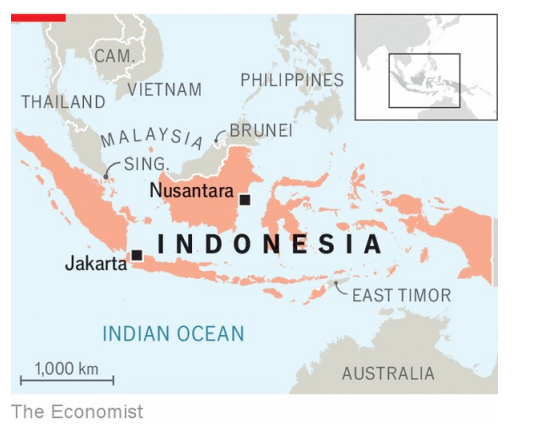

# Indonesia’s new capital is built on vanity

President Jokowi doesn’t seem to be in any mood to leave politics behind

vanity：美 [ˈvænəti] 虚荣；空虚；无价值的东西；

原文：

THE LEGACY of Joko Widodo (or Jokowi) was meant to be graft-free

politics and an infrastructure revolution in Indonesia. On the face of it, the

outgoing president has partially succeeded on the latter. During his decade in

power, Jokowi’s government has overseen around 200 projects. The

grandest was officially opened on August 17th, when Nusantara, an entirely

new capital city carved out of the jungles of Borneo, hosted festivities to

mark Indonesia’s 79th independence day. The ceremony highlighted two

uncomfortable questions. One is whether Nusantara is an infrastructure leap

too far: a giant vanity project doomed to fail. The other is whether Jokowi

will really quit politics when his term ends in October and he is supposed to

hand over power to Prabowo Subianto.

佐科·维多多(或称佐科威)的遗产本应是印尼的无贪污政治和基础设施革命。从表面上看，即将离任的总统在后一个问题上取得了部分成功。在他执政的十年间，佐科维政府监管了大约200个项目。最盛大的于8月17日正式开幕，当时努桑塔拉，一个从婆罗洲丛林中开辟出来的全新的首都城市，举办庆祝活动来纪念印度尼西亚第79个独立日。仪式突出了两个令人不安的问题。一个是Nusantara是否是一个过分的基础设施飞跃:一个注定要失败的巨大的虚荣项目。另一个问题是，当佐科维的任期在10月份结束时，他是否真的会退出政坛，他应该将权力移交给普拉博沃·苏比安托。

学习：

graft：贪污

outgoing： 即将离职的；即将离任的；将卸任的

Borneo：美 [ˈbɔrnioʊ] 婆罗洲；婆罗洲岛；

quit politics：退出政坛

hand over：交给；递交；转交；移交（权力或职位）

原文：

Jokowi sees the move of the country’s capital as a key part of his legacy.

When completed in 2045, Nusantara will mark Indonesia’s transformation

into a developed country, according to boosterish announcements by the

planning authority. But Jokowi’s project is not going to plan. The president

had to delay his move to a new palace for the last few weeks of his formal

rule because of snafus with electricity and running water. Construction has

been marred by problems with land acquisition, financing and management.

佐科威将国家首都的迁移视为其遗产的重要组成部分。根据规划局的公告，2045年竣工时，努桑塔拉将标志着印度尼西亚转变为一个发达国家。但是佐科维的项目不会成功。由于电力和自来水供应的混乱，总统不得不在他正式执政的最后几周推迟他搬到新宫殿的计划。土地收购、融资和管理方面的问题阻碍了建设。

学习：

snafu：美 [snæˈfu]  混乱局面；混乱状态；混乱

running water：自来水；流水；

marred：破坏；损坏；毁坏；损害；（mar的过去式）          

原文：

Jakarta, the current capital, is under serious threat. According to an index

compiled by Maplecroft, a consultancy, no big city worldwide faces more

climate-related risks. Yet disaster in Jakarta does not mean triumph in

Nusantara.

目前的首都雅加达正受到严重威胁。根据咨询公司Maplecroft编制的指数，世界上没有一个大城市面临更多与气候相关的风险。然而，雅加达的灾难并不意味着努桑塔拉的胜利。

学习：

Jakarta： 美 [dʒəˈkɑrdə] 雅加达

原文：

An obvious question is whether Indonesia’s next president will ditch the

scheme. A more penetrating question to ask is whether he will have the

power to. The presidential term of Mr Prabowo, a garrulous former general

accused of war crimes and whose family has a sprawling business empire,

starts in October.

一个显而易见的问题是印尼的下一任总统是否会放弃该计划。一个更尖锐的问题是，他是否有权力。普拉博沃先生的总统任期将于10月开始，他是一位被指控犯有战争罪的健谈的前将军，其家族拥有庞大的商业帝国。

学习：

ditch：抛弃；摆脱；丢弃；

penetrating：尖锐的；透彻的；深刻的；

garrulous：英 [ˈɡar(j)ʊləs] 唠叨的；喋喋不休的；多话的；

war crimes：战争罪

has a sprawling business empire：拥有庞大的商业帝国

原文：

Mr Prabowo is hardly an advertisement for a new era of Indonesian

democracy. But look beyond his chequered résumé and it is also possible

that there will not be a clean-cut transfer of power away from Jokowi, whose

son will govern as vice-president. On August 12th Airlangga Hartarto

resigned as head of Golkar, the oldest political party in the country. At a

press conference he implied that he was forced to step down. During an

emergency meeting on August 21st, party leaders appointed Bahlil

Lahadalia, a Jokowi ally, as Golkar’s new chairman. Days earlier, Jokowi

had appointed Mr Bahlil as his new energy minister as part of a cabinet

reshuffle.

普拉博沃先生很难说是印尼民主新时代的广告。但透过他曲折的履历来看，也有可能权力不会完全从佐科维手中转移，他的儿子将担任副总统。8月12日，Airlangga Hartarto辞去了该国历史最悠久的政党Golkar的主席职务。在记者招待会上，他暗示自己被迫下台。在8月21日的紧急会议上，政党领导人任命佐科威的盟友Bahlil Lahadalia为Golkar的新主席。几天前，作为内阁改组的一部分，佐科维任命巴赫利先生为新的能源部长。

学习：

chequered：英 [ˈtʃɛkəd] 多变的；有波折的；

clean-cut：干净利落的；清晰的；

press conference：记者招待会

emergency meeting：紧急会议

reshuffle：改组；重组；调整；重新分配（资源或人员）

原文：

Parliament is also considering establishing a supreme advisory council.

Some suspect it is designed to create a new office for Jokowi. Mr Prabawo

has promised to “continue and, if possible, finish” Nusantara. Jokowi’s

promise appears to be to continue, if possible, holding some sway in

Indonesia’s politics. ■

议会也在考虑成立一个最高咨询委员会。有人怀疑这是为了给佐科威创建一个新办公室。普拉巴沃承诺“继续，如果可能的话，完成”努桑塔拉。佐科维的承诺似乎是，如果可能的话，继续在印尼政治中保持一定的影响力。■

学习：

sway：影响力；支配力；势力；权势；主导地位

hold some sway：保持一定影响力

## 后记

2024年8月26日18点54分于上海。

