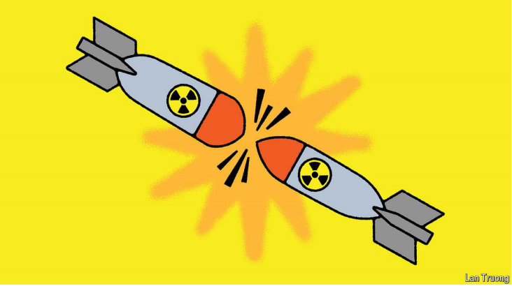

# If a China and America war went nuclear, who would win?

After 45 days of conventional fighting nukes would be tempting, wargamers suggest

nuke：美 [nuk] 核武器；

tempting：吸引人的；诱人的；诱惑性的；

原文：

IT IS BAD enough to contemplate a war in Asia. It is grimmer still to think

through a nuclear one. But somebody has to. And so Andrew Metrick, Philip

Sheers and Stacie Pettyjohn, all of the Centre for a New American Security

(CNAS), a think-tank in Washington, recently gathered a group of experts to

play a tabletop exercise—a type of wargame—to explore how a Sino-

American nuclear war could break out. The results were not encouraging.

考虑亚洲的战争已经够糟糕了。更可怕的是，还要考虑核能。但总得有人去做。因此，华盛顿智库新美国安全中心(CNAS)的Andrew Metrick、Philip Sheers和Stacie Pettyjohn最近召集了一批专家进行桌面演习——一种战争游戏——以探索中美核战争如何爆发。结果并不令人鼓舞。

学习：

contemplate：考虑；思考；思忖

grimmer：冷酷的；讨厌的；可怕的；（grim的比较级）          

tabletop：桌面          

原文：

In the exercise scenario, it is 2032 and a war over Taiwan has been raging

for 45 days. China uses “theatre” nuclear weapons—with a shorter range and

smaller yield than the city-busting “strategic” missiles—to shorten the war

by coercing America into submission. The targets include Guam and

Kwajalein Atoll—a pair of islands vital to America’s military position in the

Pacific—as well as an American aircraft-carrier strike group.

在演习场景中，时间是2032年，围绕台湾的战争已经持续了45天。中国使用“战区”核武器——比摧毁城市的“战略”导弹射程更短、威力更小——通过迫使美国屈服来缩短战争。目标包括关岛和夸贾林环礁——对美国在太平洋的军事地位至关重要的一对岛屿——以及一个美国航母战斗群。

学习：

theatre：战场；战区

city-busting：摧毁城市的

coercing：强迫；（coerce的现在分词）

submission：屈服；服从；顺从；投降

atoll：美 [ˈætˌɔl] 环礁；珊瑚岛；

aircraft-carrier：航母

strike group：打击战斗群

原文：

That is distressingly plausible. One reason is the geography of the Asian

battlefield. During the cold war America and the Soviet Union both planned

to use lots of tactical nuclear weapons to destroy large and dispersed troop

formations, often in the vicinity of towns and cities. “Today in the Pacific”,

notes the study, “naval vessels at sea and military airbases on small islands

are a vastly different target.” Fewer nukes would be required and there

would be less civilian harm than in cold-war strikes.

令人沮丧的是，这似乎是合理的。一个原因是亚洲战场的地理位置。冷战期间，美国和苏联都计划使用大量战术核武器摧毁大型分散的部队编队，通常是在城镇附近。该研究指出，“今天在太平洋，海上的军舰和小岛上的空军基地是完全不同的目标。”与冷战时期相比，需要的核武器会更少，对平民的伤害也会更小。

学习：

distressingly：使人痛苦地；悲惨地          

plausible：貌似真实的；似乎合理的；似乎有道理的

dispersed：散布的；被分散的

troop formations：部队编队

vicinity：附近；邻近；周围；

naval：美 [ˈneɪvl] 海军的；舰队的；军舰的；

naval vessels：军舰

原文：

That is related to a second reason: the evolution of weaponry. Most people,

not unreasonably, think of conventional weapons as being less escalatory

and thus more usable than nuclear ones. But today’s low-yield nukes—20

kilotonnes of explosive power, roughly Hiroshima-size—can be delivered

with extreme precision and less collateral damage. “The line between low-

yield tactical nuclear weapons and precision-guided conventional weapons

in terms of both their operational effects and perceived impact is blurring,”

says CNAS.

这与第二个原因有关:武器的演变。大多数人认为常规武器不容易升级，因此比核武器更有用，这不无道理。但是今天的低当量核武器——20千吨的爆炸力，大致相当于广岛原子弹的大小——可以极其精确地发射，附带损害也更小。CNAS说:“低当量战术核武器和精确制导常规武器在作战效果和感知影响方面的界限正在变得模糊。”。

学习：

weaponry：美 [ˈwɛpənri] （总称某一类型或某国、某组织的）武器；兵器

unreasonably：不合理地          

conventional weapon：传统武器

escalatory： 美 [ɛskələˌtəri] 升级的

Hiroshima：美 [ˌhɪroʊˈʃimə] 广岛（日本本州西南海岸一城市）

collateral：美 [kəˈlætərəl] 附属的；辅助的；旁系的；次要的

collateral damage：附带伤害

原文：

The third factor is the effect of a long war. Weeks into a conflict, both sides

would run short of conventional weapons. Theatre nuclear weapons would

become more attractive. “On a per-weapon basis”, note the authors, “nuclear

arms are more efficient at destroying large-area targets.” Their immense

power means that they would also continue to work even if weeks of war

had degraded the command, control and intelligence systems that

conventional munitions rely on.

第三个因素是长期战争的影响。冲突开始几周后，双方都会缺少常规武器。战区核武器将变得更有吸引力。“基于每种武器”，作者指出，“核武器在摧毁大面积目标方面更有效。”它们巨大的力量意味着，即使数周的战争已经削弱了常规弹药所依赖的指挥、控制和情报系统，它们也将继续工作。

学习：

munition：美 [mjuˈnɪʃən] 军火；军需品；

原文：

The result of all this, in the wargame, was a strange sort of nuclear war:

China was incentivised to use nuclear weapons first, despite its formal “No

First Use” pledge, but once it did so, and in contrast with expectations for

how a US-Soviet war would have played out in Europe, things did not

necessarily spiral into an apocalyptic exchange of strategic nuclear weapons.

In the world of nuclear strategists, that is what counts as good news.

在战争游戏中，所有这一切的结果是一场奇怪的核战争:中国受到激励首先使用核武器，尽管它正式承诺“不首先使用”，但一旦它这样做了，而且与美苏战争在欧洲将如何结束的预期相反，事情不一定会演变成一场世界末日般的战略核武器互相发射。在核战略专家的世界里，这算得上是好消息。

学习：

apocalyptic：美 [əˌpɑkəˈlɪptɪk] 像世界末日的；

原文：

The exercises suggested China had more reason for cheer. The experts and

officials playing as China had a wide range of military targets—Asia is

chock-full of American facilities and naval assets. (Though there is little

evidence that China possesses low-yield nukes right now.) The American

team, by contrast, struggled with the fact that many of the most attractive

targets for retaliation were on the Chinese mainland. Striking those with

tactical nuclear weapons would carry a much higher risk of escalation to

general nuclear war.

演习表明中国有更多的理由欢呼。扮演中国的专家和官员有广泛的军事目标——亚洲充满了美国的设施和海军资产。(尽管几乎没有证据表明中国现在拥有低当量核武器。)相比之下，美国队很难接受这样一个事实，即许多最有吸引力的报复目标都在中国大陆。用战术核武器打击这些目标会带来升级为全面核战争的更高风险。

学习：

chock-full：满满的；充满的；塞满的

retaliation：美 [rɪˌtælɪˈeʃən] 报复；反击

原文：

Moreover, the players found that America did not have the weapons needed

to hit the “very small number” of lower-risk targets—mostly warships and

Chinese bases on disputed reefs in the South China Sea. Its most advanced

non-nuclear missiles would have run out by day 45. America, unlike Russia,

no longer has a nuclear-tipped anti-ship missile. A new submarine-launched

nuclear cruise missile is slated for the 2030s. But it could not be used for

signalling to deter Chinese nuclear use before the fact without giving away

where it was. It would also tie up scarce attack subs in the middle of a naval

war.

此外，玩家们发现，美国没有打击“极少数”低风险目标所需的武器——主要是军舰和南海有争议岛礁上的中国基地。其最先进的非核导弹将在第45天耗尽。与俄罗斯不同，美国不再拥有核弹头反舰导弹。一种新的潜射核巡航导弹预计将在21世纪30年代问世。但它不能被用来在不暴露其位置的情况下，在事实发生之前发出阻止中国使用核武器的信号。它还会在海战中束缚稀缺的攻击潜艇。

学习：

warship：军舰；战船；

anti-ship missile：反舰导弹

nuclear-tipped：核弹头的

cruise missile：巡航导弹

slate：计划；安排

原文：

Nuclear strategy has its own macabre grammar, steeped in the assumptions

and experience of the cold war and reshaped by the march of military

technology. It boils down to politics, though. Faced with the nuclear

annihilation of 5,000 American sailors on a carrier or nuclear attack on

American territory such as Guam, would an American president respond

with nuclear force, reach for what would be a shrinking quiver of

conventional weapons—or fold? That, concede the authors, is “the

fundamental, unknowable component”.■

核战略有自己的残酷规则，沉浸在冷战的假设和经验中，并被军事技术的进步重塑。不过，归根结底还是政治问题。面对一艘航空母舰上的5000名美国水兵的核毁灭，或者对关岛等美国领土的核攻击，美国总统会以核力量做出回应，会动用常规武器这个越来越小的武器库，还是会放弃？作者承认，这是“基本的、不可知的组成部分”。■

学习：

macabre：美 [məˈkɑːbrə] 恐怖的；可怕的；可怖的

grammar: 基本规则和结构

macabre grammar：残酷规则

>这里的 "grammar" 指的是核战略的基本规则和结构。结合上下文，这句话的意思是，核战略有其自身的残酷规则，这些规则深受冷战时期的假设和经验的影响，并且随着军事技术的发展而不断改变。

steeped：充满…的；沉浸在…中的；浸；（steep的过去式和过去分词）

march：进展；进步；

boil down to：归结于

annihilation：美 [əˌnaɪəˈleɪʃn] 毁灭；摧毁；

quiver：美 [ˈkwɪvər] 一组（用于特定目的的）物品（或工具）

## 后记

2024年8月26日19点54分于上海。

