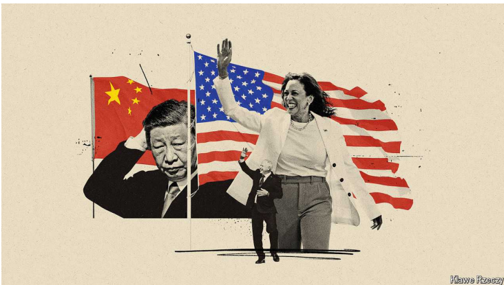

# China’s rulers are surprised by Kamala Harris and Tim Walz

One has never been to China, the other has visited 30 times

原文：

Chinese officials and analysts are struggling. A woman who has never

visited China and who has only briefly met its leader, Xi Jinping, has

suddenly emerged as a serious contender in the race for the White House.

The Democratic Party gathered from August 19th to 22nd to celebrate the

nomination of Kamala Harris as its presidential candidate and her selection

of Tim Walz as her running-mate. For China’s rulers the ascent of the Harris

Walz ticket creates two difficulties. It challenges China’s nihilistic

interpretation of American politics as racist and decrepit. And it has

triggered a scramble to assess how a Harris administration might approach

China relations, not least because Ms Harris’s credentials on dealing with

China are limited, while Mr Walz has more experience of China than any

vice-presidential candidate in decades.

中国官员和分析人士正在苦苦挣扎。一位从未访问过中国、只与中国领导人短暂见过面的女性，突然成为白宫角逐中的有力竞争者。8月19日至22日，民主党集会庆祝卡玛拉·哈里斯被提名为总统候选人，以及她选择蒂姆·瓦尔兹作为竞选伙伴。对中国的统治者来说，哈里斯·瓦尔兹的崛起造成了两个难题。它挑战了中国对美国政治的虚无主义解读，认为美国政治是种族主义和陈旧的。这引发了一场评估哈里斯政府可能如何处理对华关系的过程中所表现出的紧迫感和混乱，尤其是因为哈里斯在处理中国问题上的资历有限，而瓦尔兹在中国问题上的经验比几十年来任何一位副总统候选人都多。

学习：

serious contender：有力竞争者

create 2 difficulties：造成了两个难题

nihilistic： 美 [ˌnaɪɪ'lɪstɪk] 虚无主义的；无政府主义的

decrepit：英 [dɪˈkrɛpɪt] 衰老的；破旧的；老朽的；

scramble：（尤指需要手脚并用的）艰难行走；争抢；争夺；混乱；

>这里的 "scramble" 指的是一种紧急、混乱的行动或争抢。在这个上下文中，它描述了中国官员和分析人士在急于评估哈里斯政府可能如何处理对华关系的过程中所表现出的紧迫感和混乱。
>
>例子：
>- **英语**: When the store announced a huge discount on the latest smartphone, there was a scramble among customers to get their hands on it.
>- **中文**: 当商店宣布对最新的智能手机进行大幅折扣时，顾客们争先恐后地抢购，场面一片混乱。

原文：

Cynicism about American politics abounds in China. The shake-up in the

presidential race since June illuminates the limitations of China’s

understanding of its rival. When Barack Obama was elected in 2008, his

appeal upset the widely held belief in China, reinforced by relentless official

propaganda, that America was so profoundly racist that a black person could

not become president. China’s latest report on human rights in America,

published in May, says racism is getting worse, while gender discrimination

is “rampant”. But America could elect its second black president, and its

first female one.

对美国政治的冷嘲热讽在中国比比皆是。自6月份以来总统竞选中的动荡表明，中国对其对手的了解存在局限性。当巴拉克·奥巴马在2008年当选时，他的呼吁打破了中国广泛持有的信念，而这一信念被无情的官方宣传所强化，即美国是如此根深蒂固的种族主义者，以至于一个黑人不可能成为总统。中国在5月份发布的最新美国人权报告称，种族主义越来越严重，而性别歧视“猖獗”。但是美国可以选出第二位黑人总统，也是第一位女性总统。

学习：
cynicism：美 [ˈsɪnɪsɪzəm] 愤世嫉俗；犬儒主义；冷言冷语；冷嘲热讽

shake-up：改组；调整；动荡；剧变；

human rights：人权

原文：

For much of this year the Biden-Trump contest was a boon for Chinese

propagandists, allowing them to portray American democracy as a fight

between two men past their cognitive prime, whose attacks were redolent of

playground bickering. By bowing out, Mr Biden has unsettled that narrative

and encouraged some Chinese to wonder about their own system, in which

Mr Xi, who is 71, appears set on remaining leader for life. Last month a

Chinese blogger wrote that “For some people, the greatest contribution they

can make to the party, the country and the people is to hand over power, step

down from the stage and go home to play with their grandchildren.” The

next sentence—“That’s right, I’m talking about you, Biden”—did not calm

China’s censors, who scrubbed the post.

在今年的大部分时间里，拜登和特朗普的竞争对中国宣传者来说是一个福音，让他们能够将美国民主描绘成两个过了认知黄金期的人之间的战斗，他们的攻击让人想起操场上的争吵。通过退出，拜登打破了这种说法，并鼓励一些中国人思考他们自己的制度，在这种制度下，71岁的Xi似乎注定要终身担任领导人。上个月，一位中国博主写道，“对一些人来说，他们能为党、国家和人民做出的最大贡献就是交出权力，下台，回家陪孙子们玩。”下一句话——“没错，我说的是你，拜登”——并没有让中国的审查人员平静下来，他们删除了这篇帖子。

学习：

boon：恩赐；益处；福利；天赐之物；福音

redolent：令人想起的；使人联想到的

bickering： 美 ['bɪkərɪŋ] 口角；争吵；

bow out:退出

scrub：擦洗；刷洗；彻底清洗；取消；放弃

scrub the post：删除了帖子

原文：

In 2008 Mr Obama had not been to China and had little foreign-policy

experience. Before she became vice-president Ms Harris was in a similar

position: a biography of her published in 2021 mentions China just once. As

vice-president she has acquired more exposure to diplomacy. She has been

on 17 foreign trips, several of them to Asia, including one in 2022 where she

briefly met Mr Xi on the sidelines of a summit in Thailand.

2008年，奥巴马没有去过中国，也没有什么外交政策经验。在她成为副总统之前，哈里斯女士也处于类似的位置:2021年出版的一本她的传记只提到过一次中国。作为副总统，她获得了更多的外交机会。她已经出访了17次，其中几次去了亚洲，包括2022年的一次，在泰国的一次峰会间隙，她与Xi短暂会面。

学习：

sideline:  主要活动或正式会议之外的非正式场合

>这里的 "sideline" 指的是在主要活动或正式会议之外的非正式场合。在这个上下文中，"on the sidelines of a summit" 描述的是哈里斯副总统在参加泰国峰会时，在正式会议之外与Xi进行了简短的会面。
>
>例子：
>- **英语**: The leaders held a private discussion on the sidelines of the economic summit.
>- **中文**: 领导人在经济峰会的非正式场合进行了私下讨论。

原文：

Some of the signals point to continuity with Mr Biden’s policy on China.

Regarding trade there is little sign that Ms Harris would reverse the tariffs

maintained by the Trump and Biden administrations. In her first big

economic-policy speech, on August 16th, Ms Harris appeared to criticise Mr

Trump’s plans to increase tariffs further, but endorsed the idea of helping the

middle class, the justification used by the Biden administration for its

protectionism.

一些信号表明拜登的对华政策将会延续。在贸易方面，几乎没有迹象表明哈里斯会逆转特朗普和拜登政府维持的关税。在8月16日她的第一次重要经济政策演讲中，哈里斯似乎批评了特朗普进一步提高关税的计划，但支持帮助中产阶级的想法，这是拜登政府为保护主义所使用的理由。

学习：

increase tariffs further：进一步提高关税

原文：

As for diplomacy, on her vice-presidential trips she condemned

“intimidation and coercion in the South China Sea” and in 2022 she met

William Lai Ching-te, who has since become Taiwan’s president. If there is a

shift, it will be subtle. Ian Bremmer of Eurasia Group, a consultancy, says

that as president she would be less inclined than Mr Biden to describe

geopolitics as a contest between autocracy and democracy, and will stress

the importance of upholding rules and norms. “I think this will make it

easier for the US to have honest conversations with not only the Chinese but

with other countries around the world that are not going to hear from

Kamala, ‘It’s our way or the highway,’” he says.

至于外交，在她以副总统身份出访时，她谴责了“南海的恐吓和胁迫”，并在2022年会见了赖清德。如果有转变，那将是微妙的。咨询公司欧亚集团(Eurasia Group)的伊恩布雷默(Ian Bremmer)表示，作为总统，她不会像拜登那样倾向于将地缘政治描述为专制和民主之间的较量，而是会强调维护规则和规范的重要性。“我认为这将使美国更容易不仅与中国，而且与世界上其他不愿意听到卡玛拉说‘这是我们的道路或高速公路’的国家进行诚实的对话，”他说。

学习：

intimidation：美 [ɪnˌtɪmɪˈdeɪʃən] 恐吓；胁迫；威胁；

coercion：美 [koʊˈɜːrʒn] 强迫；威压；强制；

South China Sea：中国南海

原文：

Complicating China’s assessment is the potential role of Mr Walz as Ms

Harris’s consigliere on China. In 1989 and 1990 he taught English and

American history at a secondary school in Foshan in the province of

Guangdong. Later, while working as a teacher in America in the 1990s and

2000s, he organised trips to China for students. He raved about the warm

welcome he received there. “Harris’s every move…truly has a presidential

air,” said a commenter on Weibo, a microblog platform, in response to Mr

Walz’s appointment. Another commenter praised the move, saying it was

like putting wings on a tiger.

让中国的评估变得复杂的是，瓦尔兹可能会成为哈里斯的中国顾问。1989年和1990年，他在广东省佛山市的一所中学教英语和美国历史。后来，在上世纪90年代和21世纪初在美国当老师时，他组织学生去中国旅行。他对自己在那里受到的热烈欢迎赞不绝口。“哈里斯的一举一动……真的很有总统的味道，”微博平台新浪微博上的一位评论者在回应瓦尔兹的任命时说。另一位评论者称赞了这一举措，称这就像给老虎装上了翅膀。

学习：

consigliere：美 [ˌkɔnsiˈljɛreɪ] 顾问；参谋； **注意发音**

rave：极力夸奖；赞不绝口；

原文：

The claim that Mr Walz is sympathetic to China has supporters in America,

too. On August 16th Republicans in the House of Representatives launched

an investigation into his “longstanding and cosy relationship with China”. In

fact Mr Walz is no defender of China’s government. His year in Foshan

coincided with a fierce clampdown on dissent following the bloody

suppression on June 4th 1989 of the pro-democracy protests in Tiananmen

Square. Five years later he married a fellow teacher on that same day in

June. According to a newspaper in Nebraska, where he grew up, his wife

Gwen said: “He wanted to have a date he’ll always remember.”

学习：

clampdown：镇压；限制；

原文：

After being elected to the House of Representatives in 2006, Mr Walz

supported bills aimed at punishing China for violating human rights. This

record is already the subject of intense scrutiny in China. In the *Paper*, a

news outlet in Shanghai, a scholar, Diao Daming, wrote, “It is difficult to

determine whether these actions reflect Walz’s personal views and positions,

but at the least it points to the Democratic Party’s recent ideas and biases.”

2006年当选众议院议员后，瓦尔兹支持旨在惩罚中国侵犯人权的法案。这一记录已经成为中国密切关注的对象。在上海的一家新闻媒体上，学者Diao Daming写道，“很难确定这些行为是否反映了瓦尔兹的个人观点和立场，但至少它指出了民主党最近的想法和偏见。”

原文：

For China the Harris-Walz ticket is unexpected. But the best guess is that it

promises continuity on defence and trade and, possibly, more emphasis on

human rights. Faced with this prospect, some in China yearn for another

Trump administration. It might bring chaos but also, they hope, strain

America’s alliances and undermine its global image. Yan Xiaodong of

HuaYu, a think-tank in Beijing, recently noted that, with regard to Taiwan,

Mr Trump had shown a “business mentality”. Mr Yan recalled the words of

Mao in 1970: “I don’t like the Democratic Party. I prefer the Republican

Party.” The theory, according to Mr Yan, is that it is easier for Republicans

to negotiate with adversaries without appearing weak. In 1972 Richard

Nixon visited China, ending nearly a quarter-century of American efforts to

isolate it.

对中国来说，哈里斯-沃尔兹组合是出人意料的。但最好的猜测是，它承诺在国防和贸易方面保持连续性，并可能更加重视人权。面对这一前景，一些中国人渴望另一个特朗普政府。这可能会带来混乱，但他们也希望，这会使美国的联盟紧张，并破坏其全球形象。北京智库HuaYu的Yan Xiaodong最近指出，在台湾问题上，特朗普表现出了一种“商业心态”。Yan先生回忆了毛在1970年说的话:“我不喜欢民主党。我更喜欢共和党。”Yan先生认为，这个理论是共和党人更容易与对手谈判而不显得软弱。1972年，理查德·尼克松访问了中国，结束了美国近25年来孤立中国的努力。

学习：

ticket：指的是总统和副总统这个组合

yearn for：渴望；向往；

原文：

If she wins, Ms Harris will probably visit China for the first time in 2025. Is

a breakthrough possible then? It is worth keeping expectations low. Just ask

Mr Obama about his first trip. In 2009 he tried to give the Chinese a taste of

American political culture by meeting students in a town-hall-type setting in

Shanghai. Even this small gesture “made Chinese officialdom nervous”,

according to Jeffrey Bader, an adviser, resulting in “painful hand-to-hand

combat” between officials on both sides. A future President Harris would

find that Mr Xi, who took over three years later, is even less inclined to

compromise—or tolerate such democratic deceits. ■

如果哈里斯女士获胜，她可能会在2025年首次访问中国。那么有可能取得突破吗？保持低期望值是值得的。问问奥巴马先生关于他的第一次旅行就知道了。2009年，他试图通过在上海市政厅式的环境下会见学生，让中国人领略美国的政治文化。据顾问杰弗里·巴德(Jeffrey Bader)称，即使是这个小小的姿态也“令中国官场紧张”，导致双方官员“痛苦的肉搏战”。未来的哈里斯总统会发现，三年后接任的中国领导人甚至更不倾向于妥协——或者容忍这样的民主欺骗。■

学习：

officialdom：美 [əˈfɪʃldəm] 官场；官僚作风；官僚

hand-to-hand：徒手的；近身的；白刃战的；肉搏的          、

## 后记

2024年8月28日11点57分于上海。

