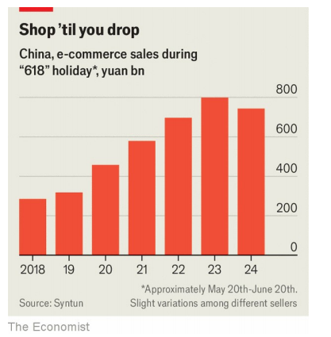

# Pinduoduo, China’s e-commerce star, suffers a blow

It faces a slowing economy, stiffening competition and angry merchants

stiffening：美 [ˈstɪf(ə)nɪŋ] 加固；使更为坚定；使（衣物、织物）硬化；使（态度、立场）更坚决；紧绷；（stiffen的现在分词）

stiffening competition：竞争加剧

merchants：美 [ˈmɜrtʃənts] 商人；批发商；（merchant的复数）

e-commerce：电商

原文：

Triumphs are fleeting in China’s fast-changing economy. Earlier this month

Colin Huang, the founder of Pinduoduo, a Chinese e-commerce darling,

became the country’s richest man. The company, founded in 2015, rose to

success by offering a gamified shopping experience where users can buy in

groups to secure lower prices. Today it is China’s third-largest e-commerce

firm by sales, behind only JD.com and Alibaba.

在中国快速变化的经济中，胜利转瞬即逝。本月早些时候，中国电子商务宠儿拼多多的创始人Colin Huang成为中国首富。该公司成立于2015年，通过提供游戏化的购物体验获得成功，用户可以集体购买以获得更低的价格。今天，按销售额计算，它是中国第三大电子商务公司，仅次于JD.com和阿里巴巴。

学习：

triumphs are fleeting：胜利转瞬即逝

fast-changing：变化迅速的；瞬息万变；日新月异          

darling：宠儿；备受宠爱的人

gamifiled：游戏化的

secure：获得

secure lower prices：获得更低的价格

原文：

Mr Huang’s time atop China’s rich list was, however, brief. On August 26th

Pinduoduo’s share price cratered by nearly 30% after it reported sales for the

quarter from April to June that fell short of the market’s lofty expectations

and gave warning that a long-run decline in profitability was “inevitable”.

Mr Huang’s net worth plunged by \$14bn, to a meagre \$35bn; he is now only

China’s fourth-richest person.

然而，Huang登上中国富豪榜榜首的时间很短暂。8月26日，拼多多的股价重挫近30%，此前其报告称，4月至6月的季度销售额低于市场的高预期，并警告称盈利能力的长期下降是“不可避免的”。Huang的净资产暴跌140亿美元，至区区350亿美元；他现在只是中国第四大富豪。

学习：

share price：股价；股票价格；

crater：美 [ˈkreɪtər] 大幅降低

>这里的“crater”用作动词时，表示“突然且大幅度下降”或“崩溃”。在这种情况下，它形容拼多多的股价大幅下跌。
>
>例子：
>- **英文**：After the company announced disappointing earnings, its stock price cratered by 25% in a single day.
>- **中文**：在公司公布了令人失望的收益后，其股价在一天内暴跌了25%。

lofty expectations：高预期

meagre：英 [ˈmiːɡə] 贫乏的；稀少的；数量很少的；

原文：

Pinduoduo’s woes are set against a backdrop of weakening consumer

spending in China. In June sales from the “618” shopping festival fell for the

first time since the annual e-commerce event began in 2010, despite a

number of platforms extending their sales periods this year (see chart).

Industry analysts expect e-commerce sales in China to continue slowing.

eMarketer, a research firm, forecasts that annual revenue growth will fall

from 8.3% this year to 6.5% in 2028.

拼多多的困境是在中国消费者支出疲软的背景下发生的。6月，“618”购物节的销售额自2010年年度电子商务活动开始以来首次下降，尽管许多平台今年延长了销售期(见图表)。行业分析师预计，中国的电子商务销售将继续放缓。研究公司eMarketer预测，2028年，年收入增长将从今年的8.3%降至6.5%。

学习：

woe：困境

backdrop：背景

原文：

A vicious price war is adding to the trouble. Visit any Chinese e-commerce

site and you will be battered by signs advertising huge discounts and

promising the cheapest deals online. Algorithms promote sellers with the

lowest prices. Competition has grown more intense because of forays into e-

commerce by short-video apps such as Douyin (TikTok’s Chinese sister

company) and Xiaohongshu (China’s answer to Instagram).

恶性价格战更是雪上加霜。访问任何一个中国电子商务网站，你都会被广告上的巨大折扣和承诺网上最便宜交易的标志所震惊。算法推销价格最低的卖家。由于抖音(TikTok的中国姐妹公司)和小红书(中国版的Instagram)等短视频应用进军电子商务，竞争变得更加激烈。

学习：

vicious：美 [ˈvɪʃəs] 恶意的；恶劣的；凶恶的

is adding to the trouble：雪上加霜

foreys：突袭；尝试；侵略；攻击；涉足；

short video：短视频

batter: 猛烈攻击，覆盖，淹没

>
>这里的“batter”用作动词时，表示“猛烈攻击”或“反复敲击”。在这个上下文中，描述用户在访问中国电商网站时被大量广告和促销信息所“猛烈轰炸”或“淹没”。
>
>例子：
>- **英文**：When you walk through the market, vendors will batter you with offers and promotions.
>- **中文**：当你走过市场时，小贩们会用各种优惠和促销信息对你进行猛烈推销。

原文：

Mutinous merchants are piling yet more pressure on the industry. Some

Chinese e-commerce companies juice their sales by fining merchants for late

deliveries or product mismatches. Last month hundreds of suppliers

surrounded the offices of Temu, Pinduoduo’s foreign offshoot, in the

southern city of Guangzhou to protest against such penalties. Dozens broke

into the building. In response, Pinduoduo said on its earnings call that it

would invest 10bn yuan ($1.4bn) to reduce fees for merchants and create “a

healthy and sustainable platform ecosystem”.

反叛的商人给这个行业带来了更多的压力。一些中国电子商务公司通过对延迟发货或产品不匹配的商家进行罚款来刺激销售。上个月，数百名供应商包围了拼多多海外分公司Temu在广州的办公室，抗议这种处罚。数十人闯入大楼。作为回应，拼多多在财报电话会议上表示，将投资100亿元人民币(合14亿美元)降低商户费用，打造“一个健康、可持续的平台生态系统”。

学习：

mutinous：美 [ˈmjutnəs] 反叛的；桀骜不驯的；抗命的

juice：给予活力；增添趣味

juice sales：促进销量

late deliveries：延迟发货

offshoot：分支；旁枝；分枝；分支机构

原文：

Pinduoduo may be hoping that international expansion will rescue it from

deteriorating conditions at home. That will not be straightforward. Although

the number of people perusing Temu, which launched in America in 2022,

has rocketed, owing in no small part to the vast amounts it has spent on

advertising, turning that into revenue has proved trickier. eMarketer reckons

Temu will capture less than 2% of e-commerce sales in America this year,

compared with more than 40% for Amazon.

拼多多可能希望国际扩张能拯救其国内日益恶化的状况。这并不简单。尽管研究2022年在美国推出的Temu的人数激增，这在很大程度上归功于其在广告上的巨额投入，但将这转化为收入却更加困难。eMarketer估计，Temu今年在美国的电子商务销售额中将占不到2%,相比之下，亚马逊将占40%以上。

学习：

international expansion：国际扩张

peruse：美 [pəˈruz]   仔细阅读；详细审查；认真研究

原文：

What is more, America’s e-commerce titan is fighting back against the

Chinese upstart. During its Prime Day sale in July it offered discounts of up

to 70% on some products. It is also reportedly planning to launch a discount

section on its site which will feature cheap items shipped directly from

factories in China. Cash-strapped consumers may celebrate the growing

range of cheap goods on offer. For China’s e-commerce star, however, the

future no longer looks as bright. ■

此外，美国电子商务巨头正在反击中国新贵。在7月的Prime Day销售中，它对一些产品提供高达70%的折扣。据报道，该公司还计划在其网站上推出一个折扣区，展示直接从中国工厂发货的廉价商品。手头拮据的消费者可能会庆祝越来越多的廉价商品上市。然而，对于这位中国电子商务明星来说，未来不再那么光明。■

学习：

upstart：新贵；突然升起的人；新崛起的人物

titan：巨人，巨头

cash-strapped：现金拮据；囊中羞涩；

## 后记

2024年8月31日14点44分于上海。

